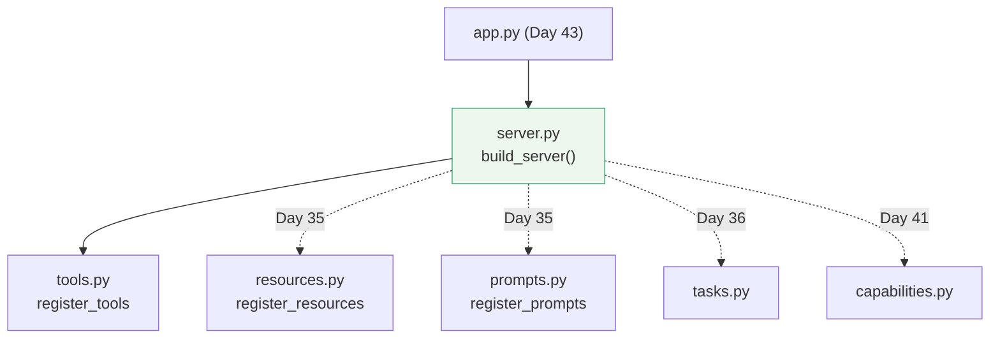

# 1.4 — The shape later days register into

## One-line answer

`sutra_mcp/` gets one module per kind of capability and one convention — `register_<kind>(server)`
— so that seven later days can each add a file and one line to `build_server()` instead of
inventing a second server.

## The story

The office has one filing cabinet and four drawers.

Accounts has the top drawer. Personnel has the second. Contracts has the third. The bottom one is
empty and has a blank label holder, because whoever bought the cabinet expected a fourth department
eventually. Everyone knows where things go, and finding a contract means opening one drawer, not
searching a room.

Then the company adds a maintenance team. Two things could happen. Somebody writes "Maintenance" on
the blank label and starts using the empty drawer — one new label, everything else unchanged, and
the cleaner still knows where the cabinet is. Or somebody buys a second cabinet and puts it by the
back window, because the first one was "getting full". Six months later there are four cabinets,
two of them have a Contracts drawer, and the honest answer to *"where is the lease?"* is *"try
both"*.

Nobody chose the second outcome. It arrived one reasonable decision at a time, and every one of
those decisions was made by a person who could not see the other three.

## The idea in plain language

A **package** is a folder of Python modules that are imported together —
`sutra_mcp/`, holding `__init__.py` and its siblings.

A **registration function** is a function that takes an already-built server and attaches something
to it. It returns nothing and it constructs nothing:

```python
def register_tools(server: FastMCP) -> None:
    """Attach this module's tools to a server."""
```

**Line by line:**

- `server: FastMCP` — the server arrives as an argument. The function does not build one, does not
  import one, and does not know whether the object it was handed is the real Sutra server or a
  throwaway one a test made. That is the whole point.
- `-> None` — it changes the object it was given and returns nothing. A `register_*` that returns a
  server is a second constructor wearing a helper's name, and the next person to read it will call
  it expecting a fresh object.
- The docstring says *"a server"*, not *"the server"*. There is no global.

Seven later days each add one module and one line. The days are already assigned, so the drawers can
be labelled now rather than argued about later:

| Day | Module it adds to `sutra_mcp/` | What it registers |
| --- | --- | --- |
| 34 (today) | `server.py`, `tools.py` | `build_server()`, `register_tools(server)` |
| 35 | `resources.py`, `prompts.py` | `register_resources(server)`, `register_prompts(server)` |
| 36 | `tasks.py` | long jobs: `start_task`, `get_task`, `cancel_task` |
| 37 | `auth.py` | issuer validation on the way in |
| 39 | `db_tools.py` | SQL-backed tools over a local SQLite file |
| 41 | `capabilities.py` | what the server declares it can do |
| 42 | `agent_server.py` | the whole desk agent, exposed as a server |
| 43 | `app.py` | the deploy-shaped entry point that never calls `run()` |

Every one of those is a drawer in one cabinet. None of them is a second `FastMCP(...)`.

## Why Sutra needs it

Because the alternative is not hypothetical, it is the default.

Day 35 needs a server to hang resources on. The path of least resistance is to write
`resources.py`, construct a `FastMCP("sutra-mcp-resources")` inside it, and be finished in ten
lines. It works. It also means Sutra now has two servers with two names, a host has to be configured
twice, an allowlist has to name both, and a tool on one cannot see a resource on the other. Day 41's
capability declaration then has to declare capabilities twice, and Day 45's audit has two things to
audit that were meant to be one.

Deciding the shape today, when there is exactly one module in the package, costs one paragraph.
Deciding it on Day 41, when there are five, costs a refactor across five days of the learner's own
code — which is the code this curriculum never edits for them.

## The mechanism

The package as it stands tonight, and as it will stand on Day 43:

```text
sutra_mcp/
├── __init__.py        # empty, or re-exporting build_server
├── server.py          # build_server() - today
├── tools.py           # register_tools(server) - today
├── resources.py       # register_resources(server) - Day 35
├── prompts.py         # register_prompts(server) - Day 35
├── tasks.py           # Day 36
├── auth.py            # Day 37
├── db_tools.py        # Day 39
├── capabilities.py    # Day 41
├── agent_server.py    # Day 42
└── app.py             # Day 43
```

And the one function that ties them together. This is `sutra_mcp/server.py` as it will look after
Day 35, so you can see the shape rather than only today's slice of it:

```python
# sutra_mcp/server.py  - the shape, not today's contents
from mcp.server.fastmcp import FastMCP

from sutra_mcp.tools import register_tools

SERVER_NAME = "sutra-mcp"


def build_server() -> FastMCP:
    """Return a configured sutra-mcp server. Building one never starts one."""
    server = FastMCP(SERVER_NAME, instructions=INSTRUCTIONS, stateless_http=True)
    register_tools(server)
    # Day 35 adds: register_resources(server)
    # Day 35 adds: register_prompts(server)
    return server
```

**Line by line:**

- `from sutra_mcp.tools import register_tools` — an absolute import, naming the package. Relative
  imports (`from .tools import ...`) work too; absolute ones are used here because they read the
  same whether you are looking at the file, at a traceback, or at a grep result.
- `SERVER_NAME = "sutra-mcp"` — the string from [1.3](1.3-the-name-is-an-identity.md), typed once.
  Every later day that needs to name the server references this constant.
- `register_tools(server)` — one line per registration. Adding a capability on a later day is adding
  one import and one line here, and the diff on `build_server()` says exactly what changed.
- The two comments are load-bearing. They are the label holder on the empty drawer: the next person
  opening this file is told where their line goes before they have to decide.
- **The arrow only points one way.** `server.py` imports from `tools.py`; `tools.py` must never
  import from `server.py`. That rule is what makes the shape work, and breaking it is the failure
  below.



Note the direction of the Day 43 arrow. `app.py` imports `build_server`; `server.py` knows nothing
about `app.py`. Deployment depends on the server, never the other way round.

## When it breaks

The break is the import arrow pointing both ways. It happens naturally: `tools.py` wants a constant
that lives in `server.py`, so somebody adds one import line.

```text
Traceback (most recent call last):
  File "<string>", line 1, in <module>
  File "...\pkg\server.py", line 1, in <module>
    from pkg.tools import register_tools
  File "...\pkg\tools.py", line 1, in <module>
    from pkg.server import build_server
ImportError: cannot import name 'build_server' from partially initialized module 'pkg.server'
(most likely due to a circular import) (...\pkg\server.py)
```

Reproduced on 2026-09-04 with a two-file package of exactly that shape. Three things to read in it:

**`partially initialized module`** is the real diagnosis. Python began executing `server.py`, hit
line 1, went off to run `tools.py`, and `tools.py` asked for a name that `server.py` had not defined
yet because it was still on its own first line. Nothing is missing; the order is impossible.

**`most likely due to a circular import`** is a hint, not a certainty — the same message appears for
a genuine typo in a name. Check both files' import lines before believing it.

**The fix is not `import` inside the function.** Moving the import into the body makes the error go
away and keeps the cycle, so the next person adds another one. The fix is to move the shared thing
*down*: put the constant in `tools.py`, or in a third module both may import, so the arrow points one
way again.

## In production

**What a professional writes instead:** the same shape, plus a `__init__.py` that re-exports exactly
one name — `build_server` — so callers write `from sutra_mcp import build_server` and never learn
which module it lives in. That gives you the freedom to split `server.py` later without touching a
single caller.

**What degrades at scale:** `build_server()` grows a line per capability, and eventually somebody
wants a server with only some of them — a read-only deployment with no write tools, or a test that
wants tools and no auth. The version that survives takes the registrations as data:
`build_server(register=[register_tools, register_resources])`, defaulting to all of them. It is not
worth writing today with one registration, and it is the shape to grow into, which is exactly why
each registration is a plain function rather than a decorator or a subclass.

**The failure mode that only appears with real traffic:** import-time work hiding in a registration
module. `db_tools.py` on Day 39 opens a database, `auth.py` on Day 37 fetches issuer metadata — and
if either does it at import rather than inside its `register_*`, then importing `sutra_mcp.server`
touches a network. Now a unit test that only wanted to check a tool name fails in a sandbox with no
egress, and the traceback points at an import line nobody read.

**The review comment a senior engineer leaves:** *"`resources.py` constructs its own `FastMCP`. That
gives us two servers with two names and two configuration entries for one product, and a tool in one
cannot see a resource in the other. Take a server as an argument like `register_tools` does, and add
one line to `build_server()`."*

**The interview question:** *"how did you keep one MCP server from turning into five as the team
added features?"* The honest answer: *"One `build_server()` that constructs the server object and
calls a `register_<kind>(server)` function per module. Registration functions take the server as an
argument, return nothing, and never construct one, so adding a capability is one new file and one
new line in a function you can read in ten seconds. The import arrow points one way — the server
module imports the capability modules, never the reverse — which is what keeps it from turning into
a circular import the first time somebody wants a shared constant. It also means tests can build a
server with only the registrations they care about."*

## Check yourself

```bash
grep -n "register_tools" days/day-34-building-sutra-mcp-tools/lab/serve.py
```

You will find it twice: once being called inside `build_server`, once being defined below. Say which
of those two lines a Day 35 file would add a sibling to, and which direction the import between
`server.py` and `resources.py` must run.

**Out loud, without scrolling up:** state the signature of a registration function and both halves of
why it takes the server as an argument instead of importing one.

**Next:** [2.1 — The decorator that writes your schema](../02-function-to-declaration/2.1-the-decorator-that-writes-your-schema.md).
