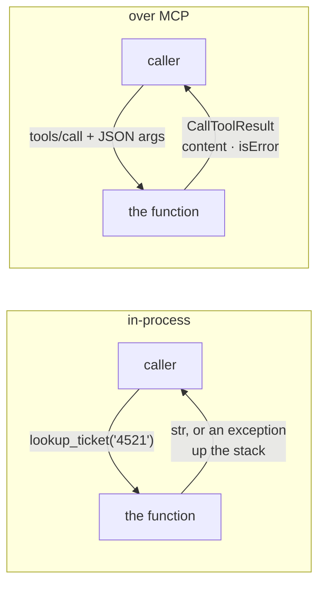

# 2.4 — What the caller can no longer assume

## One-line answer

The same function called over MCP returns a result object instead of a value, reports failure
instead of raising it, accepts only what JSON can carry, and can fail for reasons that have nothing
to do with the work — so "it is the same function" is true of the body and false of everything
around it.

## The story

Your sister rings and asks how you make the lemon rice.

You tell her: rice from yesterday, mustard seeds till they pop, turmeric, peanuts, lemon at the end
off the heat. It takes a minute. She asks *"how much turmeric?"* and you say *"less than you think"*,
and she says *"like for the sambar?"* and you say *"half that"*, and it is done. Neither of you
wrote anything down.

Six months later a colleague asks for the same recipe, so you write it on a card. Now every one of
those shortcuts has to become a number. *Less than you think* has to be a quarter teaspoon. *Rice
from yesterday* has to say cold, cooked, day-old, not warm. You cannot say *"half of what you use
for sambar"*, because you have no idea what she uses. And when she cooks it and it comes out wrong,
she will not ring you mid-way to ask — she will finish it, decide the recipe is bad, and you will
never hear about it.

The dish is the same dish. Everything around getting it made is different, and all of the difference
comes from the fact that you are not in the room.

## The idea in plain language

`lookup_ticket` in `sutra/loop.py` and `lookup_ticket` on `sutra-mcp` run the same body. Four things
around it are not the same, and each one changes how a caller has to be written.

**A return value became a result object.** In Python you get a `str` and can use it. Over MCP you
get a `CallToolResult` — a list of content blocks, an optional `structuredContent`, and an `isError`
flag. Getting to your string means reaching into `result.content[0].text`.

**An exception became a field.** In Python a failure raises and, unless someone catches it, ends the
caller's turn. Over MCP the same failure comes back as an ordinary reply with `isError: true`, and
the caller carries on. Nothing propagates across a process boundary; a stack does not cross a pipe.

**Python objects became JSON.** A `datetime`, a `Decimal`, a `set`, a custom class: all fine as
arguments in-process, none of them expressible in a tool call. Whatever you send must survive being
written as JSON and read back.

**New failures appeared that have nothing to do with the work.** A local function cannot time out,
cannot have its process die, and cannot be renamed between two calls. A tool over a wire can do all
three, and none of those is a bug in the tool.

Day 33's
[1.1](../../../day-33-client-and-transports/parts/01-the-connector/1.1-the-tool-that-lives-somewhere-else.md)
made this point from the client's chair: an MCP tool is indistinguishable from a local function on a
good day, and that is both the value and the risk. This part is the same fact from the server
author's chair, with the four differences named so you can write for them.

## Why Sutra needs it

Because Sutra is about to have both doors on one room, and every later day depends on which door it
came through.

`sutra/loop.py` keeps its plain functions — the hand-rolled loop from Day 3 still calls them
directly, and `sutra/desk/` still uses them through ADK. `sutra_mcp/tools.py` puts the same
implementations on a wire. One implementation, two doors, and it is important that it stay one
implementation: two copies of `search_kb` that drift apart is a support desk that answers differently
depending on which agent asked.

That is why the build brief tells you to **import** the functions from `sutra.loop` rather than
retype them. And it is why the interesting design question of this day is not *"how do I expose a
function"* — it is *"what does exposing it oblige me to change about how it reports failure"*. Day 3
already made the right choice for the wrong reason: its
[2.3](../../../day-03-loop-hand-rolled/parts/02-tools-and-dispatch/2.3-a-failed-tool-is-an-observation.md)
returns a sentence rather than raising, so that the model could read the failure. Over MCP that
choice stops being a nicety and becomes the difference between the model recovering and the model
being handed a stack trace.

## The paper behind it

> **Implementing remote procedure calls** · `doi:10.1145/2080.357392` · 1984 ·
> `https://doi.org/10.1145/2080.357392`

It argued that a procedure call is the right shape to borrow for talking to another machine, and
then spent the paper on the parts that cannot be borrowed: what a call means when the callee may
have vanished, how arguments cross a boundary, and why "the same as a local call" is a goal you
approach rather than reach. This day's four differences are that argument in a modern setting.

Taught in full on Day 15 —
[`days/day-15-toolsets-and-openapi/papers/01-implementing-remote-procedure-calls.md`](../../../day-15-toolsets-and-openapi/papers/01-implementing-remote-procedure-calls.md).

## The mechanism

`lab/both.py` calls the same logic both ways with the same four arguments and prints what came back:

```python
def direct(value: Any) -> str:
    """Call the plain Python function and report the result or the exception."""
    try:
        out = lookup_ticket() if value is None else lookup_ticket(value)
    except TypeError as exc:
        return f"raised TypeError: {exc}"
    except AttributeError as exc:
        return f"raised AttributeError: {exc}"
    return f"returned {type(out).__name__}: {out[:44]}..."


async def over_the_wire(client: Any, value: Any) -> str:
    """Call the same logic through tools/call and report isError plus the text block."""
    arguments = {} if value is None else {"ticket_id": value}
    result = await client.call_tool("lookup_ticket", arguments)
    text = result.content[0].text.replace("\n", " ")
    return f"isError={result.isError} {type(result).__name__}: {text[:60]}..."
```

**Line by line:**

- `from sutra.loop import lookup_ticket` at the top of the file — the **real** function, the one Day
  3 wrote. This is not a copy.
- The `try` / `except` pair in `direct` exists only because there is no other way to see a local
  failure. That asymmetry is the finding: the in-process caller must catch, and the MCP caller must
  not, because there is nothing to catch.
- `except TypeError` and `except AttributeError` are two *different* exception types for two
  different mistakes, and a caller has to know both. Over the wire there is one shape for every
  failure.
- `await client.call_tool(...)` — `await`, because the call goes somewhere. A local call does not.
- `result.content[0].text` — three lookups to reach the string the function returned: the list, the
  first block, its text. `content[0]` is an assumption, and
  [3.3](../03-the-two-calls/3.3-one-call-one-result.md) is where it is examined.
- `result.isError` — a field, read like any other field. Nothing was raised and nothing needs
  catching.

Both arms, run on 2026-09-04:

```text
--- a good id: '4521' ---
  in-process : returned str: Title: Keeps getting logged out. Body: I kee...
  over MCP   : isError=False CallToolResult: Title: Keeps getting logged out. Body: I keep getting logged...

--- an id that is not there: '9999' ---
  in-process : returned str: No ticket with id '9999'....
  over MCP   : isError=False CallToolResult: No ticket with id '9999'....

--- a number where a string was promised: 4521 ---
  in-process : raised AttributeError: 'int' object has no attribute 'strip'
  over MCP   : isError=True CallToolResult: Error executing tool lookup_ticket: 1 validation error for l...

--- nothing at all: None ---
  in-process : raised TypeError: lookup_ticket() missing 1 required positional argument: 'ticket_id'
  over MCP   : isError=True CallToolResult: Error executing tool lookup_ticket: 1 validation error for l...
```

The first two rows are the good news: **for the cases that work, the two doors agree**. The body is
genuinely the same body, and a miss is a sentence on both sides because Day 3 made it one.

The last two rows are the whole subject. In-process, a bad argument raises, the exception type
differs by mistake, and a caller who did not wrap the call loses its turn. Over MCP, both mistakes
come back as a reply — same shape, `isError=True`, a message in a text block — and the caller is
still running and can try again with the argument corrected. The wire did not make failure worse. It
made every failure the same shape, which is what a model can actually work with.



## When it breaks

The break is writing an MCP caller as though it were a local caller — wrapping the call in `try`
and treating the absence of an exception as success:

```python
try:
    result = await client.call_tool("lookup_ticket", {"ticket_id": ticket})
    body = result.content[0].text
except Exception:
    body = "lookup failed"
```

**Line by line:**

- The `try` catches transport failures — a dead process, a timeout — and those are real, so it is not
  useless.
- It catches **nothing** about the tool itself. Every tool failure arrives as a normal return value,
  so `result.isError` being `True` sails straight past this handler.
- `result.content[0].text` on a failed call is the *error message*, so `body` ends up holding
  `"Error executing tool lookup_ticket: 1 validation error for ..."`.
- Downstream, that string is treated as the ticket. It is put in a summary, shown to a user, or
  written to a report. There is no traceback anywhere because nothing went wrong in this process.

The symptom in a real system is a customer-facing message containing the words `validation error`,
and a search of your codebase for that string finding nothing, because it was produced in another
process by a library you did not call. The fix is one line: check `result.isError` before you read
`content`, which is [4.1](../04-two-kinds-of-no/4.1-the-tool-said-no.md).

## In production

**What a professional writes instead:** one implementation and two thin adapters. The function stays
pure Python in `sutra/loop.py`; the MCP layer imports it, declares it, and translates the result.
Nobody maintains two copies, and nobody puts protocol concerns — content blocks, `isError` — inside
the business function, because the day a second protocol appears (Day 42's agent server, Day 89's
A2A) you would be adding a third.

**What degrades at scale:** the four differences become four operational concerns. Result objects
mean allocation per call, which matters at thousands per second. Failures as data mean your error
rate is invisible to anything watching exceptions, so `isError` has to be exported as a metric
deliberately. JSON-only arguments mean every rich type is serialised and parsed twice per call. And
the new failure modes need timeouts, retries and a circuit breaker — Day 44's subject — which a local
function never needed.

**The failure mode that only appears with real traffic:** partial failure. A local call either
returns or raises; there is no third outcome. A remote call has one: the work was done and the reply
did not arrive. A timeout on a read-only tool like `lookup_ticket` is harmless, so a retry is free.
The same timeout on a write tool is a choice between doing the work twice and not doing it at all,
and the only way out is to make the tool idempotent — which is a decision you take when you design
the tool, not when the pager goes off.

**The review comment a senior engineer leaves:** *"this wraps `call_tool` in `try/except` and treats
no-exception as success. Tool failures come back as a result with `isError: true`, not as an
exception, so the failure path here reads the error text and hands it downstream as a ticket body.
Check `isError` first; keep the `except` for the transport."*

**The interview question:** *"you exposed an existing function over MCP — what changed for its
callers?"* The honest answer: *"The body did not change at all, and four things around it did. The
return value became a result object with content blocks and an `isError` flag. Exceptions stopped
propagating — a stack does not cross a process boundary — so tool failures arrive as ordinary
replies, which is better for a model because every failure has the same shape and it can retry.
Arguments became JSON, so anything richer than JSON has to be encoded. And a new class of failure
appeared that has nothing to do with the work: timeouts, a dead process, a tool renamed between two
calls. That is the 1984 RPC argument, and the practical version is that a remote call has three
outcomes rather than two — returned, failed, and 'we do not know' — so read-only tools are safe to
retry and write tools have to be idempotent by design."*

## Check yourself

```bash
uv run python days/day-34-building-sutra-mcp-tools/lab/both.py
```

Two of the four cases produce the same answer through both doors and two do not. Say which two
differ, and name the single design decision made on Day 3 that is the reason the other two agree.

**Out loud, without scrolling up:** name the four things that change when a function is exposed over
MCP, and say which of them makes a model *more* likely to recover from a bad argument.

**Next:** [3.1 — The list, and who may keep it](../03-the-two-calls/3.1-the-list-and-who-may-keep-it.md).
