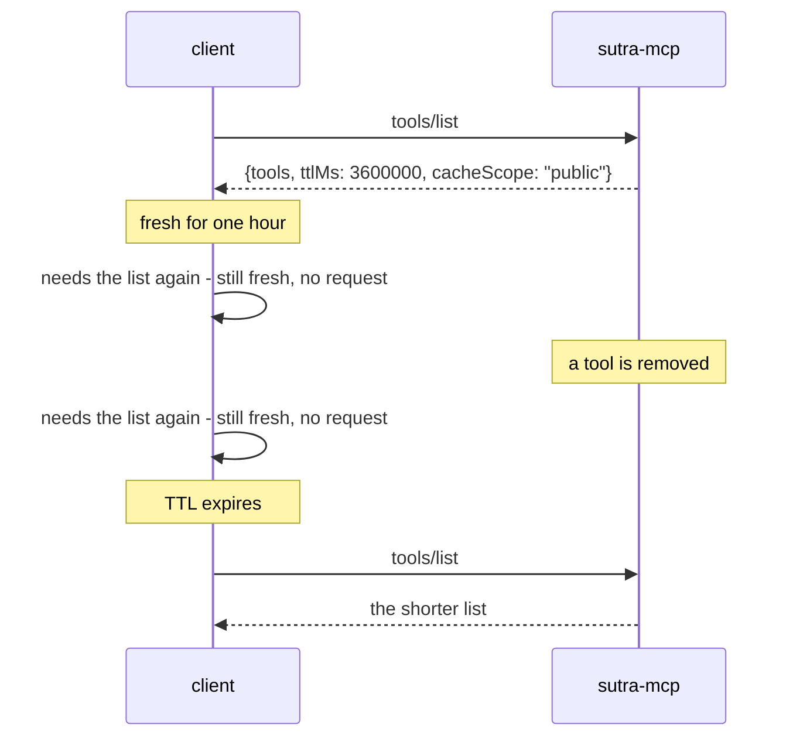

# 3.1 — The list, and who may keep it

## One-line answer

`tools/list` is the one call whose answer a client is allowed to keep, and the server decides for
how long with `ttlMs` and decides who may keep it with `cacheScope` — two fields the pinned SDK does
not send at all.

## The story

The staff noticeboard has one sheet on it: this month's canteen menu.

Somebody photocopies it and pins the copy in the staff room upstairs, so people on that floor do not
have to come down. That is a good idea and it saves forty trips. It also means that when the menu
changes, there are now two sheets and only one of them is right, and the wrong one is on a wall
nobody thinks of as a noticeboard.

Somebody else photocopies a different sheet — the duty roster, which lists who is on call and their
mobile numbers — and pins that upstairs too, in exactly the same helpful spirit. It is the same
action, the same photocopier and the same wall. The first copy was fine and the second one has put
personal numbers in front of a hundred people who had no business seeing them.

The difference was never how long the copy would sit there. It was whether the sheet was the kind of
thing that belongs on a shared wall at all. And the only person who could have known that was the
person who wrote the sheet.

## The idea in plain language

Day 32's
[3.3](../../../day-32-mcp-stateless-core/parts/03-headers-and-caches/3.3-lists-you-may-keep.md)
established the property: statelessness made list results cacheable, and a working session's tool
listings went from sixty requests to one. This part is the server side of that — the two fields
*your* server has to fill in.

**`ttlMs`** is how long, in milliseconds, a client may treat the answer as fresh. From the caching
page (`https://modelcontextprotocol.io/specification/2026-07-28/server/utilities/caching`, read
2026-09-04): *"Semantics are analogous to HTTP `Cache-Control: max-age`."* Zero means immediately
stale. Absent means the client assumes zero, *"and rely on their own caching heuristics or
notifications. This should only occur in older server versions."*

**`cacheScope`** is who may keep it, and it has exactly two values:

| Value | The specification's words | What it means for a tool list |
| --- | --- | --- |
| `"public"` | *"The response does not contain user-specific data. Any client, shared gateway, or caching proxy **MAY** store and serve the cached response to any user."* | every caller sees the same tools |
| `"private"` | *"Cached responses **MAY** be reused for the same authorization context. Caches **MUST NOT** be shared across authorization contexts."* | the list depends on who asked |

And the sentence that makes this a security decision rather than a performance one, from the same
page's security section: *"Servers MUST be aware that responses with a `"public"` `cacheScope` may
be shared between callers even if the Result is coming from an authenticated endpoint."*

One more field belongs here because the two above depend on it. The 2026-07-28 revision requires
every result to carry a **`resultType`**, and caching hints attach only to `resultType: "complete"`
— *"Servers MUST include caching hints on results with `resultType: "complete"`"*. An interim
result, one still waiting on input, carries none.

## Why Sutra needs it

Because Sutra's tool list is `["lookup_ticket", "search_kb"]` today, identical for everyone, and
that is exactly the situation in which the wrong answer is easy and harmless-looking.

`cacheScope: "public"` is correct today. It stops being correct on **Day 40**, which filters the
tool list per caller, and again on **Day 37**, which introduces authorisation. From either of those
days onward the list depends on who asked, and a `"public"` scope means a shared proxy may hand one
caller's tool list to the next — including tools that caller was not permitted to see. There is no
error. There is no log line. It is one JSON field, set correctly today and left behind by a change
made six days later in a different file.

The `ttlMs` decision has a matching hostage. Day 32's
[3.3](../../../day-32-mcp-stateless-core/parts/03-headers-and-caches/3.3-lists-you-may-keep.md) left
you a `TODO(me)` to choose the number that `sutra_mcp`'s `tools/list` would return, and Day 33's
[1.3](../../../day-33-client-and-transports/parts/01-the-connector/1.3-before-the-model-sees-a-tool.md)
left you a matching one for the *client's* TTL. Those two numbers describe the same window from
opposite ends, they are in different units — the protocol's `ttlMs` is milliseconds and ADK's
`tool_list_cache_ttl_seconds` is seconds — and nothing checks that they agree.
[6.1](../06-in-production/6.1-the-tool-you-deleted-is-still-called.md) is what the window costs when
you remove a tool.

## The mechanism

Ask the pinned SDK what it sends, and then build what the specification asks for. `lab/cacheable.py`
does both:

```python
TTL_MS = 3_600_000
CACHE_SCOPE = "public"


async def main() -> None:
    """Print the SDK's own list result, then the one a 2026-07-28 client expects."""
    server = build_server()
    tools = sorted(await server.list_tools(), key=lambda tool: tool.name)

    plain = types.ListToolsResult(tools=tools)
    print("what mcp 1.29.1 sends:")
    print(sorted(plain.model_dump(exclude_none=True, by_alias=True)))

    cacheable = types.ListToolsResult(tools=tools, ttlMs=TTL_MS, cacheScope=CACHE_SCOPE)
    print("\nwhat 2026-07-28 requires:")
    print(sorted(cacheable.model_dump(exclude_none=True, by_alias=True)))
```

**Line by line:**

- `TTL_MS = 3_600_000` — an hour, written with underscores so the count of zeros is readable. This
  is the single most common place to lose an order of magnitude: `3600` looks like an hour and is
  three and a half seconds.
- `sorted(..., key=lambda tool: tool.name)` — the ordering is not decoration, it is what makes a
  cache key stable. [3.2](3.2-the-same-order-every-time.md) is that argument.
- `types.ListToolsResult(tools=tools)` — the result object exactly as the SDK builds it, with no
  hints.
- `model_dump(exclude_none=True, by_alias=True)` — `exclude_none` drops fields that are `None` so
  the output shows only what would actually be on the wire; `by_alias` prints the JSON field names
  rather than the Python attribute names.
- `types.ListToolsResult(tools=tools, ttlMs=..., cacheScope=...)` — this **works**, and it should not.
  The SDK's model has `model_config = ConfigDict(extra="allow")`, so unknown fields are accepted and
  carried rather than rejected. That permissiveness is what lets you hand-build a 2026-07-28 result
  on a 2025-11-25 library, and it is also why a typo in one of those field names would be silently
  kept and sent.
- **Zero model calls, no network, no process.**

The output, on 2026-09-04:

```text
what mcp 1.29.1 sends:
['tools']

what 2026-07-28 requires:
['cacheScope', 'tools', 'ttlMs']
```

One key against three. The pinned SDK sends a bare list, so a modern client applies the rule for an
absent `ttlMs` — treat it as `0`, immediately stale — and asks again every time. Nothing is broken;
Day 32's sixty-to-one saving simply does not happen, and the reason is a library version rather than
a design decision.



Read the two middle rows. Between the removal and the expiry the client is offering a tool that no
longer exists, and it is behaving correctly.

## When it breaks

The unit. `ttlMs` is milliseconds, and every human instinct is seconds:

```python
cacheable = types.ListToolsResult(tools=tools, ttlMs=3600, cacheScope="public")
```

**Line by line:**

- `3600` is what you write when you are thinking in seconds and the field is in milliseconds.
- The value is a valid non-negative integer, so it passes every check the specification imposes:
  *"Servers **MUST** provide a `ttlMs` value that is `>= 0`."*
- The client does exactly what it was told and re-fetches after three and a half seconds.
- There is **no error**. The symptom is a `tools/list` request rate roughly a thousand times higher
  than you expected, which reads as a client bug, a retry storm, or a monitoring fault — anything
  except a field on your own server.

The second break is the one the story is about, and it is a single word:

```text
cacheScope: "public"   on a list that was filtered per caller
```

The specification's security note is the whole warning: a `"public"` response *"may be shared
between callers even if the Result is coming from an authenticated endpoint"*. So a shared gateway
caches the tool list an administrator received and serves it to the next caller, who now sees the
names and descriptions of tools they are not allowed to use. Whether they can *call* them is a
separate question with a separate answer — the spec is explicit that servers *"MUST apply
appropriate per-primitive access controls, and MUST NOT rely on `cacheScope` alone"* — but the
disclosure has already happened, and tool descriptions are written to be informative.

## In production

**What a professional writes instead:** both fields set explicitly, from named constants, with a
comment tying `cacheScope` to whether the list varies by caller. The rule that survives review is:
**the scope is decided by what the response contains, never by what would be faster.** A list that
depends on identity is `"private"`, and it is `"private"` from the moment the *possibility* of
filtering exists, not from the moment filtering ships.

**What degrades at scale:** a short TTL turns `tools/list` into the busiest method on your server.
Every client, every turn, for a list that changes on deploys. A long TTL fixes that and buys you the
staleness window instead. The usual landing place is a TTL measured in an hour or so with a
`listChanged` notification as the invalidation signal — the caching page is explicit that the two are
complementary: *"the client can use the TTL to avoid unnecessary refetches between notifications,
and the notification acts as an immediate invalidation signal"*. Note that Day 33 established ADK
does not subscribe to that notification, so for Sutra's own client the TTL is the whole mechanism.

**The failure mode that only appears with real traffic:** the gateway you did not know was there. A
corporate egress proxy or an API gateway obeys `cacheScope: "public"` correctly, and a tool list is
suddenly shared across teams that have different entitlements. In development there is no proxy, so
the bug does not exist until the day the deployment topology changes — and the change that exposes
it is made by a network team who have never heard of your tool list.

**The review comment a senior engineer leaves:** *"`cacheScope: 'public'` on `tools/list`, and Day
40 filters this list per caller. The moment that lands, a shared cache can serve one caller's tool
list to another. Make it `'private'` now, add a comment saying why, and revisit it if we ever prove
the list is identical for everyone."*

**The interview question:** *"your tool list is cacheable — what did you have to decide?"* The
honest answer: *"Two fields. `ttlMs` in milliseconds, which is how long a client may keep the list
fresh — and the catch is that it is also how long a client may keep offering a tool you deleted, so
removing a tool becomes two deployments. And `cacheScope`, which is who may keep it: `public` means
any shared proxy may serve it to any user, `private` means it may not cross an authorization
context. That second one is a security decision wearing a performance decision's clothes. Our list
was identical for everyone on day one, so `public` was correct, and it stopped being correct the day
we filtered tools per caller — with no error, because a cache doing the wrong thing looks exactly
like a cache doing the right thing. We also found our pinned SDK sends neither field, so clients
treat the list as immediately stale and we lose the saving entirely until the pin moves."*

## Check yourself

```bash
uv run python days/day-34-building-sutra-mcp-tools/lab/cacheable.py
```

It prints one key and then three. Change `CACHE_SCOPE` to `"private"` and run it again: nothing
about the output shape changes, and one word of meaning does. Say which caller that word protects,
and from what.

**Out loud, without scrolling up:** give the unit of `ttlMs`, both values of `cacheScope`, and the
question you ask to decide between them.

**Next:** [3.2 — The same order every time](3.2-the-same-order-every-time.md).
