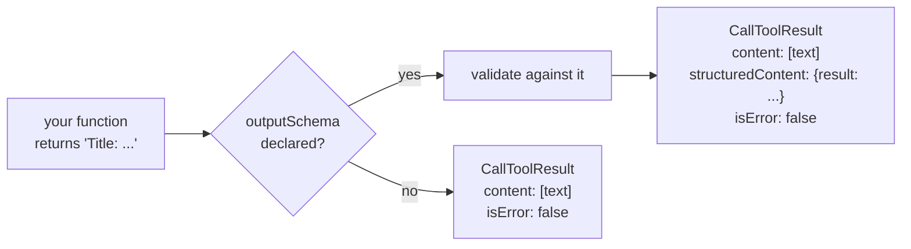

# 3.3 — One call, one result

## One-line answer

`tools/call` sends a name and an arguments object and gets back one result carrying a list of
content blocks for the model to read, an optional `structuredContent` for the program to parse, and
an `isError` flag — and your tool's plain `str` return became all three of those things.

## The story

You leave the scooter at the repair shop with one sentence: *"it stalls at the lights."*

What you get back the next morning is a job card. There is a line at the top in words —
*"idle screw adjusted, air filter cleaned, tested 4 km"* — which is the bit you read. Underneath
there is a boxed grid: part numbers, quantities, labour code, a total. That grid is not for you. It
is for the shop's ledger, and for the insurer if you ever claim, and the numbers in it have to match
the words above them exactly.

And in the corner there is a box that is either ticked or not: *work completed*. If it is not
ticked, the sentence at the top still says something — *"could not source the part"* — and you still
need to read it, and it means something completely different about what you do next.

Three pieces of paper's worth of information on one card, for three different readers, produced by
one visit.

## The idea in plain language

A tool call is one request and one reply. The request is small:

```json
{
  "jsonrpc": "2.0",
  "id": 2,
  "method": "tools/call",
  "params": {
    "name": "lookup_ticket",
    "arguments": { "ticket_id": "4521" }
  }
}
```

The reply is where the shape lives. Four fields matter today:

| Field | Who reads it | What it is |
| --- | --- | --- |
| `resultType` | the client | `"complete"` when the work is done; `"input_required"` when the server needs an answer first (Day 37) |
| `content` | the **model** | a list of blocks — text, image, audio, a link to a resource, an embedded resource |
| `structuredContent` | your **program** | a JSON value matching the tool's `outputSchema`, when it declared one |
| `isError` | the client's error path | `false` for a normal result, `true` when the tool ran and failed |

The split between `content` and `structuredContent` is the job card's split between the sentence and
the grid. `content` is prose for something that reads prose. `structuredContent` is data for
something that parses data. The specification asks you to send both when you have both, for a
practical reason (`https://modelcontextprotocol.io/specification/2026-07-28/server/tools`, read
2026-09-04): *"For backwards compatibility, a tool that returns structured content SHOULD also
return the serialized JSON in a TextContent block."*

And when the tool declared an `outputSchema`, the structured half is not optional: *"Servers **MUST**
provide structured results that conform to this schema."*

## Why Sutra needs it

Because Sutra's tools return a plain `str`, and you should know exactly what the SDK turned that
into before you rely on it.

It matters immediately for [4.1](../04-two-kinds-of-no/4.1-the-tool-said-no.md) and
[4.2](../04-two-kinds-of-no/4.2-the-call-never-happened.md), which are entirely about the `isError`
field this part introduces. It matters on **Day 35**, where a tool that wants to hand back a whole
document returns a `resource_link` block instead of a wall of text. It matters on **Day 36**, where
a long job returns immediately with a handle rather than a finished answer. And it matters on
**Day 39**, where a SQL-backed tool has genuinely structured output and `structuredContent` stops
being a wrapper around a sentence and starts being rows.

It also matters for one small habit: `result.content[0].text` is the line everybody writes, and it
assumes the list has at least one element and that its first element is text. Both assumptions are
true of Sutra's tools today and neither is guaranteed by the protocol.

## The mechanism

Here is a complete, real `CallToolResult` from Sutra's own `lookup_ticket`, dumped on 2026-09-04:

```json
{
  "content": [
    {
      "type": "text",
      "text": "Title: Keeps getting logged out. Body: I keep getting logged out of the dashboard every few minutes. Started yesterday. Plan: Pro."
    }
  ],
  "structuredContent": {
    "result": "Title: Keeps getting logged out. Body: I keep getting logged out of the dashboard every few minutes. Started yesterday. Plan: Pro."
  },
  "isError": false
}
```

Your function returned one string. Look what arrived: **the same text twice**, once as a content
block and once inside `structuredContent` under the key `result`. That is not a bug. It is
[2.1](../02-function-to-declaration/2.1-the-decorator-that-writes-your-schema.md)'s `outputSchema`
being honoured — the return hint `-> str` produced a schema of `{"result": {"type": "string"}}`, so
the SDK must produce structured output matching it, and the spec's backwards-compatibility line says
to send the text form as well.

The code that builds it, from `.venv/Lib/site-packages/mcp/server/lowlevel/server.py`, read
2026-09-04:

```python
if tool and tool.outputSchema is not None:
    if maybe_structured_content is None:
        return self._make_error_result(
            "Output validation error: outputSchema defined but no structured output returned"
        )
    else:
        try:
            jsonschema.validate(instance=maybe_structured_content, schema=tool.outputSchema)
        except jsonschema.ValidationError as e:
            return self._make_error_result(f"Output validation error: {e.message}")

return types.ServerResult(
    types.CallToolResult(
        content=list(unstructured_content),
        structuredContent=maybe_structured_content,
        isError=False,
    )
)
```

**Line by line:**

- `if tool and tool.outputSchema is not None` — output validation only happens when the tool
  declared an output schema. Annotate your return type and you have opted into a check on every call.
- `maybe_structured_content is None` — declaring an output schema and returning nothing structured is
  itself a failure, and it comes back as `isError`, not as a crash.
- `jsonschema.validate(instance=..., schema=...)` — the server validates **its own** output against
  its own published schema before sending it. That is unusual and it is the right way round: the
  promise in `tools/list` is checked at the only moment it can be broken.
- `return self._make_error_result(f"Output validation error: {e.message}")` — a schema violation in
  your own output is reported to the caller as a tool error. The caller sees `isError: true` and a
  message about *your* schema, which is a small leak of implementation detail and a large improvement
  on sending malformed data.
- `content=list(unstructured_content)` — always a list, even for one block.
- `isError=False` — set explicitly on the success path. The error path is one function away and sets
  it to `True`; that pair is section 4.

Now the calling side, and the line worth being careful about:

```python
result = await client.call_tool("lookup_ticket", {"ticket_id": "4521"})
text = result.content[0].text
```

**Line by line:**

- `client.call_tool(name, arguments)` — the two things a call is. Nothing else travels except the
  `_meta` the client library adds.
- `result.content[0]` assumes the list is non-empty. A tool that legitimately returns nothing sends
  `content: []`, and this line is an `IndexError`.
- `.text` assumes the first block is a text block. A tool returning an image sends
  `{"type": "image", "data": ..., "mimeType": ...}` and there is no `text` attribute to read.
- Neither assumption is checked and both are true for Sutra today, which is exactly why this is worth
  saying out loud now rather than on Day 35 when the first `resource_link` arrives.
- The safe form checks `isError` first, then the block's `type` — and checking `isError` first is
  [4.1](../04-two-kinds-of-no/4.1-the-tool-said-no.md)'s subject.



## When it breaks

The break is returning something the SDK cannot convert. A tool annotated `-> dict` that returns a
`set`, a `datetime`, or any object JSON cannot express fails at the moment of conversion, and the
failure arrives at the caller as a tool error:

```text
--- tools/call ticket_age_days {'ticket_id': '4522'} ---
isError : True
content : Error executing tool ticket_age_days: '4522'
```

That is `lab/drive.py`'s fourth call, run on 2026-09-04, and it is the general shape of every
failure inside a tool body: `isError: true`, and the exception's message — here a bare `'4522'` from
a `KeyError` — sitting in a text block. What it is *not* is a JSON-RPC error, and it is not a
traceback.
[4.3](../04-two-kinds-of-no/4.3-the-message-that-escaped.md) is about what that message contains.

The second break has no error and reads as a bug in the model. A tool declares `-> str`, returns a
string, and the string is a JSON document — a common thing to do when you want to return several
fields and cannot be bothered with a schema. The result is a `content` block of JSON text and a
`structuredContent` of `{"result": "{\"a\": 1}"}`: a string containing JSON, not JSON. Any client
validating against your `outputSchema` sees a valid string and is satisfied. Any program trying to
read `structuredContent.a` finds nothing. The fix is to declare a real return type — a `TypedDict`,
a dataclass or a Pydantic model — so the schema describes the fields rather than describing a string.

## In production

**What a professional writes instead:** a declared return type that is a real structure whenever the
tool returns more than one fact, and a single text block written for the model rather than a dump of
the JSON. The pattern that survives is: `structuredContent` for the program, one readable sentence
in `content` for the model, and never a raw serialisation pasted into both.

**What degrades at scale:** result size. Everything in `content` goes into the model's context, and
it is charged for on every turn it stays there. A tool that returns a whole log file has put a whole
log file in the conversation. The protocol's answer is the `resource_link` block — hand back a URI
and let the client fetch it if it wants — which is **Day 35's** subject, and it is the single most
effective size control on this interface.

**The failure mode that only appears with real traffic:** duplication. `content` and
`structuredContent` carry the same data twice by design, so a tool returning a large structure sends
it twice on every call. On small results this is invisible. On a result of any size it doubles the
bytes on the wire and, if the client puts both into the prompt, doubles the tokens. Teams find this
when a token bill grows faster than the call count and nobody can find the second copy, because the
second copy is in a field they never look at.

**The review comment a senior engineer leaves:** *"this reads `result.content[0].text` with no check
on `isError` and no check on the block type. Today every tool returns one text block so it works.
The day someone returns a resource link or an empty result, this is an `AttributeError` or an
`IndexError` in the middle of a user's turn. Check `isError`, then check `type == 'text'`."*

**The interview question:** *"what comes back from a tool call?"* The honest answer: *"One result
with four things in it. A `resultType`, which is `complete` unless the server is asking for more
input. A list of content blocks — text, image, audio, a resource link — which is what goes to the
model. An optional `structuredContent`, which is JSON matching the tool's declared output schema and
is what a program parses. And `isError`, which is how a tool says the work failed without failing the
call. The detail that surprised us is that a tool returning a plain string with a return type
annotation gets an auto-generated output schema, so the same text comes back twice — once as a text
block and once wrapped as `{'result': ...}` — and the server validates its own output against its
own published schema before sending it."*

## Check yourself

```bash
uv run python days/day-34-building-sutra-mcp-tools/lab/drive.py
```

The first call prints `isError : False` and a ticket body. Modify `drive.py` to print
`result.structuredContent` as well, and say why the same text appears twice and which of the two a
model actually reads.

**Out loud, without scrolling up:** name the four fields of a tool result and say, for each one, who
the intended reader is.

**Next:** [4.1 — The tool said no](../04-two-kinds-of-no/4.1-the-tool-said-no.md).
