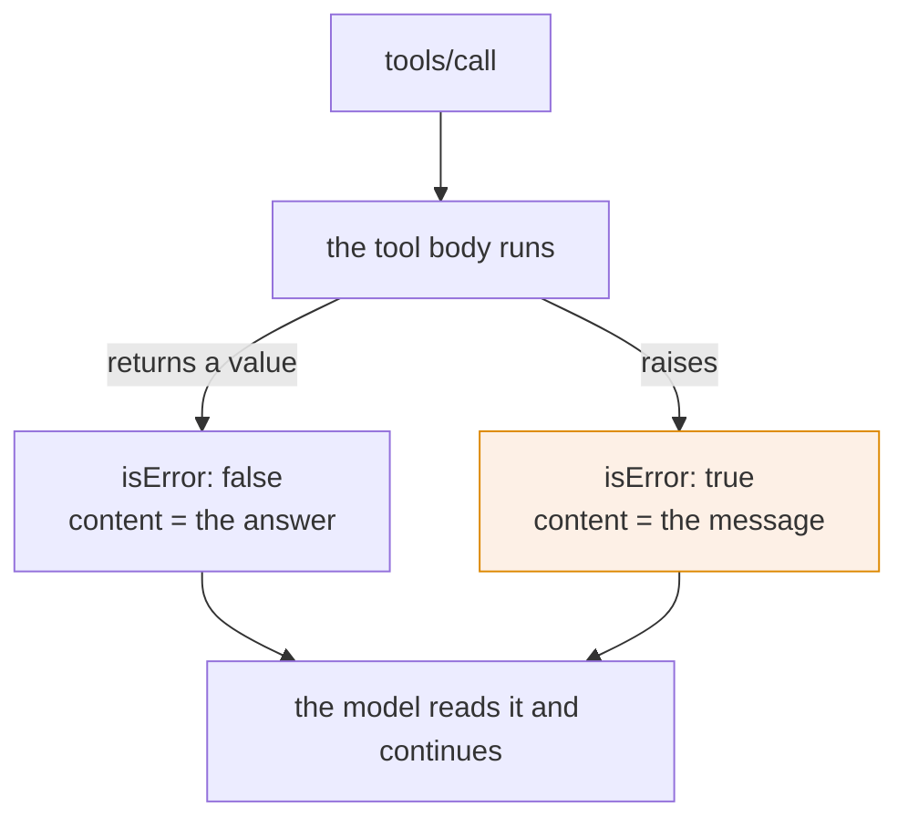

# 4.1 — The tool said no

## One-line answer

`isError: true` means the tool ran and could not do the job, the message is written for the model
that will read it, and the whole point of reporting failure this way is that the caller stays alive
to try something else.

## The story

You take the form to the counter and the clerk deals with it in ninety seconds.

She checks the boxes, turns to the screen, types, and then reaches for a stamp. The stamp says
REJECTED. Underneath it she writes one line by hand: *"joint account — second signature required."*
She slides the form back across the counter, and she is already looking past you at the next person.

Nothing went wrong at the counter. She was open, she was working, your form reached her, she read
it, and she made a decision. You are standing in the same place holding the same form, and the
difference is that you now know exactly what to change: come back with your brother.

Compare that with the other kind of no. You arrive and the shutter is down, and there is no clerk,
no stamp and no line of handwriting. You also cannot do the thing you came for, and you have learned
nothing about how to do it. That is [4.2](4.2-the-call-never-happened.md).

## The idea in plain language

The specification names two ways a tool call can fail and it is explicit about which is which
(`https://modelcontextprotocol.io/specification/2026-07-28/server/tools`, read 2026-09-04):

> **Tool Execution Errors** *"contain actionable feedback that language models can use to
> self-correct and retry with adjusted parameters"* — API failures, input validation errors,
> business logic errors. *"They are reported in tool results with `isError: true`."*

And the rule for what a client does with one:

> *"Clients **SHOULD** provide tool execution errors to language models to enable self-correction."*

So `isError: true` is not a crash report. It is a **stamped form**: the call succeeded at the
protocol level, a normal result came back, and inside it the tool says *I ran, and the answer is no,
and here is why*. The example the spec gives is worth copying for its tone:
*"Invalid departure date: must be in the future. Current date is 08/08/2025."* It names the field,
states the rule, and gives the value the model needs to fix it.

The design rule that falls out of that: **the message is written for the model, not for your log.**
A log line answers *what happened*. A tool error answers *what should you do differently*.

## Why Sutra needs it

Because Sutra already faces the interesting question and answers it in a way that surprises people.

`lookup_ticket("9999")` returns *"No ticket with id '9999'."* with **`isError: false`**. A missing
ticket is not an error. It is a fact about the archive, and the tool did exactly what it was asked
to do: it looked, and it reports what it found. Day 3's
[2.3](../../../day-03-loop-hand-rolled/parts/02-tools-and-dispatch/2.3-a-failed-tool-is-an-observation.md)
made that choice for the hand-rolled loop, and it is still right on a wire.

The distinction is worth being able to state, because it is asked in interviews and it is got wrong
in code:

| Situation | `isError` | Why |
| --- | --- | --- |
| the ticket does not exist | `false` | the tool answered the question; the answer is "none" |
| the ticket id was not a string | `true` | the tool could not run at all |
| the archive is unreachable | `true` | the tool ran and failed for a reason the caller may retry past |
| the caller is not allowed this ticket | `true` | the tool ran and refused |

A tool that returns `isError: true` for a miss teaches the model that missing tickets are failures,
and models respond to failures by retrying — so it will look up the same absent ticket again. A tool
that returns `isError: false` for an unreachable archive teaches it that an empty archive is a
normal answer, and it will summarise the customer's problem as *"no history found"* when the truth
is *"the database was down"*. Both mistakes are one boolean.

This matters again on **Day 37**, where a refusal for authorisation reasons must be distinguishable
from a genuine absence, and on **Day 39**, where a database error and an empty result set are two
lines of code apart.

## The paper behind it

> **End-to-end arguments in system design** · `doi:10.1145/357401.357402` · 1984 ·
> `https://doi.org/10.1145/357401.357402`

It argued that a function can only be completely and correctly implemented with the knowledge held
at the endpoints of a system, so lower layers should report faithfully rather than decide on the
endpoint's behalf. A tool that swallows a failure, or that turns a fact into an error, has made a
decision only the model has the context to make.

Taught in full on Day 21 —
[`days/day-21-errors-surface-not-swallow/papers/01-end-to-end-arguments.md`](../../../day-21-errors-surface-not-swallow/papers/01-end-to-end-arguments.md).

## The mechanism

Every failure inside a tool body becomes an `isError` result, and one line of the SDK does it. From
`.venv/Lib/site-packages/mcp/server/lowlevel/server.py`, read 2026-09-04:

```python
def _make_error_result(self, error_message: str) -> types.ServerResult:
    """Create a ServerResult with an error CallToolResult."""
    return types.ServerResult(
        types.CallToolResult(
            content=[types.TextContent(type="text", text=error_message)],
            isError=True,
        )
    )
```

**Line by line:**

- The failure becomes a **`CallToolResult`**, the same class a success uses. Not an exception, not a
  JSON-RPC error object. That is what makes it survivable for the caller.
- `content=[TextContent(...)]` — the message goes into the ordinary content list, so a client that
  does nothing special will hand it to the model along with everything else. That is the spec's
  *"SHOULD provide tool execution errors to language models"* happening by default.
- `isError=True` is the only field that distinguishes it. Miss that field and an error is
  indistinguishable from an answer.
- `error_message` is a plain string, and everything about the quality of the failure path comes down
  to what is in it. That is the next code block.

And here is where the string comes from, from `mcp/server/fastmcp/tools/base.py`, same day:

```python
except Exception as e:
    raise ToolError(f"Error executing tool {self.name}: {e}") from e
```

**Line by line:**

- `except Exception` — **every** exception your tool body raises is caught here. There is no escape
  hatch and no exception type that behaves differently.
- `f"Error executing tool {self.name}: {e}"` — the message the model reads is the prefix plus
  `str(e)`, and `str(e)` is whatever your exception happened to say.
- `from e` preserves the chain for the server's own logs and does not send it anywhere.
- The consequence, and it is the reason [4.3](4.3-the-message-that-escaped.md) exists: **the text of
  your exceptions is now caller-facing text.** A `KeyError` becomes the bare key. A database driver's
  error becomes a connection string.

So a professional tool does not rely on that path. It decides for itself:

```python
@server.tool()
def close_ticket(ticket_id: str, reason: str) -> str:
    """Close a support ticket. Requires a reason of at least ten characters."""
    if ticket_id not in TICKETS:
        return f"No ticket with id {ticket_id!r}. Nothing was closed."
    if len(reason.strip()) < 10:
        raise ValueError(
            f"reason must be at least 10 characters describing why the ticket is being "
            f"closed; got {len(reason.strip())}. Retry with a fuller reason."
        )
    return f"Ticket {ticket_id} closed."
```

**Line by line:**

- The missing ticket **returns a sentence** with no exception, so `isError` stays `false`. It is a
  fact, not a failure, and *"Nothing was closed"* is added because for a tool that changes something
  the model needs to know the change did not happen.
- The short reason **raises**, so `isError` becomes `true`. The model asked for something it is not
  allowed to have, and the retry is obvious.
- The `ValueError` message names the field, states the rule, gives the actual value, and says what
  to do. That is the spec's example rebuilt for this tool.
- `raise` rather than `return` for this case is deliberate: it is a rule violation the model should
  count as a failed attempt, not an answer to fold into a summary.
- `f"... got {len(reason.strip())}"` gives the model the number. *"Too short"* invites another guess;
  *"got 4"* does not.



Both arrows end at the same box. That is the property worth naming: a tool error does not interrupt
anything.

## When it breaks

The break is on the calling side, and `lab/drive.py`'s output has both halves of it in one screen,
run on 2026-09-04:

```text
--- tools/call lookup_ticket {'ticket_id': '9999'} ---
isError : False
content : No ticket with id '9999'.

--- tools/call ticket_age_days {'ticket_id': '4522'} ---
isError : True
content : Error executing tool ticket_age_days: '4522'
```

Two calls, two sentences, and the **only** difference in structure is the boolean. A caller that
reads `content[0].text` without looking at `isError` — the mistake
[2.4](../02-function-to-declaration/2.4-what-the-caller-can-no-longer-assume.md) warned about —
treats both of those as the ticket's contents. The second one then flows downstream as though
`Error executing tool ticket_age_days: '4522'` were a fact about a customer's ticket.

The other break is a tool that hides its failure:

```python
try:
    return archive.fetch(ticket_id)
except Exception:
    return f"No ticket with id {ticket_id!r}."
```

**Line by line:**

- This looks defensive and reads as tidy. It is the exact failure the end-to-end argument is about.
- `except Exception` catches the archive being unreachable, a timeout, a permissions error and a
  genuine miss, and returns the same sentence for all of them.
- `isError` stays `false`, so the model is told the ticket does not exist, and it will tell the
  customer so.
- The information needed to make the right decision — retry, escalate, or answer — existed for one
  line and was thrown away by a layer that could not use it. Principle 10 in four lines of Python.

## In production

**What a professional writes instead:** explicit error paths per failure class. Retryable failures
(timeouts, `503`s) raise with a message saying so. Permanent refusals (validation, authorisation)
raise with the rule and the offending value. Genuine absences return normally. The message always
names the field and states what a corrected call would look like — and it never contains a stack
trace, which is [4.3](4.3-the-message-that-escaped.md).

**What degrades at scale:** `isError` is invisible to anything watching exceptions, because nothing
was raised out of the process. Your error rate is a field inside a successful response. It has to be
exported as a metric deliberately — tool name plus `isError` plus a coarse reason — or the first
sign that a tool is failing constantly is a human noticing that the agent has been apologising all
week.

**The failure mode that only appears with real traffic:** the retry loop. A model reads a tool error
as an invitation to try again, which is correct behaviour and is the reason the field exists. If the
message does not say what to change — *"an error occurred"* — the model will retry with the same
arguments, get the same message, and burn its step budget doing it. Day 3's
[5.1](../../../day-03-loop-hand-rolled/parts/05-containment/5.1-the-step-budget.md) is the containment
that stops it, and a message that names the fix is the thing that makes the containment unnecessary.

**The review comment a senior engineer leaves:** *"this catches every exception from the archive and
returns 'no ticket found'. That tells the model the ticket does not exist when the truth may be that
the database is down, and the model will tell a customer we have no record of their complaint. Let
the failure be `isError` with a message that says what failed, and keep the not-found sentence for
an actual not-found."*

**The interview question:** *"how does a tool report that it failed?"* The honest answer: *"With
`isError: true` on an otherwise ordinary result. The call succeeded at the protocol level; the tool
is saying it ran and could not do the job. The spec says clients should hand those to the model
because they enable self-correction, so the message is written for the model — name the field, state
the rule, give the value, say what a corrected call looks like. The line I would defend is that a
missing record is not an error: our ticket lookup returns 'no ticket with that id' with `isError`
false, because the tool answered the question. The failure I have actually seen is a broad `except`
that turns an unreachable database into 'not found' — the model then tells a customer we have no
record of them, and there is no error anywhere to find."*

## Check yourself

```bash
uv run python days/day-34-building-sutra-mcp-tools/lab/drive.py
```

Two of its four calls come back with `isError : False` and two with `True`. For each of the four, say
in one sentence why that value is the right one, and say which one a model can most usefully retry.

**Out loud, without scrolling up:** give the rule for when a tool result is an error and when it is
an answer, and say what a message written for a model contains that a log line does not.

**Next:** [4.2 — The call never happened](4.2-the-call-never-happened.md).
