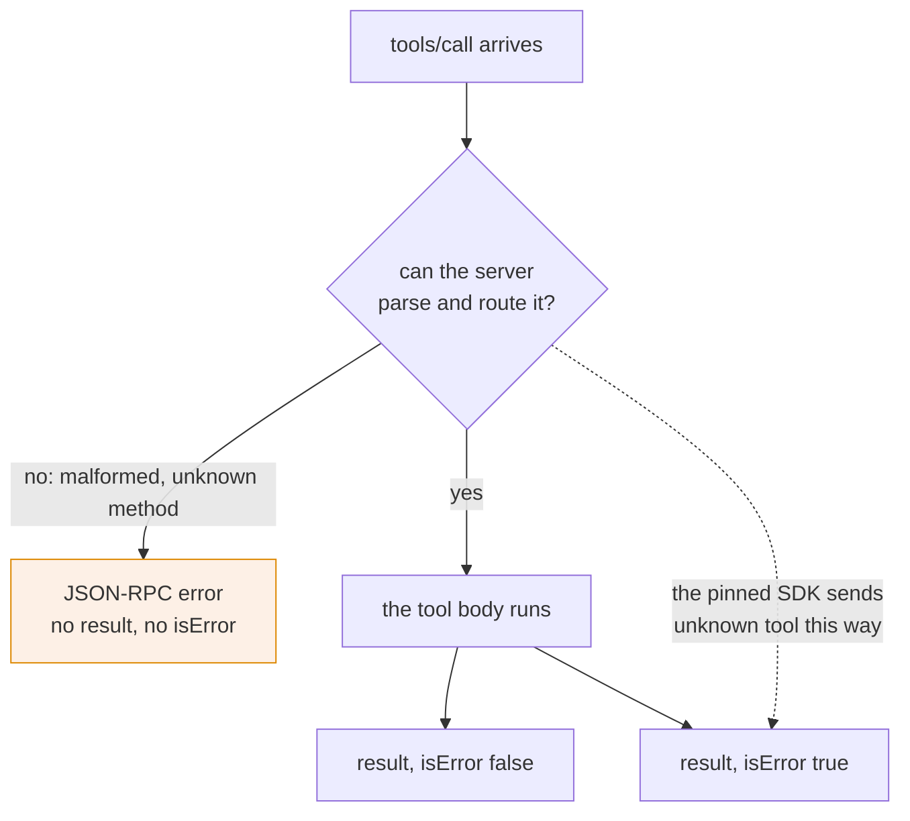

# 4.2 — The call never happened

## One-line answer

A protocol error is a JSON-RPC `error` object rather than a result: nothing ran, there is no
`isError` field because there is no result to put it in — and the pinned SDK reports an unknown tool
the other way round, which is a divergence worth knowing about before you rely on either.

## The story

You dial a number from an old visiting card and get a recorded voice.

*"The number you have dialled is not in service."* It is not a busy tone and it is not ringing out.
Nobody's phone made a sound. The message came from the network, which looked at the digits, found no
subscriber, and answered on the network's own behalf.

The difference matters for what you do next. A busy tone means try again later; somebody is there. A
ringing phone that nobody answers means try again later; somebody may be there. *"Not in service"*
means stop dialling this number — no amount of patience will connect it, and the fix is to find a
different number, not to redial.

And notice the one thing the recorded voice cannot tell you: whether the person moved, changed
provider, or never existed. It has no idea. It only knows the digits do not route.

## The idea in plain language

The specification lists two error mechanisms for tools, and
[4.1](4.1-the-tool-said-no.md) covered the second. This is the first
(`https://modelcontextprotocol.io/specification/2026-07-28/server/tools`, read 2026-09-04):

> **Protocol Errors** *"indicate issues with the request structure itself that models are less
> likely to be able to fix"* — unknown tool, malformed requests, server errors. *"They are returned
> as standard JSON-RPC errors."*

The shape it gives:

```json
{
  "jsonrpc": "2.0",
  "id": 3,
  "error": {
    "code": -32602,
    "message": "Unknown tool: invalid_tool_name"
  }
}
```

Read what is missing. There is no `result`, so there is no `content`, no `structuredContent` and **no
`isError`** — those are fields of a result and no result exists. The reply has an `error` where a
result would have been.

And the rule for what a client does with one, which is deliberately weaker than
[4.1](4.1-the-tool-said-no.md)'s: *"Clients **MAY** provide protocol errors to language models,
though these are less likely to result in successful recovery."* `MAY` against `SHOULD`. The reason
is the recorded voice: a stamped form tells you what to change, and *"not in service"* tells you the
request itself was wrong in a way the sender is unlikely to be able to repair by adjusting a
parameter.

The codes are partitioned, and the partition is new in this revision
(`https://modelcontextprotocol.io/specification/2026-07-28/basic/index`, read 2026-09-04):

| Range | Meaning |
| --- | --- |
| `-32700`, `-32600` to `-32603` | the standard JSON-RPC codes, used for general protocol failures |
| `-32000` to `-32019` | **legacy.** *"New codes MUST NOT be allocated in this sub-range"* |
| `-32020` to `-32099` | reserved for the MCP specification: `-32020` `HeaderMismatch`, `-32021` `MissingRequiredClientCapability`, `-32022` `UnsupportedProtocolVersion` |
| outside `-32768` to `-32000` | where your own application-defined codes belong |

Day 32's
[3.2](../../../day-32-mcp-stateless-core/parts/03-headers-and-caches/3.2-the-header-that-must-match.md)
met `-32020` as the header-mismatch rule. This part is the same machinery for a different question.

## Why Sutra needs it

Because a client holding a stale tool list will call a tool that is not there, and what your server
answers decides whether that client can recover.

That is not a theoretical sequence: [3.1](../03-the-two-calls/3.1-the-list-and-who-may-keep-it.md)
just gave clients permission to keep the list for as long as `ttlMs` says, so *"you called something
I do not have"* is a normal, expected event on any server that ever removes a tool.
[6.1](../06-in-production/6.1-the-tool-you-deleted-is-still-called.md) is that whole story.

It matters for a second reason, which is that Sutra will one day be the **client** — Day 42 exposes
the desk agent over MCP and Day 44 hardens the client. A client that treats a protocol error the way
it treats a tool error will retry a call that can never work, and a client that treats a tool error
the way it treats a protocol error will give up on one that would have worked on the second attempt.
Telling them apart is the whole job.

## The mechanism

The two replies side by side, so the shape difference is visible rather than described. A tool error,
as [4.1](4.1-the-tool-said-no.md) produced it:

```json
{
  "jsonrpc": "2.0",
  "id": 4,
  "result": {
    "resultType": "complete",
    "content": [{ "type": "text", "text": "Invalid departure date: must be in the future." }],
    "isError": true
  }
}
```

A protocol error, from the same specification page:

```json
{
  "jsonrpc": "2.0",
  "id": 3,
  "error": {
    "code": -32602,
    "message": "Unknown tool: invalid_tool_name"
  }
}
```

Both are replies to `tools/call`. One has `result`, one has `error`, and a client reads the presence
of those two keys before it reads anything else.

Now the divergence, and it is the reason this part matters more than a spec quotation would suggest.
Ask the **pinned SDK** for a tool that does not exist. From `lab/drive.py`, on 2026-09-04 — the first
line is the server's own stderr, the rest is the reply:

```text
Tool 'close_ticket' not listed, no validation will be performed
--- tools/call close_ticket {'ticket_id': '4521'} ---
isError : True
content : Unknown tool: close_ticket
```

`isError : True`. Not a JSON-RPC error. **The pinned SDK reports an unknown tool as a tool execution
error**, which is the category the specification explicitly assigns to protocol errors. Here is the
path, in two files read on 2026-09-04:

```python
# mcp/server/fastmcp/tools/tool_manager.py
raise ToolError(f"Unknown tool: {name}")

# mcp/server/lowlevel/server.py, inside the tools/call handler
except Exception as e:
    return self._make_error_result(str(e))
```

**Line by line:**

- `raise ToolError(f"Unknown tool: {name}")` — the tool manager cannot find the name and raises. So
  far this is reasonable.
- The handler's `except Exception` catches it, and it catches it in **exactly the same branch** that
  catches a `KeyError` from inside a tool body. From that point on the two are indistinguishable.
- `_make_error_result(str(e))` builds a `CallToolResult` with `isError=True`, which is
  [4.1](4.1-the-tool-said-no.md)'s mechanism doing what it was built for on an input it was not
  meant to receive.
- The stderr line — *"Tool 'close_ticket' not listed, no validation will be performed"* — comes from
  the cache lookup one step earlier, and it is a **warning, not a refusal**. The server knew the tool
  was unlisted and proceeded.

Is that wrong? Under `2026-07-28`, yes: the spec says unknown tool is a protocol error. Under
`2025-11-25`, which is the revision this SDK actually speaks
([5.2](../05-lifecycle/5.2-what-your-server-actually-answers.md)), the wording was looser. So it is a
version gap rather than a bug, and it has a practical consequence you can act on today: **do not
write a client that distinguishes "unknown tool" from "tool failed" by reading `isError`.** Match on
the message, or better, re-fetch `tools/list` — which is what the caching page recommends anyway:
*"Clients MAY re-fetch before the TTL expires if they have reason to believe the data has changed
(e.g., receiving an unexpected error on a tool call indicating the method was not found …)"*.



## When it breaks

Here is a genuine protocol error from your own server, produced by `lab/wire.py` on 2026-09-04 by
sending a request the server will not accept:

```text
--> tools/list
<-- {"jsonrpc":"2.0","id":2,"error":{"code":-32602,"message":"Invalid request parameters","data":""}}
(stderr) Failed to validate request: Received request before initialization was complete
```

Three things in three lines, and each one is a lesson.

**The reply has `error` and no `result`.** This is the shape of the section, seen on a real wire from
a server you built.

**`-32602` is `Invalid params`**, the standard JSON-RPC code, which the spec also uses for a request
missing its required `_meta` fields: *"A request missing any required field is malformed; the server
**MUST** reject it with JSON-RPC error code `-32602` (Invalid params)."* So the code is right. The
reason is not the one the spec has in mind — see the stderr line.

**`"data":""` is empty and the real reason is on stderr.** The client is told *"Invalid request
parameters"* and nothing else; the server privately logged *"Received request before initialization
was complete"*. That gap is the most useful thing in this transcript: **the diagnostic a caller needs
is often on the server's stderr and not in the error body**, and the caller cannot see stderr. When
you write your own error paths, put the actionable half in `message` or `data`, because the half you
put in your log is invisible to everybody who needs it.

## In production

**What a professional writes instead:** a small, deliberate set of protocol errors — malformed
request, unknown tool, unsupported version — with the standard codes and a `data` field carrying the
detail. Application-specific conditions get codes outside the reserved range, as the spec directs,
and never a code in `-32000` to `-32019`, which is now closed to new allocations. Everything else is
a tool execution error, because a caller that can recover should be given the chance.

**What degrades at scale:** clients treating the two categories the same. Under load a server that
answers a burst of unknown-tool calls with retryable-looking errors will be retried, and a stale
cache turns into a retry storm against a name that will never resolve. The `-32602` family is the
signal that says *stop and re-discover*, and it only works if both sides agree on what it means.

**The failure mode that only appears with real traffic:** a gateway in the path. An intermediary
returning HTTP `502` or an HTML error page produces something that is neither a result nor a
JSON-RPC error, and a client whose parser assumes one of the two crashes on the body. Day 33's
[3.1](../../../day-33-client-and-transports/parts/03-streamable-http/3.1-one-endpoint-one-trip.md)
made the same point from the other side: `400` from an MCP endpoint does not mean "old server", and
you have to read the body before concluding anything.

**The review comment a senior engineer leaves:** *"this client branches on `isError` to decide
whether to re-fetch the tool list. Our SDK reports an unknown tool as `isError: true` with the text
'Unknown tool: X', so that branch never fires and we keep calling a tool that was deleted until the
TTL expires. Match the message, or just re-fetch on any unexpected tool failure — the spec suggests
exactly that."*

**The interview question:** *"what is the difference between `isError` and a JSON-RPC error?"* The
honest answer: *"`isError` is inside a result — the call worked, the tool ran, and the tool is saying
no, with a message the model can act on. A JSON-RPC error replaces the result entirely: nothing ran,
so there is no `isError` field to read. The spec puts unknown tool, malformed requests and server
errors in the second category, and says clients *should* give tool errors to the model but only *may*
give it protocol errors, because a model cannot usually fix a malformed request by adjusting a
parameter. The practical catch we hit is that the SDK version we pin reports an unknown tool as
`isError: true` rather than as a protocol error, because it routes it through the same `except
Exception` as a failure inside a tool body — so we do not branch on `isError` to detect a stale tool
list, we re-fetch `tools/list` on any unexpected tool failure."*

## Check yourself

```bash
uv run python days/day-34-building-sutra-mcp-tools/lab/drive.py
uv run python days/day-34-building-sutra-mcp-tools/lab/wire.py
```

The first prints `Unknown tool: close_ticket` with `isError : True`. The second prints a reply with
an `error` object and no result at all. Say which of those two matches what the specification asks
for, and name the one field a caller reads first to tell the two shapes apart.

**Out loud, without scrolling up:** say what is missing from a JSON-RPC error reply that a tool error
always has, and give the reason the spec says `SHOULD` for one category and `MAY` for the other.

**Next:** [4.3 — The message that escaped](4.3-the-message-that-escaped.md).
