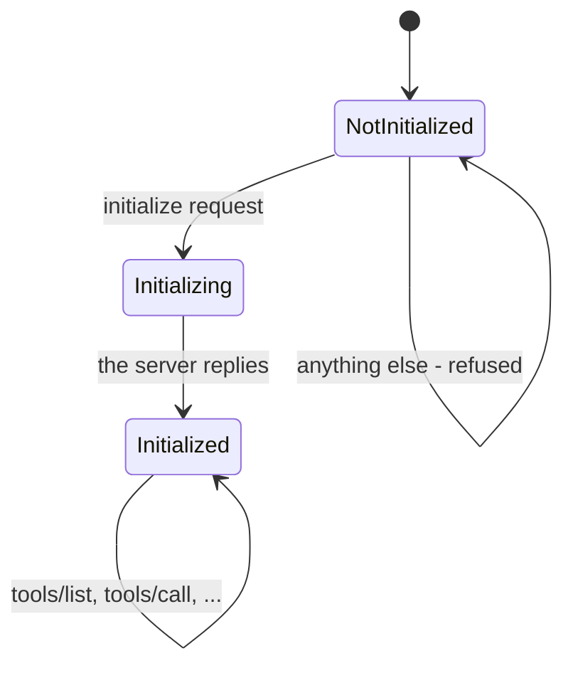

# 5.1 — The handshake that is now history

## One-line answer

Until the 2026-07-28 revision a server held three states and refused every request until a client
had walked it through all three — so this part is what your server used to have to remember, and
what deleting it removed.

## The story

You arrive at the office building at half past nine and you cannot go up.

First the register: your name, the company you are visiting, who you are, the time in. Then your
identity card, handed over and kept in a drawer. Then a plastic badge on a lanyard, and the guard
writes the badge number next to your name in the register. Only now does the lift accept you.

At one o'clock the shift changes. The new guard has the register, so if you come back down for lunch
and go up again, it works. But if you go to the second building of the same company down the road,
your badge means nothing there. Different register, different drawer, different guard. You queue
again.

And on the day the first guard goes home sick without handing the register over, everyone with a
badge is holding a piece of plastic that certifies nothing, and the only way back up is to start
again — with a person who has no record that you were ever there.

## The idea in plain language

The MCP revisions up to and including `2025-11-25` opened every connection with a **handshake**: a
fixed exchange that must happen before any useful request is allowed.

Three messages, in this order:

1. The client sends `initialize`, carrying the protocol version it wants to speak, the capabilities
   it supports, and its name and version.
2. The server replies with the version it will actually speak, its own capabilities, its
   `serverInfo`, and any instructions.
3. The client sends `notifications/initialized` — a notification, so there is no reply — meaning
   *"I have read yours, we are agreed, you may take requests."*

Only after step 3 may a `tools/list` or a `tools/call` be sent. Before that the server refuses.

Three messages, and none of them does any work. Day 32's
[2.1](../../../day-32-mcp-stateless-core/parts/02-the-reframe/2.1-the-call-that-remembered-you.md)
counted the cost from the client's side — four messages before the first useful one — and its
[2.2](../../../day-32-mcp-stateless-core/parts/02-the-reframe/2.2-three-instances-one-url.md)
measured what it does to a deployment: three instances behind a round-robin dispatcher, one held
handshake, and two of four requests refused on the happy path with nothing broken. That is the badge
that only works in one building.

This part is the same story from inside the server, because that is where the machinery lives: a
handshake is not a message, it is **state the server holds about a caller**, and holding it is the
thing the 2026-07-28 revision removed.

## Why Sutra needs it

Because the server you build today has that state machine in it and you should know it is there.

You will meet it three ways in this day alone. `lab/wire.py` sends `tools/list` straight in and is
refused, which is [5.2](5.2-what-your-server-actually-answers.md). The `stateless_http=True` flag in
`build_server()` exists purely to alter this machinery, which is
[5.3](5.3-building-for-the-revision-you-are-not-on.md). And Day 43's whole subject — a server where
any instance answers any request — is only interesting because this state used to make it impossible.

You will also meet it in other people's servers for years. Every server published before mid-2026
opens this way, and the specification keeps a documented path for talking to them
(`https://modelcontextprotocol.io/specification/versioning`, read 2026-09-04): *"For
interoperability with servers and clients that implement the handshake-based protocol revisions
(`2025-11-25` and earlier), see Backward Compatibility."* This is history you have to be able to
recognise, not history you may forget.

## The mechanism

The old lifecycle as a state machine, which is exactly how the SDK implements it:



And here is that diagram as code, from `.venv/Lib/site-packages/mcp/server/session.py`, read
2026-09-04. The enum first:

```python
class InitializationState(Enum):
    NotInitialized = 1
    Initializing = 2
    Initialized = 3
```

**Line by line:**

- Three named states, held **per session** — that is, per connected client, in the server's memory.
  This is the "fourth thing" [1.1](../01-the-server-object/1.1-three-things-and-no-fourth.md) said a
  2026-07-28 server does not have.
- `Initializing` exists as a separate state from `Initialized` because the server sets it *before*
  it sends its reply and clears it after, so a second `initialize` arriving mid-flight is
  distinguishable.

Now the gate itself:

```python
async def _received_request(self, responder):
    match responder.request.root:
        case types.InitializeRequest(params=params):
            requested_version = params.protocolVersion
            self._initialization_state = InitializationState.Initializing
            self._client_params = params
            ...
            self._initialization_state = InitializationState.Initialized
        case types.PingRequest():
            # Ping requests are allowed at any time
            pass
        case _:
            if self._initialization_state != InitializationState.Initialized:
                raise RuntimeError("Received request before initialization was complete")
```

**Line by line:**

- `case types.InitializeRequest(params=params)` — the handshake is the **only** request that is
  handled specially, and it is handled first. Everything else falls through to the last case.
- `self._client_params = params` — the server stores the client's declared version and capabilities
  **on the session object**. That is the state. Every later decision in the connection reads it, and
  it exists nowhere else, which is why a second instance cannot answer for the first.
- `case types.PingRequest(): pass` — one exemption, with a comment. A ping is allowed before the
  handshake because it is how a caller checks a server is alive without committing to anything.
- `case _:` — every other request, including `tools/list` and `tools/call`.
- `raise RuntimeError("Received request before initialization was complete")` — the refusal, and it
  is a `RuntimeError` rather than a protocol error object. The surrounding layer turns it into a
  JSON-RPC error, which is why the wire reply in [5.2](5.2-what-your-server-actually-answers.md)
  says *"Invalid request parameters"* and the real sentence is only on stderr.
- Notifications get the same treatment one method below, with `InitializedNotification` as their one
  exemption.

What the 2026-07-28 revision replaced it with is the absence of all of that. The specification
states the property directly
(`https://modelcontextprotocol.io/specification/2026-07-28/basic/index`, read 2026-09-04):

> *"Servers **MUST NOT** rely on prior requests over the same connection to establish context (e.g.,
> capabilities, protocol version, client identity). Every request supplies this metadata in its
> `_meta` field."*

So the three fields the handshake used to store on a session — version, capabilities, client
identity — now ride on every request, under the reserved keys Day 32's
[2.3](../../../day-32-mcp-stateless-core/parts/02-the-reframe/2.3-every-request-introduces-itself.md)
measured at about 184 bytes. The negotiation did not disappear; it moved from once-per-connection to
once-per-request, and stopped being state. And the one thing a client might genuinely want up front —
what does this server support — is available as `server/discover`, which Day 32's
[2.4](../../../day-32-mcp-stateless-core/parts/02-the-reframe/2.4-server-discover-the-optional-question.md)
established is **mandatory for a server to implement and optional for a client to call**. That
asymmetry is the difference between a question and a handshake.

## When it breaks

Send business straight in to a handshake-era server and this is what comes back. From `lab/wire.py`,
run on 2026-09-04:

```text
--- business, straight in ---
--> tools/list
<-- {"jsonrpc":"2.0","id":2,"error":{"code":-32602,"message":"Invalid request parameters","data":""}}
(stderr) Failed to validate request: Received request before initialization was complete
```

The two halves of that do not match, and the mismatch is the lesson.

**What the caller is told** is `-32602 Invalid request parameters` with an empty `data`. Under the
2026-07-28 rules that is exactly the code for a request missing its required `_meta`, so a modern
client reading only the reply would reasonably conclude its `_meta` was malformed — and go and check
a thing that is fine.

**What actually happened** is on stderr: *"Received request before initialization was complete"*. The
request was perfectly well formed. It arrived in the wrong state, and the state is invisible from
outside.

This is the concrete reason Day 32's
[2.1](../../../day-32-mcp-stateless-core/parts/02-the-reframe/2.1-the-call-that-remembered-you.md)
warns that a `400` from an MCP endpoint does not mean "old server". It also does not reliably mean
"bad request". Read the body, and when the body is empty, accept that you are guessing and probe:
send `initialize` and see whether the server takes it.

## In production

**What a professional writes instead:** nothing, on a current-revision server — the absence is the
design. What a professional does write is the **client** side of the compatibility question: one
probe, cached per server address, deciding once whether this endpoint wants a handshake, and never
guessing again per request. Day 32's
[2.4](../../../day-32-mcp-stateless-core/parts/02-the-reframe/2.4-server-discover-the-optional-question.md)
left you that decision as a `TODO(me)` and it is the same decision here.

**What degrades at scale:** the handshake, exactly as Day 32 measured. A held initialization is
per-connection state, so any layer that can move a request between instances breaks it: a load
balancer, an autoscaler, a rolling deploy, a serverless platform that freezes idle instances. The
industry workaround was sticky sessions, which pins conversations to instances and gives back the
elasticity the instances were for.

**The failure mode that only appears with real traffic:** the mid-deploy refusal. A rolling deploy
replaces instances one at a time. Clients holding an initialized connection to a replaced instance
get their next request refused with an error about initialization, reconnect, handshake again, and
carry on — so the deploy shows a spike of protocol errors that clears by itself. It is harmless and
it looks exactly like an incident, and every on-call engineer who has not seen it before spends the
first ten of their evening on it.

**The review comment a senior engineer leaves:** *"this stores the client's declared capabilities on
the session and reads them in three handlers. Under the current revision every request carries its
own capabilities in `_meta`, so that is state we are not allowed to depend on and it is the thing
that will stop us running more than one instance. Read it from the request."*

**The interview question:** *"what did the MCP handshake do and why was it removed?"* The honest
answer: *"It was three messages before any work: the client sent `initialize` with its protocol
version, capabilities and identity, the server replied with its own, and the client sent
`notifications/initialized`. The server then held that agreement as per-session state and refused
anything that arrived before it. That is fine for one process on your laptop and it does not survive
a load balancer, because the instance that holds your handshake may not be the one that gets your
next request — the measurement people quote is two of four requests refused across three instances,
with nothing actually broken. The 2026-07-28 revision deleted it: version, capabilities and client
identity now ride in `_meta` on every request, which costs a couple of hundred bytes a call and buys
you the property that any instance can answer anything. There is still a way to ask a server what it
supports, `server/discover`, but it is optional to call and nothing is remembered afterwards — it is
a question, not a handshake."*

## Check yourself

```bash
uv run python days/day-34-building-sutra-mcp-tools/lab/wire.py
```

The third and fourth probes both send `initialize`. Compare the fourth probe's second reply with the
second probe's only reply: the same request, the same server, two different answers. Say what changed
between them, and say where that changed thing was stored.

**Out loud, without scrolling up:** name the three messages of the old handshake, name the three
things the server used to store because of them, and say where those three things live now.

**Next:** [5.2 — What your server actually answers](5.2-what-your-server-actually-answers.md).
