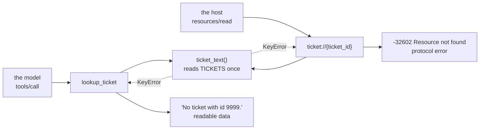

# 1.3 — Should `lookup_ticket` stop being a tool?

## One-line answer

No — it gains a second door rather than swapping doors: `ticket://{ticket_id}` is added as a resource
and `lookup_ticket` stays a tool, and the price of that answer is one store read through two code
paths, which you pay by writing the paths as two thin adapters over one function.

## The story

You give the neighbour a copy of your front-door key.

The reason is good. You are out most of the day, the plumber comes when he comes, and the alternative
is a wasted trip for him and a wasted afternoon for you. With the copy next door, the plumber gets in
without anybody's permission being asked for a third time.

What you did not do is throw away your own key. Obviously not. You still need to get in, and there
are evenings when the neighbour is out.

So now there are two keys. That is genuinely better than one, and it is also genuinely two. When you
change the lock, you have to remember there is a second key, and the second key is in someone else's
drawer. When you finally move out, you have to get it back. And on the evening you cannot find your
own key, you now have to think about where the other one is instead of simply concluding you are
locked out.

Two keys is the right answer here. It is not the free answer, and the difference between those two
sentences is the whole of this part.

## The idea in plain language

Day 32 left this question open, on purpose, in the *Check yourself* of
[32.1.3](../../../day-32-mcp-stateless-core/parts/01-the-socket/1.3-tools-resources-prompts.md):

> Look at each of Sutra's two tools and decide, out loud, whether it would be better as a resource
> once Day 35 makes that possible — and say what the cost of the change would be, not just the
> benefit.

Here is the answer, and the reason it is not the answer people expect.

**The rule in [1.1](1.1-the-hand-that-reaches-first.md) says `lookup_ticket` is a resource.** It does
not write, the address is known in advance, and no search is involved. `lab/surface.py` prints
`resource` on that row.

**The rule does not say it must stop being a tool.** Those are two different claims, and collapsing
them is the mistake. A **surface** is a way of reaching data. Nothing in the specification says one
piece of data has exactly one surface, and there is a concrete reason not to want that here: *not
every host reads resources*.

That last sentence is the one to hold on to. The specification is explicit that a host decides how to
use resources, and lists three quite different ways it might
(`https://modelcontextprotocol.io/specification/2026-07-28/server/resources`, read 2026-09-04):

> "Resources in MCP are designed to be **application-driven**, with host applications determining how
> to incorporate context based on their needs."
>
> For example, applications could:
>
> * Expose resources through UI elements for explicit selection, in a tree or list view
> * Allow the user to search through and filter available resources
> * Implement automatic context inclusion, based on heuristics or the AI model's selection

Read the list again as a server author. Every one of those is optional, and a host that implements
none of them is still a conformant host. A host that only calls `tools/list` and `tools/call` — which
is a very common shape, because tools were the first thing everyone built — sees a server with an
empty counter if you moved everything to the shelf.

So the decision splits in two, and only one half is a design question:

| The question | The answer | Why |
| --- | --- | --- |
| Should `ticket://{ticket_id}` exist as a resource? | **Yes** | The address is known, the read is safe, and it removes a model decision per turn ([1.2](1.2-what-a-door-costs.md)) |
| Should `lookup_ticket` be deleted? | **No** | A host that reads no resources would lose the ticket entirely, and Sutra cannot see which host is calling |

And now the cost, stated as plainly as the benefit, because a decision recorded with only its
benefit is not a decision, it is an advertisement:

1. **One store, two code paths.** Two handlers now read `TICKETS`. If they drift, one door starts
   returning something the other does not.
2. **Two miss rules, and they are deliberately different.** The tool returns a readable sentence,
   because a model reads it. The resource raises `-32602`, because a program reads it. Both are
   correct, and having both means a reader of the code must know which is which
   ([2.3](../02-the-shelf/2.3-the-miss-that-must-be-an-error.md)).
3. **Two sets of metadata.** The tool has a description that steers a model; the resource has a
   title, a description and a MIME type that steer a picker. Change the ticket format and both are
   stale.
4. **Two things to allow or deny.** Day 40's allowlists filter tools. A resource that is not on any
   tool list is not filtered by a tool allowlist, and a team that believes it has closed the counter
   has not looked at the shelf.
5. **Two things Day 45 audits.** The MCP audit at the end of Phase 6 checks surfaces. Two doors is two
   rows, forever.

Point 1 is the only one you can engineer away, and the mechanism below is how.

## Why Sutra needs it

Because this is the first time Sutra publishes the same data twice, and the habit set here is the one
every later day inherits.

`sutra_mcp/tools.py` from [Day 34](../../../day-34-building-sutra-mcp-tools/LESSON.md) holds
`lookup_ticket` over the wire. Today's build brief adds `sutra_mcp/resources.py` holding
`ticket://{ticket_id}`. If those two files each open the ticket store their own way, Sutra has
duplicated its data access on the day it first had more than one caller — and Day 39, which replaces
the dictionary with a SQLite table, then has two places to change instead of one.

The same argument arrives again, harder, on **Day 42**, when the whole desk agent is exposed with
`to_mcp_server`. At that point the same triage capability is reachable as a tool, as a resource and as
an agent. Three doors is fine. Three copies of the logic behind them is not.

## The mechanism

One function reads the store. Two adapters translate its failure into the dialect their caller
speaks.

```python
# the shape sutra_mcp/resources.py and sutra_mcp/tools.py should share
def ticket_text(ticket_id: str) -> str:
    """The stored text of one ticket, or KeyError. The only place TICKETS is read."""
    return TICKETS[ticket_id]


# the tool door - the caller is a model, so a miss is readable data
def lookup_ticket(ticket_id: str) -> str:
    """Look up one support ticket by its id."""
    try:
        return ticket_text(ticket_id)
    except KeyError:
        return f"No ticket with id {ticket_id!r}."


# the resource door - the caller is a program, so a miss is a protocol error
def ticket_resource(ticket_id: str) -> str:
    """The raw text of one support ticket, addressed by its id."""
    try:
        return ticket_text(ticket_id)
    except KeyError:
        raise McpError(
            ErrorData(
                code=INVALID_PARAMS,
                message="Resource not found",
                data={"uri": f"ticket://{ticket_id}"},
            )
        ) from None
```

**Line by line:**

- `ticket_text` has no error handling and no formatting. It reads the store and raises `KeyError` on a
  miss, which is what a dictionary already does. Its docstring makes the rule explicit — *the only
  place `TICKETS` is read* — because that sentence is the entire defence against cost 1 above.
- `raise` rather than `return None` matters: a function that returns `None` on a miss pushes the check
  onto every caller, and one of them will forget. An exception cannot be forgotten by accident.
- `lookup_ticket` catches `KeyError` and returns a sentence. That is Day 3's rule that a failed tool
  is an observation rather than a crash
  ([3.2.3](../../../day-03-loop-hand-rolled/parts/02-tools-and-dispatch/2.3-a-failed-tool-is-an-observation.md)):
  the tool's consumer is a model, and a model that receives `"No ticket with id '9999'."` can say so
  to the customer. Returning an error here would abort a turn that had a perfectly good answer
  available.
- `ticket_resource` raises `McpError` with `code=INVALID_PARAMS`, which is the constant for `-32602`
  in `mcp.types`. The specification is unambiguous: *"If the requested resource does not exist,
  servers **MUST** return a JSON-RPC error with code `-32602` (Invalid Params)."*
- `data={"uri": ...}` echoes back the address that failed. The spec's own example error carries the
  same field, and it is what makes a log line useful: the code says *what* went wrong and the data
  says *which one*.
- `from None` suppresses the chained `KeyError` in the traceback. Without it, the transport logs a
  `KeyError: '9999'` above the real error and a reader debugs the dictionary instead of the request.
- Neither adapter touches `TICKETS`. That is the point. When Day 39 moves the store into SQLite, one
  function changes.

The same shape as a picture, because the asymmetry is the thing worth remembering:



Two entrances, one room, two exits — and the two exits are different **on purpose**, which is the
opposite of the drift you were trying to avoid.

## When it breaks

It breaks when someone tidies it up.

The drift is not that the two handlers diverge. You defended against that. The drift is that a later
engineer reads the two `except` clauses, notices they do different things with the same failure,
concludes it is a bug, and makes them consistent. Whichever way they make them consistent, something
breaks:

- Make the resource polite, and a host caches *"No ticket with id '9999'."* as the body of ticket
  9999. Nothing errors, ever. [2.3](../02-the-shelf/2.3-the-miss-that-must-be-an-error.md) is that
  failure in full.
- Make the tool raise, and a turn that could have said *"I could not find that ticket"* now fails.
  The customer gets nothing instead of an honest sentence, and Day 21's rule about errors surfacing
  ([21.4.1](../../../day-21-errors-surface-not-swallow/parts/04-failure-lab/4.1-the-swallowed-exception.md))
  gets cited in defence of exactly the wrong change.

The defence is a comment, and it is worth writing in full rather than as a shrug:

```python
# Two doors, two dialects, on purpose. The tool answers a MODEL, so a miss is
# readable data (Day 3). The resource answers a PROGRAM, so a miss is -32602
# (2026-07-28 server/resources). Making these consistent breaks one of them.
```

**Line by line:**

- It names both callers, because "model" and "program" is the whole distinction and neither is
  visible from inside the function.
- It cites the day and the specification page rather than saying *"do not change"*, so the next
  reader can check the claim instead of obeying it.
- It sits above both handlers rather than inside one, because the thing being explained is the
  difference between them.

## In production

**What a professional writes instead:** the shared reader is not a convention, it is a module. The
store lives behind one function in one file, the two surfaces import it, and a test asserts that both
doors return the same text for the same id. That test is three lines and it is the only thing that
notices when someone adds a third door.

**What degrades at scale:** the number of surfaces onto one dataset grows quietly. Tool, resource,
prompt that embeds the resource, agent-as-server on Day 42, and an HTTP endpoint somebody added for a
dashboard. Five doors onto one table is normal in a real system, and the failure is never that a door
is wrong — it is that a permission change was applied to four of them.

**The failure mode that only appears with real traffic:** the two doors have different traffic shapes.
The host reads `ticket://{id}` once per ticket view, including views where the user never asks the
model anything. The tool is called only when the model decides to. So the resource door can carry ten
times the read volume of the tool door within a week of shipping, and any rate limit or cache tuned on
the tool's numbers is tuned on the wrong door.

**The review comment a senior engineer leaves:** *"both files open `TICKETS` directly. That is fine
today because it is a dict. On Day 39 it is a database and this becomes two connection strategies,
two retry policies and two places to add the tenant filter. Put the read behind one function now,
while it costs four lines."*

**The interview question:** *"You exposed the same data as a tool and as a resource. Isn't that
duplication?"* The honest answer: *"the access is not duplicated — both go through one reader. What is
duplicated is the surface, and that is deliberate, because a host that only implements tools sees
nothing on the shelf and a host that attaches context sees no reason to spend a model decision. What
I would not duplicate is the miss behaviour: the tool returns a sentence because a model reads it, the
resource returns `-32602` because a program reads it, and there is a comment saying so, because the
next person's instinct is to make them match."*

## Check yourself

```bash
uv run python days/day-35-resources-and-prompts/lab/surface.py
```

The output says `lookup_ticket` is a resource. Say out loud why the answer to *"should it stop being a
tool?"* is still no, and name the one kind of host that decides it.

**Out loud, without scrolling up:** list three things that now exist twice because Sutra opened a
second door, and name the one that a shared function does not fix.

**Next:** [2.1 — An address, not a call](../02-the-shelf/2.1-an-address-not-a-call.md).
