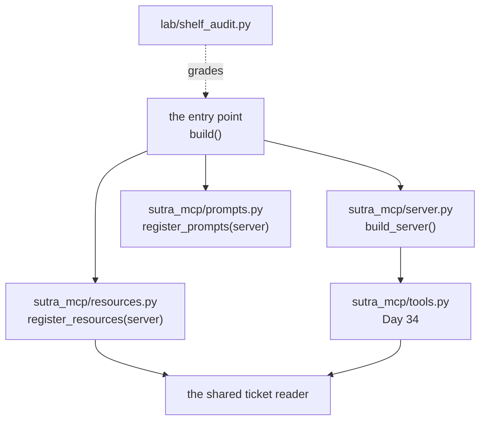

# 6.1 — Two modules, one server

## One-line answer

`sutra_mcp/resources.py` and `sutra_mcp/prompts.py` each expose one function that **takes the server
and registers into it** — `register_resources(server)` — because a module that decorates a global at
import time cannot be tested, cannot be ordered, and cannot be left out.

## The story

There is one notice board in the stairwell and four different people put things on it.

The building secretary pins the water-tanker timings. The parents' group pins the tuition notices. The
man in 302 pins the lost-cat photographs. And the board itself belongs to nobody in particular — it is
screwed to the wall, it has a fixed size, and whoever gets there first takes the middle.

It works, and it works because of one rule everyone follows without being told: **you bring your notice
to the board.** Nobody has ever tried to bring the board to their notice. If the parents' group decided
that their tuition timetable would arrive with its own board attached, there would be two boards in the
stairwell by Tuesday, three by Thursday, and nobody would know which one had the tanker timings on it.

The board is one thing. The notices are many. The direction of travel is always the same, and it is the
only reason a shared wall works at all.

## The idea in plain language

[Day 34](../../../day-34-building-sutra-mcp-tools/LESSON.md) wrote `sutra_mcp/server.py` and a function
called `build_server()` that returns the server object with the tools already on it. Today adds two
more modules to the same package, and the question is how they attach.

There are two shapes and only one of them survives contact with a test.

**The shape that does not work** is a module that decorates a module-level server:

```python
# sutra_mcp/resources.py  - the shape to avoid
from sutra_mcp.server import mcp  # reach in and grab the global


@mcp.resource("archive://summary")
def archive_summary() -> str:
    return f"Sutra archive: {len(TICKETS)} tickets."
```

**Line by line:**

- `from sutra_mcp.server import mcp` needs a server object to exist at import time, which means
  `server.py` has to build one as a side effect of being imported.
- The decorator runs at import time too. So *importing this module registers a resource*, and the only
  way to not register it is to not import the file — which no ordinary tool does deliberately.
- There is no way to build a second server for a test. Every server in the process is that one.
- The import direction is `resources.py → server.py`, and `server.py` will eventually want to know
  about resources, which is the beginning of a circular import.

**The shape that works** is a function that takes the server as an argument:

```python
# sutra_mcp/resources.py  - the shape to write
def register_resources(server: FastMCP) -> None:
    """Attach Sutra's readable data to an existing server. Called by the entry point."""

    @server.resource("archive://summary", title="Ticket archive summary", mime_type="text/plain")
    def archive_summary() -> str:
        return f"Sutra archive: {len(TICKETS)} tickets."
```

**Line by line:**

- `register_resources(server)` takes the board rather than fetching it. Importing this module now does
  nothing at all, which is the property that makes everything else possible.
- The type hint is the server class, so the function says what it needs. It does not import
  `sutra_mcp.server`, so there is no cycle and no import order to remember.
- `-> None` because it mutates the thing it was handed. That is honest — it is a registration, not a
  factory — and a reader can see from the signature that the result is a side effect on the argument.
- The decorators are **inside** the function body. They run when the function is called, which means a
  test can build a bare server, call only `register_resources`, and assert about a shelf with no tools
  on it.
- The docstring says who calls it. A function whose whole purpose is a side effect needs its caller
  named, or the next reader assumes it is dead code.

The same shape, twice: `register_prompts(server)` in `sutra_mcp/prompts.py`. Two functions, two files,
one server.

## Why Sutra needs it

Because `sutra_mcp` is going to have seven modules by the end of Phase 6 and they cannot all own the
server.

The cross-day contract already says what arrives: `tasks.py` on Day 36, `auth.py` on Day 37,
`db_tools.py` on Day 39, `capabilities.py` on Day 41, `agent_server.py` on Day 42, `app.py` on Day 43.
Every one of them attaches something to the same server object. If the first two do it by importing a
global, the seventh cannot do anything else, and Day 43's `app.py` — which has to construct the server
inside an ASGI entry point, possibly more than once — has nowhere to stand.

There is a second reason and it is today's gate. `lab/shelf_audit.py` grades Sutra's shelf by building
a server and registering into it. It can only do that if registration is a function it can call. An
audit that has to import a module for its side effects is an audit that cannot say *what would this
look like without the prompts?*

## The mechanism

The entry point assembles. Everything else registers:

```python
# the shape sutra_mcp's entry point takes on
from sutra_mcp.server import build_server
from sutra_mcp.resources import register_resources
from sutra_mcp.prompts import register_prompts


def build() -> FastMCP:
    """Day 34's server, plus Day 35's shelf and cards. One place assembles; nothing else does."""
    server = build_server()
    register_resources(server)
    register_prompts(server)
    return server
```

**Line by line:**

- `build_server()` is Day 34's, unchanged. Today does not edit that file, which is the practical test
  of whether the registration shape is right: adding a surface should not mean touching the module that
  makes the server.
- The three imports are all at the top and none of them do anything on import. Reordering them changes
  nothing, which is what "no import-time side effects" buys you.
- The two `register_*` calls are statements rather than expressions, because they return nothing. A
  reader sees two side effects in a row, in an order that does not matter — and if it ever does matter,
  that is a bug worth finding rather than a subtlety worth preserving.
- `return server` at the end makes this a factory. Call it twice and get two independent servers, which
  is what a test suite wants and what Day 43's app may need.
- The function is short on purpose. Assembly is the one place that knows about everything, so it should
  be the one place that is trivially readable.

And the boundary rule that the lab obeys and the project must too. `lab/shelf.py` copies its tickets
rather than importing them from `sutra/loop.py`:

```python
# days/day-35-resources-and-prompts/lab/shelf.py  (extract)
# The same two tickets and two articles the desk has had since Day 3, copied rather than
# imported: a lab file may not reach into `sutra/`, and the boundary check on Day 32 is why.
TICKETS = {
    "4521": "Title: Keeps getting logged out. Body: I keep getting logged out "
    "of the dashboard every few minutes. Started yesterday. Plan: Pro.",
    ...
}
```

**Line by line:**

- The comment names the rule and the day it came from, so a reader who thinks this is duplication can
  go and check.
- Day 32's `boundary_check.py`
  ([32.1.5](../../../day-32-mcp-stateless-core/parts/01-the-socket/1.5-one-gate-to-guard.md)) is the
  script that enforces which modules may reach past the data boundary. A day's lab is scratch code and
  is not part of the product, so it stands outside.
- The duplication is real and it is the cheaper of two costs. The alternative is a lab server that only
  starts when `PYTHONPATH` is right, spawned as a subprocess from a script, from whatever directory the
  reader happened to be in.
- `sutra_mcp/resources.py` is **not** in this position. It is project code, on the server side of the
  boundary, and it goes through the shared reader from
  [1.3](../01-who-initiates/1.3-should-lookup-ticket-stop-being-a-tool.md) rather than copying
  anything.

Where the pieces sit, once today's build brief is done:



The arrows all point away from the entry point. Nothing points back at it, and nothing between the
three modules points at either of the others.

## When it breaks

The break is a registration nobody called.

You write `sutra_mcp/prompts.py`, you write `register_prompts`, the file imports cleanly, the tests you
wrote for it pass, and you forget the one line in the entry point. The server starts. `tools/list`
works. `resources/list` works. `prompts/list` returns an empty array, which is a **completely valid
response** — the specification says the set of prompts *"**MAY** be empty"* — so nothing anywhere
reports a problem.

That is what today's gate is for, and it is why it is red right now:

```bash
uv run python days/day-35-resources-and-prompts/lab/shelf_audit.py; echo "exit: $?"
```

**Line by line:**

- It imports what the build brief tells you to write, registers it into Day 34's server, and grades the
  result. **Zero generations.**
- The exit code is the verdict, so it can go red — Principle 11.

Measured on 2026-09-04, before any of today's project code exists:

```text
  - sutra_mcp.server.build_server is not importable: No module named 'sutra_mcp.server' (Day 34)
findings: 1
exit: 1
```

One finding, and it is honest about which day owns it. `sutra_mcp/` holds nothing but an empty
`__init__.py` in this repository right now, so the audit cannot get as far as looking for today's
modules. When `server.py` exists and `resources.py` does not, the finding changes to
`sutra_mcp.resources.register_resources is not usable`, and when both exist the audit starts grading
what is actually on the shelf ([6.2](6.2-the-shelf-a-stranger-can-use.md)).

The second break is the circular import, and it has a real traceback that reads as nonsense the first
time:

```text
  File "...\sutra_mcp\resources.py", line 1, in <module>
    from sutra_mcp.server import mcp
ImportError: cannot import name 'mcp' from partially initialized module 'sutra_mcp.server' (most likely due to a circular import) (...\sutra_mcp\server.py)
```

Reproduced on 2026-09-04 with a two-module package of exactly that shape; the paths are shortened here
and are absolute in the real message.

`partially initialized` is the useful phrase. Python was part-way through executing `server.py`, that
execution imported `resources.py`, and `resources.py` asked `server.py` for something it had not
defined yet. The registration-function shape makes this impossible rather than unlikely, because
`resources.py` never imports `server.py` at all.

## In production

**What a professional writes instead:** one assembly function, in one place, and every other module
exposes a `register_*` that takes what it needs. The assembly function is what the entry point calls
and what the tests call, so there is exactly one description of what a complete server is. Nobody
constructs a server in a module body.

**What degrades at scale:** registration order starts to matter and nobody notices when it starts. Two
modules registering the same URI is the obvious case; a subtler one is a module that reads
configuration another module set up. The defence is that the assembly function is short enough to read
in one go — the moment it needs a comment explaining why the order is what it is, the order has become
a dependency and should be an argument instead.

**The failure mode that only appears with real traffic:** a surface silently missing in one
environment. The staging entry point calls all three registrations; the production one was written
earlier and calls two. Both start, both serve, both pass health checks, and the difference only shows
up as a host reporting that a prompt it uses is not there. A single assembly function used by every
entry point is the whole fix, and it is free if you do it before there are two entry points.

**The review comment a senior engineer leaves:** *"`resources.py` imports the server object and
decorates it at module level. That means importing the module registers things, so there is no way to
build a server without a shelf, no way to test the shelf without the tools, and `app.py` on Day 43 will
have to import for side effects and hope. Make it `register_resources(server)` and have one place do
the assembly."*

**The interview question:** *"How is your MCP server put together?"* The answer that shows you have
maintained one: *"one factory that builds the server and a `register_*` function per surface, each
taking the server as an argument. Nothing registers at import time. The reason is testability first —
you can build a bare server and attach only the piece under test — and the second reason is that by the
end of the phase there are seven modules attaching to the same object, and if the first one reaches for
a global then every one after it has to as well. The failure it prevents is quiet: a registration
function nobody called produces an empty `prompts/list`, which is a valid response, so nothing errors
and the surface is simply missing."*

## Check yourself

```bash
uv run python days/day-35-resources-and-prompts/lab/shelf_audit.py; echo "exit: $?"
```

Read the finding and say which day it belongs to. Then look at `load_server()` in that file and say why
it collects findings and keeps going instead of raising on the first one.

**Out loud, without scrolling up:** say what importing `sutra_mcp/resources.py` should do, and say what
an empty `prompts/list` proves about your server.

**Next:** [6.2 — The shelf a stranger can use](6.2-the-shelf-a-stranger-can-use.md).
