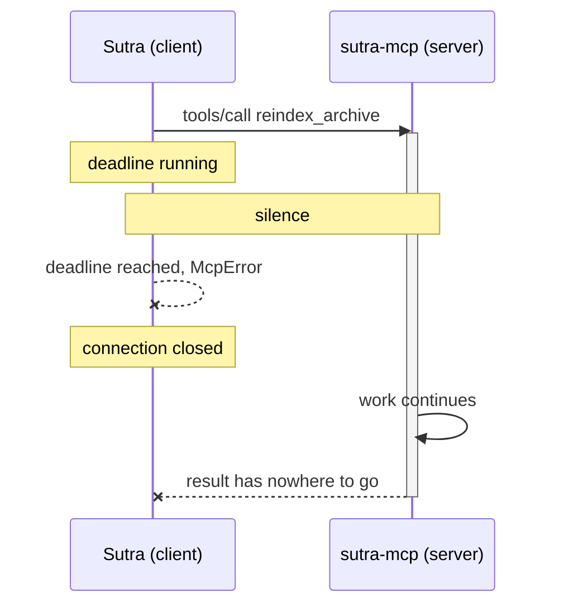

# 1.1 — The call you cannot leave

## One-line answer

A tool call that does its work while the caller waits has tied the life of the work to the life of one
network connection, and a connection is the least durable thing in the system.

## The story

You take a thick folder of paper into the copy shop on the corner and ask for one copy of everything.

The man behind the counter feeds the sheets in a handful at a time. You cannot go and run your other
errand, because he has your originals and he has your money and there is nothing in your hand that
says the job exists. So you stand there. Behind you, a queue forms of people who want one page each, and none of
them can be served, because there is one counter and you are standing at it.

Halfway through, your phone rings and you have to step outside. When you come back the man has
finished. He has no idea who the copies belong to. There is a stack of warm paper on the counter and a
new customer in your place. You ask for your copies and he asks which ones are yours, and neither of
you has an answer, because the only thing that ever connected you to that stack was the fact that you
were standing there.

Nothing broke. The copier worked. The paper is fine. What went wrong is that the job's only identity
was *your presence at the counter*, and presence is not something you can rely on.

## The idea in plain language

A **tool call** is a request Sutra sends to a server asking it to do something and send back the
answer. Day 4 introduced tools as declarations the model can choose from; Day 34 gives Sutra's own
tools their own server. Every tool call you have written so far finishes almost as soon as it starts.
`lookup_ticket` reads a dictionary. `search_kb` scans a handful of strings. The answer comes back
before anything has time to go wrong.

Some work is not like that. "Re-index the whole ticket archive" is not a dictionary lookup. It reads
thousands of tickets, computes something for each one, and writes the result somewhere. Phase 7 builds
exactly that on Day 49. And the obvious way to write it is the way you have written every tool so far:

> the request arrives, the server does the work, the server sends the answer back on the same
> connection the request came in on.

That shape is called a **blocking call**: the caller is blocked — stopped, waiting, unable to do
anything else — from the moment it asks until the moment the answer arrives. For a dictionary lookup
that is invisible. For a long job it is a decision with three consequences, and all three of them are
about the connection rather than about the work.

**One.** The connection has to stay open the whole time. An HTTP request that has been sent and not
answered is a socket held open at both ends, and at every machine in between.

**Two.** The caller cannot do anything else on that connection while it waits, and it does not know
whether the silence means "still working" or "died".

**Three** — and this is the one people meet last and remember longest — **the work has no name except
the connection**. If the connection breaks, there is no way to ask "what happened to my re-index?",
because nothing was ever handed over that could be used to ask. The copies exist. Nobody can claim
them.

The word **durable** is worth defining here because the rest of the day turns on it. Something is
durable when it survives the thing that created it. A stack of copies with a job number on it is
durable: the number outlives your visit. A stack of copies identified only by who is standing at the
counter is not.

## Why Sutra needs it

Because Sutra is about to grow work that is genuinely long, and the day it does is already on the map.

**Day 49** builds a local embedding index over the ticket archive. Building that index reads every
ticket. It is the first piece of work in this curriculum that cannot plausibly finish inside one
request, and it is the reason this day exists ahead of it rather than after it.

**Day 43** deploys `sutra_mcp` as a stateless service where any instance answers any request. A
blocking call is the one shape that cannot survive that deployment: the work lives inside one
process's memory for as long as it runs, so the instance that started it is the only one that can
finish it, and killing that instance during a deploy destroys work with no record that it existed.

**Day 44** hardens the client with retries and timeouts. A retry is only safe when the thing being
retried can be recognised as the same request. A blocking call gives the client nothing to recognise
it with, which is why part [6.2](../06-in-production/6.2-the-job-that-ran-twice.md) has to go and fix
that separately.

And there is a smaller reason that matters immediately: the shape you choose here decides the shape of
`sutra_mcp/tasks.py`, which is the file this day asks you to write.

## The paper behind it

> **Promises: linguistic support for efficient asynchronous procedure calls in distributed systems**
> · `doi:10.1145/53990.54016` · 1988 ·
> `https://doi.org/10.1145/53990.54016`

It argued that a remote call should hand the caller a claim on the answer *immediately*, so the caller
can carry on working and collect the answer when it actually needs it — instead of standing at the
counter.

The whole argument, made runnable and switched off and on again, is in
[`../../papers/01-promises.md`](../../papers/01-promises.md). Read it **after** the parts: the point of
today is that you build the mechanism first and meet the proposal afterwards.

## The mechanism

The cost is easiest to believe when you watch it. This is a server doing a piece of work on a thread
while a client waits with a deadline, which is exactly what an HTTP client, a proxy and a gateway all
do in real life.

```python
# days/day-36-long-jobs-and-tasks/lab/blocking.py
CHUNKS = 12  # the archive, in slices
CHUNK_S = 0.1  # what one slice costs
CLIENT_DEADLINE_S = 0.5  # the caller's patience

finished_at: float | None = None
result: str | None = None


def reindex() -> None:
    """The server's work. It has no idea anybody is waiting."""
    global finished_at, result
    done = 0
    for _ in range(CHUNKS):
        time.sleep(CHUNK_S)
        done += 1
    result = f"re-indexed {done}/{CHUNKS} chunks"
    finished_at = time.perf_counter()
```

**Line by line:**

- `CHUNKS` and `CHUNK_S` are the work, expressed as something you can shorten while you experiment.
  The real re-index reads tickets; this one sleeps. The subject of this part is the caller's
  experience, and the caller cannot tell the difference.
- `CLIENT_DEADLINE_S = 0.5` is the number that decides everything, and notice **who owns it**: not the
  server, not the tool, not the author of `reindex`. It is set by whoever configured the client, and
  the server is never told what it is.
- `finished_at` and `result` are module-level on purpose, so that after the client has given up you
  can still ask what happened to the work. In a real server that state is invisible, which is exactly
  the problem — this file makes it visible so you can see it being thrown away.
- `def reindex() -> None:` takes no arguments and returns nothing, because in this shape the *return
  value is delivered by the connection*, not by the function. That is the assumption the whole day
  attacks.
- The docstring is the important line in the file: **the work has no idea anybody is waiting.** The
  work cannot check, cannot be told, and cannot react. Nothing in the code that does the work has any
  relationship to the caller at all.

```python
worker = threading.Thread(target=reindex)
worker.start()

worker.join(timeout=CLIENT_DEADLINE_S)
if worker.is_alive():
    print(f"client   : gave up after {time.perf_counter() - start:.2f}s (deadline reached)")
    print("client   : McpError('Timed out while waiting for response')")
    print("client   : holds no name for the work it started")
```

**Line by line:**

- `threading.Thread(target=reindex)` stands in for "the server, somewhere else". The client and the
  work are genuinely separate here, which is what makes the next line meaningful.
- `worker.join(timeout=CLIENT_DEADLINE_S)` is the client's whole behaviour in one call: wait for the
  answer, but not forever. Every MCP client has this line somewhere, and so does every HTTP library
  underneath it.
- `if worker.is_alive():` is how the client discovers it lost. Note what it learns: **that time
  passed.** It does not learn whether the server crashed, whether the work is still running, or how
  far it got. Those three situations are indistinguishable from here, and they need three different
  responses.
- `McpError('Timed out while waiting for response')` is the message the `mcp` client actually raises;
  it is printed rather than raised so that the script can carry on and show you what the server does
  next.
- `holds no name for the work it started` is the line to remember. The client is not merely
  disappointed. It is *unable to ask a follow-up question*, and no amount of retry logic fixes that.

Run it:

```bash
uv run python days/day-36-long-jobs-and-tasks/lab/blocking.py
```

**Line by line:**

- From the repository root, like every command in this curriculum. **Zero model calls** — nothing here
  needs a key.

Measured on 2026-09-04:

```text
client   : gave up after 0.51s (deadline reached)
client   : McpError('Timed out while waiting for response')
client   : holds no name for the work it started
server   : finished at 1.21s with 're-indexed 12/12 chunks'
server   : nobody was listening; the result was discarded
```

Read the last two lines slowly. **The work succeeded.** The index was built. The answer was correct.
And it was thrown away, because the only place it could have been delivered was a connection that no
longer existed. That is not a bug in the re-index. It is a consequence of the shape.

Here is the same sequence as a picture, because the thing that goes wrong is a matter of *when*:



Everything after the dashed line is wasted, and the server has no way to know it is wasting it.

## When it breaks

It breaks in the client first, and the message is honest but almost useless:

```text
McpError: Timed out while waiting for response
```

What it says: no answer arrived within the deadline. What it **means** is one of three completely
different things, and the message does not say which:

| What actually happened | What the client should do |
| --- | --- |
| the server is still working | wait longer, or ask again later |
| the server crashed mid-job | start again |
| the server finished and the reply was lost | do nothing — the work is done |

Retrying is correct in one row, wasteful in another and actively harmful in the third. A client that
cannot tell them apart has to guess, and the usual guess is to retry — which is how one re-index
becomes two. Part [1.3](1.3-work-with-no-name.md) measures that, and part
[6.2](../06-in-production/6.2-the-job-that-ran-twice.md) fixes it.

The second break is quieter and lands on the server. Long blocking calls consume a connection each,
and connections are a fixed resource. A server that is happily answering hundreds of quick calls will
stop answering anything at all once a handful of slow ones are in flight, and the symptom arrives at
the *fast* endpoints:

```text
httpx.PoolTimeout: connection pool exhausted
```

Nothing is broken in the code that fails. The tool that cannot get a connection is the innocent party;
the slow tool holding them all is upstairs.

The smallest fix for both is the same, and it is the rest of this day: **stop returning the answer on
the connection, and start returning a name for the work.**

## In production

**What a professional writes instead:** nothing that takes longer than a request goes *in* a request.
A tool that might be slow returns a handle straight away and does the work somewhere the request does
not own — a worker, a queue, a job runner. The rule of thumb people actually use is that if a call can
exceed the smallest deadline anywhere between the caller and the code, it must not be a blocking call
at all. Note that this is a decision about the *shape* of the tool, taken before the first line of the
tool is written, which is why it is worth taking now rather than on Day 49.

**What degrades at scale and under concurrency:** the failure is not linear, which is what makes it
surprising. One slow blocking call is fine. A hundred concurrent slow calls hold a hundred
connections, and the pool, the proxy's worker count or the container's file-descriptor limit runs out
first — so the endpoint that falls over is a fast one that has nothing to do with the slow job. Under
autoscaling it gets worse rather than better: the platform sees busy instances, starts more, sends
them fresh traffic, and every in-flight blocking call on an instance it later removes is destroyed
with no record that it ever ran.

**The review comment a senior engineer leaves:** *"This tool sleeps in a request handler. That makes
our timeout budget a property of the archive size, which nobody controls and nobody measures. Return a
handle and move the loop to a worker — and while you are there, tell me what happens to a job whose
instance gets rolled during a deploy, because right now the answer is that it disappears silently."*

**The interview question:** *"how do you handle an operation behind a request/response protocol when
the operation takes far longer than any reasonable request?"* An honest answer: *"I do not hold the
request open, because the timeout that fires will not be mine — it will be a proxy's or a load
balancer's, and I cannot see or change it. I return a durable handle immediately and let the caller
come back for the result. The part people underestimate is not the waiting, it is the naming: when a
blocking call's connection breaks, the work has no identity at all, so you cannot poll it, cancel it
or recognise the retry as a duplicate. I demonstrated this on my own MCP server — the client timed out
at half a second, the server finished the job a second later, and the correct answer was thrown away
because there was nowhere to put it."*

## Check yourself

```bash
uv run python days/day-36-long-jobs-and-tasks/lab/blocking.py
```

Now set `CLIENT_DEADLINE_S = 2.0` and run it again. The client wins. Then set `CHUNKS = 40` and watch
it lose again — and notice that you fixed nothing, you only moved the number. That is the whole of
part [1.2](1.2-the-timeout-ladder.md) in one edit.

**Out loud, without scrolling up:** name the three different things a timeout error can mean, and say
why the client cannot tell them apart.

**Next:** [1.2 — The timeout ladder](1.2-the-timeout-ladder.md).
