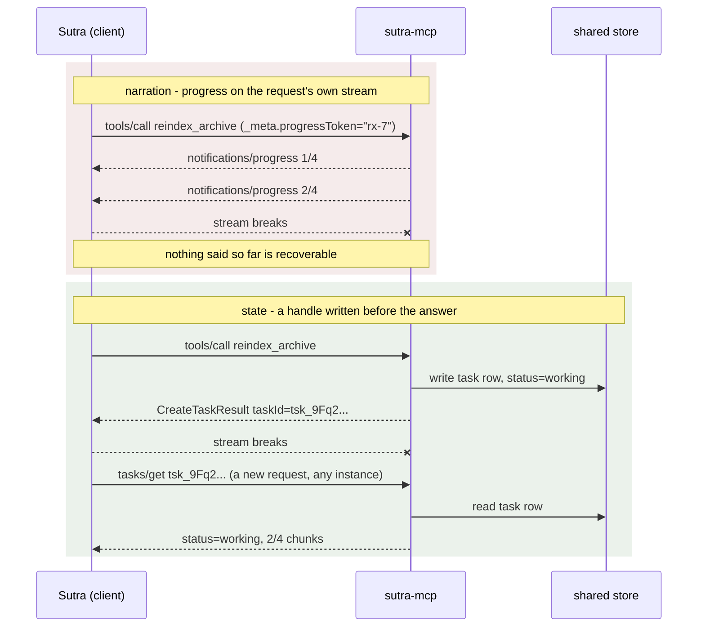

# 2.3 — Progress is narration, not state

## One-line answer

Progress notifications travel on the response stream of the request they belong to and stop when that
request ends, so progress can tell you a job is alive but can never tell you what happened to a job
you stopped watching.

## The story

You order food and the app draws a little bar across the top of the screen.

*Order received.* *Being prepared.* *Nearly ready.* You watch it the way everyone watches it, for no
reason, and then your phone dies.

You find a charger, wait, turn the phone back on, and open the app again. The bar is gone. There is no
bar for an order that is no longer in front of you — the screen shows a fresh list and a button to
order again. And yet the doorbell goes twenty minutes later and the food is there, exactly as ordered,
because the kitchen never depended on you watching.

The bar was never the order. It was somebody describing the order to you while you happened to be
looking. What survived your dead battery was the order itself, which had a number on it.

## The idea in plain language

Part [2.1](2.1-the-token-you-have-to-ask-for.md) showed how a client asks for progress and part
[2.2](2.2-reporting-from-inside-a-tool.md) showed how a tool sends it. This part is about what progress
is **not**, and it is the pivot of the whole day.

Three properties, each of them written into the specification, and together they close the door.

**It is request-scoped.** A progress notification does not float around the connection looking for a
home. It flows on the response stream of the one request it relates to. The 2026-07-28 changelog says
so while describing an unrelated change
(`https://modelcontextprotocol.io/specification/2026-07-28/changelog`, read 2026-09-04):

> *"Request-scoped notifications such as `notifications/progress` and `notifications/message` continue
> to flow on the response stream of the request they relate to, not the `subscriptions/listen`
> stream."*

So there is no separate channel to subscribe to for progress. If the request's stream is not there,
neither is the progress.

**It is advisory.** The server **MAY** send notifications, at whatever frequency it likes, and **MAY**
omit the total. A server that sends nothing is compliant. Nothing about progress is a promise, which
means nothing can be built on top of it.

**It is bounded by the request.** The specification is explicit that progress notifications **MUST**
stop after completion, and **MUST** only reference tokens associated with an in-progress operation.
There is no such thing as a progress notification about a finished job, or about a job you asked for
yesterday.

Put those together with the rule from part [1.3](../01-the-blocking-call/1.3-work-with-no-name.md) —
a broken stream loses the in-flight request, and the client must re-issue with a new id — and the
conclusion is unavoidable. **Progress dies with the connection, and it takes everything it said with
it.** There is no place to go and ask "what was the last progress on that job?", because progress was
never stored anywhere. It was spoken.

The distinction that clears this up in one line is **narration versus state**:

| | Narration (`notifications/progress`) | State (a task handle) |
| --- | --- | --- |
| Lives in | the open request's stream | a store any instance can read |
| Survives a broken connection | no | yes |
| Can be queried later | no | yes, by name |
| Guaranteed to exist | no — MAY | yes, it is written before the response |
| Answers | *"is it alive right now?"* | *"what happened to job X?"* |
| Costs | one message, no storage | a row, an owner, an expiry |

Both are useful and they answer different questions. The mistake — and it is a common one, because
progress is the feature people meet first — is to build a long-running operation on progress alone and
discover at the first proxy restart that there was never anything to come back to.

## Why Sutra needs it

Because this is the decision `sutra_mcp/tasks.py` is made of, and the wrong answer is the one that
looks simpler.

**Day 43** deploys `sutra_mcp` as a stateless service. Any instance answers any request; instances come
and go with deploys. A design where the only record of a running job is a message stream held by one
instance cannot survive a routine deployment, and it will fail on a Tuesday afternoon rather than in a
test.

**Day 44** hardens Sutra's client and states the rule outright: **no held connections**. A client that
must keep a stream open to know what its job is doing has a held connection by another name, whatever
the code calls it.

And the shape of today's build follows directly: progress is the **decoration**, the handle is the
**mechanism**. Section 3 builds the handle, and it does so knowing precisely what progress could not do.

## The mechanism

The exact same job, watched two ways. This is the part where the picture does the work:



The two blocks are the same job. The difference is one write, to somewhere that is not the connection,
made **before** the first answer goes out.

Run the progress demo once more and read its output with this in mind:

```bash
uv run python days/day-36-long-jobs-and-tasks/lab/progress.py
```

**Line by line:**

- From the repository root. **Zero model calls.** The script builds the notification messages and
  appends them to a list called `delivered`, and it clears that list between the two arms.

Measured on 2026-09-04:

```text
with a progressToken   : result 're-indexed', 4 notifications

without a progressToken: result 're-indexed', 0 notifications
no error, no warning, no log line - the tool simply succeeded quietly
```

`delivered` is the whole point of the demo and it is a **local list in the client's process**. In a real
system that list is whatever the client chose to do with the messages as they arrived — a progress bar,
a log line, nothing at all. The server kept no copy. When the client process ends, so does every trace
that those four notifications ever existed.

That is what "narration" means, made concrete: four messages were produced, delivered and forgotten,
and at no point did anything durable change.

## When it breaks

The break here is a design that seemed fine for months. A dashboard shows running jobs by listening to
progress notifications and holding them in memory. Then the dashboard is restarted, or its stream is
dropped by an idle timeout, and the operator sees:

```text
httpx.ReadError: [WinError 10054] An existing connection was forcibly closed by the remote host
```

Followed by an empty dashboard. Not an error dashboard — an *empty* one, because from the client's
point of view there are now no jobs. The jobs are still running. The workers are still consuming CPU.
Nothing in the system is broken. The only thing that was lost was the narration, and the narration was
the only record anybody had.

The second break is subtler and shows up in code review as a comment nobody follows up. Someone writes
a retry that reconnects and expects the progress to resume:

```text
McpError: Received progress notification for an unknown token
```

That is the client rejecting a notification for a token it is no longer waiting on. The reconnect
created a **new request with a new id**, exactly as the specification requires, and the old token is
meaningless. There is no resume. There never was.

The smallest fix for both is the same and it is one line of design: write the job down before you
answer, and hand back its name.

## In production

**What a professional writes instead:** progress and a handle, in that order of importance reversed.
The handle is created first and is the contract; progress is added on top for the callers who happen to
be watching, and the system is correct without it. A useful test of any long-job design is to ask *"if
every progress notification were dropped, would anything be wrong?"* — the answer must be "no, it would
just be less pleasant".

**What degrades at scale and under concurrency:** progress gets less reliable as the system gets
bigger, in the direction nobody wants. More instances means more deploys means more dropped streams;
more concurrent jobs means more notifications competing for the same pipes; and rate limiting — which
the specification tells both sides to implement — means a busy server legitimately sends fewer updates
exactly when there is most to say. A design that treats progress as decoration degrades gracefully. A
design that treats it as state degrades into silence.

**The review comment a senior engineer leaves:** *"The only place the job's state exists is the progress
stream, so if the client reconnects we have lost the job. Write the task row before you return, return
its id, and let progress be a nicety. Otherwise every deploy of the gateway is a data-loss event and we
will not even know how many jobs it ate."*

**The interview question:** *"you have progress notifications working. Why do you still need task
handles?"* An honest answer: *"because progress is narration and a handle is state. Progress rides on
the response stream of one open request, it is explicitly advisory — the spec says a server MAY send
it — and it MUST stop when the request completes. So it answers 'is this alive right now?' and nothing
else. The moment the stream breaks, the client is required to re-issue as a brand new request, and
there is no way to ask about the old one. A handle is written to shared storage before the first
response goes out, so it answers 'what happened to job X?' from any instance, any time, after any
number of disconnections. I would use both: the handle for correctness, progress for the person
watching."*

## Check yourself

```bash
uv run python days/day-36-long-jobs-and-tasks/lab/progress.py
```

Now delete the `delivered.clear()` call before the second arm and run it again. The second arm reports
four notifications it never produced, because it is reading the first arm's leftovers. That bug is
funny in a demo and is exactly the bug a dashboard has when it keeps progress in memory across
reconnects: stale narration presented as current state. Put the `clear()` back.

**Out loud, without scrolling up:** say which stream a progress notification travels on, and give the
one question a handle can answer that progress cannot.

**Next:** [3.1 — A name the server mints](../03-the-handle/3.1-a-name-the-server-mints.md).
