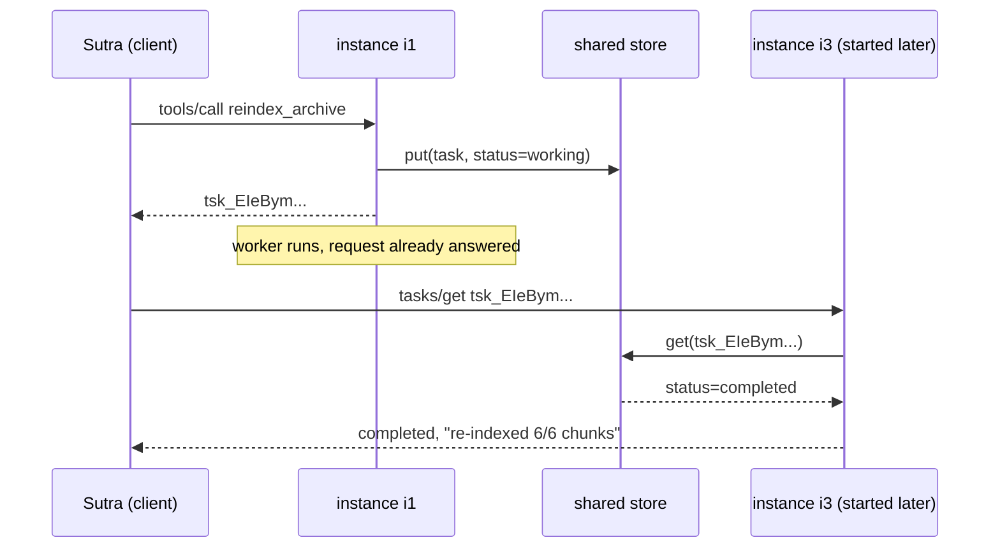

# 3.1 — A name the server mints

## One-line answer

The server writes the job down and hands back its name **before** it does any of the work, so the name
is the one thing in the system that cannot be lost by a connection closing.

## The story

You go in for a blood test and the whole thing takes four minutes.

The nurse fills two small tubes, sticks a printed label on each, and reads the number on the label back
to you: *"your results will be under this, they take a few days."* Then you leave. Nobody asks you to
wait, and nobody asks you to come back to the same nurse.

A week later a doctor you have never met pulls the results up on a screen. She was not there. She does
not know what the nurse looked like, what time you came in, or that you nearly fainted. She types the
number and the result is there, because the number was printed and stuck to the tube **before** the
tube went anywhere.

Notice the order of events. The label was not created when the results came back. It was created at the
very start, when nothing had happened yet and there was nothing to report — which is precisely why it
still works after everything else in the story has changed.

## The idea in plain language

Day 32's part
[3.4](../../../day-32-mcp-stateless-core/parts/03-headers-and-caches/3.4-state-that-travels-in-the-payload.md)
established the rule this part builds on. Since the 2026-07-28 revision there are no protocol sessions,
so cross-call memory works one way only: the server mints an **opaque handle**, returns it, and the
client passes it back as an ordinary argument. That part left you with a `TODO(me)` — decide Sutra's
handle policy — and this section is where it gets decided.

A **handle** is a string that names something the server is holding. *Opaque* means the client must not
read anything out of it: not who owns it, not when it was made, not what it points at. It is a label,
not a description.

For a long job the handle has a specific name — a **task id** — and three properties that are not
optional.

**It is server-minted.** The client does not choose it. If clients could choose, one client could name
its task the same as another's and read work that is not its own.

**It is durable before it is returned.** The row exists in shared storage *before* the response leaves
the server. This is the ordering rule and it is the single most important sentence in this part. If you
return the id first and write the row afterwards, there is a window in which the client holds a name
for something that does not exist, and a crash inside that window produces a handle that will never
resolve. The Tasks extension states the requirement plainly
(`https://modelcontextprotocol.io/extensions/tasks/overview`, read 2026-09-04):

> *"The task must be durably created before sending the response."*

**It is redeemable from anywhere.** The store is not the instance's memory. It is a place every replica
can read, which is what makes the handle survive a deploy, a restart, or the client landing on a
different instance next time.

What you are actually buying with all of this is the thing part
[1.3](../01-the-blocking-call/1.3-work-with-no-name.md) said was missing: **identity for the work**. The
request id names a message and dies with it. The task id names a job and outlives every message about
it.

And one thing to be clear about, because it is where people accuse this design of cheating: the state
did not disappear, it **moved**. It went from one process's memory to a shared store. That is not free —
you have swapped a dictionary lookup for a network read, and you now own an expiry policy that a
session used to give you for nothing. Part [6.3](../06-in-production/6.3-the-store-is-the-stateful-thing.md)
is the honest accounting of that bill.

## Why Sutra needs it

Because `sutra_mcp/tasks.py` is the file this day asks you to write, and its three functions are
`start_task`, `get_task` and `cancel_task`. All three of them take or return a handle, so the handle's
rules are the module's rules.

**Day 43** deploys `sutra_mcp` where any instance answers any request. The demo below is that
deployment in miniature: three instance objects, one store, and a job started by one instance and
finished by another that did not exist when it began.

**Day 47** makes sessions durable against a database. The store in this part is a dict with a lock; on
Day 47 the same shape becomes a real table, and nothing about the handle changes. That is the property
worth noticing — the design is independent of the storage technology.

**Day 37** needs the same shape for a different reason: a server that has to ask the user a question
mid-call returns an interim result carrying opaque state, and the client re-issues with that state.
Same idea, different name.

## The mechanism

One store, several interchangeable instances, and a job whose name outlives the instance that started
it:

```python
# days/day-36-long-jobs-and-tasks/lab/tickets.py  (extract)
@dataclass
class Task:
    task_id: str
    owner: str
    status: str = "working"
    done: int = 0
    total: int = CHUNKS
    result: str | None = None
    error: str | None = None


@dataclass
class Store:
    """The shared rack. In production a table; here a dict with a lock."""

    rows: dict[str, Task] = field(default_factory=dict)
    lock: threading.Lock = field(default_factory=threading.Lock)

    def put(self, task: Task) -> None:
        with self.lock:
            self.rows[task.task_id] = task

    def get(self, task_id: str) -> Task | None:
        with self.lock:
            return self.rows.get(task_id)
```

**Line by line:**

- `Task` is a `dataclass` rather than a dict because every field in it is a decision, and a dataclass
  makes the reader confront the list. `owner`, in particular, is not decoration — part
  [3.2](3.2-the-handle-anyone-can-guess.md) is about what happens without it.
- `status: str = "working"` is the only status a task can be born in. A task that starts `completed`
  has skipped the point, and a task that starts `pending` invents a state the extension does not have.
- `result` and `error` are both `None` and both nullable, because a finished task has exactly one of
  them. Keeping them separate rather than overloading one field is what lets a client distinguish
  "finished with an answer" from "finished with a failure" without parsing text.
- `Store` wraps a plain dict with a `threading.Lock`. The lock is there because two threads genuinely
  touch these rows — the poller and the worker — and the demo would otherwise be teaching a race. In
  production the lock is the database's, and you get it by having a database.
- `field(default_factory=dict)` rather than `= {}`: a mutable default on a dataclass is shared between
  every instance, which would make two stores secretly the same store. This is the one Python gotcha
  in the file and it is worth the extra words.
- `get` returns `Task | None`. A missing row is a normal outcome, not an exception, because the most
  common cause is a client holding a handle the server has forgotten — which is the client's problem,
  not a server fault.

```python
class Instance:
    """One replica of the server. It owns no task state of its own."""

    def __init__(self, name: str, store: Store) -> None:
        self.name = name
        self.store = store

    def start_reindex(self, owner: str) -> str:
        task = Task(task_id=f"tsk_{secrets.token_urlsafe(16)}", owner=owner)
        self.store.put(task)  # durable BEFORE the response is sent
        threading.Thread(target=self._work, args=(task.task_id,), daemon=True).start()
        return task.task_id
```

**Line by line:**

- `Instance` holds exactly two attributes: a name for the printout, and the store. **No task lives on
  the instance.** That is the whole architecture in one class definition, and it is what lets the demo
  create a new instance halfway through and have it work.
- `secrets.token_urlsafe(16)` mints the id. `secrets`, not `random`: the `random` module is seeded
  predictably and is documented as unsuitable for anything security-related. Sixteen bytes is 128 bits
  of randomness, which is the number part [3.3](3.3-sutras-handle-policy.md) turns into a written
  policy.
- The `tsk_` prefix is a readability convenience for logs and error messages. It carries no meaning the
  client is allowed to use, and it is the only structured thing in the string on purpose.
- `self.store.put(task)` comes **before** the thread starts and before the return. Those three lines in
  that order are the durability rule. Swap the first two and you have a job that can be running before
  anybody could look it up; swap `put` and `return` and you can hand out a name for nothing.
- `threading.Thread(..., daemon=True).start()` stands in for a worker, a queue or a job runner. What
  matters is that the work happens **somewhere the request does not own**, so the response can go out
  immediately.
- The return value is the bare string. Not the task object, not the result — the name. That is what the
  client stores.

```python
    def get_task(self, task_id: str, owner: str) -> dict[str, object]:
        task = self.store.get(task_id)
        if task is None or task.owner != owner:
            return {"error": {"code": -32602, "message": f"unknown task {task_id}"}}
        return {
            "served_by": self.name,
            "taskId": task.task_id,
            "status": task.status,
            "statusMessage": f"{task.done}/{task.total} chunks",
            "result": task.result,
        }
```

**Line by line:**

- `task is None or task.owner != owner` collapses two different situations — no such task, and not
  your task — into **one branch with one message**. That is deliberate and it is a security decision:
  telling a caller "that exists but is not yours" confirms the id is real, which is exactly the fact an
  attacker is fishing for.
- `-32602` is JSON-RPC's *Invalid params*. It is the right code because an unknown handle is a bad
  argument, not a server fault, and the 2026-07-28 revision moved resource-not-found to this same code
  for the same reason. A `-32603` *Internal error* here would page somebody for a client mistake.
- `served_by` is not part of any specification. It exists purely so the demo can prove which instance
  answered, and it is the field to delete first when this shape moves into `sutra_mcp`.
- `statusMessage` is the extension's field name for the human-readable progress line, and it is a
  string on purpose — the protocol does not define a numeric progress field on a task, so counts go in
  here as text.
- `result` is returned as `None` while the job is running. A client that reads `result` before checking
  `status` will happily believe a running job returned nothing, which is why part
  [4.2](../04-the-tasks-extension/4.2-five-statuses-and-the-terminal-rule.md) insists the status is
  read first.

Run it:

```bash
uv run python days/day-36-long-jobs-and-tasks/lab/tickets.py
```

**Line by line:**

- From the repository root. **Zero model calls**, no network — three objects and a dict in one process.

Measured on 2026-09-04:

```text
i1 minted   : tsk_EIeBymGrSa0dm9mppEJ5TA
i1 returned : after 0.002s - the client holds a string and nothing else
i2 polls    : {'served_by': 'i2', 'taskId': 'tsk_EIeBymGrSa0dm9mppEJ5TA', 'status': 'working', 'statusMessage': '2/6 chunks', 'result': None}
i3 polls    : {'served_by': 'i3', 'taskId': 'tsk_EIeBymGrSa0dm9mppEJ5TA', 'status': 'completed', 'statusMessage': '6/6 chunks', 'result': 're-indexed 6/6 chunks'}
i3 stranger : {'error': {'code': -32602, 'message': 'unknown task tsk_EIeBymGrSa0dm9mppEJ5TA'}}
i3 nonsense : {'error': {'code': -32602, 'message': 'unknown task tsk_not_a_real_handle'}}
```

Four things in that output are worth naming.

`i1 returned : after 0.002s` — against the blocking version in part
[1.1](../01-the-blocking-call/1.1-the-call-you-cannot-leave.md), which held the caller for the length of
the job. Every timeout on part [1.2](../01-the-blocking-call/1.2-the-timeout-ladder.md)'s ladder is now
irrelevant, because no request is ever slow.

`i2` and `i3` answered polls for a job **`i1` started**, and `i3` was constructed after the job was
already running. A replica that did not exist when the work began can serve it.

The last two lines are the same error text for two different situations, and that is the design from the
walkthrough above working as intended.

Here is the shape as a picture:



## When it breaks

The break is the ordering rule, ignored. Someone writes the obvious-looking version — start the work,
then record it — and it passes every test, because tests do not crash between two statements:

```python
task_id = f"tsk_{secrets.token_urlsafe(16)}"
threading.Thread(target=work, args=(task_id,)).start()
store.put(Task(task_id=task_id, owner=owner))  # too late
```

**Line by line:**

- The id is minted first, which is fine.
- The worker starts **before** the row exists. For the width of those two statements there is a job
  running that nothing can find. A poll arriving in that window gets `unknown task`, and a client that
  treats `unknown task` as "it failed, retry" starts a second job.
- `store.put` last is the bug. If the process is killed between the two lines — a deploy, an eviction,
  an out-of-memory kill — the work either never happened or happened invisibly, and no row records
  either outcome.

The visible symptom is a client that polls a handle it was given one instant earlier and gets:

```text
{"error": {"code": -32602, "message": "unknown task tsk_EIeBymGrSa0dm9mppEJ5TA"}}
```

which is baffling until you see the order of the two statements. The smallest fix is to move the `put`
above the `start`, exactly as the demo has it, and to treat the write as the moment the task begins to
exist.

The second break is the one the demo deliberately does not have: a store that is a plain module-level
dict inside a server with three replicas. Every instance then has its own store, the handle resolves on
one instance out of three, and the failure looks like a flaky network. Day 32's part
[2.2](../../../day-32-mcp-stateless-core/parts/02-the-reframe/2.2-three-instances-one-url.md) measured
that exact arithmetic: with a round-robin dispatcher, two of four requests are refused with nothing
broken.

## In production

**What a professional writes instead:** the row is written inside a transaction that also enqueues the
work, so the two cannot separate. Task creation is a database insert, task lookup is a primary-key read,
and the worker is a separate process reading a queue rather than a thread inside the request handler.
The thread in this demo is the one thing that does not survive contact with a real deployment — it dies
with its instance and takes the job with it, which is what part
[6.1](../06-in-production/6.1-the-task-that-says-working-forever.md) is about.

**What degrades at scale and under concurrency:** the store becomes the hot path. Every poll is a read,
and part [4.3](../04-the-tasks-extension/4.3-polling-is-a-budget.md) shows that an impatient client can
turn one seven-minute job into more than two thousand reads. Multiply by concurrent tasks and the store
is doing far more work serving questions about jobs than the jobs themselves cost. The mitigations are
an index on the primary key, a sensible `pollIntervalMs`, and a terminal result the client is allowed
to cache.

**The review comment a senior engineer leaves:** *"`start_reindex` returns the id and then writes the
row. Flip those. Right now a crash between them leaves a client holding a name for a job we have no
record of, and our own client treats unknown-task as retryable — so the failure mode is duplicate work
we cannot even count."*

**The interview question:** *"walk me through what your server does when a long tool call arrives."* An
honest answer: *"it mints a random opaque id, writes a task row to shared storage with status
`working`, hands the work to something outside the request — a queue or a worker — and returns the id.
In that order, and the order is the interesting part: the row is durable before the response goes out,
so there is never a moment when the client holds a name for a job that does not exist. After that the
client polls with the id. I built this against a shared store with three server instances, and the
proof it is right is that an instance created after the job started can answer a poll about it."*

## Check yourself

```bash
uv run python days/day-36-long-jobs-and-tasks/lab/tickets.py
```

Now move `self.store.put(task)` to **after** the `return` line — Python will not let you, which is
itself informative — so instead move it below the `Thread(...).start()` and add
`time.sleep(CHUNK_S)` between them. Poll immediately and watch a freshly-minted handle come back
`unknown task`. Then put it back where it belongs.

**Out loud, without scrolling up:** say the three things that must be true of a task id, and say why the
row is written before the response rather than after it.

**Next:** [3.2 — The handle anyone can guess](3.2-the-handle-anyone-can-guess.md).
