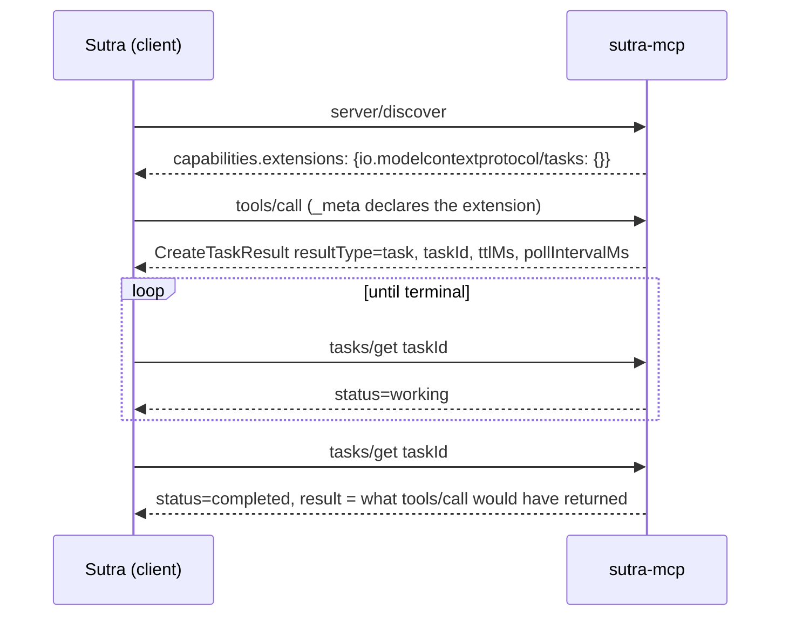

# 4.1 — Four messages on the wire

## One-line answer

The Tasks extension is the handle you built in section 3, written down as four standard messages — an
opt-in on the request, a `CreateTaskResult` instead of the answer, a `tasks/get` poll, and a terminal
result — so any client can drive any server's long jobs without knowing anything about that server.

## The story

You pay the electricity bill at the little shop on the corner because the queue at the office is
absurd.

The man behind the till has never heard of your supplier. He does not know what a standing charge is,
what your tariff is called, or which office issued the paper. He takes the slip, scans the barcode at
the bottom, types the amount, and hands you a receipt. Twenty seconds.

The reason that works is that the bottom third of every bill in the country looks the same. Reference
number here, amount here, barcode there. Above the line each supplier can print whatever it likes —
different logos, different explanations, different colours. Below the line, everybody agreed on one
shape, and because they did, one shop can take payments for suppliers it has never heard of.

## The idea in plain language

Section 3 built a working long-job mechanism by hand: mint a handle, return it immediately, let the
client come back with it. That mechanism is correct and it has one problem — it is **yours**. A client
that has never seen `sutra_mcp` has no idea that `reindex_start` returns something you can pass to
`reindex_status`. Every server invents its own pair of tools and every client has to be taught each
one.

The **Tasks extension** is the agreement that removes that. It is an official MCP extension identified
by the string `io.modelcontextprotocol/tasks`, and it standardises exactly the shape you built. Its own
overview describes the reason in one line
(`https://modelcontextprotocol.io/extensions/tasks/overview`, read 2026-09-04):

> *"MCP Tasks let servers return a durable handle instead of blocking, so clients can poll for
> progress, provide input when needed, and retrieve the final result after reconnecting."*

An **extension** is a capability that ships on its own timeline rather than inside the core protocol.
Day 32's part
[4.1](../../../day-32-mcp-stateless-core/parts/04-governance-and-registry/4.1-a-standard-nobody-owns.md)
described the governance behind that: capabilities are versioned separately so the core does not have
to grow every time somebody has a good idea. Tasks is one of these, which is why nothing in the core
specification mentions `tasks/get`.

Four messages carry the whole thing.

**One — the client declares support, on every request.** There is no handshake any more, so there is
nowhere to declare it once. The declaration rides in `_meta`, in the per-request capabilities block,
and it says nothing more than *"I know what a task is."*

**Two — the server answers with a handle instead of the result.** This is a `CreateTaskResult`,
recognised by `resultType: "task"`. Notice that the client did not ask for a task. It called
`tools/call` like always; the **server** decided this particular run would be long. The overview calls
this *server-directed*, and it is what lets one tool be fast for a small archive and a task for a big
one without the client knowing in advance.

**Three — the client polls.** `tasks/get`, carrying the `taskId`, at roughly the cadence the server
suggested. Same shape as `reindex_status`, standard name.

**Four — the terminal answer.** When the task finishes, `tasks/get` returns the status `completed`
along with `result`: *the thing the original `tools/call` would have returned* if it had been fast. That
is the detail that makes the extension elegant rather than merely tidy — the task is a wrapper around
the original result, not a replacement for it, so a client can unwrap it and carry on as though nothing
unusual happened.

There is a rule attached to message one that is easy to skim past and is the most important sentence in
the extension for anyone writing a server:

> *"Before returning a `CreateTaskResult`, verify that the client included the extension in its
> per-request capabilities. **Never return a task to a client that did not declare support.**"*

Because think about what a task looks like to a client that has never heard of one. It called a tool
and got back an object with a `taskId` in it, and no `content` — so it either crashes or shows the user
a piece of JSON. The declaration is not paperwork. It is the server checking that the answer it is
about to give can be understood.

## Why Sutra needs it

Because Sutra sits on both sides of this wire, and the two sides have different deadlines.

**As a client**, Sutra will connect to servers it did not write, starting with the ones Day 32's part
[4.2](../../../day-32-mcp-stateless-core/parts/04-governance-and-registry/4.2-the-registry-queried-live.md)
found in the registry. If one of those returns a `CreateTaskResult`, Sutra either understands it or
mangles it — and Sutra can only be sent one if it declared support, so the choice is explicit and
yours.

**As a server**, `sutra_mcp` gets a re-index tool on Day 49 that needs exactly this. Building the
handle by hand first, as section 3 did, is Principle 4: you know what the standard is standardising
before you adopt it.

**Day 41** is the server-capabilities day, and it is where the `extensions` block Sutra advertises gets
decided properly. Today you learn what one of the entries in that block means.

## The mechanism

Every message written out. Nothing here talks to a server — the point is to read the shapes with your
own eyes before any library hides them.

```python
# days/day-36-long-jobs-and-tasks/lab/wire_shapes.py  (extract)
EXT = "io.modelcontextprotocol/tasks"


def call_with_tasks() -> dict:
    """tools/call from a client that has declared the extension."""
    return {
        "jsonrpc": "2.0",
        "id": 1,
        "method": "tools/call",
        "params": {
            "name": "reindex_archive",
            "arguments": {"archive": "tickets"},
            "_meta": {
                "io.modelcontextprotocol/protocolVersion": "2026-07-28",
                "io.modelcontextprotocol/clientCapabilities": {"extensions": {EXT: {}}},
            },
        },
    }
```

**Line by line:**

- `EXT` is a constant because the identifier is long, reverse-DNS, and appears in three different
  places. Typing it twice is how you get a client that silently declares nothing — the server sees an
  unknown extension key, ignores it, and never sends a task.
- `"method": "tools/call"` — an ordinary tool call. There is no `tasks/create` and no special method
  for starting a task. Every long job starts as a normal call.
- `"_meta"` is inside `params`, as always since the 2026-07-28 revision, and it carries the protocol
  version alongside the capabilities. Day 32's part
  [2.3](../../../day-32-mcp-stateless-core/parts/02-the-reframe/2.3-every-request-introduces-itself.md)
  is where that block was introduced.
- `"io.modelcontextprotocol/clientCapabilities": {"extensions": {EXT: {}}}` is the declaration. Note the
  nesting: capabilities, then `extensions`, then the extension name as a **key** whose value is an
  empty object. The empty object is a place for future per-extension options; today there are none, and
  writing `true` or `null` instead is wrong in a way nothing will tell you about.
- This whole block is repeated on **every** request. There is no session to remember it in, which is
  the trade Day 32 measured: about 184 bytes of `_meta`, forever, in exchange for any instance
  answering anything.

```python
def create_task_result() -> dict:
    """The server's immediate answer: a handle instead of the work."""
    return {
        "jsonrpc": "2.0",
        "id": 1,
        "result": {
            "resultType": "task",
            "task": {
                "taskId": "tsk_9Fq2mR7wZk4bT1cs",
                "status": "working",
                "ttlMs": 3_600_000,
                "pollIntervalMs": 2_000,
            },
        },
    }
```

**Line by line:**

- `"id": 1` matches the request. This *is* the response to that `tools/call` — not a notification, not a
  second message. The request is answered immediately; it is just answered with a name.
- `"resultType": "task"` is how a client recognises what it is holding. The 2026-07-28 revision made
  `resultType` required on every result — `"complete"` for an ordinary answer — and the extension adds
  `"task"` as a third value. A client reads that field first and branches on it.
- `"task"` wraps the handle in an object rather than returning a bare string, so that status, TTL and
  polling advice arrive with it and no second round trip is needed to learn them.
- `ttlMs` is how long the server promises the handle will still resolve. It is **milliseconds**, and
  `3_600_000` is written with underscores for a reason: the single most common bug with this field is
  reading `3600` as if it meant something sensible. Day 32's part
  [3.3](../../../day-32-mcp-stateless-core/parts/03-headers-and-caches/3.3-lists-you-may-keep.md) met the
  same suffix on cache TTLs, and it bites the same way.
- `pollIntervalMs` is the server's advice on cadence, also in milliseconds. It is advice, not a rule —
  part [4.3](4.3-polling-is-a-budget.md) is about what it costs to ignore it.
- `"status": "working"` is the only status a task can be created in, and it is here so the client does
  not have to poll once just to find out the obvious.

```python
def tasks_get(task_id: str) -> dict:
    return {
        "jsonrpc": "2.0",
        "id": 2,
        "method": "tasks/get",
        "params": {"taskId": task_id, "_meta": {"io.modelcontextprotocol/tasks": {}}},
    }
```

**Line by line:**

- `"method": "tasks/get"` is a **method the extension adds to the protocol**, not a tool. That
  distinction matters: it is not in `tools/list`, the model never chooses it, and no allowlist of tool
  names affects it. It is client plumbing.
- `"id": 2` is a new request id, because this is a new request. The original id is finished — part
  [1.3](../01-the-blocking-call/1.3-work-with-no-name.md) is the whole argument for why the `taskId`
  and not the request id is what carries forward.
- `"taskId"` travels in `params`, as an ordinary parameter. This is Day 32's rule about state
  travelling in the payload, with a standard field name on it.
- `_meta` here carries the extension key so the request identifies itself as extension traffic. In a
  real client the same `_meta` builder produces this and the block in `call_with_tasks`, which is the
  argument for having exactly one such builder.

Run it:

```bash
uv run python days/day-36-long-jobs-and-tasks/lab/wire_shapes.py
```

**Line by line:**

- From the repository root. **Zero model calls**, no network — it prints JSON and then runs one rule.

Measured on 2026-09-04 (the first two messages; the rest are in part
[4.2](4.2-five-statuses-and-the-terminal-rule.md)):

```text
--- client -> server  tools/call, extension declared
{
  "jsonrpc": "2.0",
  "id": 1,
  "method": "tools/call",
  "params": {
    "name": "reindex_archive",
    "arguments": {
      "archive": "tickets"
    },
    "_meta": {
      "io.modelcontextprotocol/protocolVersion": "2026-07-28",
      "io.modelcontextprotocol/clientCapabilities": {
        "extensions": {
          "io.modelcontextprotocol/tasks": {}
        }
      }
    }
  }
}

--- server -> client  CreateTaskResult
{
  "jsonrpc": "2.0",
  "id": 1,
  "result": {
    "resultType": "task",
    "task": {
      "taskId": "tsk_9Fq2mR7wZk4bT1cs",
      "status": "working",
      "ttlMs": 3600000,
      "pollIntervalMs": 2000
    }
  }
}
```

The underscores are gone in the output because JSON has no such notation — `3600000` is what actually
goes on the wire, and looking at that number is a reminder of why the source spells it `3_600_000`.

The whole exchange, in order:



`server/discover` at the top is the optional half. It is how a client learns up front that a server
speaks the extension at all — Day 32's part
[2.4](../../../day-32-mcp-stateless-core/parts/02-the-reframe/2.4-server-discover-the-optional-question.md)
covers what it is and why calling it is a **MAY** for clients and a **MUST** for servers.

## When it breaks

The break that costs the most time is the declaration in the wrong place. The client believes it opted
in; the server sees nothing; every call comes back as an ordinary result and the long job blocks exactly
as it did in part [1.1](../01-the-blocking-call/1.1-the-call-you-cannot-leave.md):

```text
McpError: Timed out while waiting for response
```

No mention of tasks, no mention of capabilities. From the client's point of view the server simply did
not use the extension, which is a legal thing for a server to do — so nothing anywhere reports a
problem. The three ways to produce that exact silence:

| Mistake | What the server sees |
| --- | --- |
| `_meta` placed beside `params` instead of inside it | no metadata at all |
| the extension key misspelt or abbreviated | an unknown extension it must ignore |
| `{"io.modelcontextprotocol/tasks": true}` instead of `{}` | a malformed capability entry |

The opposite break is louder and lands on a client that never opted in:

```text
KeyError: 'content'
```

That is a client unwrapping what it assumed was a normal tool result and finding `resultType: "task"`
instead. It is the failure the *"never return a task to a client that did not declare support"* rule
exists to prevent, and when you see it, the bug is on the **server**, not on the client that crashed.

## In production

**What a professional writes instead:** one function builds `_meta` for every outgoing request, and the
extension declaration is a parameter to it rather than a literal typed at each call site. On the server
side, the capability check happens in one place — a helper that decides *task or inline* — rather than
in each tool, because a single tool that forgets the check is a single tool that breaks strangers'
clients.

**What degrades at scale and under concurrency:** the declaration is per-request, so it is bytes on
every call forever, and a chatty agent making thousands of small tool calls pays for a capability it
uses on one of them. That is the deliberate trade of a stateless protocol and it is measurable — Day 32
put the `_meta` block at about 184 bytes. The other scaling question is the server's: deciding *task or
inline* per request means the same tool has two response shapes in production, so both need
monitoring, and "how often did we return a task?" is a metric worth having before you need it.

**The review comment a senior engineer leaves:** *"This tool returns a `CreateTaskResult` without
checking the client's declared extensions. Any host that has not opted in gets an object it cannot
parse, and the crash happens in their code, not ours. Put the check in one helper and make every
long-running tool go through it."*

**The interview question:** *"how does an MCP client know it is going to get a task instead of a
result?"* An honest answer: *"it does not know in advance, and that is by design — the extension is
server-directed. The client declares support for `io.modelcontextprotocol/tasks` in the per-request
capabilities in `_meta`, and then it has to handle either shape coming back: an ordinary result, or a
`CreateTaskResult` identified by `resultType: 'task'`. The rule that goes with that is on the server —
it must never return a task to a client that did not declare support, because that client will try to
read `content` out of a handle and crash. The nice property is that when the task does complete,
`tasks/get` hands back exactly the result the original call would have returned, so the task is a
wrapper rather than a different API."*

## Check yourself

```bash
uv run python days/day-36-long-jobs-and-tasks/lab/wire_shapes.py
```

Now change `EXT` to `"io.modelcontextprotocol/task"` — singular — and look at the printed request. It is
still valid JSON-RPC, still a valid MCP request, and declares nothing. Nothing in the message is marked
wrong, which is exactly how this bug reaches production.

**Out loud, without scrolling up:** name the four messages in order, say who decides that a call becomes
a task, and say what a server must check before returning one.

**Next:** [4.2 — Five statuses and the terminal rule](4.2-five-statuses-and-the-terminal-rule.md).
