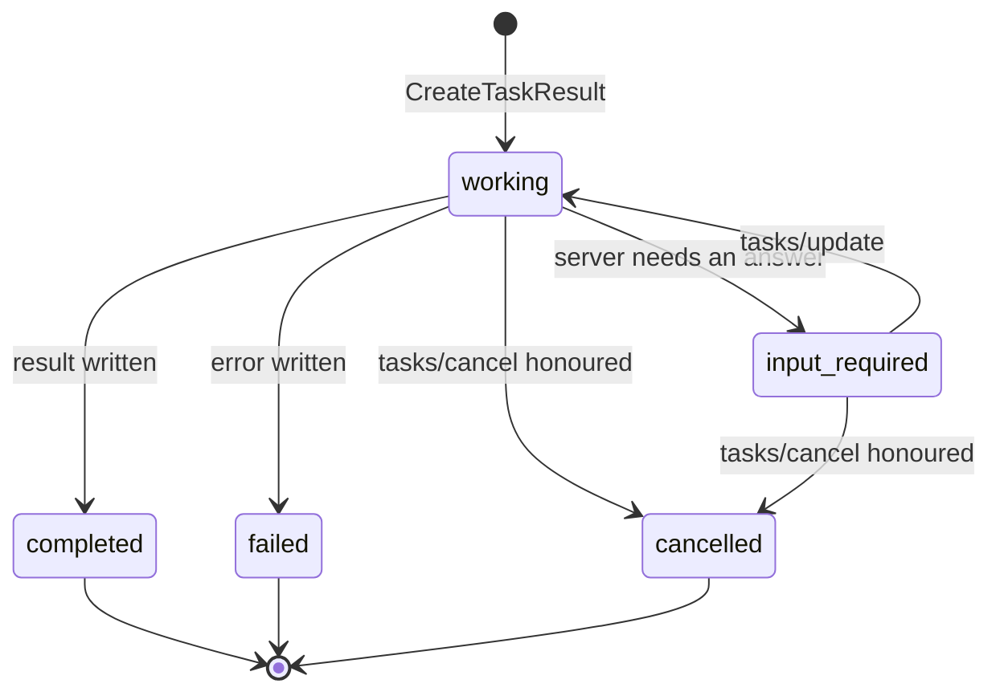

# 4.2 — Five statuses and the terminal rule

## One-line answer

A task is always in exactly one of five states, and three of them are **terminal** — once a task is
`completed`, `failed` or `cancelled` it never changes again, which is the promise that makes a poll
result safe to stop asking about.

## The story

Your exam results come out on a Tuesday and you refresh the page all morning.

*Being marked.* *Being marked.* *Being marked.* Then, at eleven, a grade. You take a screenshot, send
it to three people, and put your phone down.

What you do next is the point. You do not check again that afternoon in case it has gone back to
*being marked*. It cannot. The whole system depends on that: once a result is published it is
published, and if the board ever needs to change one it does not quietly rewind the page — it issues a
correction, with a different name and a paper trail, precisely because rewinding would destroy
everybody's ability to trust the first answer.

The refreshing stopped not because you got tired of it, but because you got an answer that was
**final**, and you knew it was final.

## The idea in plain language

The Tasks extension defines exactly five statuses. Not four, not seven, and not a free-text field.
Here they are with what each one means
(`https://modelcontextprotocol.io/extensions/tasks/overview`, read 2026-09-04):

| Status | Meaning | Terminal? |
| --- | --- | --- |
| `working` | the operation is in progress | no |
| `input_required` | the server needs something from the client before it can continue | no |
| `completed` | it finished; the `result` field holds the final output | **yes** |
| `failed` | a JSON-RPC error occurred; the `error` field has the details | **yes** |
| `cancelled` | it was cancelled — *"not always honored"* | **yes** |

And the rule that gives the set its shape, quoted from the same page:

> *"`completed`, `failed`, and `cancelled` are terminal — once reached, the task's state does not
> change."*

**Terminal** means final. A `completed` task does not go back to `working` if somebody restarts the
job. A `cancelled` task does not become `completed` because the work happened to finish anyway. If the
same operation is run again, that is a **new task with a new id**, exactly as a corrected exam result
is a new document rather than an edit to the old one.

Three things follow from that, and they are the reason the rule is worth a part of its own.

**Polling has a stopping condition.** A client polls until the status is terminal, then stops, and it
never has to poll again "just in case". Without the rule there is no safe moment to stop.

**A terminal result is cacheable.** The client can store it, hand it to the model, log it, and never ask
again. Under a protocol where a result might change, every cached answer is a guess.

**A status change is a one-way door for the server too.** Writing a terminal status is the last write
that row will take, which makes it a good place to put everything a later reader needs: the result, the
error, the final count. Nothing will be appended afterwards.

The one status people meet last is `input_required`, and it is worth being clear about what it is for
because it does not fit the mental model of "a job runs and finishes". A task that needs something from
the user — an approval, a choice, a confirmation — moves to `input_required`, and the `tasks/get`
response then carries an `inputRequests` map describing what it needs. The client gathers the answers
and sends them with `tasks/update`. That is **Day 37's** subject, elicitation, and this is the shape it
arrives in; today all you need is that `input_required` is not a failure and not terminal — the task is
waiting for you, and it goes back to `working` once you answer.

There is a matching rule about **which** statuses may be reached from where. It is short: any
non-terminal status may become any other status, and a terminal status may become nothing at all.

## Why Sutra needs it

Because `get_task` in `sutra_mcp/tasks.py` returns one of these five strings, and every caller of it
branches on the answer.

**Day 44** writes Sutra's retry and timeout policy. A retry loop that polls a task needs to know when
to stop, and the terminal rule is the only thing that gives it an exit condition that is not a
timeout.

**Day 64** is the human approval gate. An approval is a job that pauses, waits for a person, and then
continues — which is precisely `working → input_required → working`. Meeting the state machine here
means Day 64 is wiring rather than inventing.

**Day 49's** re-index is the first Sutra task that can genuinely fail halfway. Distinguishing `failed`
from `cancelled` matters there: one of them means try again, and the other means somebody meant it.

## The mechanism

First the terminal answer, so you can see where the original result reappears:

```python
# days/day-36-long-jobs-and-tasks/lab/wire_shapes.py  (extract)
def tasks_get_completed(task_id: str) -> dict:
    return {
        "jsonrpc": "2.0",
        "id": 2,
        "result": {
            "resultType": "complete",
            "taskId": task_id,
            "status": "completed",
            "result": {
                "resultType": "complete",
                "content": [{"type": "text", "text": "re-indexed 1204/1204 tickets"}],
            },
        },
    }
```

**Line by line:**

- The outer `"resultType": "complete"` describes **this message**: it is an ordinary, finished response
  to the `tasks/get` request. It is not describing the task.
- `"status": "completed"` describes **the task**. The two words look alike and mean different things —
  one is about the message you are reading, the other about the job it reports on — and confusing them
  is the standard mistake when you first meet this shape.
- The **inner** `"result"` is the payload: exactly what the original `tools/call` would have returned if
  it had been fast enough to answer inline. Its `content` array with a `text` item is the ordinary tool
  result shape from Day 34.
- Because the inner object is a complete tool result, a client can unwrap it and hand it to the same
  code that handles fast tools. That is the whole ergonomic argument for the extension: the task is a
  wrapper, not a different API.
- On a `failed` task this field is absent and `error` is present instead, carrying a JSON-RPC error
  object. A client therefore reads `status` **first** and only then decides which field to look at —
  reading `result` first gets you `None` from a running task and no clue why.

Now the rule, as code:

```python
TERMINAL = {"completed", "failed", "cancelled"}
STATUSES = ["working", "input_required", *sorted(TERMINAL)]


def transition(current: str, wanted: str) -> str:
    """The one rule that makes a terminal answer safe to keep."""
    if current in TERMINAL:
        return f"refused: {current} is terminal and MUST NOT become {wanted}"
    if wanted not in STATUSES:
        return f"refused: {wanted} is not a task status"
    return f"ok: {current} -> {wanted}"
```

**Line by line:**

- `TERMINAL` is a `set` because the only question ever asked of it is membership, and a set says that
  to the reader as well as to the interpreter.
- `STATUSES` is built **from** `TERMINAL` rather than typed out again, so the two cannot drift apart. If
  a future revision adds a terminal status, one line changes.
- The terminal check comes **first**, before the validity check. That ordering is the rule: a terminal
  task refuses every transition, including a transition to a status that does not exist, and including
  a transition to itself. Checking validity first would let `completed -> completed` through as a
  harmless no-op, and a no-op write is still a write somebody has to reason about.
- `wanted not in STATUSES` is the closed-set check. A status is not a free-text field; `"finished"`,
  `"done"` and `"in_progress"` are all wrong, and a server that invents one has produced something no
  client can branch on.
- The function returns a **string** rather than raising or returning a bool, because the demo's job is
  to print six decisions in a row and let you read them. In `sutra_mcp/tasks.py` the same logic raises
  or returns an error object; the decision it encodes is identical.

Run it:

```bash
uv run python days/day-36-long-jobs-and-tasks/lab/wire_shapes.py
```

**Line by line:**

- From the repository root. **Zero model calls**, no network. The transition table is printed after the
  four messages.

Measured on 2026-09-04:

```text
--- server -> client  tasks/get, terminal
{
  "jsonrpc": "2.0",
  "id": 2,
  "result": {
    "resultType": "complete",
    "taskId": "tsk_9Fq2mR7wZk4bT1cs",
    "status": "completed",
    "result": {
      "resultType": "complete",
      "content": [
        {
          "type": "text",
          "text": "re-indexed 1204/1204 tickets"
        }
      ]
    }
  }
}

--- the terminal rule
  ok: working -> input_required
  ok: input_required -> working
  ok: working -> completed
  refused: completed is terminal and MUST NOT become working
  refused: cancelled is terminal and MUST NOT become completed
  refused: finished is not a task status
```

The third and fifth lines together are the whole state machine. `working -> completed` is allowed and is
the last thing that will ever happen to that row; `cancelled -> completed` is refused even though the
work really did finish, because the client has already been told the job was cancelled and has already
acted on it.

The machine as a picture:



Every arrow into a terminal state is one-way, and there are no arrows out of one. That absence is the
guarantee.

## When it breaks

The break is a server that treats the status column as ordinary mutable data. Somebody adds a retry:
if a task failed, run it again and set it back to `working`. It looks helpful and it produces this,
from a client that had already stopped polling:

```text
McpError: task tsk_9Fq2mR7wZk4bT1cs reported failed at 11:04 and completed at 11:09
```

or, far more often, no error at all — just a support ticket saying the job was reported as failed and
the index looks fine, and nobody can work out which report to believe. The client cached `failed`,
because it was entitled to, and the row moved underneath it.

The correct version of "retry" is a **new task with a new id**, linked to the old one by a field of your
own if you want the audit trail. The old row stays `failed` forever, which is what makes the history
readable.

The second break is on the client and is quieter still:

```text
TypeError: 'NoneType' object is not subscriptable
```

That is a client that read `result` before checking `status`, on a task that is still `working`. The
field is legitimately `None` — nothing has been produced yet — and the client dereferenced it. The fix
is the ordering rule from the walkthrough: **status first, then the field the status tells you to
read.**

## In production

**What a professional writes instead:** the status column has a check constraint listing the five
values, and the transition is guarded in the update statement itself —
`UPDATE tasks SET status = ? WHERE task_id = ? AND status NOT IN ('completed','failed','cancelled')` —
so that two workers racing to finish the same task cannot both write. The guard lives in the query for
the same reason the ownership check did in part
[3.2](../03-the-handle/3.2-the-handle-anyone-can-guess.md): a condition in a `WHERE` clause travels with
the statement, while an `if` above it can be forgotten by the next person.

**What degrades at scale and under concurrency:** the interesting race is a cancellation arriving at
the same moment the work finishes. Both paths want to write a terminal status, and without the guard
both succeed — the row ends up `cancelled` with a result in it, or `completed` after the client was told
it was cancelled. The guarded update makes one of them a no-op and the caller can see which by checking
how many rows were affected. At scale you also want the terminal write to be the row's **last** write:
tasks that keep being touched after they finish are how tables that should be write-once become hot.

**The review comment a senior engineer leaves:** *"The retry path sets `status` back to `working` on a
failed task. That breaks the terminal rule and any client that cached the failure now disagrees with us
about what happened. Insert a new task and record the previous id on it — the old row is history and
history does not get edited."*

**The interview question:** *"what are the states of an MCP task and why does it matter that some of them
are terminal?"* An honest answer: *"`working`, `input_required`, `completed`, `failed` and `cancelled`,
and the last three are terminal — once reached the task never changes again. That matters for two
practical reasons. It gives the client a stopping condition, so a polling loop is not an infinite loop
with a timeout bolted on. And it makes a terminal answer cacheable: I can store it, act on it and throw
the handle away. The corollary is that a retry is a new task with a new id, never a rewind of the old
one — if you rewind, every client that already cached the failure is now holding a different truth from
you, and you will find out through a support ticket rather than an alert."*

## Check yourself

```bash
uv run python days/day-36-long-jobs-and-tasks/lab/wire_shapes.py
```

Now add `("completed", "completed")` to the list of transitions and run it again. It is refused, and it
is worth sitting with why: rewriting a terminal status with the same value looks harmless, but a rule
with an exception is a rule somebody will find the edge of.

**Out loud, without scrolling up:** name the five statuses, say which three are terminal, and say what
the correct way to retry a failed task is.

**Next:** [4.3 — Polling is a budget](4.3-polling-is-a-budget.md).
