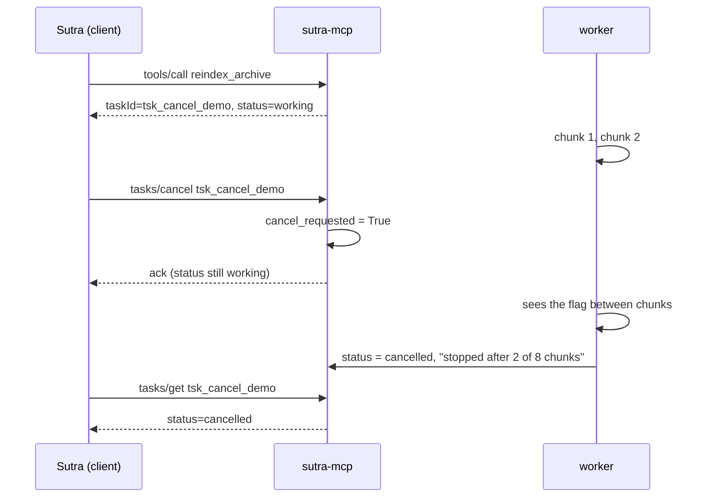

# 5.1 — Cancel is a request, not a switch

## One-line answer

`tasks/cancel` records an intention and returns immediately; the specification says cancellation is
**cooperative**, so a server may acknowledge your cancel and then finish the job anyway — and a
`cancelled` status is the one status that is never a promise about what happened.

## The story

You are in the chair at the hairdresser's and you change your mind halfway through.

You say *"actually, stop, leave the length"* and she says *"of course"* and puts the scissors down. She
heard you. She agreed. And your hair is still shorter than it was when you sat down, because the part
that is already cut is already cut.

If you had said it two minutes earlier, less would have gone. If you had said it while she was
reaching for the clippers, none of the last section would have. And if you had said it as the last snip
happened, nothing at all would have changed except that she now knows you did not want it.

Everybody in that room behaved correctly. The word "stop" arrived, was heard, and was obeyed from that
moment onward. What it could not do is reach backwards.

## The idea in plain language

The Tasks extension gives the client a third verb alongside `tasks/get` and `tasks/update`:
`tasks/cancel`, taking the `taskId`. What that verb means is where people are surprised
(`https://modelcontextprotocol.io/extensions/tasks/overview`, read 2026-09-04):

> *"The client can send `tasks/cancel` at any time. Cancellation is cooperative — the server
> acknowledges the intent but is not obligated to stop the work."*

And, in the server instructions:

> *"Acknowledge cancellation requests with an empty result. Honor them when possible, but cancellation
> is cooperative — the task may still reach a non-`cancelled` terminal status."*

Three consequences, and each of them changes how you write client code.

**The acknowledgement is not a confirmation.** An empty result means *"I have your message"*. It does
not mean the work stopped, and it does not mean the work will stop. A client that treats the
acknowledgement as an outcome will report "cancelled" to a user for a job that goes on to complete.

**The outcome arrives through `tasks/get`, like every other outcome.** After cancelling, the client
keeps polling until the task is terminal, and the terminal status is the answer: `cancelled` if the
server stopped, `completed` if it finished first, `failed` if it broke on the way. There is no separate
channel for "did my cancel work". The status table from part
[4.2](../04-the-tasks-extension/4.2-five-statuses-and-the-terminal-rule.md) even labels `cancelled`
*"(not always honored)"*, which is a rare thing for a specification to admit about one of its own
values.

**A terminal task cannot be cancelled at all.** The terminal rule outranks this verb: `completed`,
`failed` and `cancelled` never change, so cancelling a finished task is not a late success, it is an
error.

Why would a protocol design something so weak? Because the alternative is a lie. To guarantee a stop
you would need to be able to kill the work from outside — terminate the thread, kill the process, abort
the transaction — and a protocol has no such power over code it did not write. A server can only stop
if the code doing the work is written to notice, which is entirely a property of that code and not of
the protocol. So the specification promises the only thing it can actually deliver: **the message will
be delivered and recorded.** What happens next is the server's honesty, and part
[5.2](5.2-the-checkpoint-that-makes-cancel-real.md) is about making that honesty real.

A useful mental separation: `tasks/cancel` is a **request to stop**, not a **stop**. The same
distinction as asking someone to stop rather than physically stopping them, and it carries the same
implication — the person has to be listening.

## Why Sutra needs it

Because `cancel_task` is one of the three functions this day asks you to put in `sutra_mcp/tasks.py`,
and its return type is the whole design.

**Day 49's** re-index is expensive. Somebody will start one by mistake, and the ability to say "stop
that" without waiting for it to finish is the difference between an inconvenience and an afternoon.

**Day 64** builds the human approval gate, where a person can reject an action mid-flight. Rejection is
cancellation with a reason attached, and it inherits every property described here — including the fact
that a rejection arriving after the action has already been taken cannot undo it.

**Day 40** builds the security posture around tool filtering, and the blast-radius question there has a
sibling here: *how do I stop a thing I started?* A capability that cannot be stopped has a larger blast
radius than the same capability with a working cancel, and Principle 13 says the containment story
arrives with the capability.

## The mechanism

The verb, written as it behaves — recording an intent and returning at once:

```python
# days/day-36-long-jobs-and-tasks/lab/cancel.py  (extract)
task = {"taskId": "tsk_cancel_demo", "status": "working", "done": 0, "cancel_requested": False}
lock = threading.Lock()


def tasks_cancel(task_id: str) -> dict:
    """The verb. It records an intent; it does not stop anything by itself."""
    with lock:
        if task["taskId"] != task_id:
            return {"error": {"code": -32602, "message": f"unknown task {task_id}"}}
        if task["status"] in {"completed", "failed", "cancelled"}:
            return {
                "error": {
                    "code": -32602,
                    "message": f"cannot cancel task in terminal state '{task['status']}'",
                }
            }
        task["cancel_requested"] = True
        return {"resultType": "complete", "taskId": task_id, "status": task["status"]}
```

**Line by line:**

- `cancel_requested` is a **separate field from `status`**, and that separation is the design. Setting
  the status to `cancelled` here would be a lie: the work has not stopped and might not. The flag says
  *somebody asked*; the status says *what actually happened*.
- The unknown-task branch returns the same `-32602` and the same wording as every other miss in this
  day, for the reasons part [3.2](../03-the-handle/3.2-the-handle-anyone-can-guess.md) gave. A cancel is
  a read of the id before it is anything else, so it is an enumeration surface too.
- The terminal branch **refuses**, and it says which terminal state, because unlike a not-found this is
  not an enumeration risk — the caller has already proved it knows the task by receiving its status.
- `task["status"]` is returned in the acknowledgement, unchanged. The client gets back `working`, which
  is honest and slightly startling: you asked to cancel and the server told you it is still running.
  That is exactly the information the specification's "empty result" leaves out, and a small
  improvement on it.
- The whole function is under `with lock:` because the worker thread is reading `cancel_requested` and
  writing `status` at the same time. In a real server the lock is the database's, and the update is a
  conditional one.
- Nothing here waits. `tasks_cancel` returns immediately, in the time it takes to set a boolean — a
  cancel that blocked until the work stopped would be a blocking call, which is the thing this whole day
  exists to avoid.

The worker's side, which is where the intent actually takes effect:

```python
def worker() -> None:
    """Index the archive one chunk at a time."""
    for _ in range(CHUNKS):
        time.sleep(CHUNK_S)
        with lock:
            if CHECKPOINTS and task["cancel_requested"]:
                task["status"] = "cancelled"
                task["statusMessage"] = f"stopped after {task['done']} of {CHUNKS} chunks"
                return
            task["done"] = int(task["done"]) + 1
    with lock:
        if task["status"] == "working":
            task["status"] = "completed"
            task["statusMessage"] = f"re-indexed {task['done']}/{CHUNKS} chunks"
```

**Line by line:**

- The check sits **between two chunks**, not inside one. That is the only place it can sit: a unit of
  work either happens or it does not, and asking "should I stop?" halfway through writing a row is how
  you get a half-written row.
- `CHECKPOINTS` is the ablation switch, and part [5.2](5.2-the-checkpoint-that-makes-cancel-real.md) is
  the part that turns it off. Here it is on.
- Writing `status = "cancelled"` is done by the **worker**, not by `tasks_cancel`. Only the worker knows
  it has actually stopped, so only the worker is entitled to say so. This is the single most
  transferable idea in the part.
- `statusMessage` records *how far it got* — `stopped after 2 of 8 chunks`. A cancelled task that says
  nothing about its partial progress leaves the next person unable to decide whether to resume or start
  again.
- The final `if task["status"] == "working"` guard stops the completion path from overwriting a
  `cancelled` status set moments earlier. Without it, a cancel landing on the last chunk would be
  clobbered — which is the terminal-rule race from part
  [4.2](../04-the-tasks-extension/4.2-five-statuses-and-the-terminal-rule.md), in eight lines.

Run it with the checkpoint in place:

```bash
CHECKPOINTS=1 uv run python days/day-36-long-jobs-and-tasks/lab/cancel.py
```

**Line by line:**

- From the repository root. **Zero model calls**, no network. `CHECKPOINTS=1` is the arm where the
  worker is listening; part 5.2 runs the other one.

Measured on 2026-09-04:

```text
checkpoints in the worker : True
client sends tasks/cancel : {'resultType': 'complete', 'taskId': 'tsk_cancel_demo', 'status': 'working'}
final status              : 'cancelled'
statusMessage             : 'stopped after 2 of 8 chunks'
chunks actually indexed   : 2 of 8
```

Read the second and third lines together. At the moment of acknowledgement the status was **`working`** —
the server had not stopped anything yet and said so. The stop happened afterwards, in the worker, and
only then did the status become `cancelled`. Two of eight chunks were indexed and six were not, which is
the whole value of the verb.

The sequence:



The gap between the acknowledgement and the status change is not a flaw in the drawing. It is the
subject.

## When it breaks

The first break is a client that believes the acknowledgement. It shows the user "cancelled", stops
polling, and then the job completes:

```text
{"jsonrpc": "2.0", "id": 9, "result": {"resultType": "complete", "taskId": "tsk_9Fq2mR7wZk4bT1cs", "status": "completed", "result": {"resultType": "complete", "content": [{"type": "text", "text": "re-indexed 1204/1204 tickets"}]}}}
```

A `completed` task the user was told had been cancelled. Nothing errored. The correct client behaviour
is to keep polling after cancelling and report the **terminal status**, not the acknowledgement.

The second break is cancelling something that has already finished:

```text
{"error": {"code": -32602, "message": "cannot cancel task in terminal state 'completed'"}}
```

This is not a bug and should not be retried. It is the terminal rule refusing, and the useful thing for
a client to do with it is to fetch the task and show what actually happened, because the answer the user
wanted — *did it run?* — is right there.

The third break has no error text at all, which is what makes it the subject of the next part: a server
whose worker never checks the flag. It accepts the cancel, acknowledges it, records the intent
faithfully, and finishes the job in full. Every message is correct and nothing stopped.

## In production

**What a professional writes instead:** cancellation is recorded with a conditional update —
`UPDATE tasks SET cancel_requested = 1 WHERE task_id = ? AND status = 'working'` — so that the terminal
rule is enforced by the database rather than by an `if` that runs before it. The client's cancel path
does not end at the acknowledgement: it cancels, then polls to a terminal state, then reports what that
state was. And the user-facing wording follows the protocol's honesty — *"cancelling…"* until the status
is terminal, never *"cancelled"* on the strength of an acknowledgement.

**What degrades at scale and under concurrency:** the race between "cancel arriving" and "work
finishing" is rare per task and certain across a fleet. If you run enough tasks, some of them will
receive a cancel in the same instant they complete, and if the completion path does not check the status
before writing, some of those will end up as `cancelled` rows containing a full result — or `completed`
rows for jobs the user was told were stopped. The guard costs one condition and removes a class of
support ticket nobody can reproduce.

**The review comment a senior engineer leaves:** *"`cancel_task` sets `status = 'cancelled'` and
returns. We have not stopped anything — we have told the client a story about the future. Set a
`cancel_requested` flag, let the worker set the terminal status when it actually stops, and make the UI
say 'cancelling' until we know."*

**The interview question:** *"what happens when a client cancels an MCP task?"* An honest answer: *"the
server acknowledges it and records the intent, and that is all the protocol promises — cancellation is
explicitly cooperative, the spec says the server is not obligated to stop the work. So the
acknowledgement is not the outcome. The client keeps polling and reads the terminal status: `cancelled`
if the work stopped, `completed` if it got there first. On the server side I keep the requested flag
separate from the status, because only the code doing the work knows whether it actually stopped, and it
is the only thing entitled to write `cancelled`. And a task already in a terminal state cannot be
cancelled at all — that returns an error, and it should not be retried."*

## Check yourself

```bash
CHECKPOINTS=1 uv run python days/day-36-long-jobs-and-tasks/lab/cancel.py
```

Now change the client's wait from `CHUNK_S * 2.5` to `CHUNK_S * 20` — longer than the whole job — and
run it again. The cancel arrives after the work has finished, and you get the terminal-state refusal
rather than a late cancellation. Then set it to `CHUNK_S * 0.1` and watch `stopped after 0 of 8
chunks`.

**Out loud, without scrolling up:** say what `tasks/cancel`'s acknowledgement actually promises, say who
is entitled to write the `cancelled` status, and say what a client should do immediately after
cancelling.

**Next:** [5.2 — The checkpoint that makes cancel real](5.2-the-checkpoint-that-makes-cancel-real.md).
