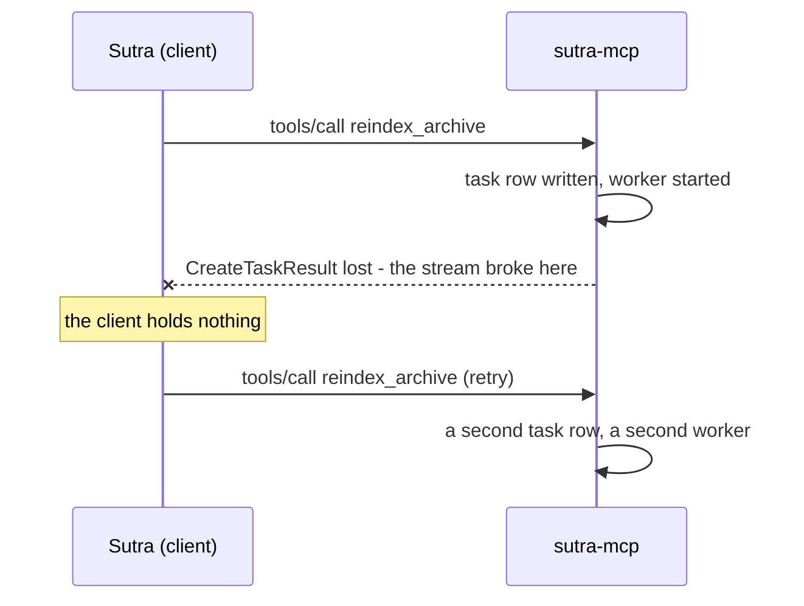

# 6.2 — The job that ran twice

## One-line answer

A handle makes a retry safe **after** you have it; the one request that can still duplicate work is the
one that creates the task, and the only thing that closes that gap is a key the **client** chooses and
the server remembers.

## The story

You pay for the shopping and the card machine thinks about it for a long moment and then shows an
error.

The assistant looks at her screen, shrugs, and says *"it hasn't gone through, try again."* You tap
again. This time it beeps and prints a receipt and you go home.

That evening the bank app shows two payments to the same shop, ninety seconds apart. Neither the
assistant nor you did anything careless. Her screen genuinely said the first one failed, because the
reply never got back to the machine — but the bank had already taken the money before the line dropped.
Between the machine and the bank there was a moment where the payment had happened and nobody on your
side of the counter could know it.

Getting the money back takes a phone call and a week, and everyone you speak to is perfectly nice about
it, and the whole thing exists because a message went missing in the one direction where its absence
is ambiguous.

## The idea in plain language

Part [1.3](../01-the-blocking-call/1.3-work-with-no-name.md) diagnosed the disease: work whose only name
was a connection cannot be recognised when the client asks again. Section 3 cured most of it. Once you
hold a task id, every retry is a `tasks/get` on that id, and a `tasks/get` can be repeated a thousand
times without doing any work at all — it is a read.

But look carefully at the sequence and one message is still exposed:



The `CreateTaskResult` is the message carrying the name. If **that** is what gets lost, the client never
learns the name of the job it started, and it is back in exactly the position part 1.3 described: it
must re-issue as a new request, and the server has no way to know the two are the same errand.

This is a specific and well-known shape, and it has a name. **At-least-once delivery** means a message
may arrive more than once; the sender retries because it did not hear back, and "did not hear back"
covers both "it never arrived" and "it arrived and the acknowledgement was lost". Nobody can tell those
apart from the sending side. Ever. It is not an engineering shortcoming, it is a property of
communicating over an unreliable channel.

Since you cannot make delivery exactly-once, you make the **operation** safe to repeat. The word for
that is **idempotent**: doing it twice has the same effect as doing it once. A `tasks/get` is naturally
idempotent because it changes nothing. Starting a job is not, unless you add something.

The something is an **idempotency key**: a string the *client* chooses, sends with the request, and
**reuses on the retry**. The server keeps a map from key to task id. First time it sees a key, it
creates the task and records the mapping. Every time after that, it returns the same task id and starts
nothing.

Note who owns what, because it inverts the rule from part
[3.1](../03-the-handle/3.1-a-name-the-server-mints.md). The **task id** must be server-minted, because
the server owns the namespace. The **idempotency key** must be client-chosen, because only the client
knows that two requests are the same intention — from the server's side they are two identical messages
and identical messages are normally two jobs.

One honest note about scope. **The Tasks extension does not define an idempotency key.** It gives you
handles, statuses and the three verbs; deduplicating the creating call is left to the application. So in
Sutra this is a tool argument like any other — which is precisely Day 32's rule that state travels in
the payload, applied one more time, and it means the key appears in the tool's `inputSchema` where a
reviewer can see it.

## Why Sutra needs it

Because Sutra's most expensive operation is also its most repeatable-by-accident one.

**Day 73** runs the nightly re-index unattended. Unattended is the worst case: nobody notices two
copies, and the natural key is sitting right there — the date and the archive name. `idem-2026-09-04-tickets-nightly`
is a key that makes the whole night idempotent, however many times the scheduler fires.

**Day 44** writes the retry policy. A retry is only safe when the thing being retried is idempotent, so
the two subjects are one subject: Day 44 decides *when* to retry, and this part decides *what makes it
safe to*.

**Day 60** builds durable execution, where a workflow step that has already run must not run again after
a restart. That is this idea with a bigger blast radius, and it is the same key.

## The mechanism

Two ways of starting a job, and the same retry sent to both:

```python
# days/day-36-long-jobs-and-tasks/lab/idempotency.py
tasks: dict[str, dict[str, str]] = {}
by_key: dict[str, str] = {}
work_started = 0


def start_naive(archive: str) -> str:
    """No key. Every call is a new job."""
    global work_started
    task_id = f"tsk_{secrets.token_urlsafe(8)}"
    tasks[task_id] = {"archive": archive, "status": "working"}
    work_started += 1
    return task_id
```

**Line by line:**

- `tasks` is the task store from part 3.1, trimmed to the two fields this demo needs.
- `by_key` is the new thing and it is a **second index**: key to task id. It is separate from `tasks`
  rather than a field on the row, because you look things up by it, and in a database it is its own
  unique index.
- `work_started` counts jobs actually begun. It is the number the whole part is about — not how many
  requests arrived, but how much work happened.
- `start_naive` is section 3's `start_reindex` with the worker removed. Every call mints a fresh id and
  increments the counter, which is correct behaviour for a server that has been given no way to know
  better.
- `secrets.token_urlsafe(8)` is shorter here than part 3.1's `16` purely so the printed output fits on a
  line; part [3.3](../03-the-handle/3.3-sutras-handle-policy.md)'s rule 1 wants sixteen in real code, and
  the policy check enforces it.

```python
def start_idempotent(archive: str, key: str) -> tuple[str, bool]:
    """Same key, same handle. Returns (task_id, was_replayed)."""
    global work_started
    if key in by_key:
        return by_key[key], True
    task_id = f"tsk_{secrets.token_urlsafe(8)}"
    tasks[task_id] = {"archive": archive, "status": "working"}
    by_key[key] = task_id
    work_started += 1
    return task_id, False
```

**Line by line:**

- `key: str` is a required parameter, not an optional one with a default. An idempotency key that can be
  omitted will be omitted, and the day it matters is the day nobody passed one.
- `if key in by_key:` is the whole mechanism, and notice what it returns: the **same task id**, not an
  error. A duplicate creation is not a client mistake to be punished — it is the client doing the only
  correct thing after a lost reply, and the right response is to hand back what it should have received
  the first time.
- `was_replayed` tells the caller which happened. It is not needed for correctness and is very much
  needed for observability: "how often are we replaying?" is the metric that tells you whether your
  network is dropping replies.
- `by_key[key] = task_id` is written **after** the task row and **before** the return, so the ordering
  rule from part 3.1 holds for both writes. In a real server the two go in one transaction, because a
  key recorded without its task is a key that will replay a handle to nothing.
- `work_started += 1` sits only on the creating path. That is the assertion of the whole part, expressed
  as a counter you can print.

Run it:

```bash
uv run python days/day-36-long-jobs-and-tasks/lab/idempotency.py
```

**Line by line:**

- From the repository root. **Zero model calls**, no network. It starts two jobs the naive way and two
  the keyed way, and prints how much work each pair caused.

Measured on 2026-09-04:

```text
without an idempotency key
  handles      : tsk_IKjvx8-hybc / tsk_Vwv5EqpiSbE
  same handle? : False
  jobs running : 2

with an idempotency key
  handles      : tsk_FLHM-MFzo3o / tsk_FLHM-MFzo3o
  same handle? : True
  replayed?    : False then True
  jobs running : 1
```

Two identical requests. In the first block they produce two different handles and two re-indexes; in the
second they produce **the same handle** and one. The `replayed?` line is the part to keep: the second
call was recognised as a repeat and answered from the map, and the client cannot tell — which is
exactly right, because the client's correct behaviour after a lost reply is to ask again and get the
answer it missed.

## When it breaks

The first break is a key that is not stable across the retry. Somebody generates it inside the retry
loop:

```python
for attempt in range(3):
    key = f"idem-{uuid.uuid4()}"  # a new key every attempt
    task_id = start_idempotent("tickets", key)
```

**Line by line:**

- `uuid.uuid4()` inside the loop makes every attempt a different key, so the server sees three distinct
  intentions and starts three jobs.
- The fix is one line up: the key is generated **before** the loop, from the intention rather than from
  the attempt. A key derived from what you are trying to do — the archive and the date — is better still,
  because it survives the client process restarting mid-retry.

The visible symptom is not an error. It is the counter in part 1.3's demo, in production:

```text
jobs started : 3
wasted work  : 2 full re-index
```

The second break is a key that is *too* stable. Someone uses the archive name alone, so
`start_idempotent("tickets", "tickets")` replays forever, and the nightly job runs once and then never
again — every subsequent night gets last night's task id back, reports `completed` instantly, and
indexes nothing. This is the failure that arrives as *"why is the index a fortnight out of date?"*, and
it is worse than the duplicate because it is silent and cumulative. A key must be unique per
**intention**, and "re-index the tickets tonight" is a different intention from "re-index the tickets
tomorrow night".

The third is the key map with no expiry, which is part
[3.3](../03-the-handle/3.3-sutras-handle-policy.md)'s rule 3 arriving in a second table:

```text
sqlite3.OperationalError: database or disk is full
```

The map grows exactly as fast as the task table and needs the same sweep. It should usually expire
*sooner* than the task itself: a retry that arrives long after the original has no chance of being a
real retry.

## In production

**What a professional writes instead:** the key is a column with a **unique constraint**, and creation
is written as an insert that may violate it — insert the row, and on a uniqueness violation read back
the existing task id and return that. Doing it in that order rather than "check, then insert" is what
makes it safe against two retries arriving at the same instant on two different instances: the database
arbitrates, not a race between two `if` statements. The key also travels with the request rather than
being derived on the server, because a server-derived key would have to guess which requests are the
same, and guessing is what this whole mechanism exists to avoid.

**What degrades at scale and under concurrency:** the failure that only appears under concurrency is
exactly that simultaneous double-submit, and it is common precisely when things are going badly — a
proxy restart causes many clients to retry in the same second. A check-then-insert implementation
passes every single-threaded test and duplicates under load. The other scaling issue is the map's size:
it is written on every creating call forever, so it wants a shorter TTL than the tasks themselves and a
sweep of its own.

**The review comment a senior engineer leaves:** *"`start_task` has no idempotency key, so if the client
never sees our `CreateTaskResult` it will re-issue and we will run the whole index twice. Take a key as
a required argument, put a unique index on it, and implement it as insert-then-catch rather than
check-then-insert — otherwise two simultaneous retries both pass the check."*

**The interview question:** *"you return a task handle immediately. Can the client still cause duplicate
work?"* An honest answer: *"yes, on exactly one message — the response carrying the handle. If that is
lost, the client never learns the job's name and its only option is to send the request again, and two
identical requests are normally two legitimate jobs, so the server cannot tell. Delivery is at-least-once
and that is not fixable, so I make the creating operation idempotent instead: the client sends a key it
chooses and reuses on every retry, and the server maps key to task id and replays the same handle. The
detail I would insist on in review is that the key is client-chosen while the task id stays
server-minted — only the client knows two requests are the same intention — and that the server
implements it as an insert against a unique constraint rather than a check followed by an insert, or two
retries landing at once both slip through."*

## Check yourself

```bash
uv run python days/day-36-long-jobs-and-tasks/lab/idempotency.py
```

Now call `start_idempotent("articles", key)` with the **same** key as the tickets job and read what comes
back. It replays the tickets handle, for a different archive, and starts nothing — because the key, not
the arguments, is what the server matched on. Then decide out loud whether the server should have
refused that instead, and what it would need to store in order to.

**Out loud, without scrolling up:** say which single message in the task lifecycle can still cause
duplicate work, and say who chooses the idempotency key and why it is not the server.

**Next:** [6.3 — The store is the stateful thing](6.3-the-store-is-the-stateful-thing.md).
