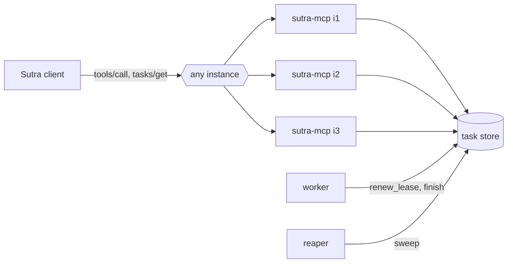

# 6.3 — The store is the stateful thing

## One-line answer

Every property you removed from the MCP server by going stateless reappears in the task store, so the
honest version of "our server is stateless" is "we moved the state to something designed to hold it, and
that thing is now the most important component we own".

## The story

Your building used to have a small water tank on each flat's balcony, and last year the landlord
replaced them all with one big tank on the roof.

It is better. Nobody runs out because their own tank was small. The plumber services one tank instead
of twelve. When a new flat is built on the top floor it simply connects, and nothing has to be
rebalanced.

And then, in the summer, the pump on the roof fails, and it is not one flat without water — it is
everybody. When four flats run their washing machines at the same time the pressure on the top floor
drops in a way it never used to. The tank has to be cleaned, and cleaning it means a day with no water
for the whole building, which has to be announced, and somebody has to remember to announce it.

Nothing here is an argument against the shared tank. The shared tank is the right design and everyone
prefers it. It is an argument for noticing that the twelve small problems did not vanish — they became
one big problem, and the one big problem now needs a maintenance schedule and somebody whose job it is.

## The idea in plain language

Day 32 taught statelessness, and part
[3.4](../../../day-32-mcp-stateless-core/parts/03-headers-and-caches/3.4-state-that-travels-in-the-payload.md)
was careful about the wording: **the state does not stop existing, it moves.** This day has been
spending that sentence. Now it is worth adding it all up, because after eighteen parts the bill is
itemised.

Sutra's MCP server is genuinely stateless. Any instance answers any request; no instance remembers a
caller; a deploy can replace all of them mid-conversation and nothing is lost. Every one of those
properties is real and every one of them was bought with the same thing: a store behind the handlers
that all of them share.

Here is what the store now owes, and where in this day each obligation was discovered:

| The store must | Because of | Discovered in |
| --- | --- | --- |
| exist before the response is sent | a handle that names nothing is worse than no handle | [3.1](../03-the-handle/3.1-a-name-the-server-mints.md) |
| record an owner and filter every read on it | possession of a string is not authorisation | [3.2](../03-the-handle/3.2-the-handle-anyone-can-guess.md) |
| record a TTL and be swept | nothing tells a handle its client has gone | [3.3](../03-the-handle/3.3-sutras-handle-policy.md) |
| refuse writes to terminal rows | a cached answer must stay true | [4.2](../04-the-tasks-extension/4.2-five-statuses-and-the-terminal-rule.md) |
| serve every poll as a read | polling is the client's only universal option | [4.3](../04-the-tasks-extension/4.3-polling-is-a-budget.md) |
| carry a cancellation flag the worker reads | cancellation is cooperative and lives in the work | [5.2](../05-cancellation/5.2-the-checkpoint-that-makes-cancel-real.md) |
| carry a lease and be reaped | a dead worker writes no status | [6.1](6.1-the-task-that-says-working-forever.md) |
| enforce one job per idempotency key | the creating response can be lost | [6.2](6.2-the-job-that-ran-twice.md) |

Eight obligations, none of which existed this morning, all of which belong to one component.

The consequence people miss is about **scaling**. Instances scale by adding instances — that is the
whole prize of statelessness. The store does not. Adding a second store does not double anything; it
splits the world in two, and a handle minted against one is unknown to the other, which is the
sticky-session failure from Day 32's part
[2.2](../../../day-32-mcp-stateless-core/parts/02-the-reframe/2.2-three-instances-one-url.md) wearing a
database costume. So the store is the one component whose capacity has to be *planned* rather than
scaled out, and it is the one whose failure is total rather than partial.

The second consequence is about **latency**. A tool call that used to be a dictionary lookup is now a
network read. Under load the store's slowest responses become the tool's slowest responses, and the
tail of one distribution becomes the tail of the other. Day 44 is where the timeouts that account for
that get chosen.

None of this is an argument for going back. A session had the same state and put it somewhere with no
backups, no schema, no expiry policy and no way for a second instance to read it. Moving it was
correct. Pretending it went away is not.

## Why Sutra needs it

Because the next several days each pick up one row of that table, and knowing which is which is what
stops them being written twice.

**Day 39** puts SQLite behind Sutra's MCP tools and generates `sutra/data/tickets.sqlite3`. That is the
day the task store stops being a dict and becomes a table with a schema.

**Day 43** deploys `sutra_mcp` as `sutra_mcp/app.py`, an ASGI entry point where any instance answers
any request. It is the day the store's shared-ness is load-bearing rather than theoretical.

**Day 44** writes `sutra/mcp/hardening.py` — retries, timeouts, and the no-held-connections rule — which
is the client-side half of the latency point above.

**Day 45** is the Phase 6 audit. Every row in the table above is an audit question, and the ones this
day leaves as `TODO(me)` are the ones that audit will find.

## The mechanism

The seam is the point. Everything the store owes can be stated as an interface, and the interface is
what `sutra_mcp/tasks.py` should be written against rather than against a dict or against SQL:

```python
# the shape - the hub's build brief says which parts of it you write today
from typing import Protocol


class TaskStore(Protocol):
    """What sutra_mcp/tasks.py needs from whatever is holding the rows."""

    def create(self, task: Task, idempotency_key: str) -> tuple[Task, bool]: ...

    def read(self, task_id: str, owner: str) -> Task | None: ...

    def finish(self, task_id: str, status: str, result: str | None, error: str | None) -> bool: ...

    def request_cancel(self, task_id: str, owner: str) -> bool: ...

    def renew_lease(self, task_id: str, until: float, done: int) -> None: ...

    def sweep(self, now: float) -> int: ...
```

**Line by line:**

- `Protocol` rather than an abstract base class, because nothing here needs inheritance — a dict-backed
  store for tests and a SQLite-backed store for Day 39 should be interchangeable without either
  importing the other.
- `create` takes the idempotency key **alongside** the task and returns `(task, was_replayed)`. Both
  writes belong to one call because part [6.2](6.2-the-job-that-ran-twice.md) showed they must be one
  transaction: a key recorded without its task replays a handle to nothing.
- `read` takes an `owner` and returns `Task | None`. The owner is a parameter rather than something the
  caller filters on afterwards, so that part
  [3.2](../03-the-handle/3.2-the-handle-anyone-can-guess.md)'s check cannot be forgotten by the next
  person to write a handler — there is no way to call this without saying who is asking.
- `finish` returns a `bool`: **did this write actually happen?** That is the terminal-rule guard from
  part [4.2](../04-the-tasks-extension/4.2-five-statuses-and-the-terminal-rule.md) surfaced in the
  signature. A worker completing a task that was already cancelled gets `False` and can log it rather
  than silently disagreeing with the client.
- `request_cancel` is named for what it does. Not `cancel` — part
  [5.1](../05-cancellation/5.1-cancel-is-a-request-not-a-switch.md) spent a whole document on the
  difference, and a method called `cancel` will eventually be believed by somebody.
- `renew_lease` takes the progress count as well as the deadline, because part
  [6.1](6.1-the-task-that-says-working-forever.md) said renewal should ride on the progress write rather
  than be its own round trip. One call, one row touched.
- `sweep` returns how many rows it acted on. A reaper that reports nothing is indistinguishable from a
  reaper that is not running, and that number is the metric an alert hangs off.
- There is **no `list` method**, and the omission is deliberate: the extension removed `tasks/list`, and
  a store interface that offers a way to enumerate everybody's tasks is an interface somebody will
  eventually expose.

The architecture the interface describes:



Count the arrows into the store. Three instances, a worker and a reaper, all writing to one thing — and
that one thing is the only box in the picture that cannot be fixed by drawing another copy of it.

Run the day's two store-shaped checks together and read them as an audit of that box:

```bash
uv run python days/day-36-long-jobs-and-tasks/lab/policy.py; echo "policy exit: $?"
uv run python days/day-36-long-jobs-and-tasks/lab/tenancy.py; echo "tenancy exit: $?"
```

**Line by line:**

- Both are run from the repository root and both make **zero model calls**. Neither needs a key, a
  server, or a network.
- `policy.py` checks the five handle rules and is red on rules 2 and 3, which are the two obligations in
  the table above that nothing in `lab/` implements yet.
- `tenancy.py` checks that the naming scheme does not hand out a directory of other tenants' jobs, and
  is red because the sequential arm exists in it on purpose.
- Two red checks, both about the store rather than about the protocol, is a fair summary of what this
  day leaves you holding.

## When it breaks

The break is the one the water tank had: everything is fine, and then the shared thing has a bad day.

```text
sqlalchemy.exc.OperationalError: (psycopg2.OperationalError) connection to server at "tasks-db" failed:
FATAL: sorry, too many clients already
```

Every instance is healthy. Every worker is healthy. The MCP server is stateless and could be scaled to
thirty instances, and scaling it to thirty instances is what caused this, because thirty instances times
their connection pools exceeded what the database will accept. The property that made the servers cheap
to add is the property that made them dangerous to add.

The second break is the one that follows from believing the marketing:

```text
sqlite3.OperationalError: attempt to write a readonly database
```

This is what a task store on a container's local disk says after the container is recreated read-only,
or nothing at all if the disk was simply ephemeral — in which case every handle from before the deploy
resolves to `unknown task` and every client concludes its job never existed. "Stateless server" gets
read as "no persistence needed", the store is put somewhere convenient, and the convenient place is
exactly the place that does not survive.

The third is the slow one. Under load, a poll that used to take a moment starts taking longer, and
because part [4.3](../04-the-tasks-extension/4.3-polling-is-a-budget.md)'s clients poll on a fixed
cadence regardless, the store gets no relief from its own slowness. There is no error text for this one.
It shows up as a latency graph with a rising tail and a support ticket saying the desk feels sluggish.

## In production

**What a professional writes instead:** the store is a managed database, not a file next to the code; it
has a schema in version control, a backup with a tested restore, and a connection pool sized against the
number of instances rather than against one instance's needs. The task table has an index on the
primary key, one on the idempotency key with a unique constraint, and one on the lease column for the
reaper's sweep. And there is a written answer to *"what happens to running tasks during a deploy?"*,
because there is one whether or not anybody wrote it down.

**What degrades at scale and under concurrency:** the store is the contention point, and every part of
this day adds traffic to it — a write per creation, a read per poll, a write per heartbeat, a write per
sweep. Polls dominate, which is why the cadence in part 4.3 is a store-capacity decision rather than a
client politeness decision. The two mitigations that actually work are backing off the polling and
letting clients cache terminal results, and both of them are only safe because part
[4.2](../04-the-tasks-extension/4.2-five-statuses-and-the-terminal-rule.md) guaranteed a terminal status
never changes.

**The review comment a senior engineer leaves:** *"We keep saying the server is stateless, and it is, but
the design review should be of the task store — that is where all the state went. I want to see the
schema, the indexes, who sweeps it, what the backup story is, and what the connection pool looks like at
thirty instances. Right now the phrase 'stateless' is doing a lot of work it has not earned."*

**The interview question:** *"if your MCP server is stateless, where does the state live?"* An honest
answer: *"in a store behind the handlers, and I would push back gently on the framing — statelessness
did not remove the state, it moved it somewhere designed to hold it, and that store is now the most
important component in the system. It owes eight things: durability before the response, an owner on
every row, a TTL and a sweep, a terminal-write guard, a read per poll, a cancellation flag, a lease the
worker renews, and a unique idempotency key. It is also the one component you cannot scale by adding
copies — three server instances is a good idea, three task stores is two different worlds. So I size it
deliberately, back off the polling that hits it, and let clients cache terminal results, which is safe
precisely because a terminal status never changes."*

## Check yourself

```bash
uv run python days/day-36-long-jobs-and-tasks/lab/policy.py; echo "policy exit: $?"
uv run python days/day-36-long-jobs-and-tasks/lab/tenancy.py; echo "tenancy exit: $?"
```

Now go back through the eight-row table and, for each row, name the method on `TaskStore` that would
satisfy it. Two rows map to the same method and one row maps to none of them — find which, and decide
whether that is a gap in the interface or a job for something outside it.

**Out loud, without scrolling up:** say which component in the picture cannot be scaled by adding
another copy of it, and say what "stateless" actually means once you have been honest about where the
state went.

**Next:** the paper. Read
[`Promises: linguistic support for efficient asynchronous procedure calls in distributed systems`](../../papers/01-promises.md)
now that you have built the mechanism it proposed — that order is Principle 4 at the scale of a day.
