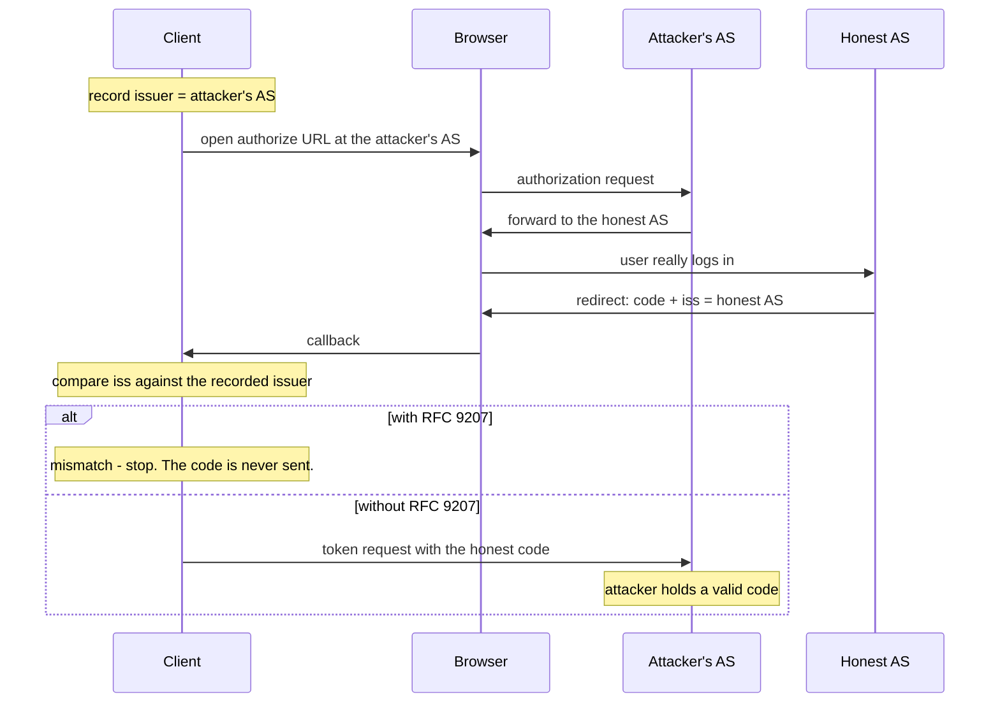

# OAuth 2.0 Authorization Server Issuer Identification

> **OAuth 2.0 Authorization Server Issuer Identification** · `doi:10.17487/RFC9207` · 2022 ·
> `https://www.rfc-editor.org/rfc/rfc9207`

## One-line answer

An authorization response that does not say who sent it can be redirected to the wrong recipient, so
this document adds one parameter — `iss` — and one obligation: the client compares it against the
issuer it recorded, before the authorization code goes anywhere.

## The story

A call centre handles three insurance brands from the same room.

You rang about one of your policies last week and gave a reference number. Today a message arrives:
*your claim reference is 4471; reply with your policy number to confirm.* It came from the same
number as last time, it is worded the way their messages are worded, and it is entirely genuine.

The trouble is that you hold policies with two of the three brands, and both use this operator. The
message does not say which company it is from, because the system that generates it does not put the
brand in. So you are being asked to send a policy number back, and you cannot tell which company will
receive it.

Reply with the wrong one and you have handed one company's reference to another. Nobody forged
anything. The message is real, the operator is real, both companies are real. What is missing is one
line saying *this is from us* — and without it, you have no way to check that the answer came from
the place you wrote to.

That was the state of OAuth for a decade. A client that talked to several authorization servers
received authorization responses that did not identify their sender, and a class of attacks lived in
that gap.

## The idea in plain language

The document is short and its claim is one sentence: **the authorization response must identify the
authorization server that produced it, and the client must check.**

Some vocabulary first, because the claim is only interesting once these are clear.

An **authorization server** is the service that authenticates the user and issues credentials. Its
identity is a URL called the **issuer**, and it publishes that URL in its own metadata document.

An **authorization code** is a short-lived string the authorization server hands back through the
user's browser. It is not a token. It is a one-time voucher that the client exchanges, at the
authorization server's token endpoint, for an actual access token. The exchange is where the code
becomes valuable, and it is the step this document protects.

The **authorization response** is the redirect that carries the code back to the client — typically
`https://client.example/callback?code=...&state=...`.

The attack the document exists to close is called a **mix-up attack**, and it needs three
ingredients: a client that supports more than one authorization server, an attacker who can influence
which one a given flow starts at, and an authorization response that does not identify its sender.

Once those three are present, the sequence is short. The client is steered into starting at the
attacker's authorization server and records it as the one it is dealing with. That server does not
authenticate anybody; it forwards the browser to the honest one, where the user really does log in. A
genuine code comes back to the client's callback. The client, still believing it is talking to the
attacker's server, posts the honest code to the attacker's token endpoint. The attacker now holds a
valid authorization code for that user at the honest server.

Nothing was forged and nothing was stolen from the browser. The client simply gave a real credential
to the wrong recipient, because the response did not say who had produced it.

## Why Sutra needs it

Because [2.1](../parts/02-issuer-checks/2.1-which-desk-actually-answered.md) is the part that
implements this document, and `sutra/mcp/auth.py` is where it lands.

MCP puts Sutra squarely in the vulnerable shape. Each MCP server names its own authorization server
in its Protected Resource Metadata ([1.2](../parts/01-the-badge/1.2-the-refusal-that-carries-directions.md)),
so a client that talks to several servers holds credentials for several issuers — the first
ingredient. Server URLs that come from a registry rather than from your own hands supply the second.

The MCP specification makes the obligation normative rather than advisory: MCP authorization servers
**SHOULD** include `iss` in authorization responses, including error responses, and clients **MUST**
apply the RFC 9207 §2.4 validation before transmitting the authorization code to any token endpoint.

You meet the same document again on [Day 45](../../day-45-the-mcp-audit/), where the audit checks that
the comparison exists and is strict.

## The mechanism

The method has three parts. Two are obligations on the authorization server; one is on the client,
and it is where the protection actually happens.

**1. The authorization server adds `iss` to the authorization response.** The value is the issuer
identifier — the same URL it publishes as `issuer` in its metadata. It is added to successful
responses and to error responses alike, because an attacker who can control an error message the user
sees has a phishing channel.

```text
HTTP/1.1 302 Found
Location: https://client.example/callback?code=x1A2b3C4&state=S9&iss=https%3A%2F%2Fauth.honest.example
```

**2. The authorization server advertises that it does this.** A server that includes the parameter
**MUST** set `authorization_response_iss_parameter_supported` to `true` in its metadata document. The
advertisement exists so a client can tell the difference between *this server does not send `iss`* and
*this server sends `iss` and it has been stripped*.

**3. The client compares, before redeeming.** Before the browser is ever opened, the client records
the issuer from the authorization server's validated metadata, alongside the PKCE code verifier and
the `state` value, in one per-flow record. When the response arrives it reads `iss`, form-decodes it,
and compares.

The comparison table, as the MCP specification tabulates §2.4:

| Server advertises `iss` | `iss` present in the response | Client action |
| --- | --- | --- |
| `true` | yes | Compare against the recorded issuer, simple string comparison |
| `true` | no | **Reject the response** |
| `false` or absent | yes | Compare against the recorded issuer |
| `false` or absent | no | Proceed |

Two properties of the comparison are load-bearing.

**It is a simple string comparison**, per RFC 3986 §6.2.1. After form-decoding, clients **MUST NOT**
apply scheme or host case folding, default-port elision, trailing-slash removal or percent-encoding
normalisation. [2.2](../parts/02-issuer-checks/2.2-the-comparison-that-must-not-be-helpful.md) measures
what happens when they do: three reasonable tidy-ups take one accepted issuer to five.

**It happens before the token request.** After the code has been posted to the wrong endpoint, the
attacker has it. Validating afterwards tells you that you were attacked, which is a different and much
less useful thing.

Where the check sits, with the point of no return marked:



## The paper in one demo

Two authorization servers on the loopback interface, one honest and one under an attacker's control,
and a client that runs the mix-up flow with the `iss` check on and off.

**The file tree** — two files, both standard library, no model, no key, no network beyond
`127.0.0.1`:

```text
days/day-37-auth-and-elicitation/lab/papers/issuer-identification/
├── authservers.py   # two HTTP servers on 8871 and 8872
└── client.py        # the OAuth client, with ISS_CHECK as the ablation switch
```

**`authservers.py`** — the two servers, one handler class, the port deciding which is which:

```python
# days/day-37-auth-and-elicitation/lab/papers/issuer-identification/authservers.py
HONEST_PORT = 8871
EVIL_PORT = 8872

HONEST_ISSUER = f"http://127.0.0.1:{HONEST_PORT}"
EVIL_ISSUER = f"http://127.0.0.1:{EVIL_PORT}"

# The only secret in this demo: the code the honest server would mint for a real user.
HONEST_CODE = "honest-code-4521"

# Where the attacker's server sends the browser back to. It claims the honest issuer's
# identity in its metadata but cannot claim it in the iss parameter, which is the point.
REDIRECT = "http://127.0.0.1:8870/cb"

redeemed: list[tuple[str, str]] = []  # (issuer that received the code, the code itself)


class Handler(BaseHTTPRequestHandler):
    """One handler class, two instances - the port decides which server this is."""

    issuer = ""
    advertises_iss = True
    lies_about_iss = False

    def log_message(self, *_args: object) -> None:
        return  # keep the transcript to the demo's own prints

    def do_GET(self) -> None:  # noqa: N802 - name fixed by http.server
        path = urlparse(self.path).path
        if path == "/.well-known/oauth-authorization-server":
            self._json(
                {
                    "issuer": self.issuer,
                    "authorization_endpoint": f"{self.issuer}/authorize",
                    "token_endpoint": f"{self.issuer}/token",
                    "authorization_response_iss_parameter_supported": self.advertises_iss,
                }
            )
            return
        if path == "/authorize":
            params = {
                "code": HONEST_CODE,
                "state": parse_qs(urlparse(self.path).query).get("state", [""])[0],
            }
            # An honest server stamps its own identity. The attacker's server can stamp only
            # its own too - it cannot forge the honest issuer's URL into its own redirect.
            params["iss"] = self.issuer
            self._json({"redirect": f"{REDIRECT}?{urlencode(params)}"})
            return
        self.send_error(404)

    def do_POST(self) -> None:  # noqa: N802 - name fixed by http.server
        if urlparse(self.path).path != "/token":
            self.send_error(404)
            return
        length = int(self.headers.get("content-length", "0"))
        body = parse_qs(self.rfile.read(length).decode())
        code = body.get("code", [""])[0]
        redeemed.append((self.issuer, code))
        self._json({"access_token": f"token-from-{self.issuer}", "token_type": "Bearer"})
```

**Line by line:**

- Two ports, two issuers, and the issuer string **is** the origin. That is what makes the demo honest:
  the attacker's server cannot put `http://127.0.0.1:8871` in its own `iss` and have it mean anything,
  because a client that recorded `8872` will see the mismatch either way. The parameter is not a
  secret; it is a statement whose value is that it is checked.
- `authorization_response_iss_parameter_supported` is served from `advertises_iss`, so the fourth row
  of the §2.4 table could be exercised by flipping one class attribute. It is `True` for both servers
  here, which is the common case.
- `HONEST_CODE` is a fixed string rather than a random one, so the transcript is reproducible and the
  reader can see the *same* code appear in the attacker's hands.
- `redeemed` is a module-level list recording `(issuer, code)` for every token request that arrives at
  either server. It is the demo's entire measurement: the question *did the attacker get the honest
  code* is answered by looking for the evil issuer in that list.
- `/authorize` returns the redirect **as JSON** rather than sending an HTTP 302, because there is no
  browser in this demo. That is a simplification and it is worth naming: it removes the user-agent hop
  and changes nothing about the attack, which happens entirely between the client and the two servers.
- `params["iss"] = self.issuer` is unconditional — every server stamps its own identity, always. That
  is the document's first obligation, and the demo's whole point is what the *client* does with it.
- `log_message` is overridden to return nothing, so `http.server`'s default request logging does not
  interleave with the demo's own output.
- `lies_about_iss` is declared and never used. It is a hook: a reader who wants to see what happens
  when a server stamps somebody else's issuer can wire it up, and will find that the attack still
  fails, because the client compares against what it *recorded*, not against what it is told.

**`client.py`** — the client, with the ablation switch:

```python
# days/day-37-auth-and-elicitation/lab/papers/issuer-identification/client.py
ISS_CHECK = os.environ.get("ISS_CHECK", "1") == "1"


def validate_iss(returned: str | None, recorded: str, advertised: bool) -> str | None:
    """RFC 9207 section 2.4, in full. Returns None to proceed, or the reason to stop."""
    if returned is not None:
        if returned != recorded:  # simple string comparison, no normalisation
            return f"iss {returned!r} is not the recorded issuer {recorded!r}"
        return None
    if advertised:
        return "iss absent from a server that advertises it"
    return None


def main() -> None:
    serve(int(urlparse(HONEST_ISSUER).port), HONEST_ISSUER)
    serve(int(urlparse(EVIL_ISSUER).port), EVIL_ISSUER)

    print(f"iss check: {'ON' if ISS_CHECK else 'OFF'}")

    # The client is steered into starting its flow at the attacker's authorization server.
    evil_meta = get_json(f"{EVIL_ISSUER}/.well-known/oauth-authorization-server")
    recorded = str(evil_meta["issuer"])
    advertised = bool(evil_meta["authorization_response_iss_parameter_supported"])
    print(f"{'recorded issuer before opening the browser':<43}: {recorded}")

    # The attacker's /authorize does not authenticate anybody. It forwards the user-agent to
    # the honest server, so a real login happens and a real code is minted - for the client.
    honest_response = get_json(f"{HONEST_ISSUER}/authorize?{urlencode({'state': 'S1'})}")
    callback = str(honest_response["redirect"])
    query = parse_qs(urlparse(callback).query)
    code = query["code"][0]
    returned_iss = query.get("iss", [None])[0]
    print(f"{'authorization response came back with iss':<43}: {returned_iss}")

    if ISS_CHECK:
        reason = validate_iss(returned_iss, recorded, advertised)
        if reason is not None:
            print(f"{'client stops before the token request':<43}: {reason}")
            print()
            print(
                f"{'attacker holds an honest authorization code':<43}: "
                f"{any(i == EVIL_ISSUER for i, _ in redeemed)}"
            )
            print(f"{'token requests sent':<43}: {len(redeemed)}")
            return

    # Believing it is still talking to the desk it started at, the client posts the honest
    # server's code to the attacker's token endpoint.
    post_form(f"{recorded}/token", {"grant_type": "authorization_code", "code": code})
    print(f"{'client posted the code to':<43}: {recorded}/token")
    print()
    stolen = [c for i, c in redeemed if i == EVIL_ISSUER]
    print(f"{'attacker holds an honest authorization code':<43}: {bool(stolen)} {stolen}")
    print(f"{'token requests sent':<43}: {len(redeemed)}")
```

**Line by line:**

- `ISS_CHECK` is the ablation switch and it defaults to `"1"` — the protected arm. A switch whose
  default is *off* is a switch somebody ships.
- `validate_iss` is the document's §2.4, complete, in seven lines. The `returned is not None` branch
  comes first, which is the table's third row: a present `iss` is compared regardless of what the
  metadata advertised.
- `returned != recorded` with a comment saying *no normalisation*. That comment is the whole of
  [2.2](../parts/02-issuer-checks/2.2-the-comparison-that-must-not-be-helpful.md), sitting where
  somebody would otherwise add a `.lower()`.
- `recorded` comes from the **attacker's** metadata, because that is where the client was steered.
  The demo is not cheating — it records the issuer of the server it thinks it is dealing with, exactly
  as an honest client would.
- The `/authorize` request goes to the **honest** server, which is the attack: the attacker forwarded
  the browser there, so the login and the code are genuine. The client never notices the redirection
  because the browser did it.
- `query.get("iss", [None])[0]` handles the parameter being absent, yielding `None` rather than a
  `KeyError`. Stripping `iss` is exactly what an attacker in the middle would try, and it lands on the
  second row of the table.
- The protected arm returns **before** `post_form` is reached. That early return is the mechanism: the
  code is never transmitted. Placing the check anywhere after the token request would still print a
  refusal and would still have leaked the code.
- `redeemed` is imported from `authservers` and read directly, which is how the demo measures the
  attacker's gain without instrumenting the client. The number that matters is `token requests sent`:
  zero in the protected arm, one in the ablated arm.
- `serve` starts both servers in daemon threads, so the process exits when `main` returns without any
  shutdown ceremony. Ports 8871 and 8872 are on `127.0.0.1` only.

**The command**, both arms:

```bash
cd days/day-37-auth-and-elicitation/lab/papers/issuer-identification
ISS_CHECK=1 python client.py
ISS_CHECK=0 python client.py
cd -
```

**Line by line:**

- `cd` into the demo directory because `client.py` imports `authservers` as a sibling module. Running
  it from the repository root would need a package or a path adjustment, and the demo is deliberately
  two flat files.
- The two runs differ **only** in the environment variable. Same servers, same flow, same code.
- **Zero generations, no key, and no network beyond the loopback interface.** The demo has no model in
  it at all, which is the right shape for a protocol argument.

**The output, both arms, run on 2026-09-04.** With the check **on**:

```text
iss check: ON
recorded issuer before opening the browser : http://127.0.0.1:8872
authorization response came back with iss  : http://127.0.0.1:8871
client stops before the token request      : iss 'http://127.0.0.1:8871' is not the recorded issuer 'http://127.0.0.1:8872'

attacker holds an honest authorization code: False
token requests sent                        : 0
```

With the check **off**:

```text
iss check: OFF
recorded issuer before opening the browser : http://127.0.0.1:8872
authorization response came back with iss  : http://127.0.0.1:8871
client posted the code to                  : http://127.0.0.1:8872/token

attacker holds an honest authorization code: True ['honest-code-4521']
token requests sent                        : 1
```

**`False` and 0 against `True` and 1.** The second and third lines are identical in both runs — the
`iss` arrived, correctly, in both. The only difference is whether anybody looked at it.

## When it breaks

The document's protection has real limits, and the honest reading of it names them.

**It protects the code, not the session.** RFC 9207 stops the authorization code reaching the wrong
token endpoint. It says nothing about what happens after a token is legitimately issued, nothing about
a stolen token, and nothing about the audience checks
[1.3](../parts/01-the-badge/1.3-a-voucher-for-one-shop.md) is about. It is one door in a corridor of
doors.

**It depends entirely on the recorded issuer being authentic.** The MCP specification is explicit:
the validation depends on that recorded value being authentic and *provides no protection if the
expected issuer was obtained from an unvalidated source*. A client that reads the expected issuer out
of the same response it is checking has written a comparison that always passes.

**It only bites when the client talks to more than one authorization server.** A client with exactly
one configured issuer was never vulnerable to a mix-up, because there is no second server to be
confused with. That is why the parameter went unnoticed for a decade and became urgent for MCP: MCP
made multi-issuer clients the normal case.

**The obligation on the server is still only a SHOULD.** The MCP specification notes that a future
revision is expected to upgrade authorization server inclusion of `iss` from SHOULD to MUST, and that
client rejection behaviour on absence continues to key on the metadata advertisement until then. So
today there are compliant authorization servers that send nothing, and a client cannot distinguish
those from a stripped parameter without the advertisement.

**And the third table row exists because the advertisement lags.** Servers emit `iss` before they
update their metadata. A client that checks only when `authorization_response_iss_parameter_supported`
is true skips the check for exactly the servers that are ahead of their own documentation. The
specification calls this the local-policy provision and resolves it in one direction: **if the
parameter is present, it is compared.**

## In production

**What survived:** all of it, and more forcefully than the document itself asked. RFC 9207 is a
SHOULD for the server and a validation obligation for the client, and downstream specifications
tightened it. *Best Current Practice for OAuth 2.0 Security* (`doi:10.17487/RFC9700`, 2025) folded
mix-up defence into the baseline guidance for every new OAuth deployment, and MCP's own authorization
specification makes the client-side validation a **MUST** and lists RFC 9207 among its normative
references. The comparison rule — simple string comparison, no normalisation — survived intact and is
restated by MCP with the forbidden transformations enumerated by name, which is a strong signal that
implementers were getting it wrong.

**What did not survive is the assumption the document was written under.** RFC 9207 was written for a
world where multi-issuer clients were unusual — a niche property of federation-heavy deployments. MCP
inverted that: a client that talks to several MCP servers has several authorization servers by
construction, from
[Day 32's registry](../../day-32-mcp-stateless-core/parts/04-governance-and-registry/4.2-the-registry-queried-live.md)
onward. A defence that was optional hardening for a minority is now baseline for a whole protocol.

**What is still not shipped is the client half.** The pinned SDK in this repository, `mcp==1.29.1`,
implements CIMD and does **not** implement the `iss` check: the OAuth callback handler's type is
`Callable[[], Awaitable[tuple[str, str | None]]]` — code and state, no third slot for the issuer.
Verified on 2026-09-04 in `.venv/Lib/site-packages/mcp/client/auth/oauth2.py`.
[6.2](../parts/06-in-production/6.2-the-tray-the-driver-cannot-see.md) measures that gap across ten
mechanisms. Four years after publication, in a specification that names it as a MUST, the check is
still something you write yourself. That is the most useful thing this document teaches about how
security advice actually propagates.

**The other half of the same 2022 work did survive in libraries**, and it is worth naming the
contrast: PKCE and `state` are in every OAuth library because they are needed for *every* flow, and a
missing one breaks the happy path. `iss` validation is needed only in the multi-issuer case and its
absence breaks nothing. Defences whose absence is invisible propagate slowly. That is a pattern, not
an accident, and it is worth carrying to the next security feature you are asked to skip.

## Check yourself

```bash
cd days/day-37-auth-and-elicitation/lab/papers/issuer-identification
ISS_CHECK=1 python client.py
ISS_CHECK=0 python client.py
cd -
```

Run both arms and put the two `token requests sent` numbers side by side. Then find §2.4 in the
document at `https://www.rfc-editor.org/rfc/rfc9207` and check the four-row table in
[2.1](../parts/02-issuer-checks/2.1-which-desk-actually-answered.md) against it, line for line. Then
set `advertises_iss = False` on the evil server's handler and work out which table row the demo now
exercises, and whether the protected arm still stops.

**Out loud, without scrolling up:** what did this document actually claim, and what do we do
differently now? The honest form of the second half: the claim was that one parameter and one string
comparison close the mix-up class — and four years later the parameter is widely emitted, the
comparison is a MUST in MCP, and the SDK on this machine still does not perform it.

**Next:** back to the hub — [`../LESSON.md`](../LESSON.md) — for the build brief and the ledger.
