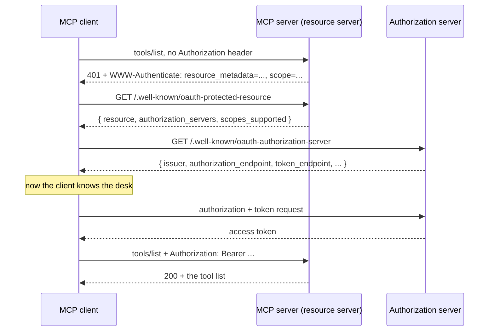

# 1.2 — The refusal that carries directions

## One-line answer

A protected MCP server answers an unauthenticated request with `401` **and a `WWW-Authenticate`
header naming the document that says where to go next** — so the client discovers its
authorization server from the refusal itself, without being configured with it in advance.

## The story

You drive into a car park you have never used before. There is no attendant. The barrier is down.

You press the button and nothing rises. What comes out instead is a small printed slip. It does not
say "no". It says: *pay at the machine by the lift, then return with this slip.*

That slip is the whole reason you are not stuck. A barrier that just stayed down would have taught
you nothing — you would sit there with the engine running, reverse out, and go somewhere else. A
barrier that prints directions has turned a refusal into the first step of the process. You did not
need to know, before you arrived, where the payment machine was. The refusal told you.

And notice what the slip does *not* contain. It is not a ticket that lets you out. It is not money.
It is an address and an instruction, and it is useless to anybody who is not standing at this
barrier.

## The idea in plain language

When an MCP client makes an HTTP request to a protected MCP server without a valid token, the
server does not simply say no. It returns the HTTP status **401 Unauthorized** together with a
header called **`WWW-Authenticate`**, and that header carries the address of a small JSON document
describing what this server is and which authorization server issues tokens for it.

Three new terms, defined before they are used.

**`WWW-Authenticate`** is a standard HTTP response header. It has existed since the earliest days of
HTTP for exactly this purpose: a server that refuses a request uses it to say what kind of
credential it wanted. MCP uses the `Bearer` scheme from it — the same word from
[1.1](1.1-the-badge-the-desk-and-the-door.md), meaning *whoever bears this string gets in*.

**Protected Resource Metadata** is the JSON document the header points at. It is standardised as
*OAuth 2.0 Protected Resource Metadata* (`doi:10.17487/RFC9728`), published in 2025. It is served
from a fixed, predictable path — `/.well-known/oauth-protected-resource` — and it answers exactly
one question: *who issues tokens for this thing?* The MCP specification is blunt about it: MCP
servers **MUST** implement it, and MCP clients **MUST** use it for authorization server discovery.

**Scope** is a label on a permission. `tickets:read` is a scope; so is `tickets:write`. A token
carries the scopes the user agreed to give it, and a tool checks for the one it needs. Scopes are
how one token can be enough for reading and not enough for closing.

Put together, the sequence is: *ask · get refused with an address · read the document at that
address · go and get a token · ask again with the token*. The client starts knowing only the MCP
server's URL. Everything else it learns from the refusal.

There is a second refusal that looks similar and means something entirely different, and mixing
them up is the most common client bug in this area. **401 means "I do not know who you are".
403 means "I know exactly who you are, and no".** The specification tabulates three:

| Status | Description | When |
| --- | --- | --- |
| 401 | Unauthorized | Authorization required, or the token is invalid |
| 403 | Forbidden | Invalid scopes or insufficient permissions |
| 400 | Bad Request | Malformed authorization request |

A 403 also carries `WWW-Authenticate`, but with `error="insufficient_scope"` and the scopes the
operation actually needs. That is not a rejection of your identity. It is a shopping list.

## Why Sutra needs it

Because Sutra's client must not be configured with an authorization server URL, and today is the
day you decide that.

[Day 33](../../../day-33-client-and-transports/) built `sutra/mcp/client.py` with `connect_stdio`
and `connect_http`. Over stdio there is no authorization at all — [1.1](1.1-the-badge-the-desk-and-the-door.md)
covered why. Over HTTP, the naive design puts an `AUTH_SERVER_URL` in `.env` beside the MCP server's
URL, and it works right up until Sutra talks to a second MCP server run by somebody else. Then there
are two authorization servers, and a configuration file cannot tell you which token goes where.

The refusal-carries-directions design removes the question. `sutra/mcp/auth.py`, which you write
today, holds a function that takes a 401 response and returns the issuer it names. One MCP server or
fifty, the client learns each one's desk from that server's own refusal.

You meet this again on [Day 44](../../../day-44-client-hardening/), where retry logic has to know
that a 401 is worth one retry after a fresh token and a 403 is worth none at all. A client that
retries a 403 by re-authorizing gets the same token back and loops.

## The mechanism

Two functions: one that builds the challenge a server sends, and one that returns the document the
challenge points at.

```python
# days/day-37-auth-and-elicitation/lab/challenge.py  (extract)
RESOURCE = "https://mcp.sutra.example/mcp"  # the canonical URI of this MCP server
ISSUER = "https://auth.sutra.example"  # the authorization server that mints tokens for it


def challenge(scopes: list[str], error: str | None = None) -> str:
    """Build the WWW-Authenticate header value an unauthorised MCP server returns."""
    parts = ['Bearer resource_metadata="' + RESOURCE + '/.well-known/oauth-protected-resource"']
    if error is not None:
        parts.append(f'error="{error}"')
    parts.append('scope="' + " ".join(scopes) + '"')
    return ", ".join(parts)


def protected_resource_metadata() -> dict[str, object]:
    """The RFC 9728 document the challenge points at - the client's only map."""
    return {
        "resource": RESOURCE,
        "authorization_servers": [ISSUER],
        "scopes_supported": ["tickets:read"],
        "bearer_methods_supported": ["header"],
    }
```

**Line by line:**

- `RESOURCE` is the server's **canonical URI**, and it is a specific thing rather than "the URL you
  happen to have typed". The specification defines it as the resource identifier from *Resource
  Indicators for OAuth 2.0*: it has a scheme, it has no fragment, and the guidance is to use the most
  specific form you can and to leave the trailing slash off. `https://mcp.sutra.example/mcp` is
  valid; `mcp.sutra.example` is not, because it has no scheme.
- `parts` starts with the scheme name `Bearer` and the `resource_metadata` parameter glued together,
  because `WWW-Authenticate` is *scheme first, then comma-separated parameters*. Putting
  `resource_metadata` in a separate list element would emit `Bearer, resource_metadata=…`, which is
  not the grammar and which some HTTP clients will refuse to parse.
- The metadata URL is built by appending `/.well-known/oauth-protected-resource` to the resource
  URI. `.well-known` is a reserved path prefix for exactly this kind of "ask a server about itself"
  document, so it never collides with a real route.
- `error` is optional and defaults to `None` because the 401 case has no error code — there was no
  token, so nothing was wrong with one. The 403 case passes `insufficient_scope`. Building both from
  one function is deliberate: the two headers differ by one parameter, and writing them as two
  unrelated string literals is how they drift apart.
- `scope` is a **space-separated** list inside one quoted value, not a repeated parameter. That is
  the OAuth convention and it catches people out; `scope="a" scope="b"` is wrong.
- `protected_resource_metadata` returns a plain dict rather than a class because it is a document,
  not behaviour. `authorization_servers` is a **list** — a resource may name more than one desk, and
  the client picks. That plural is the reason section 2 exists.
- `scopes_supported` is described by the specification as the **minimal** set needed for basic
  functionality, not everything the server can do. Extra permissions are asked for later, when a
  403 says which ones are missing.
- `bearer_methods_supported: ["header"]` says the token goes in the `Authorization` header and
  nowhere else. Tokens **MUST NOT** be put in the URI query string, because query strings end up in
  access logs, browser history and referrer headers.

Run it:

```bash
python days/day-37-auth-and-elicitation/lab/challenge.py
```

**Line by line:**

- From the repository root. **Zero generations.** Nothing here talks to a network; it prints the two
  headers and the document.

Measured on 2026-09-04:

```text
no token at all ->
  HTTP/1.1 401 Unauthorized
  WWW-Authenticate: Bearer resource_metadata="https://mcp.sutra.example/mcp/.well-known/oauth-protected-resource", scope="tickets:read"

token present, scope too narrow ->
  HTTP/1.1 403 Forbidden
  WWW-Authenticate: Bearer resource_metadata="https://mcp.sutra.example/mcp/.well-known/oauth-protected-resource", error="insufficient_scope", scope="tickets:write"

the document that header points at:
  resource                    https://mcp.sutra.example/mcp
  authorization_servers       ['https://auth.sutra.example']
  scopes_supported            ['tickets:read']
  bearer_methods_supported    ['header']

hops the client needs to find the desk: 1 (the 401 itself carried the address)
```

The whole discovery sequence, with the parts that are refusals marked:



Note that the client asks the *MCP server* for the metadata document, and then asks the
*authorization server* for its own metadata separately. Two well-known documents, from two different
hosts, answering two different questions: *who issues tokens for you?* and *where are your
endpoints?*

## When it breaks

The break that wastes the most time is a 401 with no directions on it at all:

```text
HTTP/1.1 401 Unauthorized
content-type: application/json

{"error":"invalid_token"}
```

There is no `WWW-Authenticate` header. The client now knows it is unauthorised and has no idea what
to do about it, so it does the only thing it can: it gives up. In the pinned SDK this surfaces as
the client's discovery helper returning nothing, because
`extract_resource_metadata_from_www_auth` reads the header and there is no header to read. Verified
on 2026-09-04 in `.venv/Lib/site-packages/mcp/client/auth/utils.py`, `mcp==1.29.1`. The fix is on the
server: a resource server that returns 401 without `WWW-Authenticate` has told the client to leave.

The second break is the 401/403 confusion, and it is quiet because it looks like a retry loop rather
than an error:

```text
HTTP/1.1 403 Forbidden
WWW-Authenticate: Bearer error="insufficient_scope", scope="tickets:write", resource_metadata="https://mcp.sutra.example/mcp/.well-known/oauth-protected-resource"
```

A client that treats every 4xx with `WWW-Authenticate` as "go and authorize again" will start a full
authorization flow, request the same scopes it already has, receive the same token, retry, and get
403 again. Nothing errors. The user sees a spinner. The fix is to read the status code *before* the
header: 403 means ask for **more scopes**, computed as the union of what you already had and what
the challenge names, and it means give up after a small number of attempts.

The third break is a client that goes looking for the metadata document at the wrong place. The
specification's discovery order, per SEP-985, is: the `resource_metadata` value from the header
first; then the path-based well-known URI `/.well-known/oauth-protected-resource/{path}`; then the
root-based one. A client that only ever tries the root form will fail against any server hosted at a
sub-path — which is most of them, because `https://example.com/mcp` is the normal shape.

## In production

**What a professional writes instead:** not two functions, but one middleware and one small parser.
On the server side the pinned SDK already has it: `mcp.server.auth.middleware.bearer_auth` holds
`RequireAuthMiddleware`, which takes a `resource_metadata_url` and builds the `WWW-Authenticate`
value itself, and `BearerAuthBackend`, which wraps a `TokenVerifier`. Verified on 2026-09-04 in
`.venv/Lib/site-packages/mcp/server/auth/middleware/bearer_auth.py`, `mcp==1.29.1`. On the client
side `sutra/mcp/auth.py` gets a `discover_issuer(response) -> str | None` that reads the header and
returns the address. Neither side hand-builds the string in more than one place.

**What degrades at scale:** the discovery round trips. Every cold client start now costs a 401, a
metadata fetch from the resource server, and a metadata fetch from the authorization server, before
the first useful request. Under a burst of new client processes — a serverless function that starts
fresh per invocation, say — those three requests multiply. The answer is to cache both metadata
documents by URL, honouring their HTTP cache headers, and to keep the cache across the token
refresh rather than tying it to the token's lifetime. The trade is the same one
[Day 32 taught about cached tool lists](../../../day-32-mcp-stateless-core/parts/03-headers-and-caches/3.3-lists-you-may-keep.md):
for as long as you cache, you can be pointing at a desk the server has stopped using.

**The failure mode that only appears with real traffic:** the thundering 401. When an authorization
server rotates its signing key and every token in flight becomes invalid at once, every client gets
a 401 in the same second and every one of them starts a discovery-plus-authorization flow
simultaneously. The authorization server, which was sized for a steady trickle of new sessions,
falls over — and now nobody can get a token, so the retries continue. Jittered backoff on the
re-authorization path is not optional at that scale, and it belongs in
[Day 44](../../../day-44-client-hardening/)'s hardening module rather than in this one.

**The review comment a senior engineer leaves:** *"`sutra/mcp/auth.py` reads `AUTH_SERVER_URL` from
the environment. Delete that variable. The server tells us its issuer in the 401 — if we hard-code
it, we have made a configuration file the authority on a security decision, and the day we add a
second MCP server it will be wrong for one of them silently."*

**The interview question:** *"how does an MCP client find out which authorization server to use?"*
The honest answer: *"it doesn't know in advance and it shouldn't. It sends the request without a
token, gets a 401, and reads the `resource_metadata` parameter out of the `WWW-Authenticate` header.
That points at the server's Protected Resource Metadata document — RFC 9728 — whose
`authorization_servers` field names the issuer. Then it fetches the authorization server's own
metadata for the endpoints. We deliberately do not configure the issuer, because a client that talks
to more than one MCP server would need one setting per server and would eventually use the wrong
one. The subtlety I'd flag is 401 versus 403: 401 means get a token, 403 means `insufficient_scope`
and get a **wider** token, and a client that conflates them re-authorizes in a loop with the same
scopes and never terminates."*

## Check yourself

```bash
python days/day-37-auth-and-elicitation/lab/challenge.py
```

Add a third case to `main`: a request that is malformed rather than unauthorised. Decide which of
the three status codes it gets, and whether it carries a `WWW-Authenticate` header at all. Then
change `authorization_servers` to hold two issuers, and write down — in a comment, in
`challenge.py` — how the client is supposed to pick one. That question is section 2's subject and
your answer to it is worth writing before you read the answer.

**Out loud, without scrolling up:** what is the difference between a 401 and a 403 here, and what
does a client do differently in each case?

**Next:** [1.3 — A voucher for one shop](1.3-a-voucher-for-one-shop.md).
