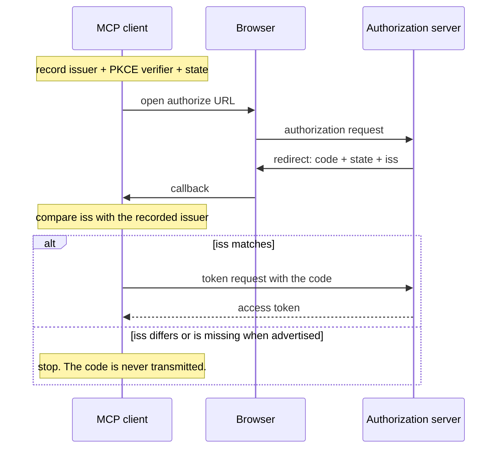

# 2.1 — Which desk actually answered

## One-line answer

An authorization response that does not say **which** authorization server produced it can be
redirected to the wrong one — so the response carries an `iss` parameter, and the client compares it
against the issuer it recorded **before** it sent the user off, and stops if they differ.

## The story

You post a form to your insurer and wait for the confirmation.

A text message arrives a day later. *Your claim reference is 4471. Reply with your policy number to
confirm.* No brand name, no logo, nothing in it that says which company sent it — just a reference
and an instruction.

The awkward part is that you hold policies with two insurers, and both of them use the same
call-centre operator. You have had messages from both, and they look identical, because they are
generated by the same system in the same building. So you cannot tell, from this message, which
company is asking. You could reply with the wrong policy number to the wrong company, and it would
be handled by a person who was expecting it.

Nothing here is forged. The message is real, the operator is real, both companies are real. The only
missing thing is a single line saying *this is from us* — and without it, you have no way to check
that the answer came from the place you wrote to.

## The idea in plain language

The vulnerability this part is about is called a **mix-up attack**, and it needs three ingredients:
a client that can talk to more than one authorization server, an attacker who can influence which
one the flow starts at, and an authorization response that does not identify its sender.

Here is the sequence in plain words.

1. Your client is steered into starting an authorization flow at authorization server **B**, which
   the attacker controls. It records B as the desk it is dealing with.
2. B does not authenticate anybody. It forwards the browser to the honest authorization server
   **A**, where you really do log in, with your real credentials.
3. A issues a genuine **authorization code** — a short string that can be exchanged for a token —
   and sends the browser back to your client's redirect address with it.
4. Your client is now holding a real code from A while believing it is talking to B. So it does the
   natural thing: it posts the code to **B's** token endpoint.
5. The attacker now holds a valid authorization code minted by A, for you, and can redeem it.

Read step 4 again, because that is the whole attack. The client did not get tricked into accepting a
fake token. It got tricked into **handing a real one to the wrong recipient**, because nothing in the
response told it which server had answered.

The fix is one parameter. The authorization server adds `iss` — its own issuer identifier — to the
redirect it sends back. The client, which recorded the expected issuer before opening the browser,
compares the two. If they differ, it stops **before** transmitting the code anywhere.

The MCP specification tabulates exactly when a client must reject, and there is a subtlety in it
that people get wrong:

| Server advertises `iss` support | `iss` in the response | Client action |
| --- | --- | --- |
| `true` | present | Compare against the recorded issuer |
| `true` | absent | **Reject the response** |
| `false` or absent | present | Compare against the recorded issuer |
| `false` or absent | absent | Proceed |

The third row is the one people leave out. A server that emits `iss` without having updated its
metadata still gets its `iss` checked. The specification is explicit that this is a deliberate local
policy choice, to accommodate servers that emit the parameter before they advertise it. The rule
worth memorising is: **if the parameter is there, it is checked, always.**

Two more facts that ride along.

**It applies to error responses too.** If the `iss` does not match, the client **MUST NOT** act on or
display `error`, `error_description` or `error_uri`. An attacker who can control the error text you
show the user has a phishing channel, and it is closed by the same comparison.

**The advertisement flag has a name.** An authorization server that includes `iss` **MUST** declare
`authorization_response_iss_parameter_supported: true` in its metadata — the same metadata document
the client already fetched in [1.2](../01-the-badge/1.2-the-refusal-that-carries-directions.md).

## Why Sutra needs it

Because Sutra is heading for exactly the shape mix-up attacks require: more than one MCP server, and
therefore more than one authorization server.

[Day 32 taught the registry](../../../day-32-mcp-stateless-core/parts/04-governance-and-registry/4.2-the-registry-queried-live.md):
Sutra will connect to servers it did not write, discovered from a list. [1.2](../01-the-badge/1.2-the-refusal-that-carries-directions.md)
established that each of those servers names its own issuer in its own metadata. Put those two
together and `sutra/mcp/auth.py` is a client that holds credentials for several desks at once —
which is the first ingredient. The second, an attacker influencing which desk you start at, arrives
the moment a server URL comes from anywhere but your own hands.

So the function you write today has a specific shape: the recorded issuer travels with the PKCE code
verifier and the `state` value, in one per-request record, and it is checked before the token request
is built. Not after. Not "if it looks wrong". Before.

You meet the same idea again on [Day 40](../../../day-40-filtering-and-allowlists/), where the
question moves up a level: not *which desk answered* but *which servers are we willing to talk to at
all*. And [Day 45](../../../day-45-the-mcp-audit/)'s audit will look for this check by name.

## The paper behind it

> **OAuth 2.0 Authorization Server Issuer Identification** · `doi:10.17487/RFC9207` · 2022 ·
> `https://www.rfc-editor.org/rfc/rfc9207`

It argued that an authorization response must identify the authorization server that produced it,
and specified the `iss` parameter and the client-side comparison that closes the mix-up attack class.

Read it after the parts: [`papers/01-issuer-identification.md`](../../papers/01-issuer-identification.md).

## The mechanism

The four-row table above, written as a function, with the parameter extracted the only way it is
allowed to be extracted.

```python
# days/day-37-auth-and-elicitation/lab/iss_check.py  (extract)
EXPECTED_ISSUER = "https://auth.sutra.example"  # recorded BEFORE the browser was opened


def issuer_of(response_url: str) -> str | None:
    """Pull the iss parameter out of a redirect, form-decoded, and nothing else."""
    query = parse_qs(urlparse(response_url).query)
    values = query.get("iss")
    return values[0] if values else None


def act(returned: str | None, advertised: bool, expected: str = EXPECTED_ISSUER) -> str:
    """Apply RFC 9207 section 2.4 as the MCP specification tabulates it."""
    if returned is not None:
        # Simple string comparison. No normalisation of any kind - see compare.py.
        return "redeem" if returned == expected else "reject: issuer mismatch"
    if advertised:
        return "reject: iss absent from a server that advertises it"
    return "redeem"
```

**Line by line:**

- The comment on `EXPECTED_ISSUER` is load-bearing, not decoration. The whole protection depends on
  the expected value being recorded **before** the user-agent left, from the authorization server's
  own validated metadata document. An expected issuer read back from the response, or from an
  unvalidated source, protects against nothing — you would be comparing a string to itself.
- `urlparse(...).query` then `parse_qs` is the pair that form-decodes correctly. The authorization
  response is `application/x-www-form-urlencoded`, so `%3A%2F%2F` has to become `://` before any
  comparison. `parse_qs` does that decode for you, which is exactly the decode RFC 9207 permits — and
  the *only* transformation it permits.
- `parse_qs` returns a dict of **lists**, because a query string may legally repeat a key. Taking
  `values[0]` is the deliberate choice to look at the first one. A response with two `iss` parameters
  is malformed, and a stricter implementation would reject it outright rather than pick; that is a
  reasonable thing to argue for in review.
- `returned: str | None` and `advertised: bool` are two separate inputs because the table has two
  separate axes. Folding them into one truthy value is how the third row disappears.
- The `if returned is not None` branch comes **first**, and that ordering *is* the third row. Presence
  of the parameter decides the comparison, regardless of what the metadata claimed. Test the
  `advertised` flag first and you will write `if advertised and returned: compare`, which silently
  skips the check for exactly the servers that are ahead of their own documentation.
- `return "redeem" if returned == expected else ...` — `==` on two strings and nothing else. Not
  `startswith`, not `.lower()`, not `urlparse` comparison. [2.2](2.2-the-comparison-that-must-not-be-helpful.md)
  is the whole argument for that austerity.
- `act` returns a string verdict rather than raising. That is a teaching choice: it lets all five
  cases print in one table. In `sutra/mcp/auth.py` the real function raises, because a mismatch must
  not be something a caller can accidentally ignore by not reading a return value.

Run it:

```bash
python days/day-37-auth-and-elicitation/lab/iss_check.py; echo "exit: $?"
```

**Line by line:**

- From the repository root. The exit code is the number of authorization codes this client would
  hand to the wrong desk, so **0 is the pass** and any other number is a hole. **Zero generations.**

Measured on 2026-09-04:

```text
advertised, iss present and right       https://auth.sutra.example      redeem
advertised, iss present and wrong       https://evil.example            reject: issuer mismatch
advertised, iss absent                  -                               reject: iss absent from a server that advertises it
not advertised, iss present and wrong   https://evil.example            reject: issuer mismatch
not advertised, iss absent              -                               redeem

authorization codes this client would hand to the wrong desk: 0
exit: 0
```

Where the check sits in the flow, with the point of no return marked:



The `alt` block is the mechanism. Everything to the left of the token request is recoverable;
everything to the right of it has already happened.

## When it breaks

The break you want is a client that refuses and says so:

```text
mcp.client.auth.exceptions.OAuthFlowError: issuer 'https://evil.example' is not the recorded issuer 'https://auth.sutra.example'
```

`OAuthFlowError` is a real exception class in the pinned SDK — verified on 2026-09-04 in
`.venv/Lib/site-packages/mcp/client/auth/exceptions.py`, `mcp==1.29.1` — but **the SDK does not
raise it for this**. There is no `iss` handling in `mcp/client/auth/oauth2.py` at all:
[6.2](../06-in-production/6.2-the-tray-the-driver-cannot-see.md) reads that off the installed package
and says what to do about it. The message above is what *your* code must produce.

The break you do not want has no text, because nothing went wrong from the client's point of view:

```text
iss check: OFF
recorded issuer before opening the browser : http://127.0.0.1:8872
authorization response came back with iss  : http://127.0.0.1:8871
client posted the code to                  : http://127.0.0.1:8872/token

attacker holds an honest authorization code: True ['honest-code-4521']
token requests sent                        : 1
```

That is the paper demo with the check switched off, run on 2026-09-04. The client got a token. The
user logged in successfully. The attacker got the code. No exception, no log line, no HTTP error —
the flow completed. This is the failure that motivates the entire section, and
[the paper part](../../papers/01-issuer-identification.md) runs it both ways.

The third break is subtler and is the reason the third table row exists. An authorization server
upgrades, starts emitting `iss`, and has not yet republished its metadata. A client written as
*"check `iss` only when `authorization_response_iss_parameter_supported` is true"* now receives the
parameter and ignores it. There is no error. The protection is simply absent for that server, for as
long as its metadata lags.

## In production

**What a professional writes instead:** the recorded issuer is not a module-level constant. It is a
field on the same short-lived per-authorization record that already holds the PKCE `code_verifier`
and the `state` value, keyed by `state`, with a short expiry, and it is read back by looking up the
`state` returned in the callback. Recording it anywhere else — a global, a session dict, the last
value seen — reintroduces the bug the moment two authorization flows overlap, which they will, because
a user with two MCP servers configured will authorize both while making a cup of tea.

**What degrades at scale:** nothing in the comparison, which is one string equality. What degrades is
the *record*. Per-flow records with no expiry are an unbounded table; per-flow records in process
memory are lost when the client restarts mid-flow, and the user sees an authorization that silently
never completes. The production shape is a small keyed store with a TTL measured in a few hundred
seconds and an explicit "this authorization expired, start again" message rather than a hang.

**The failure mode that only appears with real traffic:** interoperability, not attack. Some
authorization servers emit `iss` with a trailing slash where their metadata's `issuer` has none, or
serve metadata from a host that differs in case. A strict comparison rejects them — correctly, per the
specification, which forbids normalising — and your users see authorization failures against one
particular identity provider. The fix is never to loosen the comparison; it is to record the issuer
from the *validated metadata document* and to raise the discrepancy with the provider, because a
server whose `iss` disagrees with its own `issuer` metadata has a bug that affects every client.

**The review comment a senior engineer leaves:** *"the `iss` comparison happens after
`exchange_code_for_token`. Move it above. The point of this check is that the code is never
transmitted to the wrong endpoint — checking afterwards tells us we were attacked, which is a
different and much less useful thing."*

**The interview question:** *"what is a mix-up attack and what stops it?"* The spoken answer:
*"it needs a client that talks to more than one authorization server. The attacker gets you to start
the flow at their server, forwards you to the real one so you genuinely log in, and the real server's
code comes back to your client — which then posts that code to the attacker's token endpoint, because
nothing in the response said who sent it. RFC 9207 adds an `iss` parameter to the authorization
response and requires the client to compare it against the issuer it recorded before opening the
browser, before the code is transmitted anywhere. The detail I'd want to get right is that you check
`iss` whenever it is present, even if the server's metadata does not advertise support — servers
roll the parameter out before the metadata catches up, and a client keyed only on the advertisement
skips the check for exactly those servers. And it applies to error responses too: on a mismatch you
must not even display the error text, because that is a phishing surface."*

## Check yourself

```bash
python days/day-37-auth-and-elicitation/lab/iss_check.py; echo "exit: $?"
```

Change `act` so that the `advertised` flag is tested first — `if advertised and returned is not
None:` — and run it again. Note which row's verdict flips and what the exit code becomes. Put it
back. Then add a sixth case: a response that carries `iss` **twice**, with two different values.
Decide what `issuer_of` should do about it, and write the decision down.

**Out loud, without scrolling up:** why does the client compare `iss` *before* it sends the
authorization code anywhere, rather than after?

**Next:** [2.2 — The comparison that must not be helpful](2.2-the-comparison-that-must-not-be-helpful.md).
