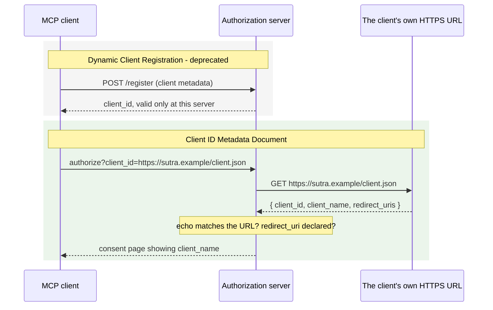

# 2.3 — The menu you host yourself

## One-line answer

A client's identity is no longer something it registers at every authorization server it meets — its
`client_id` **is an HTTPS URL it controls**, serving a small JSON document the server fetches and
checks, which is why Dynamic Client Registration is now deprecated.

## The story

You run a small food shop and you have just signed up to your fourth delivery app.

Each one wanted the menu typed into its own dashboard. Four dashboards, four sets of prices, four
descriptions of the same three curries. When you change a price you change it four times, and by the
end of the month one of them is always wrong — usually the one the customer is looking at.

The alternative you eventually work out is embarrassingly simple. You put the menu on your own web
page, one file, and give each app the address. They read it. When you change a price you change it
once, on the page you own, and every app sees the new price the next time it looks.

Nothing about your relationship with the four apps changed. What changed is who holds the document.
It used to be four copies in four places that could drift apart; now it is one thing you control, and
everybody else reads it.

## The idea in plain language

Before an OAuth client can start an authorization flow it needs a **client identifier** — a string
the authorization server recognises, so it can show the user a consent screen saying *this
application wants access* and can check that the address it is redirecting back to is one the client
actually declared.

There have historically been two ways to get one. **Pre-registration** means a human created the
client in the authorization server's console and handed you an identifier. That works when the two
parties know each other. **Dynamic Client Registration** — specified in RFC 7591 — means the client
sends a POST to a `/register` endpoint and the server mints an identifier on the spot. That was
built for exactly MCP's situation, where a client and a server have never met.

Dynamic Client Registration has three problems that only show up at MCP's scale. It is a **write**
endpoint open to strangers, so it accumulates junk registrations and needs rate limiting and
cleanup. The identifier it returns is **specific to one authorization server**, so a client talking
to five servers is five different clients. And the server learns nothing about who is registering,
because anybody can POST anything.

The 2026 answer is **Client ID Metadata Documents**, usually shortened to CIMD. The idea is one
sentence: **the `client_id` is an HTTPS URL, and fetching that URL returns the client's metadata.**

```json
{
  "client_id": "https://app.example.com/oauth/client-metadata.json",
  "client_name": "Example MCP Client",
  "client_uri": "https://app.example.com",
  "redirect_uris": [
    "http://127.0.0.1:3000/callback",
    "http://localhost:3000/callback"
  ],
  "grant_types": ["authorization_code"],
  "response_types": ["code"],
  "token_endpoint_auth_method": "none"
}
```

That is the example from the specification, unchanged. The rules around it are short.

**For the client.** The document is hosted at an HTTPS URL with a path component — `https://example.com/client.json`, never a bare domain. It must include at least `client_id`, `client_name` and `redirect_uris`. And the `client_id` value inside the document must match the URL it was fetched from **exactly**.

**For the authorization server.** When it sees a URL-shaped `client_id` it fetches it, validates that the document's `client_id` matches the URL, validates that the `redirect_uri` in the authorization request is in the document's list, validates the JSON structure, and caches the result honouring HTTP cache headers.

**Advertising it.** A server that supports this publishes `client_id_metadata_document_supported: true` in its authorization server metadata.

**The priority order**, for a client that supports everything: pre-registered credentials if you have them → CIMD if the server advertises it → Dynamic Client Registration as a fallback → ask the human. And the specification now carries a warning on Dynamic Client Registration: *deprecated; new implementations should use Client ID Metadata Documents.*

The echo check is the part worth understanding rather than memorising. Why must the document's
`client_id` equal the URL? Because without it, anybody could host a document at
`https://evil.example/meta.json` whose body claims to be `https://sutra.example/client.json` — and a
server that trusted the body over the fetch address would attribute the registration to the wrong
party. **The URL is the identity. The document is only what that identity says about itself.**

There is one more consequence that reads like a footnote and is not. Credentials from
pre-registration or Dynamic Client Registration must be keyed to the issuing authorization server and
**must not** be reused at another one. CIMD identifiers have no such problem — they are self-hosted
URLs resolved on demand, so they are portable across every authorization server without
re-registration. That is the delivery-app menu: one document, many readers.

## Why Sutra needs it

Because `sutra/mcp/auth.py` has to decide, today, how Sutra introduces itself — and the naive answer
creates a registration for every server Sutra ever touches.

[Day 33](../../../day-33-client-and-transports/) built a client that connects to servers by URL, and
[Day 32](../../../day-32-mcp-stateless-core/parts/04-governance-and-registry/4.2-the-registry-queried-live.md)
showed those URLs coming from a registry. Sutra is precisely the "no prior relationship" case CIMD
was designed for. With Dynamic Client Registration, connecting to ten servers means ten POSTs to ten
`/register` endpoints and ten stored client identifiers keyed by issuer, each of which must be
invalidated if that server's authorization server changes. With CIMD it means one JSON file and the
same `client_id` everywhere.

The practical instruction for today: `sutra/mcp/auth.py` holds the client's `client_id` as a single
constant — the HTTPS URL of Sutra's own metadata document — and a function that checks the
authorization server's metadata for `client_id_metadata_document_supported` before using it. Where
that document is actually hosted is a real deployment question and it is left as a `TODO(me)` in the
hub's build brief, because it depends on where Sutra ends up running.

You meet the priority order again on [Day 43](../../../day-43-stateless-by-default/), when Sutra's
own server has to decide what it accepts from strangers.

## The mechanism

The authorization server's side of the deal: four checks, run on a document it just fetched.

```python
# days/day-37-auth-and-elicitation/lab/cimd.py  (extract)
REQUIRED = ("client_id", "client_name", "redirect_uris")


def validate(url: str, document: dict[str, object], redirect_uri: str) -> list[str]:
    """Run the authorization server's side of CIMD. Returns a list of findings; empty is a pass."""
    findings: list[str] = []
    parsed = urlparse(url)
    if parsed.scheme != "https":
        findings.append(f"client_id scheme is {parsed.scheme!r}, not 'https'")
    if parsed.path in ("", "/"):
        findings.append("client_id URL has no path component")
    missing = [key for key in REQUIRED if key not in document]
    if missing:
        findings.append(f"metadata document is missing {missing}")
    if document.get("client_id") != url:
        findings.append(
            f"client_id in the document is {document.get('client_id')!r}, "
            "not the URL it was fetched from"
        )
    uris = document.get("redirect_uris")
    if not isinstance(uris, list) or redirect_uri not in uris:
        findings.append(f"redirect_uri {redirect_uri!r} is not in the document's redirect_uris")
    return findings
```

**Line by line:**

- `validate` takes `url` and `document` as **separate arguments**, and that separation is the whole
  security property. If the function took only the document, it could not perform the echo check at
  all — it would have no independent notion of where the document came from. Any refactor that
  collapses them has removed the protection.
- `parsed.scheme != "https"` is checked rather than assumed. A `client_id` of
  `http://sutra.example/client.json` would be fetched over a channel anybody on the path can rewrite,
  which turns the identity document into whatever the attacker wants it to say.
- `parsed.path in ("", "/")` enforces the "must contain a path component" rule. The reason is
  ownership granularity: a bare domain as an identifier means anybody who can serve anything at that
  domain is that client. Requiring a path means the identity is a specific file, and a specific file
  is something a specific team controls.
- `REQUIRED` is a tuple, not a list, because the required set is fixed by the specification and
  nothing in the program should be able to append to it. The check reports **all** missing keys at
  once, rather than returning on the first, so an implementer fixing their document gets the whole
  list in one round trip.
- `document.get("client_id") != url` is the echo check, and it is the line the whole part is about.
  `.get` rather than `[...]` because a missing key is already reported by the `REQUIRED` check, and
  a `KeyError` here would hide the more useful finding behind a traceback.
- The comparison is `!=` on plain strings, for the same reason as
  [2.2](2.2-the-comparison-that-must-not-be-helpful.md). A `client_id` that is *nearly* the fetch URL
  is not the fetch URL.
- `isinstance(uris, list)` before the `in` test, because `redirect_uri in "some string"` is a
  substring test that silently succeeds. A document whose `redirect_uris` is a bare string rather
  than an array would otherwise pass, and would accept any redirect that happened to be a substring
  of it.
- `validate` returns findings rather than raising, so all four failure modes can be printed side by
  side. In a real authorization server the response is an OAuth error — `invalid_client` or
  `invalid_request` — and the user sees a consent page that never appears.

Run it:

```bash
python days/day-37-auth-and-elicitation/lab/cimd.py
```

**Line by line:**

- From the repository root. **Zero generations, and no network** — the "fetch" is a dict literal, so
  the checks can be exercised without hosting anything.

Measured on 2026-09-04:

```text
honest client            -> findings: 0
forged client_id echo    -> findings: 1
    client_id in the document is 'https://sutra.example/oauth/client-metadata.json', not the URL it was fetched from
undeclared redirect_uri  -> findings: 1
    redirect_uri 'https://evil.example/steal' is not in the document's redirect_uris

registration write requests to the authorization server: 0
```

The last line is the arithmetic that makes the case. Ten MCP servers, ten authorization servers,
**zero** registration writes — against ten POSTs and ten stored identifiers under the old scheme.

The two flows side by side:



The direction of the arrow between the client and its metadata is the whole change. Under
registration the client **pushes** its identity to each server; under CIMD each server **pulls** it
from the one place the client controls.

## When it breaks

The first break is the echo check firing, and the error is an OAuth error rather than an HTTP one:

```text
HTTP/1.1 400 Bad Request
content-type: application/json

{"error":"invalid_client","error_description":"client_id in metadata document does not match the URL it was fetched from"}
```

`invalid_client` is the code for *I do not accept this client identity*, and it is a 400 — a
malformed authorization request, per [1.2](../01-the-badge/1.2-the-refusal-that-carries-directions.md)'s
status table. The user never reaches a consent page.

The second break is the one that will actually happen to you, and it has nothing to do with attacks:

```text
mcp.client.auth.exceptions.OAuthRegistrationError: client_metadata_url must be a valid HTTPS URL with a non-root pathname, got: https://sutra.example
```

That is the pinned SDK refusing a `client_id` with no path. `OAuthRegistrationError` and the
validation helper `is_valid_client_metadata_url` are both real in `mcp==1.29.1` — verified on
2026-09-04 in `.venv/Lib/site-packages/mcp/client/auth/oauth2.py` and
`.venv/Lib/site-packages/mcp/client/auth/utils.py`. The SDK checks the URL shape before the flow
starts, which is the right place for it.

The third break has no message and is the deployment trap. Your metadata document is served with
`Cache-Control: max-age=86400`, you change a `redirect_uri`, and authorization servers keep the old
document for a day. Users get `invalid_request` on the new redirect and nothing in your logs says
why, because the failure is in somebody else's cache. Changing a `redirect_uri` is therefore two
deployments: publish the document containing **both** the old and the new URI, wait out the cache
lifetime, then remove the old one. That is the same two-deployment shape
[Day 32 taught for removing a cached tool](../../../day-32-mcp-stateless-core/parts/03-headers-and-caches/3.3-lists-you-may-keep.md).

## In production

**What a professional writes instead:** the client does not choose CIMD unconditionally. It
implements the priority order — pre-registered credentials first if configured, then CIMD if the
authorization server's metadata says `client_id_metadata_document_supported`, then Dynamic Client
Registration if a `registration_endpoint` exists, then prompt. The pinned SDK models exactly this:
`should_use_client_metadata_url(oauth_metadata, client_metadata_url)` decides, and the fallback is
built in. Verified on 2026-09-04 in `.venv/Lib/site-packages/mcp/client/auth/oauth2.py`,
`mcp==1.29.1`. Hard-coding one mechanism means the first authorization server that does not support
it is an outage.

**What degrades at scale:** the metadata endpoint becomes a dependency of everybody else's login. Every
authorization server that has never seen your `client_id`, or whose cache has expired, fetches that
URL during a user's authorization. It must be static, fast, cacheable and never behind the same
infrastructure that is down when you are having an incident — a plain object store with a CDN in
front of it is the right kind of boring. Serve it with a long, honest `Cache-Control` and treat
changes to it as releases.

**The failure mode that only appears with real traffic:** localhost redirect URIs. The example
document declares both `http://127.0.0.1:3000/callback` and `http://localhost:3000/callback` because
different platforms resolve the loopback differently, and a document declaring only one of them fails
for half your users on a machine-dependent basis. The port is the other half of the problem: a
desktop client that binds an ephemeral port cannot declare it in advance, so it must either fix the
port and handle it being busy, or declare a range — and the specification's own example fixes the
port, which tells you which trade-off the field settled on.

**The review comment a senior engineer leaves:** *"we're POSTing to `/register` on every cold start.
Every one of those creates a client the authorization server now has to store forever, and the id we
get back only works at that one server. Check `client_id_metadata_document_supported` first and use
our metadata URL — DCR is deprecated and should be the third thing we try, not the first."*

**The interview question:** *"how does an MCP client that has never met a server get an OAuth client
id?"* The spoken answer: *"three ways, in priority order. Pre-registered credentials if we have them,
which we usually don't for a server we discovered from a registry. Then Client ID Metadata
Documents, which is the 2026 default: our `client_id` is literally an HTTPS URL we control, serving a
small JSON document with `client_id`, `client_name` and `redirect_uris`, and the authorization server
fetches it and checks the `client_id` inside equals the URL it fetched from. That echo check is the
important bit — the URL is the identity, the document is just what that identity claims. Then Dynamic
Client Registration as a fallback, which is now formally deprecated. The practical win is portability:
a CIMD identifier works at every authorization server without registering anywhere, whereas
registration-based credentials are keyed to one issuer and must never be replayed at another."*

## Check yourself

```bash
python days/day-37-auth-and-elicitation/lab/cimd.py
```

Break the echo check — change `document.get("client_id") != url` to compare only the hostnames — and
run it again. Confirm the forged case now reports `findings: 0`, and say in one sentence what an
attacker gains. Put it back. Then decide where Sutra's own metadata document will actually be hosted,
and write the URL down; the hub's build brief has a `TODO(me)` waiting for that answer.

**Out loud, without scrolling up:** why must the `client_id` inside the metadata document equal the
URL the document was fetched from?

**Next:** [3.1 — The job that stopped and left a number](../03-the-question/3.1-the-job-that-stopped-and-left-a-number.md).
