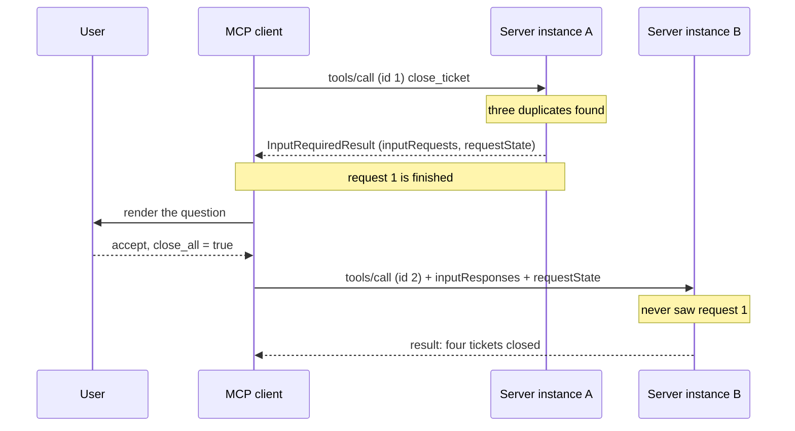

# 3.1 — The job that stopped and left a number

## One-line answer

A server that needs a human answer mid-call cannot interrupt you — it **ends the call** with a
result that says *input required*, carrying the question and an opaque slip, and you get the answer
and **call again** as a brand new request.

## The story

A plumber is replacing a tap in your kitchen. You have gone back to work in the other room.

Halfway through, he finds that the pipe behind the wall is a size nobody uses any more. He has two
options and they cost different amounts, and he cannot pick for you.

The old way of handling this is that he comes and finds you. He stands in the doorway with the
spanner still in his hand, the job half open, water off, and waits while you think about it. Nothing
moves until you answer. If you have stepped out, he waits anyway.

The new way is that he packs up, leaves a note on the counter with the two options and a job number,
and goes to his next call. You read the note, decide, and ring the number. A plumber — maybe him,
maybe a colleague — comes back with your answer written on the job sheet and finishes it.

The second version feels worse for about five seconds and is better for everything else. Nobody
stands in a doorway holding a spanner. Two jobs happen instead of one. And crucially, the person who
comes back does not have to be the person who left, because everything they need is written on the
sheet.

## The idea in plain language

**Elicitation** is a server asking the *human* a question in the middle of doing something. Not the
model, not the client's programmer — the person. *"This ticket has three duplicates. Close all four
together?"*

Until the 2026-07-28 revision, servers asked by sending a request **to** the client, mid-call, over
a connection both sides were holding open. The client answered on the same connection and the tool
carried on. That is the plumber in the doorway, and it needs a held call, which
[Day 32 explained is exactly what this revision deleted](../../../day-32-mcp-stateless-core/parts/02-the-reframe/2.1-the-call-that-remembered-you.md).

The replacement is a pattern with a name: **Multi Round-Trip Requests**, or **MRTR**. It is worth
learning as a shape rather than as a feature, because three separate things now ride on it. The
specification is blunt about the break: servers **MUST** send server-to-client requests using MRTR,
and the previous pattern of server-initiated requests *is no longer supported*. It calls it a
breaking change in its own note.

The shape is four steps.

1. The client sends a request — a `tools/call`, say.
2. The server realises it needs something a human has to supply. Instead of a result, it answers
   with an **`InputRequiredResult`**: a result whose `resultType` is `"input_required"`, carrying an
   **`inputRequests`** map of questions and an opaque **`requestState`** string. **The original
   request is now finished.** It got a response. It is not pending.
3. The client gets the answers from the user and **retries the original request** — same method,
   same arguments — with an **`inputResponses`** map attached and the `requestState` echoed back
   exactly. The JSON-RPC `id` **must** be different, because this is a different request.
4. The server, finding the answers enclosed, completes. Or asks again, which is allowed.

Three details that people get wrong on first reading.

**`inputRequests` is a map, not a list.** The keys are identifiers the server picks and must keep
unique within one response; the values are the requests. The client answers by returning a map with
**the same keys**. That is how the server knows which answer belongs to which question when it asked
two.

**Only three client requests may receive an `InputRequiredResult`:** `prompts/get`,
`resources/read` and `tools/call`. Anything else, the specification says servers **MUST NOT**.

**`requestState` is opaque to the client.** Clients **MUST NOT** inspect, parse, modify or make any
assumption about its contents, and if the result carried one, the retry **MUST** echo the exact
value. If it did not, the retry **MUST NOT** invent one. [3.4](3.4-the-docket-you-cannot-write-yourself.md)
is about what the server puts in it and why it has to be signed.

The reason the whole pattern exists is in one sentence of the specification, and it is the same
sentence as [Day 32's](../../../day-32-mcp-stateless-core/parts/02-the-reframe/2.2-three-instances-one-url.md):
this handles server-to-client requests *without requiring a shared storage layer across server
instances or requiring stateful load balancing.* The retry can land on a different instance. That is
the whole point.

## Why Sutra needs it

Because Sutra is about to grow a tool that changes something, and a tool that changes something needs
a way to ask.

Everything `sutra_mcp` serves so far reads: [Day 34's](../../../day-34-building-sutra-mcp-tools/)
`lookup_ticket` and `search_kb`, [Day 35's](../../../day-35-resources-and-prompts/) resources. A
read tool that guesses wrong wastes a request. A write tool that guesses wrong closes a customer's
ticket. The moment Sutra grows `close_ticket`, "should I also close the three duplicates?" is a
question only the person at the desk can answer, and it is not a question that can be answered when
the tool was *called*, because nobody knew about the duplicates until the tool went and looked.

The MRTR shape is also how [Day 38](../../../day-38-failure-and-migration-lab/) migrates the three
deprecated client features. Roots, Sampling and Logging were all server-initiated requests; all three
are formally deprecated, and `InputRequiredResult` is what replaces the mechanism underneath them. So
learning this shape once buys you tomorrow's day as well.

And it constrains today's design. `sutra_mcp/auth.py`, which you write today, cannot hold a
"pending question" dictionary keyed by request. If it does, the retry landing on a second instance
finds nothing, and you have rebuilt sticky sessions inside your own process.

## The mechanism

The whole answer a server sends when it needs a human, built by one function:

```python
# days/day-37-auth-and-elicitation/lab/elicit_form.py  (extract)
def ask_before_closing(ticket_id: str, duplicates: int, state: str) -> dict[str, object]:
    """The whole answer a server sends when it needs a human before it will act."""
    return {
        "resultType": "input_required",
        "inputRequests": {
            "close_duplicates": {
                "method": "elicitation/create",
                "params": {
                    "mode": "form",
                    "message": (
                        f"Ticket {ticket_id} has {duplicates} duplicates. "
                        "Close all of them together?"
                    ),
                    "requestedSchema": {
                        "type": "object",
                        "properties": {
                            "close_all": {
                                "type": "boolean",
                                "title": "Close duplicates too",
                                "default": False,
                            },
                            "reason": {
                                "type": "string",
                                "title": "Closing note",
                                "maxLength": 200,
                            },
                        },
                        "required": ["close_all"],
                    },
                },
            }
        },
        "requestState": state,
    }
```

**Line by line:**

- The function returns a **result**, not an error. That is the single most important thing about this
  shape and the thing most likely to be got wrong: `input_required` is a successful JSON-RPC
  response. The client is not in a failure path. `resultType: "input_required"` is the discriminator
  that tells it to look for questions instead of content.
- `inputRequests` is a dict whose one key is `"close_duplicates"`. The key is chosen by the server
  and means nothing outside this exchange — the specification calls it a server-assigned identifier,
  unique within this response. The client will return an answer under that same key.
- The value is a whole request object: `method` plus `params`. `elicitation/create` is the method
  name that has always meant *ask the user*. What changed in 2026-07-28 is only where it travels —
  inside a result rather than as a request of its own.
- `"mode": "form"` is stated explicitly even though the specification allows omitting it, because
  omitting it means *form* by default and a reader of your server's code should not have to know
  that. The other mode is `url`, and it is [4.1](../04-out-of-band/4.1-the-link-you-check-before-you-click.md)'s
  subject.
- `message` is the sentence a human reads. It names the ticket and the number of duplicates, because
  the person answering has no other context — they are being interrupted, and the question has to
  stand alone.
- `requestedSchema` describes the shape of the answer. Its restrictions are strict enough to need
  their own part; [3.2](3.2-a-form-the-till-can-print.md) is that part.
- `"default": False` on `close_all` matters more than it looks. Clients that support defaults
  **SHOULD** pre-populate the form with them, so the default is what a user gets by pressing the
  obvious button. Defaulting a destructive option to `True` is how a confirmation dialogue becomes a
  rubber stamp — Principle 13, in one JSON field.
- `"required": ["close_all"]` and *not* `reason`. The boolean is the decision; the note is optional.
  A schema that requires everything turns a confirmation into a form-filling exercise, and people
  answer forms by typing anything.
- `state` is passed **in** rather than generated here, because minting it needs a signing key and a
  principal, and a function that builds a JSON shape should not also be doing cryptography. Keeping
  them apart is what makes [3.4](3.4-the-docket-you-cannot-write-yourself.md) a separate module in
  `sutra_mcp/auth.py` rather than an inline detail.

Run it:

```bash
python days/day-37-auth-and-elicitation/lab/elicit_form.py
```

**Line by line:**

- From the repository root. **Zero generations, no network.** It prints the JSON-RPC response a
  compliant server would send, then lints the schema.

Measured on 2026-09-04:

```text
{
  "jsonrpc": "2.0",
  "id": 1,
  "result": {
    "resultType": "input_required",
    "inputRequests": {
      "close_duplicates": {
        "method": "elicitation/create",
        "params": {
          "mode": "form",
          "message": "Ticket 4521 has 3 duplicates. Close all of them together?",
          "requestedSchema": {
            "type": "object",
            "properties": {
              "close_all": {
                "type": "boolean",
                "title": "Close duplicates too",
                "default": false
              },
              "reason": {
                "type": "string",
                "title": "Closing note",
                "maxLength": 200
              }
            },
            "required": [
              "close_all"
            ]
          }
        }
      }
    },
    "requestState": "v1.eyJ1c2VyIjoidS0xIn0"
  }
}
```

And the retry the client sends back, which is an ordinary `tools/call` with two extra fields:

```json
{
  "jsonrpc": "2.0",
  "id": 2,
  "method": "tools/call",
  "params": {
    "name": "close_ticket",
    "arguments": { "ticket_id": "4521" },
    "inputResponses": {
      "close_duplicates": { "action": "accept", "content": { "close_all": true } }
    },
    "requestState": "v1.eyJ1c2VyIjoidS0xIn0"
  }
}
```

Compare the two `id` values. `1` and `2`, because these are two independent requests and the first
one is over. Compare the two keys named `close_duplicates`. That pairing is the only thing linking
the answer to the question.

The whole exchange:



Instance B answers a question instance A asked. It works because everything B needs arrived in the
request — the arguments, the answer, and the state — which is
[Day 32's state-in-the-payload rule](../../../day-32-mcp-stateless-core/parts/03-headers-and-caches/3.4-state-that-travels-in-the-payload.md)
applied to a conversation with a human.

## When it breaks

The break you meet first is a client that has never heard of this shape:

```text
Traceback (most recent call last):
  File "sutra/mcp/client.py", line 88, in call_tool
    return result["content"]
           ~~~~~~^^^^^^^^^^^
KeyError: 'content'
```

The response was a success. There is no error object. There is simply no `content`, because the
result was an `InputRequiredResult` and the client went looking for a tool result. Every MCP client
written before this revision produces some version of that `KeyError`, and the fix is to branch on
`resultType` before touching anything else.

The second break is the retry that forgets the state:

```text
{"jsonrpc":"2.0","id":2,"error":{"code":-32602,"message":"Invalid params: requestState is required for this call"}}
```

`-32602` is JSON-RPC's *invalid params*. The client answered the question and dropped the slip, so
the server has the answer and no idea what it was an answer to. The rule is mechanical: if the result
carried `requestState`, the retry echoes it **exactly**; if it did not, the retry must not include
one.

The third break has no error text and is the one that will cost you an afternoon. The client retries
with the same JSON-RPC `id` as the original request. Some servers accept it, some pipelines dedupe
it as a repeat, and the symptom is a tool that works when you test it slowly and silently does
nothing under load. The specification states it plainly: the `id` **MUST** be different between the
initial request and the retry, as they are independent requests.

## In production

**What a professional writes instead:** the server code does not build this dict at all. In the
pinned SDK the tool body calls `ctx.elicit(message, schema)` and receives back an
`AcceptedElicitation`, `DeclinedElicitation` or `CancelledElicitation` — verified on 2026-09-04 in
`.venv/Lib/site-packages/mcp/server/fastmcp/server.py` and
`.venv/Lib/site-packages/mcp/server/elicitation.py`, `mcp==1.29.1`. The catch is that this SDK
implements the **2025-11-25** carriage, where `elicitation/create` is a server-initiated request, not
the MRTR carriage above; [6.2](../06-in-production/6.2-the-tray-the-driver-cannot-see.md) measures
exactly which half is present. So the shape you learn here is the wire, and the API you type today
is one revision behind it.

**What degrades at scale:** the number of round trips. Each question costs a full request cycle plus
however long a human takes, and a tool that asks two questions in sequence costs three cycles. The
fix is in the protocol's own shape: `inputRequests` is a **map**, so ask everything you need in one
response and get one map of answers back. A server that discovers its questions one at a time is a
server whose tool needs restructuring.

**The failure mode that only appears with real traffic:** the abandoned question. Servers **MUST NOT**
assume that clients will fulfil the requests or retry at all. A human closes the tab; the retry never
comes. If your server allocated anything when it asked — a row, a lock, a reserved identifier — it is
now orphaned, and the leak is proportional to how often people close tabs, which is often. This is
why the specification pushes state into `requestState` rather than into the server: state that never
existed cannot leak.

**The review comment a senior engineer leaves:** *"`close_ticket` stores the pending question in a
module-level `PENDING` dict keyed by ticket id. That is a session, and we deleted sessions in this
protocol for a reason — the retry will land on another instance and find an empty dict. Everything the
retry needs goes in `requestState`, signed. Also: the dict never shrinks."*

**The interview question:** *"a tool needs to ask the user something halfway through. How does that
work?"* The honest answer: *"since the 2026-07-28 revision it does not interrupt — servers can't send
requests to clients any more, that pattern was removed and it's called out as a breaking change.
Instead the server returns a normal successful result whose `resultType` is `input_required`, carrying
an `inputRequests` map of questions keyed by server-chosen identifiers, plus an opaque `requestState`.
That response *ends* the original request. The client renders the question, gets an answer, and
re-sends the same call with a new JSON-RPC id, an `inputResponses` map under the same keys, and the
`requestState` echoed verbatim. The reason for the ceremony is that the retry can land on a different
instance — everything the second instance needs came in the request, so there's no shared session
store and no sticky routing. It's the same pattern that replaces the deprecated Roots, Sampling and
Logging features."*

## Check yourself

```bash
python days/day-37-auth-and-elicitation/lab/elicit_form.py
```

Add a second entry to `inputRequests` — a question asking which queue the ticket should be filed
under — and write out, by hand, the `inputResponses` map the client would send back for both. Then
say what happens if the client answers only one of the two, and find the sentence in the
specification that says so.

**Out loud, without scrolling up:** after the server returns `input_required`, is the original
request still open? What has to be different about the request the client sends next?

**Next:** [3.2 — A form the till can print](3.2-a-form-the-till-can-print.md).
