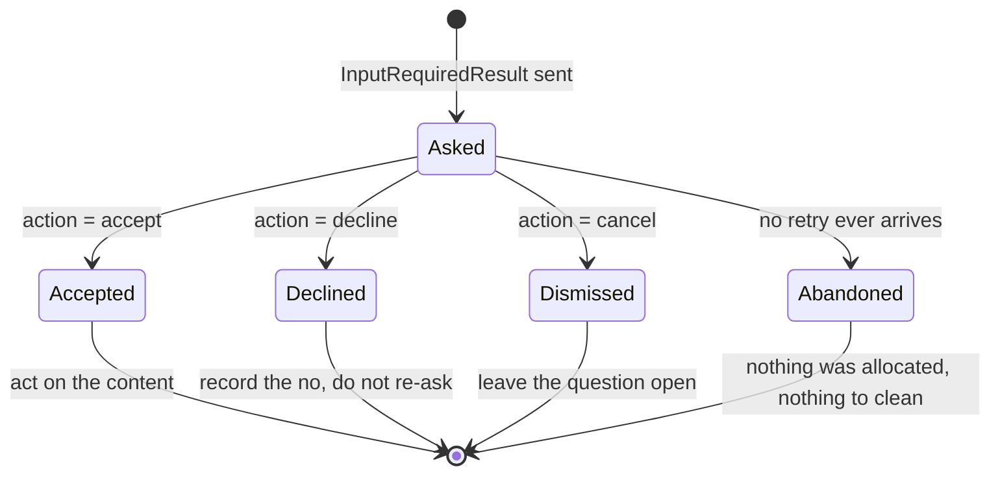

# 3.3 — Three answers, not two

## One-line answer

A user can **accept**, **decline** or **cancel**, and those are three different facts about the
world — a server that folds the last two together cannot tell "no" from "not now", and will keep
asking a person who has already said no.

## The story

Somebody knocks on your door with a clipboard.

Three things can happen. You open the door and answer their questions. You open the door and say
*no thank you, I'm not interested*. Or you look through the window, decide you cannot face it, and
do not open the door at all.

For the person with the clipboard, the second and third are completely different. The one who said
no goes on the list of houses not to call at again. The one who did not answer goes on the list to
try on a different evening, because they were probably out.

Treat them the same and you get one of two bad outcomes. Either you never go back to anyone who was
simply out, and you lose half the street — or you keep knocking at the door of somebody who told you,
to your face, that they were not interested. The second one is how a clipboard becomes a complaint.

## The idea in plain language

Every elicitation answer carries an `action` field, and it has exactly three legal values.

| Action | What the user did | What it means for the server |
| --- | --- | --- |
| `accept` | Explicitly approved and submitted | Process the submitted data |
| `decline` | Explicitly declined the request | Handle the refusal — offer alternatives |
| `cancel` | Dismissed without an explicit choice | Handle dismissal — prompt again later |

The specification's own examples of each are worth keeping: *accept* is clicking Submit, OK or
Confirm; *decline* is clicking Reject, Decline or No; *cancel* is closing the dialogue, clicking
outside it, pressing Escape, or the browser failing to load.

Three consequences follow.

**`content` only comes back on `accept`, and only in form mode.** On `decline` and `cancel` the field
is typically omitted. On URL mode it is omitted even on accept, because there was no form —
[4.1](../04-out-of-band/4.1-the-link-you-check-before-you-click.md) covers why.

**The three actions apply to both modes.** In URL mode, `accept` means *the user consented to open
the link*. It does not mean the thing at the other end of the link happened.

**Servers must handle all three.** The specification puts it as: servers **SHOULD NOT** assume that
elicitation requests will always succeed, and **MUST** handle cases where the user declines or
cancels, or where the client fails to process the request.

The design reason for splitting decline from cancel is that they carry opposite information about
the *future*. A decline is a decision: this user, asked this question, said no, and asking again is
at best noise and at worst harassment. A cancel is an absence of a decision: the dialogue went away
before anyone chose, so the question is still open and asking again later is the helpful thing to do.
Fold them into one "not accepted" branch and you must pick one behaviour for both, and whichever you
pick is wrong half the time.

There is a fourth case that is not an action: the client never comes back at all. No retry, no
answer, nothing. Servers **MUST NOT** assume the client will retry. That is not `cancel` — `cancel`
is a message the client bothered to send. Silence is the absence of any message, and the only
correct handling for it is to have allocated nothing that needs cleaning up.

## Why Sutra needs it

Because the first version of `close_ticket` will have an `if` with two branches, and it will be
wrong in a way nobody notices for weeks.

The natural code is `if answer["action"] == "accept": ... else: return "cancelled"`. It compiles, it
passes review, and it produces this behaviour: a support agent who explicitly declines to close the
duplicates gets asked again the next time they touch that ticket, and the time after that, because
the server recorded "no answer" rather than "no". The agent's experience is a tool that nags. Nothing
errors. There is no bug report, only a quiet decision to stop using the tool.

`sutra_mcp/auth.py` is where the three-way handling belongs as a shared helper rather than as an `if`
inside each tool, for the same reason the audience check does: a branch written per tool is a branch
missing from one tool.

You meet the distinction again in Phase 9, on the approval-gate day, where a human's *no* has to be
durable and auditable rather than a value in a dict. The shape you choose today is the shape that
day inherits.

## The mechanism

Two servers, given the same four answers.

```python
# days/day-37-auth-and-elicitation/lab/actions.py  (extract)
def naive(answer: dict[str, object]) -> str:
    """Treats anything that is not an explicit accept as a user who said no."""
    if answer.get("action") == "accept":
        content = answer.get("content") or {}
        return "close all four" if content.get("close_all") else "close one"
    return "give up silently"


def correct(answer: dict[str, object]) -> str:
    """Handles all three, because the specification says a server MUST."""
    action = answer.get("action")
    if action == "accept":
        content = answer.get("content") or {}
        return "close all four" if content.get("close_all") else "close one"
    if action == "decline":
        return "report: the user said no, do not ask again for this ticket"
    if action == "cancel":
        return "report: the user did not answer, offer the question again later"
    return "reject: unknown action"
```

**Line by line:**

- `naive` is not a straw man. It is the shortest correct-looking implementation, and the `else` reads
  as thorough — every path is handled, nothing falls through. That is exactly why it survives review.
- `answer.get("content") or {}` handles two different absences with one expression: the key missing,
  and the key present with a `null` value. `answer.get("content", {})` would only handle the first,
  and an explicit `null` would then blow up on `.get`. Both shapes occur, because "typically omitted"
  is not "always omitted".
- `content.get("close_all")` rather than `content["close_all"]`, because the schema marked it
  `required` but the client is a stranger's program. [3.2](3.2-a-form-the-till-can-print.md)'s third
  break was exactly this: an accept whose content is missing the field you needed. A missing key here
  yields `None`, which is falsy, which means **close one** — the safe direction. That is deliberate:
  when a destructive option's answer is absent, the absence must resolve to the smaller action.
- `correct` tests the three actions as three separate `if`s rather than a chain ending in `else`.
  The final `return "reject: unknown action"` is what an `else` would have swallowed. A future
  revision that adds a fourth action, or a buggy client that sends `"accepted"`, lands there and is
  refused instead of being silently treated as one of the three.
- The decline branch says *do not ask again for this ticket*, which implies the server writes
  something down. That is a real design consequence: honouring a decline durably needs somewhere to
  put it, and [3.4](3.4-the-docket-you-cannot-write-yourself.md) plus
  [Day 47](../../../day-47-persistent-sessions/) are where that lands. Saying it in the return string
  keeps the obligation visible rather than pretending three branches are free.
- Neither function raises. A tool that raises on a decline turns a user's legitimate "no" into an
  error in your monitoring, and your error rate now measures how often people disagree with you.

Run it:

```bash
python days/day-37-auth-and-elicitation/lab/actions.py; echo "exit: $?"
```

**Line by line:**

- From the repository root. The exit code is the number of distinct user intentions the naive server
  cannot tell apart. **Zero generations.**

Measured on 2026-09-04:

```text
answer      meant             naive server              correct server
------------------------------------------------------------------------------------------------------------
accept      close all four    close all four            close all four
accept      close one         close one                 close one
decline     no                give up silently          report: the user said no, do not ask again for this ticket
cancel      no answer yet     give up silently          report: the user did not answer, offer the question again later

user answers the naive server cannot tell apart: 1
exit: 1
```

Two rows in the naive column read `give up silently` and they came from opposite intentions. The
count of `1` is the honest measurement of the loss: one distinct user intention has become
unrepresentable.

The state machine the correct server implements:



`Abandoned` has no incoming message. It is the state you reach by the client saying nothing, and the
only reason it is safe is that the server allocated nothing when it asked.

## When it breaks

The break with an error message is the unknown action:

```text
{"jsonrpc":"2.0","id":2,"error":{"code":-32602,"message":"Invalid params: inputResponses.close_duplicates.action must be one of accept, decline, cancel"}}
```

`-32602` again — invalid params. That is what `correct`'s final branch becomes on the wire. A client
sending `"action": "yes"` gets told exactly what the legal values are, which is the difference
between a bug somebody can fix in a minute and one they file.

The break without an error message is the one this part exists for. Run the lab with `correct`
replaced by `naive` and the only visible difference is a line of output. In a real deployment the
visible difference is a support agent saying *"it keeps asking me the same thing"*, months later, in
a conversation that will not be traced back to a missing `elif`.

The third break is the abandoned retry. There is nothing to show, because nothing is sent. What you
would see is a slow accumulation in whatever the server allocated at question time — rows in a
`pending_elicitations` table, entries in a dict, reserved identifiers — none of which is ever
collected, because collection was going to happen on the retry. The tell is a table that only grows
and whose growth rate correlates with usage rather than with completed work.

## In production

**What a professional writes instead:** a match on the action that returns a typed object, and no
default branch that silently means "no". The pinned SDK gives exactly this shape:
`AcceptedElicitation[T]`, `DeclinedElicitation` and `CancelledElicitation` are three distinct classes
in a union, so `result.data` exists only on the accepted one and the type checker will not let you
reach for it on the others. Verified on 2026-09-04 in
`.venv/Lib/site-packages/mcp/server/elicitation.py`, `mcp==1.29.1`. Three classes rather than a
string field is the language doing the enforcement the specification asks for.

**What degrades at scale:** the cost of honouring a decline. "Do not ask again" needs storage keyed
by user and by question, and that storage has a retention question attached: does a no last for this
ticket, this session, this week, or for ever? Every answer is defensible and the wrong ones are
expensive — for ever means a user can never change their mind, and this session means the nagging
comes back tomorrow. Write the answer down as policy, per question, and treat it as data rather than
as an `if`. [Day 48](../../../day-48-memory-design/) is where that becomes a module.

**The failure mode that only appears with real traffic:** cancel storms. Some clients emit `cancel`
when a request times out on their side, when the window loses focus, or when the user navigates away.
A server that treats every cancel as "ask again later" and is called in a retry loop will re-ask
immediately, get cancelled again, and produce a tight loop of questions nobody sees. Rate-limit the
re-ask, per user per question, and be able to say what the limit is.

**The review comment a senior engineer leaves:** *"the `else` here treats decline and cancel the
same. They aren't the same — one is a decision and one is an absence of one. Split them, and say in
the decline branch where the 'no' is written down, because 'do not ask again' is a storage
requirement pretending to be a comment."*

**The interview question:** *"an elicitation comes back. What are the possible answers?"* The answer
that shows you have handled all of them: *"three actions — accept, decline, cancel — plus a fourth
non-answer, which is the client never retrying at all. Accept carries `content` matching the schema,
in form mode only. Decline is an explicit no; cancel is the dialogue going away without a choice, and
they mean opposite things about the future — decline means stop asking, cancel means the question is
still open. A server that folds them into one branch either nags people who said no or forgets people
who were simply interrupted. And the fourth case is why you allocate nothing when you ask: if the
retry never arrives, there's nothing to clean up."*

## Check yourself

```bash
python days/day-37-auth-and-elicitation/lab/actions.py; echo "exit: $?"
```

Add a fifth answer: `{"action": "accept"}` with no `content` at all. Predict what both servers do
before you run it, then run it. Then decide, for Sutra specifically, how long a `decline` on
"close the duplicates too" should last — this ticket, this day, or for ever — and write the answer in
a comment beside the decline branch.

**Out loud, without scrolling up:** what is the difference between `decline` and `cancel`, and what
does each one tell the server about whether to ask again?

**Next:** [3.4 — The docket you cannot write yourself](3.4-the-docket-you-cannot-write-yourself.md).
