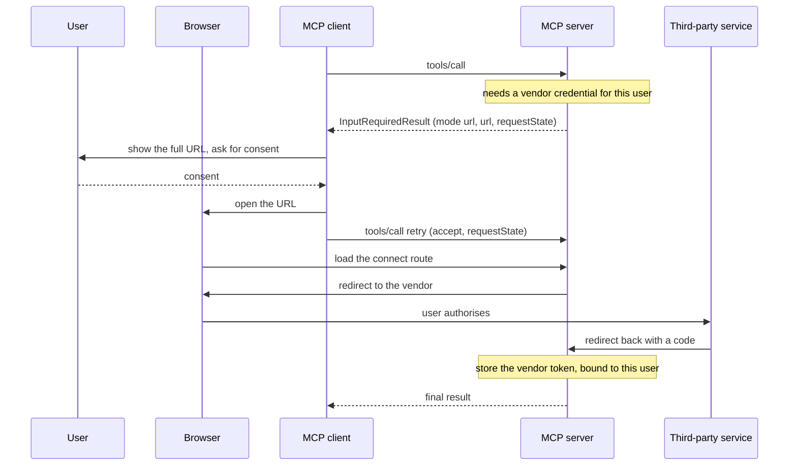

# 4.1 — The link you check before you click

## One-line answer

When the answer must not pass through the client at all, the server sends a **URL** instead of a
form — and the client's job shrinks to showing the full address, getting explicit consent, and
opening it somewhere it cannot watch.

## The story

A message arrives on your phone. *Your parcel could not be delivered. Confirm your address:* and a
link.

You have been expecting a parcel. The message is plausible. And you do the thing everybody has
learned to do, which is to look at the address before you touch it — not the words in the message,
the address itself. Where does it actually go? Is the bit before the first single slash the company
you think it is, or is the company's name sitting in the middle of somebody else's domain?

Half the time it is fine. The other half, the domain is wrong in a way that is obvious once you look
and invisible if you do not. And the reason you have to look yourself is that nobody else can look
for you: the phone cannot know which parcels you are expecting, and the message will always claim to
be from someone you trust.

## The idea in plain language

Form mode ([3.2](../03-the-question/3.2-a-form-the-till-can-print.md)) collects the answer through
the client: the client draws the form, the user types into it, the client sends the values back. That
means the client — and anything the client shows to a model, and anything the client logs — sees
every value.

**URL mode** exists for the answers where that is unacceptable. Instead of a schema, the server sends
a URL and a message. The user goes to that page in a browser, does whatever needs doing there, and
the client never sees any of it.

The request shape is small:

```json
{
  "method": "elicitation/create",
  "params": {
    "mode": "url",
    "url": "https://mcp.example.com/ui/set_api_key",
    "message": "Please provide your API key to continue."
  }
}
```

And the answer is smaller:

```json
{ "action": "accept" }
```

`accept` here means **the user consented to open the link**. It does not mean the interaction
finished. The specification is explicit: the interaction occurs out of band and the client is not
directly informed of the outcome. When the client retries the original request, the server works out
from the echoed `requestState`, or from its own stored state, whether the out-of-band work is done —
and either returns the final result or sends *another* `InputRequiredResult`.

Two rule sets come with this mode, and they are separate because they bind different parties.

**What a server must not put in the URL.** It **MUST NOT** include sensitive information about the
end user — credentials, personally identifying information. It **MUST NOT** provide a URL that is
pre-authenticated to access a protected resource, because a malicious client could use it to
impersonate the user. It **SHOULD NOT** put clickable URLs in any field of a *form* mode request. And
it **SHOULD** use HTTPS outside development.

**What a client must do with the URL.** This is the list Sutra will be audited against on
[Day 45](../../../day-45-the-mcp-audit/):

1. **MUST NOT** automatically pre-fetch the URL or any of its metadata.
2. **MUST NOT** open it without explicit consent from the user.
3. **MUST** show the full URL to the user for examination before consent.
4. **MUST** open it in a way that does not let the client or the model inspect the content or the
   user's input.
5. **SHOULD** highlight the domain, to mitigate subdomain spoofing.
6. **SHOULD** warn about ambiguous or suspicious URIs — the specification names Punycode.
7. **SHOULD NOT** render URLs as clickable anywhere else in an elicitation request.

Rule 1 is the one that surprises people. Why can a client not fetch the page to show a preview? Because
fetching *is* an action. A URL that starts a flow, consumes a one-time token or triggers a side effect
has already happened by the time you render the preview, and the user never consented to anything.

Rule 4 is the one with teeth, and the specification gives platform examples: on iOS, a Safari view
controller is acceptable and an embedded web view is not — because the embedded one is a window the
host application can read.

One thing URL mode is explicitly **not** for: authorising the MCP client's access to the MCP server.
That is ordinary MCP authorization, section 1's subject. URL mode is for the server getting something
*it* needs on the user's behalf — most often third-party authorization, where the MCP server is
acting as an OAuth client to somebody else's API. In that arrangement the server is a resource server
to your client and a client to the third party at the same time, and the specification names three
requirements: the third-party credentials **MUST NOT** transit the MCP client, the server **MUST NOT**
use the client's credentials at the third party (that is the token passthrough
[1.3](../01-the-badge/1.3-a-voucher-for-one-shop.md) forbade), and the user **MUST** authorize the
server directly.

## Why Sutra needs it

Because Sutra's support desk will eventually need to read a vendor's status API on a user's behalf,
and there are exactly two ways to get that credential — one of which is forbidden.

The forbidden one is asking for it in a form. [4.2](4.2-the-sheet-in-the-corridor.md) is that part.
The permitted one is this: `sutra_mcp` mints a consent URL on its own domain, returns it in URL mode,
and the user completes the vendor's OAuth flow in a browser. The vendor's token comes back to
`sutra_mcp`, bound to that user's identity, and never touches Sutra's client or the model's context.

That has a consequence worth stating plainly, because it cuts against everything else in Phase 5:
**a server that does third-party authorization is stateful.** The specification says so — the MCP
server is responsible for storing and managing the third-party tokens obtained this way. Statelessness
is about *requests*, not about *never storing anything*; the tokens live in a store keyed by
subject, and the request still carries everything needed to find them.

`sutra/mcp/auth.py` gets the client half: a function that takes a URL-mode elicitation and returns the
findings a host must show the user before consent. That function is small and it is the whole of rules
3, 5 and 6.

## The mechanism

The request a server sends, and the inspection a client runs before it shows anything:

```python
# days/day-37-auth-and-elicitation/lab/url_mode.py  (extract)
TRUSTED_HOST = "mcp.sutra.example"


def inspect_link(url: str) -> list[str]:
    """The client-side rules, as findings a host must show the user before consent."""
    findings: list[str] = []
    parsed = urlparse(url)
    if parsed.scheme != "https":
        findings.append(f"scheme is {parsed.scheme!r}, not https")
    host = parsed.hostname or ""
    if "xn--" in host:
        findings.append(f"host {host!r} contains punycode")
    if host != TRUSTED_HOST and not host.endswith("." + TRUSTED_HOST):
        findings.append(f"host {host!r} is not the server you are talking to")
    if parsed.username or parsed.password:
        findings.append("URL carries embedded credentials")
    if "token=" in (parsed.query or "") or "access_token=" in (parsed.query or ""):
        findings.append("URL query looks pre-authenticated")
    return findings
```

**Line by line:**

- `inspect_link` **never fetches anything**. Every check is on the string. That is rule 1, expressed
  as an absence: there is no `requests.get`, no `urlopen`, no DNS lookup. A function that resolved the
  host to check it exists would already have leaked that the user was shown this link.
- `parsed.hostname` rather than `parsed.netloc`. `netloc` includes any `user:password@` prefix and any
  `:port` suffix, so `https://mcp.sutra.example@evil.test/` has a `netloc` starting with the trusted
  name and a `hostname` of `evil.test`. Comparing against `netloc` is a real, shipped bug class.
- `"xn--" in host` catches Punycode — the encoding that lets non-ASCII characters into a domain name.
  It is how a Cyrillic character that looks exactly like a Latin `a` gets into a hostname. The
  specification only asks for a warning, not a refusal, because plenty of legitimate international
  domains use it.
- `host != TRUSTED_HOST and not host.endswith("." + TRUSTED_HOST)` is two tests because subdomains are
  legitimate and lookalikes are not. The leading dot in `"." + TRUSTED_HOST` is essential:
  `endswith("mcp.sutra.example")` alone would accept `evilmcp.sutra.example`. This is rule 5 —
  highlight the domain — done as a comparison rather than as a colour.
- `parsed.username or parsed.password` catches the embedded-credential form. Browsers have mostly
  stopped honouring it, and it is still the oldest way to make a URL's real destination hard to read.
- The `token=` check is a blunt approximation of rule 2, *no pre-authenticated URLs*. It is not
  complete and cannot be — a server can name its parameter anything — but it catches the obvious
  case, and a check that catches the obvious case is worth more than an argument about the perfect
  one.
- `inspect_link` returns findings rather than a verdict, because **the client does not decide**. Rules
  3 and 2 together say: show the user what you found, then ask. A function that returned
  `safe: bool` would have taken the decision away from the person the whole mode exists to protect.

Run it:

```bash
python days/day-37-auth-and-elicitation/lab/url_mode.py; echo "exit: $?"
```

**Line by line:**

- From the repository root. The exit code is the number of links opened with no warning that should
  have carried one, so **0 is the pass**. **Zero generations, and — importantly — zero network
  requests**, which the script prints as a claim you can verify by reading it.

Measured on 2026-09-04:

```text
the honest one      https://mcp.sutra.example/connect?e=abc123
a lookalike host    https://mcp.sutra.example.evil.test/connect?e=abc123
                      ! host 'mcp.sutra.example.evil.test' is not the server you are talking to
punycode            https://xn--mcp-sutr-example-9lb.test/connect
                      ! host 'xn--mcp-sutr-example-9lb.test' contains punycode
                      ! host 'xn--mcp-sutr-example-9lb.test' is not the server you are talking to
plain http          http://mcp.sutra.example/connect
                      ! scheme is 'http', not https
pre-authenticated   https://mcp.sutra.example/connect?access_token=ey123
                      ! URL query looks pre-authenticated

URLs fetched by this host before consent: 0
links opened with no warning that should have carried one: 0
```

Look at the second row for a moment. `mcp.sutra.example.evil.test` contains the trusted name in full,
in the right order, at the start. Read quickly, it is the right host. It is not.

The whole flow, with the browser as a separate participant because that is exactly the point:



The client's line stops at `open the URL`. Everything the user types happens between the browser and
the two servers, on the right-hand side of the diagram, where the client has no arrow at all.

## When it breaks

The break the client reports when it will not send the question at all:

```text
{"jsonrpc":"2.0","id":2,"error":{"code":-32021,"message":"MissingRequiredClientCapability: elicitation.url"}}
```

`-32021` is `MissingRequiredClientCapability`, renumbered in this revision from `-32003` — the codes
[Day 32 tabulated](../../../day-32-mcp-stateless-core/parts/03-headers-and-caches/3.2-the-header-that-must-match.md).
A client declares its modes per request, as `elicitation: {"form": {}, "url": {}}` inside
`_meta.io.modelcontextprotocol/clientCapabilities`, and servers **MUST NOT** send a mode the client
did not declare. An empty `elicitation: {}` means form only, for backwards compatibility — so a
server that assumes URL support because elicitation was declared is wrong.

The break in the pinned SDK, which speaks the previous revision, is different and worth seeing:

```text
mcp.shared.exceptions.McpError: (-32042) URL elicitation required
```

`-32042` is `URL_ELICITATION_REQUIRED`, and it carries `ElicitationRequiredErrorData` holding a list
of `ElicitRequestURLParams`. Verified on 2026-09-04 in `.venv/Lib/site-packages/mcp/types.py` and
`.venv/Lib/site-packages/mcp/shared/exceptions.py`, `mcp==1.29.1`. That is the 2025-11-25 way of
saying the same thing — an **error**, where the 2026-07-28 revision uses a **result**. Same intent,
different carriage; [6.2](../06-in-production/6.2-the-tray-the-driver-cannot-see.md) is where that gap
gets measured rather than assumed.

The third break has no error and is the one worth fearing. A client renders the message, shows a
button labelled *Continue*, and does not show the URL — because the URL is ugly and the designer
wanted a clean dialogue. Everything works. Users click Continue. And the client has removed the only
defence the user had, which was rule 3: show the full URL for examination before consent. There is no
test for this. It is caught by reading the client, which is what
[Day 45](../../../day-45-the-mcp-audit/) is for.

## In production

**What a professional writes instead:** the seven client rules live in one function that runs on every
URL-mode elicitation, and its findings are rendered in the consent dialogue rather than logged. The
consent dialogue shows the scheme, the host in a different weight from the rest of the URL, and the
full path — not a truncated version with an ellipsis, because the ellipsis is where the attacker puts
the interesting part. On the server side, the URL points at **your own** domain, never straight at
the third party, which is what makes [4.3](4.3-the-link-that-went-to-the-wrong-person.md)'s same-user
check possible at all.

**What degrades at scale:** the waiting. The retry arrives when the client decides to send it, which
may be immediately after consent — before the user has finished at the vendor. The specification
allows for exactly this: the server may need to block until the interaction completes, or it may
return **another** `InputRequiredResult`. Blocking a request handler while a human types their
password into somebody else's site is a connection held open for an unbounded period, and at scale
that is a thread pool exhausted by people who wandered off. Returning another `input_required` and
letting the client poll is the shape that survives, and it is close cousin to
[Day 36's](../../../day-36-long-jobs-and-tasks/) task handles.

**The failure mode that only appears with real traffic:** the consent that outlives its state.
`requestState` has a TTL ([3.4](../03-the-question/3.4-the-docket-you-cannot-write-yourself.md)); a
human doing a full OAuth flow at a third party, including a password reset because they forgot it, can
easily exceed it. The retry then fails verification and the user, who did everything right and
finished successfully at the vendor, sees an error. The mitigation is a longer TTL for URL-mode state
than for form-mode state, chosen deliberately and written down, plus a server that can recover from
its own stored binding when the state has lapsed but the vendor token is present.

**The review comment a senior engineer leaves:** *"the consent dialogue shows `message` and a
Continue button. The spec requires the full URL to be shown for examination before consent, and it
requires the domain to be highlighted. Right now the only thing the user can evaluate is a sentence
the server wrote, which is exactly the thing an attacker controls. Show the URL."*

**The interview question:** *"when would you use URL mode elicitation instead of form mode?"* The
answer that shows you have thought about the boundary: *"whenever the answer must not be seen by the
client — credentials, card details, or a third-party OAuth flow where our server is acting as an
OAuth client to somebody else's API. Form mode routes the value through the client, which means the
client can log it and the model may see it. URL mode sends the user to a page on our own domain and
the client's whole job is to show the full URL, get explicit consent, and open it somewhere it can't
watch — and crucially it must not pre-fetch, because fetching is an action. The thing people get
wrong is that `accept` means the user agreed to open the link, not that the interaction finished; you
learn the outcome from your own state when the retry arrives. And the second thing: URL mode is not
how the client authorizes to us — that's ordinary MCP authorization. Mixing those up is how you end
up with a server that authenticates users through a link, which is a phishing surface."*

## Check yourself

```bash
python days/day-37-auth-and-elicitation/lab/url_mode.py; echo "exit: $?"
```

Add a sixth link whose host is `mcp.sutra.example` but whose path is `/redirect?to=https://evil.test`
— an open redirect on your own trusted domain. Confirm `inspect_link` says nothing about it, and
write down whose problem that is and where it gets fixed. Then remove the leading dot from
`"." + TRUSTED_HOST` and find the hostname that now passes.

**Out loud, without scrolling up:** name three of the seven things a client must or should do with a
URL-mode link, and say why pre-fetching is forbidden.

**Next:** [4.2 — The sheet in the corridor](4.2-the-sheet-in-the-corridor.md).
