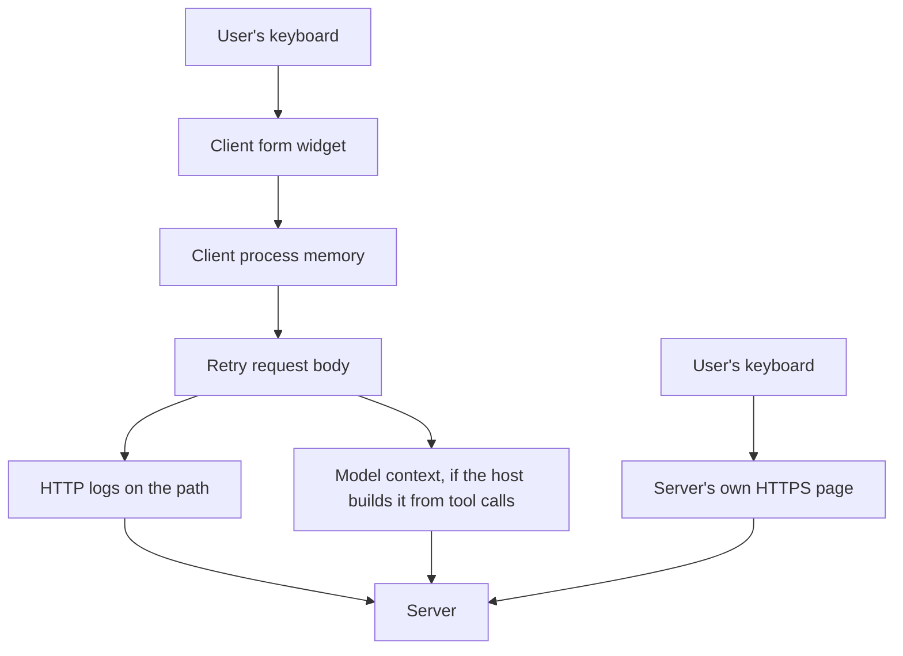

# 4.2 — 💥 The sheet in the corridor

## One-line answer

A server **MUST NOT** ask for a password, an API key, a token or a payment credential through form
mode — not because the form is insecure, but because the client, the model's context and every log
on the retry path all see what the user types into it.

## The story

The school asks parents to note down anything the staff should know about a child — an allergy, a
medicine, a family situation.

Version one is a clipboard on a table in the corridor by the front door. It is convenient. Everyone
walks past it, everyone can find it, and the office does not have to open envelopes. It works
perfectly for what it was designed for.

The problem is that everybody who walks past can also read it. Not maliciously — the person waiting
for their child glances down because it is at eye level and there is nothing else to look at. The
information is not being stolen. It is simply being seen, by everyone, all day, because of where the
form is.

Version two is a sealed envelope handed in at the office window. Slower, less convenient, and the
only thing the corridor sees is somebody carrying an envelope.

## The scene

> 🎬 **The scene:** Sutra needs a vendor's API key to read a status page on the user's behalf. You
> have just learned form mode. The design writes itself: `mode: "form"`, one string field called
> `api_key`, message *"Paste your vendor API key to continue."* It is typed, it is validated, it is
> one round trip, and the client renders it as a neat little dialogue.
>
> 😬 **The naive fix:** ship it, but mark the field `"format": "password"` so the client draws dots
> instead of characters. Now it looks secure.
>
> 💥 **Why it fails:** the dots are a rendering choice and nothing else. The value still travels as
> plain text in the `inputResponses` map of the retry request. The MCP client holds it in memory and
> may log the request body. Whatever assembles the model's context may include the tool call and its
> arguments, and models repeat their context — your key can surface in an unrelated answer three
> turns later. Every intermediary on the retry path carries it. And worst of all, you have taught
> your users that a chat window asking them to paste a credential is a normal thing that happens,
> which is precisely the lesson a phishing attack needs them to have learned.
>
> 💡 **The insight:** **a schema describes the shape of an answer; the mode decides who is allowed to
> see it.** Form mode is for answers the client may see. URL mode is for answers it must not. "The
> model might repeat it" is on its own enough to move something into the second category.

## The idea in plain language

The specification does not advise here. It forbids, in a warning block at the top of the elicitation
page:

- Servers **MUST NOT** use form mode elicitation to request sensitive information such as passwords,
  API keys, access tokens, or payment credentials.
- Servers **MUST** use URL mode for interactions involving such information.

It also draws the boundary, which is the part worth reading carefully, because "sensitive" is doing
real work: *"sensitive information" in this context refers to secrets and credentials that grant
access or authorize transactions. General contact or profile information — a name, an email address,
a username — is not categorically prohibited*, and whether to ask for it in a form is the server's
judgement, subject to the user being able to review and decline.

So the test is not *is this personal?* It is **does this grant access or authorize a transaction?**
An email address does not. An API key does. A one-time passcode does. A card number does.

The reason is the retry path. Trace where a form answer goes, in order: the user's keyboard → the
client's form widget → the client's process memory → the JSON body of the retry request → any HTTP
logging on the way → the server. In a host that builds model context from tool calls, the arguments
of that retry may also go into a prompt. Every one of those is a place a credential now exists, and
none of them was designed to hold one.

URL mode ([4.1](4.1-the-link-you-check-before-you-click.md)) removes every step but the last: the
user's keyboard → the server's own HTTPS page. The client sees a URL it consented to open and nothing
else. The specification says exactly this: the approach ensures that sensitive credentials never pass
through the LLM context, the MCP client, or any intermediate MCP servers, reducing the risk of
exposure through client-side logging or other attack vectors.

## Why Sutra needs it

Because Sutra will need a vendor credential, and the wrong version of that feature is three lines
long and looks finished.

`sutra_mcp` is going to grow a tool that reads a vendor status API — the same vendor stub
[Day 15](../../../day-15-toolsets-and-openapi/) put in front of you. A per-user key is the obvious
design, and a form is the obvious way to collect one. Nothing in the SDK stops you. Nothing in your
tests goes red. The failure is entirely a design failure, which means the only place it can be caught
is a check that runs before the request is sent.

That check belongs in `sutra_mcp/auth.py`, beside the issuer validation, for one reason: it is the
same kind of rule. Both are things the server must refuse to do, enforced in the server, before
anything leaves the process. And [Day 45's audit](../../../day-45-the-mcp-audit/) will look for it by
name.

There is a broader version of this idea waiting in Phase 9, where the combination of private data,
untrusted content and an outward channel gets a name. Today you meet its most concrete instance:
**do not put a secret on a path that a model can read.**

## The mechanism

A blunt guard that refuses a request before it is sent.

```python
# days/day-37-auth-and-elicitation/lab/credential_guard.py  (extract)
SECRET_WORDS = re.compile(
    r"\b(password|passwd|pass(phrase)?|secret|api[_ -]?key|access[_ -]?key|token|credential"
    r"|otp|pin|cvv|card[_ -]?number|private[_ -]?key|seed[_ -]?phrase)\b",
    re.I,
)


def audit(request: dict[str, object]) -> list[str]:
    """Findings against the MUST NOT. An empty list means the form may be sent."""
    params = request.get("params", {})
    if params.get("mode", "form") != "form":
        return []  # URL mode is exactly where secrets are allowed to go
    findings: list[str] = []
    message = str(params.get("message", ""))
    if SECRET_WORDS.search(message):
        findings.append(f"message names a secret: {message!r}")
    schema = params.get("requestedSchema", {})
    for name, prop in (schema.get("properties") or {}).items():
        blob = f"{name} {prop.get('title', '')} {prop.get('description', '')}"
        if SECRET_WORDS.search(blob):
            findings.append(f"field {name!r} asks for a secret")
        if isinstance(prop, dict) and prop.get("format") == "password":
            findings.append(f"field {name!r} declares format 'password'")
    return findings
```

**Line by line:**

- The regex is deliberately blunt, and the comment in the file says so: **a false positive costs a
  rename, a false negative costs a credential.** That asymmetry is the whole design argument. A
  cleverer matcher with fewer false alarms would be worse, because the cost of the two errors is not
  symmetric.
- `\b` word boundaries at both ends stop `tokenise` and `subpin` matching. Without them the guard
  becomes annoying enough that somebody deletes it, which is the real failure mode of an
  over-eager lint.
- `api[_ -]?key` with the optional separator class catches `api_key`, `apikey`, `api key` and
  `api-key` in one pattern. Field names are written in every convention there is, and listing them
  individually is how one gets missed.
- `params.get("mode", "form") != "form"` uses `"form"` as the **default**, because the specification
  says a request with no `mode` field is form mode. Defaulting to `"url"` — or treating a missing
  mode as "not form" — would let the exact request that needs checking straight through.
- The early `return []` for URL mode is not a hole. It is the point: URL mode is *where credentials
  are supposed to go*, so a guard that flagged it would be telling you to do the forbidden thing.
- `message` is checked as well as the schema, because the message is what the human reads. A form
  with a field innocently named `value` and a message saying *"paste your password"* is the same
  attack with better spelling.
- The `blob` concatenates the field name, its `title` and its `description`, and searches all three
  at once. A field named `v` with `"title": "Account password"` is caught by the title;
  [3.2](../03-the-question/3.2-a-form-the-till-can-print.md) established that `title` is what the
  client actually displays.
- `prop.get("format") == "password"` is a separate finding from the word match, because it catches
  the case where somebody avoided every banned word and still asked the client to draw dots. A field
  declaring `format: password` has admitted what it is, and — worth knowing — `password` is not one of
  the four `format` values elicitation permits anyway.
- `audit` returns findings rather than raising, so the lab can print all five cases. In
  `sutra_mcp/auth.py` a non-empty result **raises**, before the response is built, because the entire
  value of this check is that the request never leaves the process.

Run it:

```bash
python days/day-37-auth-and-elicitation/lab/credential_guard.py; echo "exit: $?"
```

**Line by line:**

- From the repository root. The exit code is the number of forbidden requests the guard let through,
  so **0 is the pass** and any other number is a credential on the wire. **Zero generations.**

Measured on 2026-09-04:

```text
close all duplicates?       send
which queue?                send
the vendor API key          REFUSE
                              message names a secret: 'Paste your vendor API key to continue.'
                              field 'api_key' asks for a secret
a friendly password box     REFUSE
                              field 'secret' asks for a secret
the same thing in URL mode  send

forbidden requests this guard let through: 0
```

The fourth case is the interesting one. Its message is *"One more detail and we are done."* — no
banned word anywhere in it — and it is still refused, because the field is called `secret` and its
title says *Account password*. The guard reads what the user will read, not what the developer meant.

Where a form answer travels, against where a URL answer travels:



Two paths to the same destination. The top one has five places a credential now exists. The bottom
one has none.

## When it breaks

The break you want is the guard refusing in your own process, before anything is sent:

```text
Traceback (most recent call last):
  File "sutra_mcp/tools.py", line 51, in fetch_vendor_status
    raise ValueError(f"forbidden elicitation: {findings}")
ValueError: forbidden elicitation: ["field 'api_key' asks for a secret"]
```

Loud, local, at the call site, naming the field. The developer fixes it in a minute and never ships
it.

The break with no error text at all is what happens without the guard. There is nothing to paste,
because the request succeeds. The user pastes their key, the tool works, and the only trace is in
places you do not read: a client's debug log, a proxy's access log with the body captured, a prompt
in a model provider's request history. The first symptom is the key being used from somewhere it
should not be, weeks later, with no way to establish how it got out.

The third break is the one the guard cannot see, and it is worth naming rather than pretending the
regex is complete. A field called `q` with the message *"Enter the code we just sent you"* asks for a
one-time passcode and matches nothing in `SECRET_WORDS`. That is a real gap. The mitigation is not a
longer regex — it is that the guard is a backstop, and the actual rule lives in review: *"does this
field grant access or authorize a transaction?"* A lint cannot answer that; it can only catch the
cases where somebody said the quiet part in the field name.

## In production

**What a professional writes instead:** the guard is one function called at the single point where
the server constructs any elicitation, not sprinkled per tool, and it raises rather than warns. Beside
it sits a test that feeds it the forbidden cases and asserts the refusal — because the guard's regex
will be softened one day by somebody with a legitimate false positive, and the test is what makes
that softening deliberate. The real fix in the same commit is the URL-mode route: a page on the
server's own domain that collects the credential, with the same-user check
[4.3](4.3-the-link-that-went-to-the-wrong-person.md) is about.

**What degrades at scale:** trust, not throughput. Every credential prompt your product shows in a
chat window makes the next phishing prompt more plausible to that user. There is no metric for it and
it does not degrade gradually — it is fine until somebody is successfully phished with a dialogue
that looked exactly like yours. The mitigation is a rule you can state to users: *this application
never asks for a password in the chat; it always sends you to a page on our domain.* You can only
state that if it is true everywhere, which is why the guard has to be central.

**The failure mode that only appears with real traffic:** log capture on the retry path. In
development nobody logs request bodies. In production somebody enables body capture at a gateway to
debug an unrelated problem, and for the hours it is on, every form answer is written to a log store
with a different retention policy and a different access list from anything you designed. If any of
those answers was a credential, it is now in a system that was never in your threat model. This is
why the rule is about the *path*, not about the *storage*.

**The review comment a senior engineer leaves:** *"this elicitation asks for the vendor API key in
form mode with `format: password`. The dots are a rendering hint — the value is plain text in the
retry body and may end up in model context. The spec's MUST NOT is explicit about API keys. This has
to be a URL-mode elicitation pointing at a page we serve, and the credential is stored bound to the
user's `sub`, never returned to the client."*

**The interview question:** *"can an MCP server ask the user for a password?"* The answer that shows
you know the boundary: *"not in form mode — the spec has a hard MUST NOT for passwords, API keys,
access tokens and payment credentials, and a matching MUST to use URL mode instead. The reason isn't
that forms are insecure in themselves; it's the path. A form answer goes through the client's memory,
the retry request body, whatever logs that request, and potentially the model's context, and models
repeat their context. URL mode collapses that to the user's keyboard and our own HTTPS page. The line
the spec draws is 'does it grant access or authorize a transaction' — an email address or a username
is fine to ask for in a form, an OTP is not. And there's a second cost that isn't technical: every
credential prompt in a chat window trains users that credential prompts in chat windows are normal,
which is the exact lesson a phishing attack needs them to have."*

## Check yourself

```bash
python days/day-37-auth-and-elicitation/lab/credential_guard.py; echo "exit: $?"
```

Add a sixth case: a field named `q` whose message is *"Enter the code we just sent you"*. Run it,
watch it pass, and write one sentence saying why the regex cannot fix that and what does. Then remove
`token` from `SECRET_WORDS`, run it again, and note that the exit code stays at 0 because no case
uses that word — which is the argument for adding a test case per banned word rather than trusting
the list.

**Out loud, without scrolling up:** name the four kinds of information a server must never request in
form mode, and name the path a form answer takes that a URL-mode answer does not.

**Next:** [4.3 — The link that went to the wrong person](4.3-the-link-that-went-to-the-wrong-person.md).
