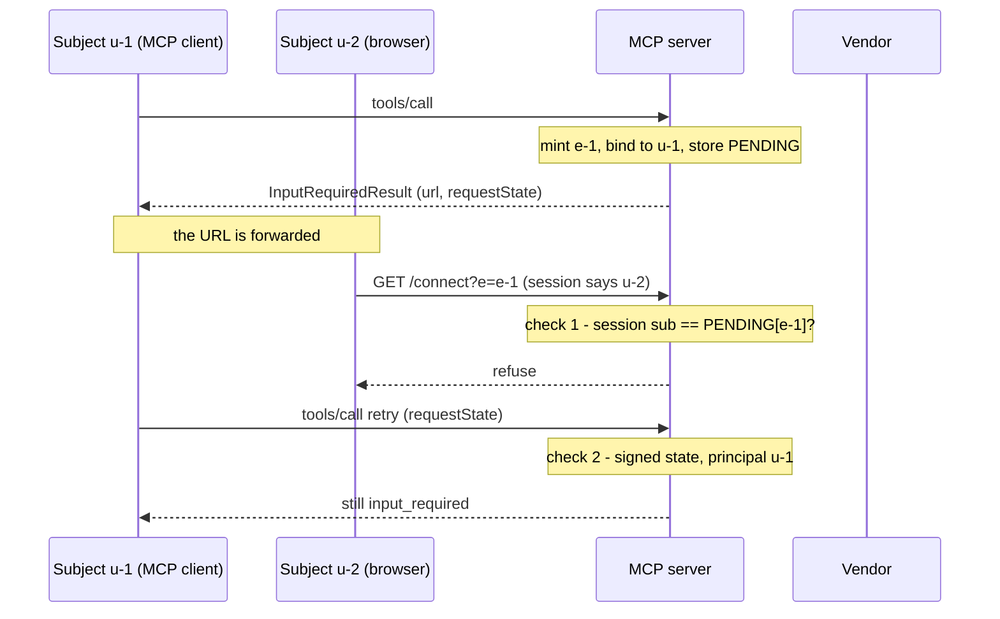

# 4.3 — 💥 The link that went to the wrong person

## One-line answer

A consent URL can be forwarded, so the server **MUST** verify that the person who finishes the flow
is the person it minted the link for — otherwise one user's account collects a token that a different
user authorised.

## The story

You are buying something online and the delivery needs confirming. A link arrives: *confirm the
delivery address for this order.*

You are on a train with no signal, so you send the link to your flatmate and ask them to sort it out.
They open it, it asks them to sign in, they sign in as themselves because that is the account they
have, and they confirm the address.

The order is now attached to their account. Not yours. They can see it, they can change it, they can
cancel it — and you cannot, because as far as the system is concerned the person who completed the
step is the person the step belongs to.

Nobody did anything wrong. You were being practical, they were being helpful, and the link did
exactly what it said. The system simply never checked that the person who opened the link was the
person it was written for.

## The scene

> 🎬 **The scene:** `sutra_mcp` needs a vendor token for the user. Following
> [4.1](4.1-the-link-you-check-before-you-click.md) exactly, it mints a consent URL on its own
> domain, returns it as a URL-mode elicitation, and stores a pending record: elicitation `e-1`
> belongs to subject `u-1`. When somebody loads `/connect?e=e-1`, the server redirects them to the
> vendor's OAuth flow and stores the resulting token against `u-1`.
>
> 😬 **The naive fix:** none is applied, because nothing looks wrong. The URL is on our domain, it is
> HTTPS, it carries no credentials, and it is not pre-authenticated. Every rule in
> [4.1](4.1-the-link-you-check-before-you-click.md) is satisfied.
>
> 💥 **Why it fails:** the link is a string, and strings travel. A user who is bored, malicious or
> merely helpful sends it to somebody else. That person opens it, is logged in to the same server as
> themselves, and completes the vendor authorisation with *their* vendor account. The server, which
> only ever knew that `e-1` belongs to `u-1`, files the resulting token against `u-1`. The victim
> authorised access to their own vendor account and handed it to the attacker's session.
>
> 💡 **The insight:** **a link is a claim about who it was for, and only the server can check it.**
> The check is: the authenticated subject in the browser session must equal the subject the
> elicitation was minted for. Everything else in URL mode is about protecting the user from a bad
> link; this is about protecting the user from a *good* link that reached the wrong hands.

## The idea in plain language

The specification calls this a **phishing** attack and walks through it in seven steps. Paraphrased
into subjects rather than names:

1. A user connected to an honest server triggers an elicitation.
2. The server generates an authorization URL, acting as an OAuth client of a third-party
   authorization server.
3. The user's client displays the URL and asks for consent.
4. Instead of clicking, that user tricks a second user of the same honest server into clicking it.
5. The second user opens the link and completes the authorization, thinking they are authorizing
   their own connection.
6. The honest server receives the callback and assumes it belongs to the first user's request.
7. The third-party tokens are bound to the first user's session and identity instead of the second
   user's, resulting in an **account takeover**.

The requirement is one sentence: to prevent this attack, the server **MUST** ensure that the user who
started the elicitation request is the same user who completes the authorization flow.

The specification's own non-normative example is the design you should reach for. The URL you hand
out points at **your own** connect route — `https://mcp.example.com/connect?...` — not straight at the
third party's authorize endpoint. That route checks that the browser has a valid session and that the
session's user is the same one the elicitation was generated for, comparing the authoritative subject
(`sub` claim) from the MCP server's authorization server against the subject from the session cookie.
Only after that does it send the browser on to the third party.

Two more requirements travel with it.

**Never trust a client-supplied identity.** Servers **MUST NOT** rely on client-provided user
identification without server verification, because it can be forged. The specification's own
example of getting it wrong is treating user input like *"I am somebody@example.com"* as
authoritative; the correct source is the `sub` from
[MCP authorization](../01-the-badge/1.1-the-badge-the-desk-and-the-door.md).

**Be resilient to a modified URL.** In all implementations, the server **MUST** ensure the mechanism
that determines the user's identity survives an attacker editing the elicitation URL. If the identity
comes from a query parameter, the attacker changes it. That is why the identity has to come from the
browser session, and why the elicitation id in the URL is only a lookup key — never the answer.

And a case the specification acknowledges: some servers are not reachable on the web and cannot use a
session cookie. The requirement does not relax; the mechanism does. Whatever else you use, it must
establish the same fact.

## Why Sutra needs it

Because this is the failure that turns a correctly-implemented feature into an account takeover, and
everything up to it looked right.

`sutra_mcp` will store third-party tokens bound to a user — that is the design
[4.1](4.1-the-link-you-check-before-you-click.md) arrived at, and it is the only design that keeps a
credential out of the client. The binding is the whole point, and a binding written from the wrong
half of the exchange is worse than no binding at all: it is a credential filed under somebody who
never granted it.

So `sutra_mcp/auth.py` gets a function with a specific signature — it takes an elicitation id and the
authenticated subject *from the browser session*, and it either proceeds or refuses. Not a subject
from a query parameter, not one from the MCP request, and not one the client supplied. The subject
comes from the session at the moment the page is loaded.

This also settles a design question left open by [3.4](../03-the-question/3.4-the-docket-you-cannot-write-yourself.md).
Signed `requestState` lets the *MCP retry* prove which principal it belongs to. It does nothing about
the *browser* arriving at the connect route, because that browser is not sending your MCP request.
Two different arrivals, two different identity checks, and you need both.

## The mechanism

The connect route, with the check behind a switch so both outcomes can be seen.

```python
# days/day-37-auth-and-elicitation/lab/same_user.py  (extract)
SAME_USER = os.environ.get("SAME_USER", "1") == "1"

# The server's own record: which elicitation was minted for which authenticated subject.
PENDING: dict[str, str] = {"e-1": STARTER}

# Where the third-party tokens end up, keyed by the subject they are bound to.
VAULT: dict[str, str] = {}


def connect(elicitation_id: str, session_sub: str) -> str:
    """The /connect route the consent URL lands on, after the browser session is read."""
    expected = PENDING.get(elicitation_id)
    if expected is None:
        return "reject: unknown elicitation"
    if SAME_USER and session_sub != expected:
        return f"reject: link was minted for {expected!r}, browser session is {session_sub!r}"
    VAULT[expected] = f"vendor-token-granted-by-{session_sub}"
    return f"granted: vendor token stored against {expected!r}"
```

**Line by line:**

- `SAME_USER` is an environment variable so the two arms can be run from the shell without editing
  the file. It defaults to `"1"` — the safe direction — because a switch whose default is off is a
  switch somebody forgets.
- `PENDING` maps the elicitation id to the subject it was minted for. This is the state the
  specification's step 2 requires: *store internal state that associates (binds) the elicitation
  request with the user's identity*. It exists before the link is ever handed out, and it is the only
  reason a check is possible at all.
- `connect` takes `session_sub` as a **parameter**, and where that parameter comes from is the entire
  security property. In the real route it is read from the browser's session cookie, resolved to the
  `sub` claim the MCP authorization server issued. It is not read from the URL, from a header the
  caller set, or from the MCP request — none of which the browser is even sending.
- `PENDING.get(elicitation_id)` with `expected is None` handled first, because an unknown or expired
  elicitation is the more common case in production and it deserves its own refusal. Falling into the
  comparison with `None` would produce a confusing message about a mismatch that is really an absence.
- `session_sub != expected` compares two subject identifiers with `!=` and nothing else, for the
  reason [2.2](../02-issuer-checks/2.2-the-comparison-that-must-not-be-helpful.md) argued at length.
  A `sub` is unique only within one issuer, so this comparison is only meaningful because both sides
  came from the same authorization server.
- `VAULT[expected]` — note that the token is stored against `expected`, the subject from the
  **pending record**, not against `session_sub`. That is what makes the attack work when the check is
  off, and writing it this way rather than the other way round is deliberate: the naive design binds
  to the request it remembers, because that is the request it is trying to complete.
- The returned string carries who granted it, which is why the attack is visible in the transcript at
  all. In a real vault the value is an opaque token and the grant provenance is a separate audit
  record — one worth keeping, because it is the only artefact that would let you find this after the
  fact.

Run both arms:

```bash
SAME_USER=1 python days/day-37-auth-and-elicitation/lab/same_user.py
SAME_USER=0 python days/day-37-auth-and-elicitation/lab/same_user.py
```

**Line by line:**

- From the repository root. The first arm is the compliant server, the second is the same code with
  the required check removed. **Zero generations, no network.** Nothing else differs between them.

Measured on 2026-09-04, check **on**:

```text
same-user check: ON

u-1 calls the tool. The server mints elicitation e-1 for u-1
and returns a consent URL. It is never clicked by the subject it was minted for.
The URL is forwarded to u-2, another user of the same server.

u-2 opens the link ->
  reject: link was minted for 'u-1', browser session is 'u-2'

vault: {}
a vendor account belonging to u-2 is now reachable by u-1: False
```

The same run with the check **off**:

```text
same-user check: OFF

u-1 calls the tool. The server mints elicitation e-1 for u-1
and returns a consent URL. It is never clicked by the subject it was minted for.
The URL is forwarded to u-2, another user of the same server.

u-2 opens the link ->
  granted: vendor token stored against 'u-1'

vault: {'u-1': 'vendor-token-granted-by-u-2'}
a vendor account belonging to u-2 is now reachable by u-1: True
```

Read the vault line in the second transcript slowly: `{'u-1': 'vendor-token-granted-by-u-2'}`. The
key is one user; the grant came from another. That single dictionary entry is the account takeover.

Where the two identity checks sit, and why one does not cover the other:



Check 1 guards the browser arriving at the connect route. Check 2 guards the MCP retry. They are
different arrivals with different credentials, and passing one says nothing about the other.

## When it breaks

The break the forwarded user sees, when the server is correct:

```text
HTTP/1.1 403 Forbidden
content-type: text/html

This link was created for a different account. Sign in as the account that started
the request, or ask them to open the link themselves.
```

A 403 rather than a 401, because the browser *is* authenticated —
[1.2](../01-the-badge/1.2-the-refusal-that-carries-directions.md)'s table again. And note the wording:
it does not say **which** account, because that would tell whoever opened the link who else uses this
server.

The break with no error at all is the second transcript above. The vendor's OAuth flow succeeded, the
callback arrived, the token was stored, the tool completed. Every log line reads as a success. The
only evidence is that the grant and the binding disagree — and you can only see that if you recorded
both, which is the argument for the audit record.

The third break is the one you will actually cause yourself. The connect route reads the subject from
the query string, because it was convenient at the time:

```text
GET /connect?e=e-1&sub=u-1
```

Now the check compares `u-1` to `u-1` and passes for everybody, because the attacker chose both
values. This is what the specification means by *the mechanism must be resilient to attacks where an
attacker can modify the elicitation URL*, and it is why the identity has to come from the session
rather than from anything in the link.

## In production

**What a professional writes instead:** the connect route is a normal authenticated web route on the
server's own domain — session cookie required, redirect-to-login if absent — and the check is the
first thing in it, before any redirect to the third party is constructed. The pending record has a
short expiry and is deleted when consumed. And the audit record written at the end carries **both**
subjects: the one it was minted for and the one who completed it. In the correct case they are equal
and the record is boring; it is the only artefact that makes the incorrect case investigable.

**What degrades at scale:** the pending table. One row per elicitation, and most of them are never
completed, because people abandon flows constantly. Without a TTL and a sweeper it grows without
bound; with a TTL that is too short, a user who took a phone call mid-flow finds their link dead. The
number you choose is a real product decision and it should be written down beside the `requestState`
TTL from [3.4](../03-the-question/3.4-the-docket-you-cannot-write-yourself.md), because the two
interact: the link outliving the state, or the state outliving the link, both produce confusing
failures.

**The failure mode that only appears with real traffic:** shared devices and multiple accounts. A
person with two accounts on the same server — a personal one and a work one — starts the flow signed
in as one and opens the link in a browser signed in as the other. The check refuses, correctly, and
the user is baffled because they *are* the same person. The fix is the error message: name the
situation, not the mechanism, and offer the action ("sign in as the account that started the
request") rather than the diagnosis.

**The review comment a senior engineer leaves:** *"`/connect` reads the subject from
`request.args['sub']`. That is attacker-controlled — the whole attack is that somebody else opens
this URL, and they can edit it. Read the subject from the session, compare it to the pending record,
and refuse on mismatch. Also, log both subjects on success; right now if this ever goes wrong we have
no way to find out that it did."*

**The interview question:** *"URL mode elicitation gives the user a link. What can go wrong?"* The
answer that shows you have read the security section: *"the link can be forwarded. The spec spells out
the attack: a user triggers an elicitation, gets a consent URL, and instead of clicking it sends it to
another user of the same server. That second user opens it, completes the third-party OAuth flow with
their own account, and the server binds the resulting token to the first user — an account takeover
where the victim did all the work. The requirement is that the server MUST verify the user who
completes the flow is the user who started it, and the standard way is to point the link at your own
connect route, read the browser session, and compare its `sub` against the subject the elicitation was
minted for. Two details matter: the identity must come from the session and not from anything in the
URL, because the attacker can edit the URL; and this check is separate from the signed `requestState`
check on the MCP retry — they guard two different arrivals."*

## Check yourself

```bash
SAME_USER=1 python days/day-37-auth-and-elicitation/lab/same_user.py
SAME_USER=0 python days/day-37-auth-and-elicitation/lab/same_user.py
```

Run both arms and put the two vault lines side by side. Then add a third arm: change `connect` to
read the expected subject from a second parameter that the caller supplies — the query-string
version — and confirm that the check passes for anybody. Say in one sentence what the attacker had to
do to defeat it.

**Out loud, without scrolling up:** where does the server get the identity it compares against the
pending record, and name two places it must *not* get it from.

**Next:** [5.1 — The optional extras list](../05-policy/5.1-the-optional-extras-list.md).
