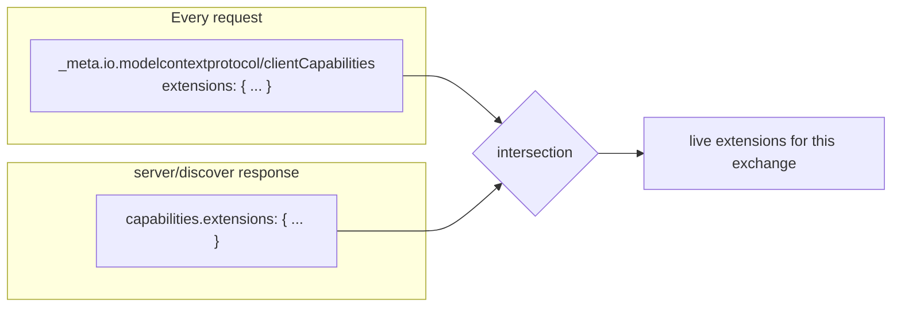

# 5.1 — The optional extras list

## One-line answer

Everything beyond MCP's small core now ships as a named, versioned **extension** with a reverse-DNS
identifier, declared by both sides on every request, **disabled by default** — so a capability is
either in play because both parties said so, or it is not in play at all.

## The story

You order a car and the salesperson turns the page to the options list.

Air conditioning. Parking sensors. A tow bar. Roof rails. Each one has a code, each one has a price,
and each one is either fitted or it is not. The car you drive away in is the base model plus exactly
the boxes that were ticked.

What makes the list work is that nothing is assumed. The dealer does not fit a tow bar because most
people want one, and you do not discover a missing tow bar three months later when you try to hitch
a trailer. If it is on the paperwork, it is on the car. If it is not on the paperwork, it is not.

And the codes matter more than the names. *Towing preparation package 1D3* is unambiguous in a way
that "the tow bar thing" is not, because the same word means slightly different things at different
manufacturers.

## The idea in plain language

Until this revision, everything MCP could do lived in the core specification, and adding a feature
meant a new version of the whole protocol. That does not scale: an interactive-UI feature and an
enterprise-authorization feature have nothing to do with each other, move at different speeds, and
are wanted by different people.

The 2026-07-28 answer is the **extensions framework**. The core stays small. Everything else is an
extension with four properties.

**A namespaced identifier.** The format is `{vendor-prefix}/{extension-name}`, for example
`io.modelcontextprotocol/oauth-client-credentials`. Official extensions use the
`io.modelcontextprotocol` prefix; a third party uses a reversed domain name it owns, so a company
owning `example.com` uses `com.example/my-extension`. This is the same reverse-DNS convention
[Day 32 met in the registry](../../../day-32-mcp-stateless-core/parts/04-governance-and-registry/4.3-a-name-that-proves-its-publisher.md),
and it does the same job: the name says who defines the thing.

**Two-sided declaration.** The client lists its extensions in
`_meta["io.modelcontextprotocol/clientCapabilities"]` under an `extensions` field, on **every
request** — the per-request capability declaration
[Day 32 taught](../../../day-32-mcp-stateless-core/parts/02-the-reframe/2.3-every-request-introduces-itself.md).
The server lists its own in the `capabilities.extensions` of its `server/discover` response. Each
extension's value is a settings object; an empty object means no settings.

**Off unless both sides say on.** The specification's note is unambiguous: *extensions are always
disabled by default and require explicit opt-in from the developer.* An extension one side declares
and the other does not is not in play.

**Independent versioning.** Extensions evolve on their own timelines, and their updates do not need
core-maintainer review. Backwards compatibility is handled with capability flags or version fields
*inside* the settings object; a genuinely breaking change gets a **new identifier**, and the
specification's own example is `io.modelcontextprotocol/my-extension-v2`. It even defines what
"breaking" means: removing or renaming fields, changing field types, altering the semantics of
existing behaviour, or adding new required fields.

The official ones, as of the day this was written:

| Extension | What it does |
| --- | --- |
| `io.modelcontextprotocol/oauth-client-credentials` | OAuth 2.0 client credentials flow, for machine-to-machine callers with no human at the desk |
| `io.modelcontextprotocol/enterprise-managed-authorization` | Centralised access control through an organisation's identity provider — [5.2](5.2-one-account-instead-of-forty.md) |
| `io.modelcontextprotocol/ui` | MCP Apps: interactive UI elements inside a conversation |
| Tasks | Asynchronous long-running work with polling and durable handles — [Day 36](../../../day-36-long-jobs-and-tasks/) |

And a rule for when the two sides disagree, called **graceful degradation**: the side that supports
an extension must either fall back to core behaviour or reject the request outright if the extension
is mandatory. The example the specification gives is the useful one — a server offering UI-enhanced
tools should still return meaningful text for clients that do not support the UI extension.

## Why Sutra needs it

Because Sutra is a client and a server, and both halves have to declare something.

As a **client**, `sutra/mcp/client.py` puts an `extensions` object into the `_meta` block it already
builds for every request. Today that object is empty, and writing an empty one deliberately is the
point: it makes the extension list a thing that exists and can be added to, rather than a thing
someone remembers to invent on the day they need it.

As a **server**, `sutra_mcp` will answer `server/discover` with a `capabilities.extensions` object.
[Day 41](../../../day-41-capabilities-and-mcp-apps/) is the day that fills it, and it needs today's
vocabulary — reverse-DNS identifiers, settings objects, both-or-nothing — to do that without
inventing a scheme.

The immediate consequence for today is that **[5.2](5.2-one-account-instead-of-forty.md)'s enterprise
governance is an extension, not a core feature.** That is not a footnote; it is the whole reason
governance is possible. A capability that is declared in the open, by name, on every request, is a
capability a gateway or an identity provider can *see* — and therefore one it can allow or deny.
[5.3](5.3-policy-that-can-name-a-feature.md) is that argument in full.

## The mechanism

Negotiation is a set intersection. Writing it as one shows how little there is to it.

```python
# days/day-37-auth-and-elicitation/lab/extensions.py  (extract)
# What Sutra's client declares in every request's _meta block.
CLIENT_CAPS: dict[str, dict[str, object]] = {
    "io.modelcontextprotocol/tasks": {},
    "io.modelcontextprotocol/enterprise-managed-authorization": {},
}

# What a server advertises in its server/discover result.
SERVER_CAPS: dict[str, dict[str, object]] = {
    "io.modelcontextprotocol/tasks": {},
    "io.modelcontextprotocol/ui": {"mimeTypes": ["text/html;profile=mcp-app"]},
    "com.vendor.example/receipts": {},
}


def negotiate(
    client: dict[str, dict[str, object]], server: dict[str, dict[str, object]]
) -> dict[str, list[str]]:
    """Both-or-nothing. An extension is live only when both sides named it."""
    return {
        "live": sorted(set(client) & set(server)),
        "client only": sorted(set(client) - set(server)),
        "server only": sorted(set(server) - set(client)),
    }


def vendor_of(identifier: str) -> str:
    """Everything before the slash - the reverse-DNS prefix whose owner defines the extension."""
    return identifier.split("/", 1)[0]
```

**Line by line:**

- Both capability sets are `dict[str, dict[str, object]]` — identifier to **settings object** — rather
  than a list of names. That shape is the specification's, and it matters: `io.modelcontextprotocol/ui`
  carries `{"mimeTypes": [...]}`, so a list of strings could not represent it. An empty dict means
  "supported, no settings", which is different from absent.
- `set(client) & set(server)` iterates the dict **keys**, which is what negotiation is about. The
  settings objects are not intersected, and deliberately: each side's settings describe what *it*
  can do, and reconciling them is the individual extension's business, not the framework's.
- The three buckets are returned together rather than just `live`, because the other two are where the
  bugs are. `client only` is a capability the client will never get to use; `server only` is a feature
  the server offers that this client cannot see. Both are silent, and both are questions worth
  printing during development.
- `sorted(...)` on each bucket, so the output is stable across runs. That is the same reason
  [Day 32 sorted the tool list](../../../day-32-mcp-stateless-core/parts/03-headers-and-caches/3.3-lists-you-may-keep.md):
  an unstable order makes a diff meaningless and a cache key wrong.
- `vendor_of` splits on the **first** slash only, with `split("/", 1)`. An extension name may itself
  contain a slash; the prefix is everything up to the first one. Splitting on all of them and taking
  the first element happens to work today and breaks on the first nested name.
- There is no `DEFAULT_EXTENSIONS` constant anywhere in the file, and that absence is the design. The
  only way an extension is live is that both dicts name it.

Run it:

```bash
python days/day-37-auth-and-elicitation/lab/extensions.py
```

**Line by line:**

- From the repository root. **Zero generations, no network.** Two dicts in, three buckets and a
  vendor table out.

Measured on 2026-09-04:

```text
live          ['io.modelcontextprotocol/tasks']
client only   ['io.modelcontextprotocol/enterprise-managed-authorization']
server only   ['com.vendor.example/receipts', 'io.modelcontextprotocol/ui']

extension                                                     vendor                      official
----------------------------------------------------------------------------------------------------
com.vendor.example/receipts                                   com.vendor.example          False
io.modelcontextprotocol/enterprise-managed-authorization      io.modelcontextprotocol     True
io.modelcontextprotocol/tasks                                 io.modelcontextprotocol     True
io.modelcontextprotocol/ui                                    io.modelcontextprotocol     True

extensions active by default: 0
```

Four extensions named between the two sides, and **one** is live. The last line is the rule as a
number: nothing is on unless it was asked for twice.

Where the two declarations travel:



Note where the client's half lives: in `_meta`, on **every request**, not in a handshake. That is
what makes the set re-evaluable per request, and it is what lets an intermediary see it without
holding any state — the property [5.3](5.3-policy-that-can-name-a-feature.md) turns into governance.

## When it breaks

The break with an error is the mandatory extension the client does not have:

```text
{"jsonrpc":"2.0","id":1,"error":{"code":-32021,"message":"MissingRequiredClientCapability: io.modelcontextprotocol/enterprise-managed-authorization"}}
```

`-32021` is `MissingRequiredClientCapability` in this revision, renumbered from `-32003`. That is
graceful degradation's second branch: the extension is mandatory, so the server rejects rather than
falling back.

The break with no error is graceful degradation's *first* branch done badly. A server that offers a
UI-enhanced tool and returns only the UI payload — no text content — to a client that never declared
`io.modelcontextprotocol/ui` produces a tool result the client cannot render. There is no error
because nothing failed; the user sees an empty response. The specification's guidance is exactly
this case: still return meaningful text content.

The third break is a naming one and it is permanent. Somebody ships `com.example/receipts` with a
required new field in the settings object and does not change the identifier. Every existing client
declaring `com.example/receipts` now means something different from what the server means by it, and
there is no version number anywhere to notice the difference. The specification's rule — adding a new
required field is a breaking change, and breaking changes get a new identifier — exists precisely
because the identifier is the only thing both sides compare.

## In production

**What a professional writes instead:** the extension set is a constant in one module, not a literal
built at each call site, and it is asserted against in a test. The pinned SDK cannot help here — there
is no `ExtensionCapability` type in `mcp==1.29.1`, verified on 2026-09-04 by reading
`.venv/Lib/site-packages/mcp/types.py`, because that SDK speaks `2025-11-25` and the extensions
framework arrived in `2026-07-28`. So the `_meta` block is hand-built, which is exactly what
[Day 32's letter](../../../day-32-mcp-stateless-core/parts/02-the-reframe/2.3-every-request-introduces-itself.md)
prepared you for, and [6.2](../06-in-production/6.2-the-tray-the-driver-cannot-see.md) measures the
gap rather than assuming it.

**What degrades at scale:** the `_meta` block's size. Every request carries the client's whole
extension declaration — [Day 32 measured the base block at 184 bytes](../../../day-32-mcp-stateless-core/parts/02-the-reframe/2.3-every-request-introduces-itself.md),
and each extension with a settings object adds to that, on every request, for ever. It is a real cost
and it is the cost statelessness charges. The mitigation is not to trim the block; it is to declare
only what you actually support, which you should be doing anyway.

**The failure mode that only appears with real traffic:** version skew across a fleet. Half your
client instances are on a build that declares `com.vendor.example/receipts` and half are not, mid
rollout. The server sees the extension live for some requests and not others, from what looks like one
client, and any behaviour it derives from that flickers. The answer is that per-request negotiation is
correct and the server must simply handle both — a server that caches "this client supports X" has
reintroduced a session.

**The review comment a senior engineer leaves:** *"we're declaring `io.modelcontextprotocol/ui` in the
client capabilities because we might want MCP Apps later. Take it out. Declaring an extension is a
promise that we can handle what a server sends when it is live — right now a server that takes us at
our word will send a UI payload we cannot render, and the user gets a blank box."*

**The interview question:** *"how does a client find out whether a server supports a particular MCP
feature?"* The answer that shows you have read the framework: *"for anything outside the small core,
it's an extension with a reverse-DNS identifier like `io.modelcontextprotocol/tasks`. The client
declares the ones it supports in the `_meta` client capabilities on every request, the server declares
its own in the `server/discover` response, and the live set is the intersection — extensions are
disabled by default and require explicit opt-in on both sides. Each one is versioned independently,
and a breaking change gets a whole new identifier rather than a version field, because the identifier
is the only thing the two sides compare. What I'd emphasise is why the declaration is per-request
rather than a handshake: it means an intermediary can see which capabilities a request would use
without parsing the body or holding state, which is what makes centralised policy possible at all."*

## Check yourself

```bash
python days/day-37-auth-and-elicitation/lab/extensions.py
```

Add `io.modelcontextprotocol/ui` to `CLIENT_CAPS` with an empty settings object and re-run. Note that
it becomes live even though the two sides' settings objects disagree — the server declared
`mimeTypes` and the client declared nothing — and write down whose job it is to reconcile that. Then
rename the server's `com.vendor.example/receipts` to `com.vendor.example/receipts-v2` and say what a
client that had been using it now experiences.

**Out loud, without scrolling up:** what has to be true for an extension to be in play, and what
happens to an extension only one side declares?

**Next:** [5.2 — One account instead of forty](5.2-one-account-instead-of-forty.md).
