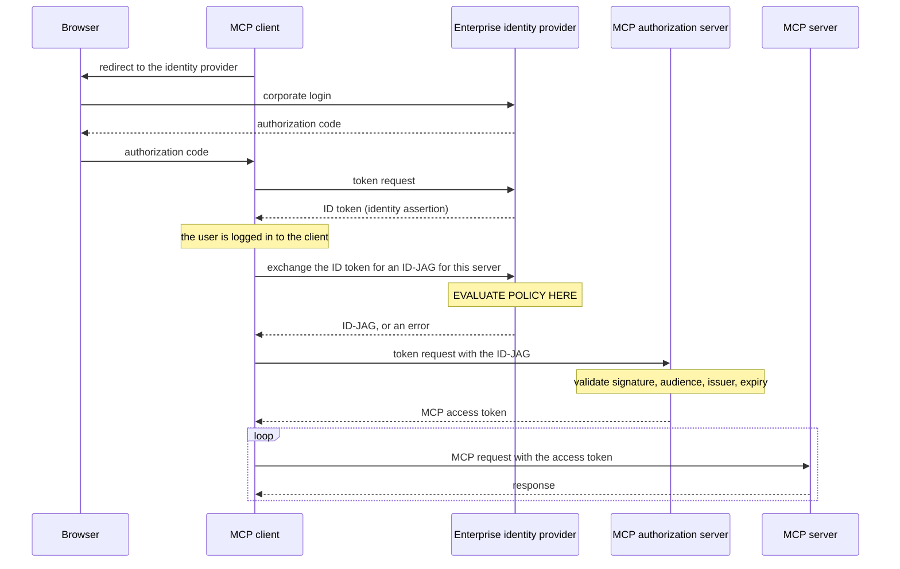

# 5.2 — One account instead of forty

## One-line answer

Enterprise-Managed Authorization moves the *allow or deny* decision from each employee's consent
dialogue to the organisation's identity provider — the client exchanges its login for a grant the
identity provider issues only if policy permits, and an unauthorised employee never receives a token
at all.

## The story

Your first week at a company, and you need a stapler, a whiteboard marker and a box of envelopes.

The way you would do it at home is buy them and claim the money back. The way the company does it is
that none of those decisions are yours. Procurement has accounts with three suppliers, those
suppliers are on a list, and you order from the list. You never see a price, never enter a card
number, and never have a conversation with a supplier about whether you are allowed to buy
envelopes.

The awkwardness comes when you want something from a supplier that is not on the list. You cannot
just buy it, and that is not an oversight — it is the entire mechanism. And on the day you leave, you
do not have to remember which suppliers know your name. Somebody switches off one account and every
supplier stops recognising you at once.

## The idea in plain language

The MCP authorization you learned in section 1 is **user-driven**. Each user, at each server,
approves each client. For a consumer application that is exactly right: individuals control what
touches their data.

In an organisation the same model produces four specific problems, and the extension's own
documentation lists them: employees should not need to understand the authorization details of every
MCP server the organisation uses; security teams cannot enforce consistent policy if each user
authorizes independently; onboarding means a new employee manually authorizing dozens of services;
and offboarding means revoking access at every service one at a time.

**Enterprise-Managed Authorization** — identifier
`io.modelcontextprotocol/enterprise-managed-authorization` — makes the organisation's identity
provider the authoritative decision-maker. Employees authenticate with their corporate identity, the
same one they use for email, and the identity provider grants or denies MCP server access according
to organisational policy.

The mechanism has a specific token in it, and it is the thing to remember.

**ID-JAG** stands for **Identity Assertion JWT Authorization Grant**. It is not an access token and
it is not an identity token. It is a *grant* — a short-lived credential that says *the identity
provider has evaluated its policy for this employee and this MCP server, and the answer is yes*. The
client cannot use it to call anything. It can only exchange it, at the MCP server's own authorization
server, for a real access token.

The flow, in the order it happens:

1. The client sends the user to the enterprise identity provider to log in. Ordinary corporate SSO.
2. The identity provider returns an **ID token** — an identity assertion. The client stores it.
3. When the client needs to reach an MCP server, it exchanges that ID token at the identity provider
   for an **ID-JAG** for that specific server. **The identity provider evaluates policy at this
   point.**
4. The client presents the ID-JAG to the MCP server's authorization server, which validates it and
   returns an ordinary MCP access token.
5. The client calls the MCP server with that access token, exactly as in section 1.

Read step 3 again. That is where the whole extension lives. The employee is not shown a consent
dialogue, and if policy says no, the client never receives a grant — so it never receives a token, so
there is no request to deny at the server. The documentation puts it plainly: employees who lack
authorization receive an appropriate error, and **the MCP client never receives a token for
unauthorized servers**.

The obligations on each party are short.

**The client** declares the extension in its per-request capabilities; supports SSO and keeps the
identity assertion; requests an ID-JAG when the server indicates enterprise-managed auth is required
and exchanges it — and specifically **does not** redirect the user to the MCP authorization server's
authorize endpoint; allows administrators to configure the identity provider's endpoints at the
organisation level rather than per user; and handles scope errors gracefully, because enterprise
tokens may carry different scope restrictions from the standard flow.

**The MCP authorization server** validates ID-JAGs — JWT signature against the identity provider's
key set, plus audience, issuer and expiry — and maps the claims to permissions. It uses the
**subject** claim as the primary stable identifier for the user, falling back to an **email** claim
only for matching pre-existing accounts created before enterprise-managed authorization was
configured.

🅿️ **Parked, and honestly so.** Running this needs a corporate identity provider and an organisation,
neither of which exists on a laptop and neither of which is free. Addendum 02 makes that a hard stop:
nothing in this curriculum requires a billing account. So the flow is interview-ready and
whiteboard-ready today, and the *decision logic* — the part an administrator actually writes — is
what the lab below makes real.

## Why Sutra needs it

Because Sutra's eventual users are support agents at a company, and the shape of the answer changes
who Sutra has to ask.

Every design in this day so far has assumed the user is the decision-maker: they log in, they consent,
they answer the elicitation. Enterprise-Managed Authorization inverts that for one specific question —
*may this person use this server at all* — and moves it somewhere Sutra does not control. That is a
design constraint, not a feature request. It means `sutra/mcp/auth.py` must be able to obtain a token
by **two** routes: the interactive one from section 1, and an exchange it performs without ever
opening a browser at the MCP server's authorization endpoint.

It also constrains error handling. An employee blocked by policy does not get a 403 from `sutra_mcp`
— they get a failure from their own identity provider, before any MCP request exists. A client that
only knows how to explain MCP-level errors will show them something unhelpful. The honest message is
*"your organisation has not approved this server"*, and Sutra can only say that if it distinguishes
the two failure sources.

You meet the other half of this on [Day 40](../../../day-40-filtering-and-allowlists/), where Sutra
decides for itself which tools it will expose to the model. That is a *local* allowlist; this is a
*central* one, and the two answer different questions about the same request.

## The mechanism

The identity provider's decision, written as the function an administrator's console configures.

```python
# days/day-37-auth-and-elicitation/lab/policy.py  (extract)
# The kind of rule an administrator writes once, in the identity provider's console.
ALLOWED_SERVERS = {"io.sutra/sutra-mcp", "io.github.acme/tickets"}
DENIED_EXTENSIONS = {"io.modelcontextprotocol/ui"}
GROUP_SCOPES = {"support": {"tickets:read"}, "support-leads": {"tickets:read", "tickets:write"}}


@dataclass(frozen=True)
class Ask:
    """One employee asking to reach one server with one set of extensions and scopes."""

    who: str
    group: str
    server: str
    extensions: frozenset[str]
    scopes: frozenset[str]


def decide(ask: Ask) -> tuple[bool, str]:
    """The identity provider's answer, before any token is minted."""
    if ask.server not in ALLOWED_SERVERS:
        return False, f"server {ask.server!r} is not on the approved list"
    blocked = ask.extensions & DENIED_EXTENSIONS
    if blocked:
        return False, f"extension {sorted(blocked)[0]!r} is denied by policy"
    granted = GROUP_SCOPES.get(ask.group, set())
    over = ask.scopes - granted
    if over:
        return False, f"group {ask.group!r} may not request {sorted(over)}"
    return True, "ID-JAG issued"
```

**Line by line:**

- The three policy constants are **data**, not code, and they live at the top of the file where an
  administrator would recognise them. That is the shape of the real thing: rules configured in a
  console, not a deployment. If changing who may reach a server requires a release, you have not
  centralised anything.
- `ALLOWED_SERVERS` is an **allowlist** and `DENIED_EXTENSIONS` is a **denylist**, and the asymmetry
  is deliberate. Servers are enumerable — an organisation knows which ones it has approved — so the
  safe default is *deny anything not named*. Extensions are open-ended, since anyone may define one,
  so an allowlist would block every new extension by default and the policy would be permanently out
  of date. Naming which is which, and why, is exactly the sort of thing a reviewer asks about.
- `Ask` is a frozen dataclass rather than five arguments, because these five values travel together
  through logging, auditing and the decision. A tuple would work and would not survive the sixth
  field.
- `extensions` and `scopes` are `frozenset` rather than `list`, because order is meaningless here and
  the operations wanted are set operations — `&` for "which of these are denied", `-` for "which of
  these were not granted". Writing those as loops is how an off-by-one gets in.
- `decide` returns `tuple[bool, str]` — the decision **and** the reason. The reason is not decoration:
  it is what the audit log records and what the employee is eventually shown. A policy engine that
  returns only `False` produces support tickets that cannot be answered.
- The order of the three checks runs from coarsest to finest: is this server approved at all, then
  does it want a forbidden capability, then may this person have these permissions. Each check is
  cheaper and broader than the next, and — more importantly — the first refusal is the most useful
  message. Telling somebody their scopes are too wide, when the real answer is that the server is not
  approved, sends them to fix the wrong thing.
- `GROUP_SCOPES.get(ask.group, set())` defaults to the **empty** set for an unknown group. An unknown
  group gets nothing, which is the safe direction; `.get(ask.group)` returning `None` would raise on
  the subtraction, and a default of "everything" would be a catastrophe waiting for a typo in a group
  name.
- `sorted(blocked)[0]` names one blocked extension rather than all of them, and `sorted` makes the
  message deterministic. A set's iteration order is stable within a run and not something to rely on
  in a message somebody will paste into a ticket.

Run it:

```bash
python days/day-37-auth-and-elicitation/lab/policy.py; echo "exit: $?"
```

**Line by line:**

- From the repository root. The exit code is the number of requests the policy allowed that it should
  have denied, so **0 is the pass**. **Zero generations, no network, and no identity provider** — the
  decision logic is the part that is free to build.

Measured on 2026-09-04:

```text
u-1   support         io.sutra/sutra-mcp        allow  ID-JAG issued
u-1   support         io.sutra/sutra-mcp        deny   group 'support' may not request ['tickets:write']
u-2   support-leads   io.sutra/sutra-mcp        allow  ID-JAG issued
u-3   support         com.unknown/scraper       deny   server 'com.unknown/scraper' is not on the approved list
u-2   support-leads   io.github.acme/tickets    deny   extension 'io.modelcontextprotocol/ui' is denied by policy

employees who had to read an authorization dialog: 0
requests allowed that policy forbids: 0
```

The second-to-last line is the user-facing result of all this machinery. Five decisions, five audit
records, and **nobody was shown a consent screen** — because the decision was never theirs.

The flow, with the policy evaluation marked:



There is no arrow from the client to the MCP authorization server's *authorize* endpoint, and no
browser involvement after the first login. That absence is the employee experience: one sign-in, then
every approved server just works.

## When it breaks

The break an employee actually meets comes from the identity provider, before MCP is involved at all:

```text
HTTP/1.1 400 Bad Request
content-type: application/json

{"error":"access_denied","error_description":"policy does not permit this user to access resource io.sutra/sutra-mcp"}
```

That is an OAuth error from the identity provider's token endpoint, in response to the ID-JAG
exchange. Note there is no MCP request anywhere in this failure. A client that reports it as
*"could not connect to the MCP server"* has told the user the wrong thing, and they will spend an
afternoon checking a URL that is fine.

The break at the MCP authorization server is a validation failure:

```text
HTTP/1.1 400 Bad Request
content-type: application/json

{"error":"invalid_grant","error_description":"ID-JAG audience does not match this authorization server"}
```

`invalid_grant` is the OAuth code for *this grant is not usable here*, and the audience check is the
same idea as [1.3](../01-the-badge/1.3-a-voucher-for-one-shop.md)'s: a grant minted for one
authorization server presented at another. The lesson repeats because the principle does.

The third break has no error and is the account-linking trap. An organisation adopts
Enterprise-Managed Authorization for a server where users already had accounts. The ID-JAG's subject
claim is a new identifier that matches nothing, so a fresh account is created, and the employee sees
an empty workspace with all their previous data apparently gone. It is not gone; it is under the old
account. That is exactly why the specification says to use the subject claim as the primary stable
identifier and fall back to the **email** claim for matching pre-existing accounts — and why the
fallback is a migration step you plan rather than a permanent behaviour.

## In production

**What a professional writes instead:** none of this by hand. The identity provider is a purchased
product with a policy console, the ID-JAG validation is a standard JWT verification against a
published key set, and the code you write is the claim-to-permission mapping and the audit record.
What *is* worth hand-writing is the decision table above as a test fixture, so that a change to
group-to-scope mapping has a failing test rather than a Monday morning.

**What degrades at scale:** the identity provider becomes a hard dependency of every MCP call path.
An ID-JAG is short-lived by design, so clients exchange constantly, and an identity provider outage
means nobody can reach any MCP server — where previously each server failed independently. The
mitigations are the boring ones: cache the exchanged access token for its full lifetime rather than
re-exchanging per request, back off on failure, and be honest in the incident review that
centralisation traded a set of small independent failures for one large correlated one.

**The failure mode that only appears with real traffic:** offboarding latency. Central revocation
"takes effect immediately" at the identity provider, and the access token already in a client's memory
keeps working until it expires. So the real revocation window is the access token's lifetime, not
zero, and the number somebody will ask you for in a compliance review is that lifetime. Say it out
loud when you configure it.

**The review comment a senior engineer leaves:** *"the client falls back to the interactive
authorization flow when the ID-JAG exchange fails. Don't. If the identity provider said no, opening a
browser at the MCP authorization server is a way for an employee to get access their organisation
denied — the extension's whole point is that the decision isn't theirs. Surface the denial and stop."*

**The interview question:** *"how would an enterprise control which MCP servers employees can use?"*
The spoken answer: *"through the identity provider, using the Enterprise-Managed Authorization
extension — `io.modelcontextprotocol/enterprise-managed-authorization`. The employee signs in with
corporate SSO once and the client keeps the identity assertion. When it needs to reach an MCP server
it exchanges that assertion at the identity provider for an ID-JAG — an Identity Assertion JWT
Authorization Grant — and *that* exchange is where policy is evaluated. If the answer is no, the
client never gets a grant, so it never gets a token; there's no request for the server to refuse. If
yes, it swaps the ID-JAG at the MCP server's authorization server for a normal access token. The
practical wins are onboarding and offboarding: a new employee gets every approved server without
authorizing anything, and revoking one account at the identity provider cuts access everywhere. The
honest downside is that you've made the identity provider a single point of failure for every MCP
call, and the real revocation window is the access token's lifetime, not zero."*

## Check yourself

```bash
python days/day-37-auth-and-elicitation/lab/policy.py; echo "exit: $?"
```

Add a sixth `Ask`: a user in a group that does not appear in `GROUP_SCOPES` at all, asking for
`tickets:read` at an approved server. Predict the verdict before you run it, then run it. Then change
`GROUP_SCOPES.get(ask.group, set())` to `GROUP_SCOPES.get(ask.group, {"tickets:read"})` and say what
class of mistake that default now hides.

**Out loud, without scrolling up:** what is an ID-JAG, and at which step in the flow is enterprise
policy actually evaluated?

**Next:** [5.3 — Policy that can name a feature](5.3-policy-that-can-name-a-feature.md).
