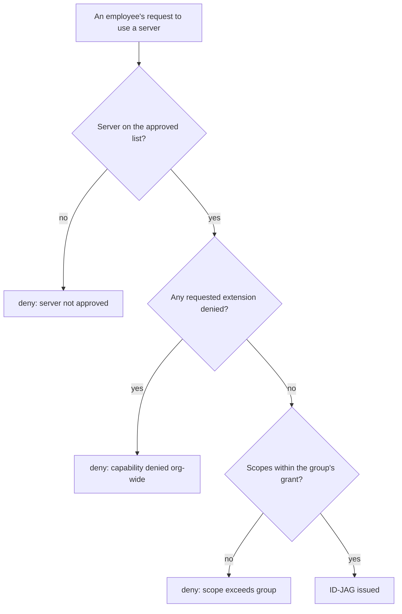

# 5.3 — Policy that can name a feature

## One-line answer

Because every capability beyond the core is a **named extension declared in the open on every
request**, an organisation can allow a server and still deny one of its features — governance gets a
vocabulary finer than *this whole server, yes or no*.

## The story

A school trip permission slip used to be one line: *I give permission for my child to attend.* Sign
or do not sign.

The version that comes home now lists the activities separately. Coach travel. The museum. The
climbing wall. Swimming. Each has its own tick box, and parents tick some and not others — usually
because of one specific thing, not because they object to the trip.

Under the old slip, a parent worried about the swimming had exactly two options: refuse the whole
trip, or agree to everything and hope. Neither is what they wanted. The itemised slip did not give
them more authority. It gave them **a vocabulary** — a way to say the one thing they actually meant.

## The idea in plain language

[5.2](5.2-one-account-instead-of-forty.md) moved the decision to the organisation.
[5.1](5.1-the-optional-extras-list.md) gave the decision something to name. This part is what those
two together buy, and it is worth stating precisely, because it is the sentence the addendum uses as
its own example: *the company allows one MCP server but blocks any server using the Apps extension,
by policy, centrally.*

That policy is only expressible because of three properties that arrived together in the 2026-07-28
revision.

**Capabilities are named.** `io.modelcontextprotocol/ui` is a string with an owner. Before the
extensions framework, "the interactive UI feature" was a description, and you cannot write a rule
against a description.

**They are declared in the open, per request.** The client's set rides in `_meta` on every request;
the server's rides in the `server/discover` response. Neither is a handshake, so nothing has to be
remembered to know what a given request would use.

**They are declared in a place an intermediary can read.** This is
[Day 32's routing argument](../../../day-32-mcp-stateless-core/parts/06-in-production/6.1-routing-without-reading.md)
in a new costume. That day, `Mcp-Method` and `Mcp-Name` in HTTP headers let a gateway route and
throttle without parsing a body. Here, the capability declaration lets a gateway or identity provider
see which extensions a request would use — and refuse.

The unit of governance therefore has three levels, not one:

| Level | The rule reads | Example |
| --- | --- | --- |
| Server | may this person reach this server at all | `io.sutra/sutra-mcp` is approved |
| Extension | may this person use this capability, anywhere | no server may use `io.modelcontextprotocol/ui` |
| Scope | which actions at a server this person may take | `support` may read tickets, not close them |

The middle row is the new one, and it is the interesting one because it cuts **across** servers. An
organisation that has decided interactive in-chat UI is not something it will review can express that
once, and it applies to every server it has ever approved and every server it approves next year. A
server-level allowlist cannot say that; it can only re-decide, per server, for ever.

There is a limit worth naming rather than glossing over. All of this rests on the declaration being
**honest**. A client can declare an empty extension set and a server can advertise nothing, and the
capability that is actually exercised is whatever the two of them agree to in the body. Governance on
declarations is governance on what parties *say* they will do. It is genuinely useful — it catches
misconfiguration, it catches the default case, it produces an audit trail — and it is not a sandbox.
This is exactly what
[Day 32 said about a verified namespace](../../../day-32-mcp-stateless-core/parts/04-governance-and-registry/4.3-a-name-that-proves-its-publisher.md):
identity is not safety, and a declaration is not an enforcement.

## Why Sutra needs it

Because Sutra is a server that will one day be on somebody's approved list, and the shape of the list
determines what Sutra must be honest about.

Concretely: when [Day 41](../../../day-41-capabilities-and-mcp-apps/) considers adding
`io.modelcontextprotocol/ui` to `sutra_mcp`, that is not a purely technical decision any more. It is
a decision that may make Sutra undeployable inside an organisation that denies that extension. The
right response is not to hide the declaration — that is lying, and it is the one thing that breaks the
whole scheme — but to make the feature genuinely optional, so a deployment that cannot have it still
works.

That is what graceful degradation means as a *product* requirement rather than a protocol one. A
server whose tools return nothing useful without the UI extension has made the extension mandatory in
practice while declaring it optional.

For today, the practical instruction is small and belongs in `sutra_mcp/auth.py` beside everything
else: the server records, per request, which extensions were live. Not for behaviour — for the audit
log. When somebody asks *"did this server ever use the UI extension for our users?"*, that log is the
answer, and it can only be written if the field is captured at the moment the request is handled.

You meet the local counterpart on [Day 40](../../../day-40-filtering-and-allowlists/), where Sutra
filters tools for itself. Central policy and local filtering are different answers to different
questions and neither replaces the other.

## The mechanism

The same `decide` function from [5.2](5.2-one-account-instead-of-forty.md), read for the middle row
this time, with the extension denial as its subject.

```python
# days/day-37-auth-and-elicitation/lab/policy.py  (extract)
DENIED_EXTENSIONS = {"io.modelcontextprotocol/ui"}


def decide(ask: Ask) -> tuple[bool, str]:
    """The identity provider's answer, before any token is minted."""
    if ask.server not in ALLOWED_SERVERS:
        return False, f"server {ask.server!r} is not on the approved list"
    blocked = ask.extensions & DENIED_EXTENSIONS
    if blocked:
        return False, f"extension {sorted(blocked)[0]!r} is denied by policy"
    granted = GROUP_SCOPES.get(ask.group, set())
    over = ask.scopes - granted
    if over:
        return False, f"group {ask.group!r} may not request {sorted(over)}"
    return True, "ID-JAG issued"
```

**Line by line:**

- `DENIED_EXTENSIONS` is a module-level set with **one** member, and that is the honest size of a real
  policy. Organisations do not deny forty capabilities; they deny the one or two they have decided
  not to review, and they change the set rarely.
- `ask.extensions & DENIED_EXTENSIONS` is a set intersection, so a request naming five extensions of
  which one is denied is refused in a single operation. The result is the **overlap**, not a boolean,
  which is what lets the message name the offending extension rather than saying "something".
- The extension check sits **between** the server check and the scope check, and that placement is a
  policy decision worth being able to defend. Putting it second says: an unapproved server is refused
  before we look at what it wanted, and a denied capability is refused before we look at who is
  asking. Both are broader facts than the person's group, so they produce the more useful message.
- `blocked` being a set means the check reads as `if blocked:` — non-empty is a denial. That is
  idiomatic and it is also the trap: an empty intersection is falsy, so a bug that produced an empty
  set for the wrong reason would silently allow. A test with a denied extension in it is what catches
  that, and it is in the lab's `ASKS` list for exactly that reason.
- Nothing here reads the **server's** advertised extensions, only the client's requested ones. That is
  a real limitation of a policy evaluated at the identity provider, before any MCP request exists —
  the identity provider knows what the client says it will use, not what the server offers. Denying a
  *server* because it advertises an extension is a different check in a different place: a gateway
  that reads `server/discover`, or an intake review of the sort
  [Day 32 built](../../../day-32-mcp-stateless-core/parts/06-in-production/6.2-before-you-depend-on-a-server.md).
  Saying so out loud is better than letting a reader assume this one function covers both.

Run it and read the fifth row:

```bash
python days/day-37-auth-and-elicitation/lab/policy.py; echo "exit: $?"
```

**Line by line:**

- From the repository root. Same script as [5.2](5.2-one-account-instead-of-forty.md); this part is
  about one row of its output. **Zero generations.**

Measured on 2026-09-04:

```text
u-2   support-leads   io.github.acme/tickets    deny   extension 'io.modelcontextprotocol/ui' is denied by policy
```

That user is in the most privileged group. The server is on the approved list. The scopes requested
are empty. Every other check passes, and the request is refused for one reason: the capability it
wanted to use. No other level of the policy could have expressed that.

The three levels, and where each is evaluated:



Three gates, narrowing. The middle one is the one that did not exist before extensions had names.

## When it breaks

The break the employee sees is the same `access_denied` from
[5.2](5.2-one-account-instead-of-forty.md), with a description that names the capability:

```text
HTTP/1.1 400 Bad Request
content-type: application/json

{"error":"access_denied","error_description":"policy denies extension io.modelcontextprotocol/ui"}
```

Naming the extension is the difference between a support ticket somebody can close and one that
becomes a meeting. The employee cannot fix it and should not try; what they need is enough
information to ask the right person.

The break with no error message is the one this part warned about: a client that declares nothing and
uses the capability anyway. There is no output to show, because nothing refuses. Policy on
declarations sees an empty set and allows. The only way that is caught is at a layer that observes
what actually happened — a gateway reading `server/discover`, or an audit log of live extensions per
request — and if neither exists, it is not caught at all.

The third break is over-blocking, and it is the common one in practice. An organisation denies
`io.modelcontextprotocol/ui` because it sounds risky, and six months later half the approved servers
return tool results that are empty, or nearly so, because their authors treated the UI extension as
present. Nothing errors. The tools "work". Users stop using them. The fix is on the server side —
graceful degradation, meaningful text content for clients without the extension — and the reason to
know about it as a client is that you will be the one asked why the tool returns nothing.

## In production

**What a professional writes instead:** the policy is configuration in a purchased console, and the
code you own is the **audit record**. One line per authorization decision, carrying subject, server,
requested extensions, granted scopes, the verdict and the reason — and one line per MCP request
carrying the live extension set. Those two together answer the question a compliance review actually
asks, which is not "what is the policy" but "what happened". Neither can be reconstructed later; both
are trivial to write at the time.

**What degrades at scale:** policy freshness against token lifetime. The extension denial is evaluated
once, at the ID-JAG exchange. An access token issued before the denial was added keeps working until
it expires, so adding an extension to `DENIED_EXTENSIONS` does not take effect immediately — it takes
effect within one token lifetime. That is the same window
[5.2](5.2-one-account-instead-of-forty.md) named for offboarding, and it is the same number. If
somebody needs a capability switched off *now*, policy at the identity provider is not the mechanism;
a gateway that sees every request is.

**The failure mode that only appears with real traffic:** the extension nobody declared. A server
starts using a new capability, the clients that support it are updated, and the identity provider's
policy has no opinion because nobody added the identifier to any list. The default is allow —
extensions are opt-in at the *protocol* level, but a policy denylist only denies what it names. An
organisation that wants the opposite default has to run an allowlist of extensions instead, and then
every new extension is blocked until reviewed. Both defaults are defensible; the failure is having
neither written down.

**The review comment a senior engineer leaves:** *"we log the authorization verdict but not which
extensions were live on each request. When Legal asks whether our users ever ran in-chat UI from this
server, 'we denied it in policy' is not an answer — that tells them what we intended. Add the live
extension set to the request log; it's one field and it is the only evidence that will exist."*

**The interview question:** *"an organisation wants to allow a particular MCP server but block one of
its features. Is that expressible?"* The answer that shows you understand why: *"yes, and only because
of two things that arrived together in the 2026-07-28 revision. Every capability beyond the core is
an extension with a reverse-DNS identifier, so the feature has a name you can write a rule against;
and the declaration rides in `_meta` on every request rather than in a handshake, so an intermediary
or an identity provider can see which capabilities a request would use without holding state. That
gives you three levels of policy instead of one — the server, the extension, and the scope — and the
extension level cuts across servers, so 'no server may use in-chat UI' is one rule rather than a
decision repeated per server for ever. The limit I'd be honest about is that this is governance on
declarations. A party that declares nothing and does it anyway is not stopped by policy; you catch
that with an audit log of what was actually live, or at a gateway, not at the identity provider."*

## Check yourself

```bash
python days/day-37-auth-and-elicitation/lab/policy.py; echo "exit: $?"
```

Add `io.modelcontextprotocol/tasks` to `DENIED_EXTENSIONS` and re-run. Nothing changes, because no
`Ask` requests it — write down what that tells you about testing a denylist. Then add an `Ask` that
does request it, and confirm the refusal names the right extension. Finally, decide whether Sutra's
own audit log should record the *requested* extension set, the *live* one, or both, and say why.

**Out loud, without scrolling up:** name the three levels an enterprise policy can act at, and say
what the extension level can express that the server level cannot.

**Next:** [6.1 — The receipt that printed the whole number](../06-in-production/6.1-the-receipt-that-printed-the-whole-number.md).
