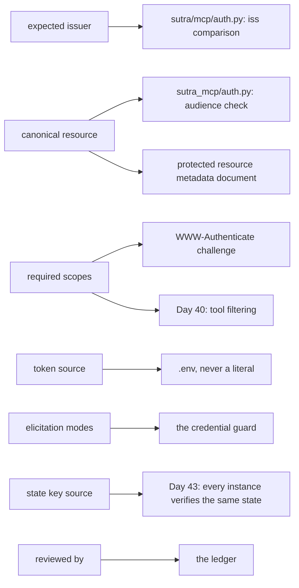

# 6.3 — Seven questions before you ask anybody anything

## One-line answer

Everything this day taught reduces to seven questions with a written answer, and a server that
cannot answer all seven is not ready to hold a token or ask a human anything — which is why the
check starts **red**.

## The story

Moving into a rented flat, you and the landlord walk round with a form.

Every room has a line. The state of the carpet. Whether the boiler works. How many keys you were
given. The meter reading, written in figures. Both of you sign it and you each keep a copy.

It takes a while and it feels like paperwork about nothing, because on the day you move in everything
is obviously fine and you can both see it. The form is not for that day. It is for eighteen months
later, when there is a disagreement about a mark on the carpet and neither of you can remember, and
the only thing anybody has is a line on a piece of paper with a number on it.

The questions are boring on purpose. A question that felt urgent would have been asked anyway.

## The idea in plain language

This day introduced a lot of machinery, and almost all of it has the same failure signature: it works
in every test you write, and the missing piece has no error message. Collected in one place:

- A missing `aud` check ([1.3](../01-the-badge/1.3-a-voucher-for-one-shop.md)) makes every case pass.
- A missing `iss` check ([2.1](../02-issuer-checks/2.1-which-desk-actually-answered.md)) completes the
  flow successfully with an attacker holding the code.
- A `decline` treated as a `cancel` ([3.3](../03-the-question/3.3-three-answers-not-two.md)) is a tool
  that nags, months later.
- An unsigned `requestState` ([3.4](../03-the-question/3.4-the-docket-you-cannot-write-yourself.md))
  accepts every honest retry.
- A missing same-user check ([4.3](../04-out-of-band/4.3-the-link-that-went-to-the-wrong-person.md))
  succeeds all the way to a stored token.
- An unredacted log ([6.1](6.1-the-receipt-that-printed-the-whole-number.md)) is a successful write.

Six mechanisms, zero error messages. You cannot test your way to these, because a test asserts what
somebody thought of, and the whole category is defined by nobody having thought of it.

What does work is a **written answer**. Not code — a decision, recorded, with a name against it. The
questions are chosen so that each one has exactly one right answer for a given deployment and no
default:

| Question | Why it has no default |
| --- | --- |
| Which issuer must `iss` equal? | It comes from the authorization server's validated metadata, per server |
| What canonical URI must a token name as its audience? | It is the URI you published, character for character |
| Which scopes does a caller need? | It is a product decision about who may do what |
| Where does the client read its token from? | Anywhere but `.env` is a Principle 9 violation |
| Which elicitation modes may this server send? | Form-only is a valid, safer answer |
| Where does the `requestState` signing key live? | If the answer is "in the code", the state is forgeable |
| Who reviewed this, by name in the ledger? | An unreviewed security decision is an unmade one |

The last one is the one people cut, and it is the one that makes the rest true. A file of answers
with nobody's name on it is a file somebody generated. The name is what turns it into a decision.

This is deliberately the same shape as
[Day 32's server intake check](../../../day-32-mcp-stateless-core/parts/06-in-production/6.2-before-you-depend-on-a-server.md):
questions as code, an exit code, red until answered. That day asked what you need to know before you
*depend on* somebody else's server. This one asks what you need to know before **your** server holds
a credential or asks a human anything.

## Why Sutra needs it

Because `sutra_mcp` is about to become a thing with a token in it, and Phase 5's gate is at
[Day 38](../../../day-38-failure-and-migration-lab/).

Every answer here is an input to code somebody writes on a later day. The canonical URI is what
`sutra_mcp/auth.py` compares audiences against and what the metadata document from
[1.2](../01-the-badge/1.2-the-refusal-that-carries-directions.md) publishes — and those two must be
the same string or nothing works. The scope list is what [Day 40](../../../day-40-filtering-and-allowlists/)
filters on. The elicitation modes decide whether the credential guard from
[4.2](../04-out-of-band/4.2-the-sheet-in-the-corridor.md) is a backstop or the only line of defence.
The signing key location decides whether [Day 43](../../../day-43-stateless-by-default/)'s deployment
can run more than one instance at all — two instances with different keys cannot verify each other's
state.

And it is red today, on purpose. Every field is `None`. That is not the check failing; it is the check
working, telling you that nobody has decided yet, which is exactly true on the day the file is
created.

## The mechanism

Seven questions with their answers as module-level constants, and a count of how many are still
empty.

```python
# days/day-37-auth-and-elicitation/lab/review.py  (extract)
# Fill these in for the server under review. None means "nobody has answered this yet".
EXPECTED_ISSUER: str | None = None
CANONICAL_RESOURCE: str | None = None
REQUIRED_SCOPES: list[str] = []
TOKEN_SOURCE: str | None = None  # where the client reads its token from
ELICITATION_MODES: list[str] = []  # which modes this server is allowed to send
STATE_KEY_SOURCE: str | None = None  # where the requestState signing key lives
REVIEWED_BY: str | None = None

QUESTIONS: list[tuple[str, object]] = [
    ("which issuer must the iss parameter equal?", EXPECTED_ISSUER),
    ("what canonical URI do tokens have to name as their audience?", CANONICAL_RESOURCE),
    ("which scopes does a caller need?", REQUIRED_SCOPES),
    ("where does the client read its token from?", TOKEN_SOURCE),
    ("which elicitation modes may this server send?", ELICITATION_MODES),
    ("where does the requestState signing key live?", STATE_KEY_SOURCE),
    ("who reviewed this, by name in the ledger?", REVIEWED_BY),
]


def main() -> int:
    open_count = 0
    for question, answer in QUESTIONS:
        filled = bool(answer)
        print(f"[{'x' if filled else ' '}] {question}")
        if not filled:
            open_count += 1
            print("      -> unanswered")
    print()
    print(f"unanswered questions: {open_count}")
    return open_count
```

**Line by line:**

- The answers are **module-level constants at the top of the file**, above the questions, so the file
  reads as a form rather than as a program. Somebody filling it in should not have to understand the
  loop.
- Every one is annotated `str | None` or `list[str]` and initialised empty. `None` is the honest
  starting value: not "false", not "no", but *nobody has answered this*. An empty string would look
  answered to a truthiness check.
- `TOKEN_SOURCE` has an inline comment because the question is ambiguous without one — it means the
  place in the *filesystem or environment*, not the HTTP header. The answer for Sutra is `.env`, and
  writing that down is what makes a future `AUTH_TOKEN = "eyJ..."` in a source file visible as a
  change of answer.
- `ELICITATION_MODES` is a list because *form only* is a real and defensible answer. A server that
  never needs a credential should say so; that turns
  [4.2](../04-out-of-band/4.2-the-sheet-in-the-corridor.md)'s guard from a regex into a policy, and a
  policy is enforceable.
- `QUESTIONS` pairs a human sentence with the constant, and the sentences are written as **questions**
  rather than as field names. `expected_issuer` is a label; *"which issuer must the `iss` parameter
  equal?"* is a thing a person can answer or admit they cannot.
- `bool(answer)` treats `None`, `""` and `[]` all as unanswered with one expression. That is exactly
  right here: an empty list of required scopes is not a decision that no scopes are required, it is a
  blank.
- `main` returns `open_count`, so the exit code is the number of open questions. It starts at **7**
  and it is meant to. A check that starts green teaches nothing, because you never see it change.
- Nothing here validates the *content* of an answer, and that is deliberate. A regex that insisted
  `EXPECTED_ISSUER` looked like a URL would let `"https://example.com"` through as a considered
  answer. The check asks whether a human answered; whether they answered well is what `REVIEWED_BY`
  is for.

Run it:

```bash
python days/day-37-auth-and-elicitation/lab/review.py; echo "exit: $?"
```

**Line by line:**

- From the repository root. The exit code is the number of unanswered questions, so **7 is the
  expected first result** and 0 is the goal. **Zero generations, no network.**

Measured on 2026-09-04, before anything is filled in:

```text
[ ] which issuer must the iss parameter equal?
      -> unanswered
[ ] what canonical URI do tokens have to name as their audience?
      -> unanswered
[ ] which scopes does a caller need?
      -> unanswered
[ ] where does the client read its token from?
      -> unanswered
[ ] which elicitation modes may this server send?
      -> unanswered
[ ] where does the requestState signing key live?
      -> unanswered
[ ] who reviewed this, by name in the ledger?
      -> unanswered

unanswered questions: 7
exit: 7
```

Seven boxes, seven unanswered. That is the correct state of a server that was written this morning,
and the file's whole value is that it says so out loud instead of the server merely not having been
asked.

Where each answer is consumed:



Question 2 feeds two places, and they must agree. That single arrow pair is the most common
misconfiguration in this whole day: a metadata document publishing one canonical URI while the
audience check compares against another, producing 401s that look like a token problem and are a
typo.

## When it breaks

The break at the start is the exit code, and it is the point:

```text
unanswered questions: 7
exit: 7
```

A build step that runs this fails. That is intended for exactly as long as the answers are missing,
and the way to make it pass is to decide, not to delete the check.

The break in the middle is the interesting one — a partially filled form:

```text
[x] which issuer must the iss parameter equal?
[x] what canonical URI do tokens have to name as their audience?
[x] which scopes does a caller need?
[x] where does the client read its token from?
[x] which elicitation modes may this server send?
[x] where does the requestState signing key live?
[ ] who reviewed this, by name in the ledger?
      -> unanswered

unanswered questions: 1
exit: 1
```

Six technical answers and no name. Everything a script can check is present and the one thing only a
person can supply is missing. That is the shape of a security review that was done by whoever
happened to be writing the code, which is not a review.

The break with no error text is the answer that is present and wrong:

```text
[x] where does the requestState signing key live?
```

The value could be `"in sutra_mcp/auth.py"`. It is filled in, the check is green, and the state is
forgeable by anyone who can read the repository. The check has done what it can do — it made somebody
write down where the key lives — and the rest is `REVIEWED_BY` and a human reading the line. Say that
out loud rather than pretending the exit code means more than it does.

## In production

**What a professional writes instead:** the answers are not Python constants. They are a small
committed configuration file — one per environment, since the issuer and the canonical URI differ
between staging and production — and the check is a test in the suite that reads it, so a
deployment cannot ship with a blank. The reviewer's name goes in the ledger, with a date, in the same
commit as the answers. And there is one question this file does not ask that a real one does: *when
was this last reviewed?* An answer from two years ago is a different kind of unanswered.

**What degrades at scale:** the number of forms. One server, one file, fine. Twenty servers and
twenty files drift, and the drift is invisible because each one is individually green. The shape that
survives is a single inventory keyed by server, generated into a report, so the question becomes
*"which of our servers has no reviewer?"* rather than *"is this one fine?"*. That is
[Day 45](../../../day-45-the-mcp-audit/)'s job and it needs today's answers to exist first.

**The failure mode that only appears with real traffic:** the answer that was true. The canonical URI
was right when it was written, then the service moved behind a new hostname and nobody edited the
form. The check stays green because the field is non-empty, and the audience validation starts
failing for real users against a value that used to be correct. A form is a snapshot, and it needs a
date and an owner or it becomes archaeology. That is the same trap
[Day 32's intake check](../../../day-32-mcp-stateless-core/parts/06-in-production/6.2-before-you-depend-on-a-server.md)
has, and it is worth knowing that both share it.

**The review comment a senior engineer leaves:** *"`REVIEWED_BY` is set to the team name. Put a
person. A team cannot be asked why the scope list is what it is, and in six months the point of this
field is that somebody can be asked."*

**The interview question:** *"how do you know an MCP server is safe to deploy?"* The honest answer:
*"you don't, from tests, because the interesting failures in this area have no failing case — a
missing audience check makes every test pass, a missing issuer check completes the flow
successfully, an unsigned state string accepts every honest retry. So we made it a short written
form: which issuer, which canonical resource URI, which scopes, where the token comes from, which
elicitation modes we're allowed to send, where the state signing key lives, and who reviewed it by
name. It starts red — seven unanswered — and the exit code is the count, so it's a build failure
until somebody decides. It doesn't validate the answers and I wouldn't claim it does; what it
guarantees is that a decision was made by a named person rather than defaulted into. The one that
gets cut is the reviewer's name, and it's the one that makes the other six mean anything."*

## Check yourself

```bash
python days/day-37-auth-and-elicitation/lab/review.py; echo "exit: $?"
```

Fill in all seven for `sutra_mcp` as it will exist at the end of Phase 5 and watch the exit code reach
0. Then add an eighth question: *when was this last reviewed?* Decide what an acceptable answer looks
like and whether the check should compare it against a date.

**Out loud, without scrolling up:** name three of the seven questions, and say why a check that starts
green would have been worse than one that starts red.

**Next:** the paper. [`papers/01-issuer-identification.md`](../../papers/01-issuer-identification.md)
— read it now that you have built the check it specifies.
