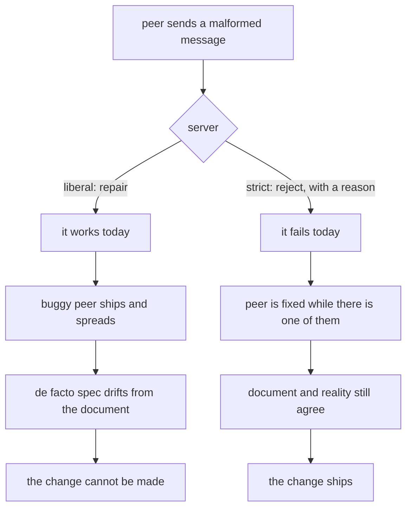

# Maintaining Robust Protocols

> **Maintaining Robust Protocols** · `doi:10.17487/RFC9413` · RFC 9413 · Informational · 2023 ·
> `https://www.rfc-editor.org/info/rfc9413`

## One-line answer

The old advice to *"be liberal in what you accept"* was misread as a licence to tolerate broken
peers, and tolerating them is how a protocol loses the ability to change: this document argues that
long-term interoperability comes from **active maintenance** — exercising extension points, rejecting
the malformed, and deprecating deliberately — rather than from politeness.

## The story

The emergency exit at the back of the hall has not been opened in ten years.

It is there. It is marked. It is on the plan the fire officer signed, and every single person who has
ever walked past it has assumed, quite reasonably, that it opens, because that is what a door with a
push bar is for.

Over the years it was painted twice, and both times somebody painted over the frame rather than
around it. A stack of chairs lives against it, because it is the only wall with nothing on it. The
bar is stiff, but nobody has pushed it hard enough to find that out.

On the day of the drill, four people put their weight on it and it does not move.

Nothing broke. There was no moment when the door failed. It was never *used*, and the not-using is
what made it useless — slowly, invisibly, by degrees, while everyone involved was being sensible.

## The idea in plain language

There is a piece of advice at the centre of Internet engineering, usually called the **robustness
principle** and quoted as *"be conservative in what you send, and liberal in what you accept."* It
sounds like plain good manners. Send clean data; put up with messy data. Everyone gets along.

The document's abstract says exactly where that goes wrong:

> "The robustness principle, often phrased as 'be conservative in what you send, and liberal in what
> you accept', has long guided the design and implementation of Internet protocols. However, it has
> been interpreted in a variety of ways. While some interpretations help ensure the health of the
> Internet, others can negatively affect interoperability over time."

Here is the mechanism it is pointing at, in plain terms.

A protocol has a rule: field X is required. One implementation has a bug and omits it. A tolerant
server repairs the omission and carries on, so nothing fails and nobody finds out. The buggy
implementation ships, is deployed widely, and works — because the tolerance is holding it up.

Now the protocol wants to change. Field X gains a meaning. And it cannot, because there is a
population of peers in the wild that do not send X, and the tolerant servers cannot tell "this peer
means the default" from "this peer is broken". The change has to be abandoned or hedged. The extension
point is painted shut.

The words for this are worth having:

- **Ossification** is a protocol losing the ability to change, because too much deployed software
  depends on how it currently behaves rather than on what it says.
- The **de facto specification** is what implementations actually accept, as opposed to what the
  document says. Every act of tolerance moves the first one further from the second, and the first one
  is the one that governs.
- **Grease** is the practice of deliberately sending values a peer must ignore, so that peers which
  cannot ignore them are found immediately rather than at the next change.

The document's own answer, and the thing that makes it more than a complaint, is in the abstract's
first two sentences: *"The main goal of the networking standards process is to enable the long-term
interoperability of protocols. This document describes active protocol maintenance, a means to
accomplish that goal."*

That is the move. Not "be strict instead of liberal" as a slogan, but: **a protocol stays usable
because people work on it**, and tolerance is a substitute for that work which appears to succeed
right up until the moment it fails permanently.

## Why Sutra needs it

Two of this day's sections turn out to be the same argument seen from two ends, and this document is
the thing that joins them.

**Section 2 is the strictness half.** [2.1](../parts/02-the-x-ray/2.1-five-questions-before-you-believe.md)
argued for five checks at the boundary and quarantine on failure, and the case made there was purely
defensive: a stranger's bug should not raise an exception in your triage loop. This document supplies
the second, larger reason. A client that quietly repairs a malformed reply is not only risking a wrong
answer today — it is *removing the signal* that would have got the server fixed, and adding one more
peer whose behaviour the protocol now has to accommodate.

**Section 4 is the maintenance half.** [4.1](../parts/04-the-leaving-list/4.1-a-feature-with-a-leaving-date.md)
described MCP's lifecycle policy — Active, Deprecated, Removed, a twelve-month floor, a public
registry — and it is easy to read that as bureaucracy. Read against this document it is the opposite:
it is the machinery that lets a protocol remove things at all. Without a deprecation process, features
never leave, and a protocol that cannot shed anything eventually cannot add anything either.

And there is a third connection this day measured directly.
[6.1](../parts/06-in-production/6.1-two-ways-a-removal-meets-you.md) found that `mcp` 2.1.1 removed
`mcp.server.fastmcp` and left a nine-line module that raises with the new import line and a link.
That is active maintenance at the scale of a library: a removal that was *worked on* rather than
merely performed. The contrast with `mcp.shared.version`, removed with no signpost, is this
document's thesis reproduced inside one package.

Read this **after** the parts, not before. That order is Principle 4 at the scale of a day: you have
now watched a tolerant client accept five malformed replies, watched a strict one name all five, and
watched a registry turn a removal into a date. The paper is the argument you can finally weigh, rather
than a position you would have taken on trust.

## The mechanism

The method has four parts. They are not four opinions; they are four things somebody does, and each
one has a cost.

**1. Exercise the extension points.** A field that is defined and never used is a field nobody's code
path has run. The remedy is to use it — send values through it in ordinary traffic, so that peers
which mishandle it are discovered while the population of such peers is small. This is where grease
comes from: if the protocol has a slot for values you must ignore, put something in it, always, and
find the peers that choke.

**2. Reject the malformed, and say so.** Tolerance is not free even when it works. Every repair is a
decision to accept something the specification forbids, and the accepted thing becomes part of what
the next implementer has to support. Rejection produces a bug report; repair produces a dependency.

**3. Feed the errors back.** Strictness is only useful if somebody hears about it. An implementation
that rejects silently has converted a fixable bug into an unexplained failure, which is why
[2.1](../parts/02-the-x-ray/2.1-five-questions-before-you-believe.md) insisted the boundary produce a
**named** diagnosis rather than a log line. A rejection you can put in a ticket is maintenance; a
rejection you cannot is just an outage with better manners.

**4. Deprecate deliberately.** Things do have to leave, and the way they leave decides whether the
protocol can keep moving. A published state, a window long enough to plan against, a named
replacement that already exists — which is precisely MCP's SEP-2596 policy, and precisely what
[4.1](../parts/04-the-leaving-list/4.1-a-feature-with-a-leaving-date.md) measured as `327 days`.

Underneath all four is one reframing that is worth stating on its own. The robustness principle is
usually read as advice to an *implementation*: what should this program do with this message? The
document reads it as advice about an *ecosystem over time*: what does this program's behaviour do to
the protocol's future? Those two readings recommend opposite things in the same situation, and only
the second one accounts for why the door will not open.

The shape of the two futures:



The left branch is the one that looks better at every individual step, which is the whole difficulty.
Nobody chooses ossification. It is assembled out of a long series of individually kind decisions.

## The paper in one demo

Two files, one small protocol, and one flag that turns the paper's claim off.

The protocol: a request is `{"v": 1, "op": "sum", "args": [...], "ext": {}}`. The `ext` field is the
extension point. In version 1 it carries nothing and means nothing — and every peer is **required** to
send it anyway, empty but present. That requirement is the paper's first recommendation written as a
rule.

The fleet: three peers, which is enough to have one of each kind that matters. `tidy` follows the
specification. `sloppy` omits `ext` — an ordinary bug. `brittle` sends `ext` correctly but cannot cope
with an unknown key in a *response*.

The timeline: era 1 runs version 1. Then a year passes and era 2 runs version 2, where
`ext: {"units": "cents"}` means the amounts arrive in hundredths. The extension point finally has a
job.

```text
lab/papers/maintaining-robust-protocols/
├── peer.py   # the server: one handler, and the strict/liberal decision
└── run.py    # the fleet, the two eras, and the ablation
```

Both files are given whole. The first one is the server, and it holds the four lines that are the
entire experiment:

```python
# days/day-38-failure-and-migration-lab/lab/papers/maintaining-robust-protocols/peer.py
"""RFC 9413 in one file: a server that is liberal, or one that is not.

The protocol is three fields wide. A request is

    {"v": 1, "op": "sum", "args": [1, 2, 3], "ext": {}}

`ext` is the extension point. In v1 it carries nothing and means nothing, and
every peer is required to send it - empty, but present. That requirement is the
entire subject of the paper: an extension point that is never exercised is a
field nobody's code path has ever touched, and the day you give it a meaning you
find out which peers were quietly ignoring it.

STRICT decides one thing: what the server does with a request that omits `ext`.
"""

from __future__ import annotations

import random

CURRENT_VERSION = 1

# Greasing: on every response the server adds one unknown key with a random name, so
# that a peer which cannot survive an unknown key fails today rather than at the bump.
GREASE_NAMES = ["x-grease-a1", "x-grease-b7", "x-grease-c3", "x-grease-d9"]


class Reject(ValueError):
    """The request was refused, and the message says which rule it broke."""


def handle(
    request: dict, *, strict: bool, version: int = CURRENT_VERSION, grease: bool = True
) -> dict:
    """Answer one request. `strict` decides whether a missing `ext` is an error.

    Args:
        request: the peer's message.
        strict: reject anything the protocol does not permit, rather than repairing it.
        version: the protocol version this server is running.
        grease: add one unknown key to the response, to exercise the peer's tolerance.

    Returns:
        The response message.

    Raises:
        Reject: naming the rule broken, when strict.
    """
    if request.get("v") != version:
        raise Reject(f"unsupported version {request.get('v')!r}; this server speaks {version}")

    if "ext" not in request:
        if strict:
            raise Reject("required field 'ext' is missing")
        request = {**request, "ext": {}}  # the liberal repair, and the whole problem

    ext = request["ext"]
    scale = 100 if (version >= 2 and ext.get("units") == "cents") else 1
    total = sum(request["args"]) * scale

    response = {"v": version, "total": total, "ext": {}}
    if grease:
        response["ext"][random.choice(GREASE_NAMES)] = "ignore me"
    return response
```

**Line by line:**

- The module docstring writes the protocol out in one line — `{"v": 1, "op": "sum", "args": [1, 2, 3],
  "ext": {}}` — because a demo whose protocol you have to reconstruct from the parser is a demo you
  cannot argue with. Three fields and an extension point is the smallest protocol that can ossify.
- `import random` is the only import in the file, and it exists purely for grease. There is no
  networking, no serialisation library and no framework: the "wire" is a Python dictionary, because
  the paper's claim is about *what peers accept over time*, not about bytes.
- `CURRENT_VERSION = 1` is a module constant rather than a default buried in a signature, so that era
  2 changing it is a visible act.
- `Reject(ValueError)` carries no fields of its own. Its message is the payload, and naming the rule
  in the message is recommendation 3 — feed the error back — reduced to its smallest possible form.
- `strict`, `version` and `grease` are **keyword-only** (after the `*`), because all three are booleans
  or small integers at the call site and `handle(request, True, 2, True)` would be unreadable. This is
  a house-style point and it matters here because the whole demo is about which flag is set.
- `if request.get("v") != version` is version checking, and it is deliberately the *only* thing that
  is strict in both arms. A protocol that cannot even agree on its version number has nothing to
  discuss, so this rejection is not the variable being tested.
- The three lines under `if "ext" not in request` are the paper. In the strict arm a missing required
  field is an error with a name. In the liberal arm it is repaired — `{**request, "ext": {}}` — and
  the repair is invisible, costs nothing, and is the kind thing to do.
- `scale = 100 if (version >= 2 and ext.get("units") == "cents") else 1` is where the past comes due.
  In version 1 this line always yields `1`, so `ext` genuinely does not matter. In version 2 it is the
  only line that reads `ext`, and it cannot distinguish *"this peer did not ask for cents"* from
  *"this peer never sends `ext` at all"*, because the repair already erased the difference.
- `response["ext"][random.choice(GREASE_NAMES)] = "ignore me"` is grease, and it is on the **response**
  rather than the request so that it tests the *peers*. One unknown key, on every reply, whose only
  purpose is to be ignored. A peer that cannot ignore it is a peer that will break at the next
  extension, and grease finds it now instead.
- `grease` is a separate parameter from `strict` so that the two ideas are separable in the code, and
  `run.py` ties them together deliberately: greasing is part of the maintenance package, not a
  different topic.
- `Reject` is a plain `ValueError` subclass. The message names the rule that was broken, which is
  recommendation 3 — a rejection that cannot be acted on is not maintenance.

The second file is the fleet and the two eras, and it is given whole in three pieces so that each one
gets its own walkthrough. First the header, the fleet, and the round trip:

```python
# days/day-38-failure-and-migration-lab/lab/papers/maintaining-robust-protocols/run.py
"""RFC 9413's claim, run twice: tolerance now is a version bump you cannot make later.

Two eras of one three-peer fleet.

  era 1  the server speaks v1. `ext` is required, empty and meaningless.
  era 2  a year on, the server speaks v2, where `ext: {"units": "cents"}` means
         the amounts arrive in cents. `ext` finally has a job.

    STRICT=0   the era-1 server repairs a request that omits `ext`, and does not grease
    STRICT=1   the era-1 server rejects it, and greases every response

Run both. The interesting number is not era 1 - it is what era 2 costs.

    STRICT=1 python run.py
"""

from __future__ import annotations

import os
import random

from peer import Reject, handle

STRICT = os.environ.get("STRICT", "0") == "1"

# Each peer is one implementation somebody else wrote. `sends_ext` and `tolerates_unknown`
# are the two ways an implementation can quietly disagree with the specification.
FLEET = [
    {"name": "tidy", "sends_ext": True, "tolerates_unknown": True},
    {"name": "sloppy", "sends_ext": False, "tolerates_unknown": True},
    {"name": "brittle", "sends_ext": True, "tolerates_unknown": False},
]

ARGS = [3, 4, 5]  # twelve dollars, or twelve hundred cents


def call(peer: dict, *, version: int, strict: bool, units: str | None) -> tuple[str, int | None]:
    """One round trip. Returns (outcome, total) - `total` is None when it failed."""
    request: dict = {"v": version, "op": "sum", "args": ARGS}
    if peer["sends_ext"]:
        request["ext"] = {"units": units} if units else {}

    try:
        response = handle(request, strict=strict, version=version, grease=strict)
    except Reject as exc:
        return f"REJECTED: {exc}", None

    unknown = [k for k in response["ext"] if not k.startswith("units")]
    if unknown and not peer["tolerates_unknown"]:
        return f"peer crashed on unknown response key {unknown[0]!r}", None
    return "ok", response["total"]
```

**Line by line:**

- `from peer import Reject, handle` is the only coupling between the two files. The server knows
  nothing about the fleet and the fleet knows nothing about the server's internals, which is what lets
  `peer.py` be read on its own as "the protocol" and `run.py` as "the world it runs in".
- `STRICT` is read from the environment once, at import, so both `call` and `main` see the same value
  and the ablation cannot be half-applied.
- A peer is a **dictionary of two booleans**, not a class. Everything that distinguishes these three
  implementations is captured by "does it send the field" and "does it survive an unknown one", and
  anything more would be a file you could delete without weakening the claim.
- `if peer["sends_ext"]` is `sloppy`'s entire bug: one missing key. Not malice, not a design
  disagreement — a field somebody forgot, which is how this always happens.
- `grease=strict` in the `handle` call is the line that ties the two recommendations together. The
  strict server also greases; the liberal one does neither. That is deliberate: they are two halves of
  *active maintenance*, and separating them in the demo would let a reader conclude that strictness
  alone is the point.
- The `unknown` check simulates the peer's own parser. A real brittle client would raise on the
  unexpected key somewhere inside its deserialiser; here it is four lines, because the interesting
  thing is *when* it is discovered, not how it fails.
- `not k.startswith("units")` excludes the field the peer legitimately expects, so the check is about
  unknown keys rather than all keys.
- `return ... , None` on both failure paths, so the caller can distinguish "no answer" from "wrong
  answer" — which turns out to be the whole difference between the two eras in the liberal arm.

Then one era, run over the whole fleet:

```python
def era(title: str, *, version: int, units: str | None, expected: int) -> tuple[int, list[str]]:
    """Run the whole fleet once; report how many were right and which ones failed loudly."""
    print(f"{title}")
    right = 0
    failed: list[str] = []
    for peer in FLEET:
        outcome, total = call(peer, version=version, strict=STRICT, units=units)
        if total is None:
            verdict = "FAILED"
            failed.append(peer["name"])  # a loud failure is a bug report with an address
        elif total != expected:
            verdict = f"WRONG (got {total}, wanted {expected})"
        else:
            verdict = "correct"
            right += 1
        print(f"  {peer['name']:8s} {verdict:34s} {outcome}")
    print(f"  peers with the right answer: {right}/{len(FLEET)}")
    return right, failed
```

**Line by line:**

- The three branches are the three outcomes that matter, and keeping them **separate** is the whole
  reason this function is not two lines. `FAILED` means no answer. `WRONG` means an answer that is
  not the right one. `correct` means what it says. A demo that collapsed the first two into "did not
  work" would hide era 2's entire finding, because era 2's liberal arm produces `WRONG`, not `FAILED`.
- `failed.append(...)` happens **only** in the `total is None` branch, never in the `WRONG` branch.
  That is deliberate and it is the paper's mechanism: a loud failure produces a name somebody can
  act on, and a quiet wrong answer produces nothing at all. `sloppy` is in `failed` in the strict arm
  and not in the liberal arm, despite being equally broken in both.
- `return right, failed` gives the caller both numbers it needs: how well the fleet did, and who is
  going to get a bug report.

And the timeline, including the one loop that models what a rejection is actually *for*:

```python
def main() -> None:
    """Era 1, the repairs it did or did not force, then era 2."""
    random.seed(9413)  # so the grease key in the transcript is reproducible
    print(
        f"era-1 server: {'STRICT - reject and grease' if STRICT else 'LIBERAL - repair and stay quiet'}\n"
    )

    _, failed = era("era 1 - v1, `ext` carries nothing", version=1, units=None, expected=sum(ARGS))

    # A rejection is a bug report with an address on it, so it gets fixed. Silence is not.
    # Only the peers that FAILED get repaired - a peer nobody complained about stays as it is.
    for peer in FLEET:
        if peer["name"] in failed:
            peer["sends_ext"] = True
            peer["tolerates_unknown"] = True
    print(f"\n  peers fixed before era 2: {failed or 'none - nothing complained'}\n")

    right, _ = era(
        "era 2 - v2, `ext.units` now means something",
        version=2,
        units="cents",
        expected=sum(ARGS) * 100,
    )
```

**Line by line:**

- The repair loop is the causal claim of the whole demo, and it is worth being explicit that it is an
  assumption rather than a measurement: **a failure that is reported gets fixed, and silence does
  not.**
- It is keyed on `failed`, the list `era` returns of peers that failed **loudly**, and not on the
  peers' own attributes. That distinction is the honest version: a peer is repaired because somebody
  found out about it, never because the script knows it is broken. In the liberal arm `failed` is
  empty, so nothing is repaired — not because tolerance is being punished, but because tolerance
  produced no information.
- `failed or 'none - nothing complained'` prints either the list of implementations that had to do
  work or the reason none did. That list is the cost of strictness, stated honestly: two teams were
  interrupted.
- `expected=sum(ARGS) * 100` in era 2 is what makes a *wrong* answer detectable. Without an expected
  value the liberal arm's era 2 looks like a success, because every peer got an answer.

Run both arms:

```bash
cd days/day-38-failure-and-migration-lab/lab/papers/maintaining-robust-protocols
STRICT=0 uv run python run.py
STRICT=1 uv run python run.py
```

**Line by line:**

- `STRICT=0` is the robustness principle read as tolerance. `STRICT=1` is active maintenance: reject
  the malformed, and grease the extension point.
- `random.seed(9413)` inside the script fixes which grease key is chosen, so the transcript below
  reproduces exactly.
- **Zero model calls, no network, no dependencies.** The standard library and two files.

Measured on 2026-09-04, `STRICT=0`:

```text
era-1 server: LIBERAL - repair and stay quiet

era 1 - v1, `ext` carries nothing
  tidy     correct                            ok
  sloppy   correct                            ok
  brittle  correct                            ok
  peers with the right answer: 3/3

  peers fixed before era 2: none - nothing complained

era 2 - v2, `ext.units` now means something
  tidy     correct                            ok
  sloppy   WRONG (got 12, wanted 1200)        ok
  brittle  correct                            ok
  peers with the right answer: 2/3

verdict: the v2 bump is rolled back. The extension point has rusted shut.
```

And `STRICT=1`:

```text
era-1 server: STRICT - reject and grease

era 1 - v1, `ext` carries nothing
  tidy     correct                            ok
  sloppy   FAILED                             REJECTED: required field 'ext' is missing
  brittle  FAILED                             peer crashed on unknown response key 'x-grease-b7'
  peers with the right answer: 1/3

  peers fixed before era 2: ['sloppy', 'brittle']

era 2 - v2, `ext.units` now means something
  tidy     correct                            ok
  sloppy   correct                            ok
  brittle  correct                            ok
  peers with the right answer: 3/3

verdict: the v2 bump ships. The extension point still moves.
```

Read era 1 first, and read it as somebody choosing a design. **Liberal scores 3/3. Strict scores
1/3.** If you evaluate the two servers on the day they ship, tolerance wins outright and strictness
looks like an own goal — two working integrations broken by a server being pedantic about a field that
carries nothing.

Now era 2. `sloppy` gets `12` where it should get `1200`, and note the outcome column: it says `ok`.
There was no error. The request was accepted, the answer was well-formed, and it was wrong by a factor
of a hundred — which is
[3.1](../parts/03-the-quiet-ones/3.1-the-answer-about-the-wrong-ticket.md)'s silent failure, arriving
this time as a direct consequence of a kindness done a year earlier.

And `brittle` in the strict arm is worth its own sentence. It was not malformed. It sent everything it
was supposed to send. It was found only because the server put a key it did not recognise in a reply
and watched what happened — which is grease doing precisely the job recommendation 1 describes, on a
peer no amount of input validation would have caught.

## When it breaks

The document is Informational, not a standard, and its advice has limits worth naming rather than
reciting.

**Strictness has a cost, and the demo shows it as a number.** `1/3` in era 1 is two broken
integrations, on day one, for a rule about a field that carried nothing. If those two peers belong to
customers rather than to colleagues, "we rejected you correctly" is a conversation, and the strict arm
only wins because somebody then *did the work*. Where the ecosystem will not do the work — a peer that
shipped in a device and will never be updated — strictness produces a permanent outage rather than a
fix, and the honest answer is a compatibility path with an end date rather than a principle.

**It assumes a maintained ecosystem.** The whole argument rests on the `if STRICT` line in `run.py`:
a rejection produces a fix. That holds where implementers are reachable and motivated. It does not
hold for firmware, for abandoned libraries, or for a partner who has moved on — and the more of those
in your population, the more the document's advice has to be applied to *new* deployments rather than
to existing ones.

**Grease is not free either.** Sending values peers must ignore costs bytes on every message and adds
a code path that has to be correct. It also only works if it is done from the beginning: introducing
grease into a mature protocol finds every brittle peer at once, which is an incident rather than a
maintenance practice.

**And the failure it describes takes years, which is the reason it keeps happening.** Nobody in the
liberal arm made a mistake they could see. The repair was one line, it fixed a real problem, and the
bill arrived in era 2 for a person who may not have been there in era 1. Advice whose payoff is a year
out competes badly against a bug that is open today, and no amount of being right about the mechanism
changes that.

## In production

**What survived.** The reframing did: *"be liberal in what you accept"* is now widely treated as
advice that needs qualification rather than as a maxim, and the phrase "the robustness principle
considered harmful" is a normal thing to hear in a protocol design discussion. Grease survived and
became standard practice — it is why TLS 1.3 deployed at all, after a generation of middleboxes had
ossified TLS 1.2 by rejecting anything they did not recognise. Strictness-as-maintenance survived in
the form of conformance suites and interoperability events, where the point of the exercise is to fail
implementations early.

And **deliberate deprecation** survived, which is the part this day is standing in. MCP's SEP-2596
policy — three states, a public registry, a twelve-month floor, a named migration path that must
already be Active — is exactly recommendation 4 written as governance. That policy was adopted in
2026, three years after this document, in a protocol with no connection to the RFC series. The idea
travelled.

**What did not.** The document does not give you a rule you can apply. It has no test for how strict
is strict enough, and the recommendation "reject the malformed" is unhelpful against a peer you cannot
afford to reject — which is most of the interesting cases. In practice implementations still tolerate
a great deal, and what has actually changed is that the tolerances are now more often *written down*:
a documented list of accepted deviations, with owners and end dates, instead of an accumulation of
undocumented repairs. That is a smaller win than the document argues for and it is a real one.

The other thing that did not survive is the hope that ossification is avoidable by good behaviour
alone. The main defence deployed since is not politeness in either direction — it is **encryption**.
Protocols that want to stay changeable now hide their extension points from middleboxes entirely, so
that no intermediary is able to depend on them. That is a stronger remedy than active maintenance and
it is an admission that maintenance alone was not enough.

**The review comment a senior engineer leaves:** *"we are silently defaulting this field when a client
omits it. That is convenient today and it is how we lose the ability to give the field a meaning
later. Reject it with a message naming the field, tell the two clients that are getting it wrong, and
if we genuinely cannot reject it then write the exception down with an owner and an end date."*

**The interview question:** *"is 'be liberal in what you accept' good advice?"* An answer that shows
you have thought about time: *"it is good advice about a message and bad advice about an ecosystem.
RFC 9413 is the write-up. If you repair a peer's malformed input, it works today, that peer ships,
and now the thing you tolerate is part of the de facto specification — so the day you want to give
that field a meaning, you cannot, because you cannot tell a peer that means the default from a peer
that is broken. We ran it as a two-era simulation: the tolerant server scores three out of three on
day one and the strict one scores one out of three, and a year later the tolerant one produces a
wrong answer with no error attached and the version bump gets rolled back. The counter-argument I take
seriously is that strictness only pays if somebody fixes the peers, so for a population you cannot
reach it is not available — and that is roughly why the industry's actual answer to ossification ended
up being encryption rather than manners."*

## Check yourself

```bash
cd days/day-38-failure-and-migration-lab/lab/papers/maintaining-robust-protocols
STRICT=0 uv run python run.py
STRICT=1 uv run python run.py
```

Now set `grease=False` in `run.py`'s `handle` call while leaving `strict` as it is, and run the strict
arm. `brittle` passes era 1 and passes era 2, because nothing in this protocol version ever sends it
an unknown key — and it is still broken. Say what would have to change in era 3 to find it, and say
what that tells you about testing an extension point you are not yet using.

**Out loud, without scrolling up:** say what a tolerant server takes away from a protocol, in one
sentence that does not use the word "ossification". Then say which era of the demo you would have to
be standing in to prefer the strict server.
