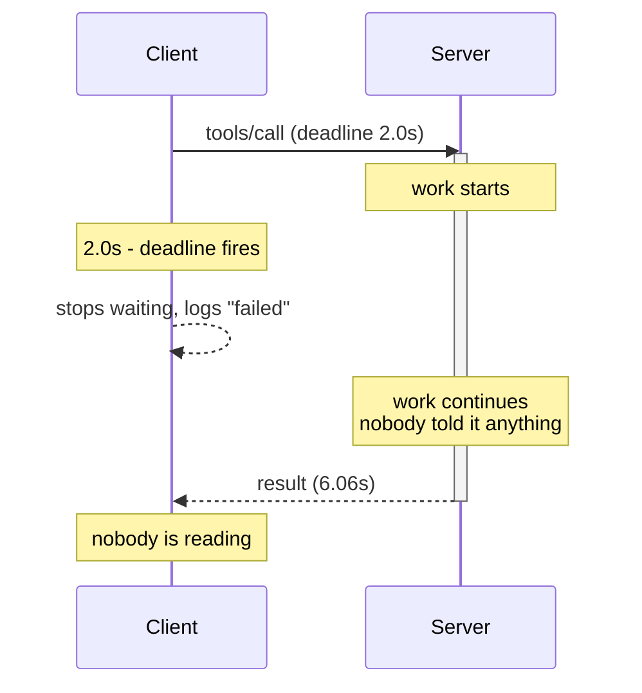

# 1.2 — Giving up ends the wait, not the work

## One-line answer

A timeout is a decision the caller takes on its own side of the wire, so the server is never told,
never notices, and finishes the work anyway — which means every side effect that call was going to
have still happens, after you stopped listening.

## The story

You booked a taxi and it did not come.

After twenty-five minutes of watching a little car icon not move, you gave up, walked to the main
road and got a bus. You did not cancel the booking, because by then you were already on the bus and
it did not seem to matter.

It mattered. The driver arrived at your gate ten minutes later, waited, rang the bell twice, waited
some more, and then started the meter and closed the trip. Nobody told him you had gone. He did the
whole job — the drive across town, the waiting, the paperwork — for a passenger who was not there.
The charge appeared on your card that evening.

You had not thought of it as a thing with two halves. You thought "I gave up" and "the taxi did not
happen" were the same sentence. They are not. The first one is about you. The second one is about
him, and he never heard about the first one.

## The idea in plain language

A **side effect** is any change a call makes to the world that outlives the call: a row written, an
email sent, a file moved, money taken. A **pure read** has none — asking what a ticket's status is
changes nothing.

When your deadline fires, exactly one thing happens: your code stops waiting. That is all. Your
process moves on. Nothing travels back down the wire, and nothing on the server side is interrupted,
because the server is not watching your clock — it does not know your clock exists.

So the work continues. If the work was a pure read, the only cost is wasted effort on a machine you
do not own. If the work had side effects, they all still happen, and now they happen **invisibly**,
because the one process that was going to see the result has walked away.

This is why "did the call succeed?" and "did the work happen?" are two different questions, and why
a timeout can only answer the first. There is a name for the state you are left in: **unknown**. Not
failed. Unknown. A client that treats a timeout as a failure has made a claim it cannot support.

[3.2](../03-the-quiet-ones/3.2-the-ticket-closed-twice.md) is what happens when you act on that claim
anyway.

## Why Sutra needs it

Sutra's tools are not all reads. Day 34 put `lookup_ticket` and `search_kb` over the wire, and both
are safe to abandon. But the desk exists to *do* things: Day 37's flow gates a `close_ticket` that
emails the customer, and Phase 6 puts a real SQLite database behind the tools on
[Day 39](../../../day-39-database-tools/LESSON.md). The moment a tool writes, a timeout stops being
an inconvenience and becomes an unresolved question about the state of the world.

The concrete version: a support agent asks Sutra to close a ticket. The MCP call times out at two
seconds. Sutra tells the agent it failed. The agent closes it by hand. The customer receives two
emails, because the first call finished at 2.4 seconds and did exactly what it was asked to do.

Nothing in that story is a bug in anyone's code. Every component behaved correctly. The bug is the
assumption that giving up cancels anything.

## The mechanism

> 🎬 **The scene:** you set a two-second deadline on a `tools/call`, exactly as
> [1.1](1.1-the-only-clock-is-yours.md) taught. The call times out. You write a line in the log that
> says the call failed, and move on.
>
> 😬 **The naive fix:** treat the timeout as a failure and retry, or tell the user it did not work.
> Both are the obvious reading of "it timed out".
>
> 💥 **Why it fails:** the server never received a cancellation, because you never sent one and there
> is nothing to send on a pipe. It is still working. It finishes at 6.06 seconds and writes whatever
> it was going to write. Your log line now says something false about the world.
>
> 💡 **The insight:** a timeout ends *your wait*. It does not end *the work*. Until you have some
> other evidence, the correct word for the outcome is not "failed" — it is "unknown".

The experiment is to give up first and then keep watching the server you abandoned:

```python
# days/day-38-failure-and-migration-lab/lab/oblivious.py
DEADLINE = float(os.environ.get("DEADLINE", "2.0"))
WATCH_FOR = 8.0  # how long we keep watching the server after we have given up
REQUEST = {"jsonrpc": "2.0", "id": 7, "method": "tools/list", "params": {}}


def main() -> None:
    """Give up early, then keep watching the server we abandoned."""
    proc = subprocess.Popen(
        [sys.executable, "slow_server.py", "slow"],
        stdin=subprocess.PIPE,
        stdout=subprocess.PIPE,
        stderr=subprocess.PIPE,
        text=True,
    )
    started = time.monotonic()
    replies: list[str] = []
    threading.Thread(target=lambda: replies.append(proc.stdout.readline()), daemon=True).start()

    proc.stdin.write(json.dumps(REQUEST) + "\n")
    proc.stdin.flush()
    print(f"t=0.00s   client sent tools/list, deadline {DEADLINE}s")

    time.sleep(DEADLINE)
    print(f"t={time.monotonic() - started:.2f}s   client GAVE UP and stopped waiting")

    # We do NOT kill the server. We just stop caring - which is all a timeout is.
    deadline_for_watching = time.monotonic() + WATCH_FOR
    while time.monotonic() < deadline_for_watching:
        line = proc.stderr.readline()
        if not line:
            break
        print(f"t={time.monotonic() - started:.2f}s   {line.strip()}")
        break

    print(f"t={time.monotonic() - started:.2f}s   reply arrived on stdout: {bool(replies)}")
    proc.kill()
```

**Line by line:**

- `stderr=subprocess.PIPE` is the new argument compared with
  [1.1](1.1-the-only-clock-is-yours.md)'s client. It is how the experiment sees the server's own
  account of what it did, and it is only possible because `slow_server.py` announces its finish on
  stderr rather than stdout — the one channel a stdio server may use for prose.
- `time.sleep(DEADLINE)` stands in for the deadline instead of `join(timeout=...)`. Here the point is
  not to demonstrate the timeout mechanism — 1.1 did that — but to be precise about the moment we
  stop caring, so the timestamps line up.
- **`proc.kill()` is deliberately not called at the deadline.** This is the most important line that
  is not there. Killing the child would make the demonstration a lie, because a timeout does not kill
  anything on the other side. It just stops the reading.
- `replies` is filled by the background thread if the answer ever lands. We never read it as a
  result; we only ask at the end whether it arrived, which is the difference between "the reply came
  and nobody was listening" and "the reply never came".
- The `while` loop with a `break` at the bottom reads exactly one stderr line and stops. It is
  written as a loop rather than a bare `readline()` so that `WATCH_FOR` bounds it — the watcher needs
  its own clock for the same reason the client did, which is 1.1 applied to the tool built to teach
  1.1.
- `f"{time.monotonic() - started:.2f}s"` on every line, because the argument of this part is entirely
  about *when* two things happened relative to each other. A transcript without timestamps would
  prove nothing.

Run it:

```bash
cd days/day-38-failure-and-migration-lab/lab
uv run python oblivious.py
```

**Line by line:**

- Same directory as before; `oblivious.py` launches `slow_server.py` by relative path.
- No environment variable to set: the default deadline of two seconds is already shorter than the
  server's six, which is the whole configuration this experiment needs. **Zero model calls.**

Measured on 2026-09-04:

```text
t=0.00s   client sent tools/list, deadline 2.0s
t=2.00s   client GAVE UP and stopped waiting
t=6.06s   [server] work finished for id=7
t=6.06s   reply arrived on stdout: False
```

Read the third line again. Four seconds after the client stopped waiting, the server announced that
it had finished the work — the work the client believes did not happen. And the last line says the
reply did land on stdout, unread, because `replies` is still empty at the moment we ask but the
server has already written to a pipe nobody is draining.

Here is the sequence, because it is easier to hold as a picture:



Nothing crosses the wire at the two-second mark. That empty gap is the entire lesson.

## When it breaks

The visible break is downstream, and it arrives as a support complaint rather than a stack trace.

On stdio there is a second, sharper version. If your client kills the child process at the deadline
instead of merely ignoring it — which is the tidy thing to do, and 1.1's `deadline.py` does it —
then the work is genuinely interrupted, but at an arbitrary point. A tool that had written the ticket
row and not yet written the audit row is now a half-finished write with nothing recording that it
happened. On HTTP you cannot even do that: closing the stream is a hint, not a kill
([1.3](1.3-hanging-up-is-the-message.md)).

The error text you eventually meet is not from the timeout at all. It is from the second attempt:

```text
sqlite3.IntegrityError: UNIQUE constraint failed: ticket_events.event_id
```

That is the good case, and it is only good because somebody put a unique constraint on the table. The
bad case has no constraint, produces no error, and shows up as two rows.

The smallest fix is not on the client. It is to make the operation **idempotent** — safe to run twice
with the effect of running once — by giving the request a key the server remembers.
[3.2](../03-the-quiet-ones/3.2-the-ticket-closed-twice.md) builds that, and it is the reason this
part comes before it.

## In production

**What a professional writes instead:** a timeout that produces *three* outcomes, not two. Success,
definite failure (the server said no), and **unknown** (we stopped waiting). Unknown is not a
failure, it is not retried blindly, and it is not reported to a user as "that did not work". It goes
to a reconciliation path: ask the server what actually happened, or wait for the operation's own
record to show up. Systems that only have success and failure end up lying on every timeout.

**What degrades at scale:** wasted capacity that is invisible in every dashboard. If a service times
out ten percent of its calls and each abandoned call does its work anyway, ten percent of the
downstream server's capacity is being spent producing results nobody reads — and the downstream
server's metrics look *healthy*, because from its point of view every request succeeded. The two
sides disagree about the error rate and both are telling the truth.

**The failure mode that only appears with real traffic:** the retry storm that follows a latency
spike. A dependency slows down, deadlines start firing, clients retry, the extra load slows the
dependency further, and more deadlines fire. Every abandoned call is still being executed, so the
server is now doing several times its normal work while its callers see nothing but timeouts. It
recovers when the callers stop, not when the server does.

**The review comment a senior engineer leaves:** *"this logs `call failed` on a timeout. We do not
know that it failed. Say `unknown` and route it to reconciliation, or tell me why it is safe to
assert something we cannot observe."*

**The interview question:** *"your write times out. Did the write happen?"* The answer that shows you
have been here: *"I do not know, and neither does the client — that is the honest state, and the
first thing I do is stop pretending otherwise. We watched it on a rig: client gives up at two
seconds, server announces it finished at 6.06, and nothing crossed the wire in between. So the
handling is in two parts. Make the operation idempotent with a request key so a retry is safe, and
have a third outcome in the code for `unknown` so we never tell a user something failed when what we
mean is that we stopped listening."*

## Check yourself

```bash
cd days/day-38-failure-and-migration-lab/lab
DEADLINE=6.5 uv run python oblivious.py
```

With a deadline longer than the server's work, the finish line arrives before the giving-up line and
the transcript reads as a success. Same code, same server. Say what changed, and say what you would
have to add to the script to make it *prove* that no cancellation was sent.

**Out loud, without scrolling up:** somebody asks whether a timed-out `close_ticket` closed the
ticket. Answer them in one sentence, honestly.

**Next:** [1.3 — Hanging up is the whole cancel message](1.3-hanging-up-is-the-message.md).
