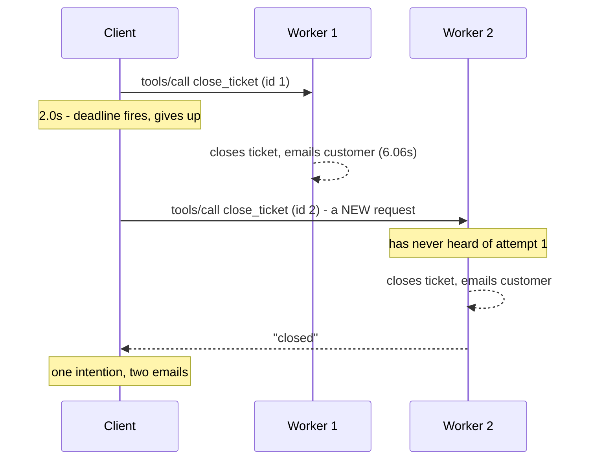

# 3.2 — 💥 The ticket closed twice

## One-line answer

Because a timeout does not stop the work and a re-issue is a brand-new request, a tool that writes
will be run twice by any client that retries — so the only place the problem can be solved is the
server, by giving the request a key it remembers.

## The story

You applied for two days of leave and the page did not come back.

You waited, watched the spinner, and eventually the tab timed out with the browser's own error page.
So you went back, filled the form in again, chose the same two dates, and submitted. This time it
worked and you got the confirmation mail.

At the end of the month your balance was four days short.

Both submissions went through. The first one did land — it was the *response* that never made it back
to you, not the request. Nobody did anything wrong: you submitted twice because you had every reason
to believe the first one had failed, and the system recorded two applications because it received
two, and they were identical in every respect except the second one had a different form reference.

The person in the office who eventually fixed it did not blame you. She said they get this every
month, and that the fix everybody asks for — "make the form remember" — is on somebody's list.

## The idea in plain language

Put three facts from section 1 next to each other and the conclusion is forced.

1. A timeout ends your wait, not the server's work
   ([1.2](../01-the-clock/1.2-giving-up-ends-the-wait.md)).
2. Cancelling over HTTP is discovered late and is cooperative
   ([1.3](../01-the-clock/1.3-hanging-up-is-the-message.md)).
3. A re-issue must be a new request with a new id, because there is no resumption
   ([1.4](../01-the-clock/1.4-a-broken-stream-loses-the-request.md)).

Therefore: **if your client ever retries a call that writes, the server will do the write twice.**
Not "might". Will, in the case where the first attempt was merely slow rather than dead, which is the
most common case.

No client-side cleverness fixes this, and it is worth being precise about why. The client's problem
is that it cannot tell "the work did not happen" from "the work happened and I did not hear". Those
two states are identical from outside the server. Any client-side fix therefore has to guess, and a
guess that is wrong in one direction loses work while a guess that is wrong in the other direction
duplicates it.

The server can tell, because the server was there. So the fix lives on the server, and it has a name.

**Idempotent** describes an operation that has the same effect whether it runs once or many times.
Reading a ticket is naturally idempotent. Setting a status to `closed` is *nearly* idempotent — the
second call finds it already closed — but the things around it are not: the audit row, the email to
the customer, the counter on somebody's dashboard.

The general mechanism is an **idempotency key**: the caller attaches a stable identifier to the
request, and the server records which keys it has already honoured. A second request with the same
key returns the first one's outcome instead of doing the work again. The key has to come from the
caller and it has to survive a retry — which means it cannot be the JSON-RPC request id, because
[1.4](../01-the-clock/1.4-a-broken-stream-loses-the-request.md) requires that to *change* on a
re-issue. Two identifiers, two jobs: the request id separates attempts, the idempotency key joins
them.

## Why Sutra needs it

Sutra's desk closes tickets and emails customers. Day 37 built the flow that gates `close_ticket`
behind a question, [Day 39](../../../day-39-database-tools/LESSON.md) puts a real SQLite database
behind the tools, and [Day 44](../../../day-44-client-hardening/LESSON.md) writes `with_retries` into
`sutra/mcp/hardening.py`. The instant those three exist together, this failure exists.

The 2026-07-28 architecture makes it sharper rather than softer. Under the old protocol a session was
pinned to one instance, and an in-memory "have I seen this?" set on that instance would have worked
by accident. With sessions removed (Day 32's
[2.2](../../../day-32-mcp-stateless-core/parts/02-the-reframe/2.2-three-instances-one-url.md)) the
retry lands on a **different worker**, which has never heard of the first attempt. So the store of
honoured keys has to be shared — a database table, not a dictionary — and that is a design decision
somebody has to make deliberately before the first write tool ships.

There is a second Sutra-specific reason. Section 5 of this day teaches the replacement for
server-initiated requests, and its whole shape is *"the client re-issues the original request"*. A
protocol that is built around re-issuing is a protocol where idempotency stops being an optional
nicety.

## The mechanism

> 🎬 **The scene:** an agent asks Sutra to close ticket T-4521. The MCP call takes longer than the
> two-second deadline. The client gives up, logs a failure, and retries as required — new request id,
> same arguments.
>
> 😬 **The naive fix:** on the client, do not retry writes. It sounds prudent, and it means every
> transient blip becomes a failure the user has to resolve by hand — at which point they retry, by
> clicking the button again, and you have moved the duplicate rather than removed it.
>
> 💥 **Why it fails:** both attempts reach a server that has no way to connect them. The first one
> was never cancelled and finished at 6.06 seconds; the second arrives at a different worker with a
> different request id and identical arguments. Two audit rows. Two emails.
>
> 💡 **The insight:** the client cannot distinguish "did not happen" from "happened and I did not
> hear", so the client cannot fix it. Give the server a key it remembers, and the second attempt
> becomes a lookup instead of a write.

The whole demonstration is a function and a set:

```python
# days/day-38-failure-and-migration-lab/lab/double_close.py
IDEMPOTENT = os.environ.get("IDEMPOTENT", "0") == "1"

AUDIT: list[str] = []  # the side effect - what a customer would actually see
SEEN: set[str] = set()  # request keys the server has already honoured


def close_ticket(ticket: str, request_key: str | None) -> str:
    """Close a ticket and write one audit row. Optionally deduplicate on a key."""
    if request_key is not None:
        if request_key in SEEN:
            return "already closed (deduplicated)"
        SEEN.add(request_key)
    AUDIT.append(f"ticket {ticket} closed; customer emailed")
    return "closed"
```

**Line by line:**

- `AUDIT` is a list rather than a counter because the argument is about **side effects**, and a side
  effect is a thing that exists, not a number that goes up. Printing the rows at the end is what makes
  the second email visible as an object rather than as an increment.
- `SEEN` is a set of keys and nothing else. A real implementation stores the *outcome* against the
  key too, so the deduplicated call can return the original answer rather than a different string —
  which matters, because a caller that gets `already closed` instead of `closed` may branch on it.
  The simplification is called out here because it is the first thing to fix when you write the real
  one.
- `request_key: str | None` makes the key **optional in the signature**, which is exactly how this
  arrives in a real codebase: the tool exists first, the key is added later, and for a while both
  paths are live. `None` is the old behaviour.
- The check is `if request_key in SEEN` **before** `SEEN.add`, and the add happens before the work.
  Adding after the work would leave a window in which two concurrent retries both check, both miss,
  and both write — the check and the record have to be one atomic step, which in a database means a
  unique constraint or a transaction rather than two statements.
- `AUDIT.append(...)` stands in for everything irreversible: the row, the mail, the webhook. One line
  here, several systems in reality, and every one of them fires twice in the unguarded arm.
- The function returns a string rather than raising on a duplicate. A duplicate is not an error — the
  caller asked for the ticket to be closed and it is closed. Raising would push the client back into
  guessing.

The scenario is four lines and no server at all:

```python
    key = "close:T-4521:9f2a" if IDEMPOTENT else None
    first = close_ticket("T-4521", key)
    second = close_ticket("T-4521", key)
```

**Line by line:**

- `"close:T-4521:9f2a"` is shaped like a real key: the operation, the subject, and a random suffix
  from the attempt. That shape matters. A key of just `"T-4521"` would deduplicate two *legitimately
  different* close operations weeks apart; a key that is purely random would change on the retry and
  deduplicate nothing. The key must be stable across the retries of one intention and unique across
  intentions, which means it is minted by whoever formed the intention — the client — and not by the
  transport.
- The two calls are made **with no server and no network**, because none is needed. The failure is
  not about transport; it is about a server having no memory. Simulating a socket would add code and
  subtract clarity.
- Between them, in reality, sits the timeout: the first call's answer was never read. The script does
  not model the waiting because [1.2](../01-the-clock/1.2-giving-up-ends-the-wait.md) already measured
  it; here the interesting thing is what is left behind.

Run both arms:

```bash
cd days/day-38-failure-and-migration-lab/lab
IDEMPOTENT=0 uv run python double_close.py
IDEMPOTENT=1 uv run python double_close.py
```

**Line by line:**

- `IDEMPOTENT=0` is a normal write tool. `IDEMPOTENT=1` is the same tool with a key.
- **Zero model calls.**

Measured on 2026-09-04:

```text
idempotency key: None
attempt 1 -> closed   (client deadline fires; the answer is never read)
attempt 2 -> closed
audit rows: 2
  - ticket T-4521 closed; customer emailed
  - ticket T-4521 closed; customer emailed
customer emails sent: 2
```

```text
idempotency key: close:T-4521:9f2a
attempt 1 -> closed   (client deadline fires; the answer is never read)
attempt 2 -> already closed (deduplicated)
audit rows: 1
  - ticket T-4521 closed; customer emailed
customer emails sent: 1
```

Two emails against one, from the same client behaving the same way. The client is not the variable in
this experiment; it is identical in both runs. The only thing that changed is whether the server was
given something to remember.

The shape of the whole failure, end to end:



Worker 2 is not making a mistake. It received a well-formed request to close a ticket and it closed
it. Every component behaved correctly and the outcome is wrong, which is the signature of a design
gap rather than a bug.

## When it breaks

If somebody has put a constraint on the table, the second write fails loudly and you find out
immediately:

```text
sqlite3.IntegrityError: UNIQUE constraint failed: ticket_events.event_id
```

That is the *good* outcome, and it is worth naming as good because at first sight it looks like a
bug. It is a database refusing to record the same event twice, which is the failure being caught by
the one layer that could catch it. The mail may already have gone, but the ledger is intact and
somebody now knows.

Without the constraint there is no error at all. The bad outcome looks like this, and it is a support
transcript rather than a log:

```text
> I got two emails saying my ticket was closed. Did something go wrong?
```

There is also a break in the fix itself. An idempotency key with no expiry is a table that only
grows, and a key derived from a value that changes — a timestamp, a fresh UUID per attempt — is a key
that never matches, so the deduplication silently does nothing while everybody believes it is on.
That second one is the more dangerous: the code is present, the tests pass because they call the
function twice with the same literal, and the retry path in production generates a different key each
time.

The smallest way to find out whether yours works is to count. If the number of deduplicated hits is
always zero in production, the key is wrong.

## In production

**What a professional writes instead:** the key is part of the tool's schema, not a hidden header, so
it is visible in `tools/list` and a caller cannot forget it. Server-side, the store is shared — a
table with a unique index on the key, written in the same transaction as the effect, so that "record
that I did it" and "do it" cannot come apart. And it has a **retention window**, typically long enough
to outlive any plausible retry, after which the key is forgotten.

Where the effect is external and cannot be transactional — an email, a payment — the standard shape
is an outbox: write the intent transactionally, and have a separate process deliver it, itself keyed.
That does not make the email exactly-once, because nothing makes an email exactly-once; it makes the
*decision* to send it exactly-once, which is the achievable version.

**What degrades at scale:** concurrent retries. The single-threaded check-then-add in the script is
a race the moment two retries arrive at two workers simultaneously. Both check, both miss, both write.
The fix is not a lock; it is to let the database's unique index be the check, by inserting first and
treating the constraint violation as "already done".

**The failure mode that only appears with real traffic:** duplicates that cluster during incidents.
Latency rises, deadlines fire, everything retries, and the duplicate rate goes from zero to a
noticeable fraction in the same window in which everybody is busy looking at the latency. The
duplicates are discovered days later by finance or by support, long after the incident is closed.

**The review comment a senior engineer leaves:** *"`close_ticket` is a write with no idempotency key.
Our client retries on timeout and the spec requires a new request id on re-issue, so the server has no
way to link the two attempts — this will send two emails the first time a call is slow. Add the key to
the tool schema, store it in the same transaction as the effect, and add a counter for deduplicated
calls so we can see it working."*

**The interview question:** *"how do you make a retry safe?"* Start by saying where the fix cannot
live: *"not on the client. The client cannot tell 'it did not happen' from 'it happened and I did not
hear', so anything it does is a guess. The fix is server-side idempotency: the caller mints a key that
is stable across retries of one intention, and the server records honoured keys in the same
transaction as the effect. In MCP it matters more than usual, because the 2026 revision removed stream
resumption — a broken stream means re-issuing with a new request id, so the protocol itself guarantees
the server sees two unrelated-looking requests. And with sessions gone the retry lands on a different
worker, so the store has to be shared, not in-memory. We measured the unguarded version: one
intention, two audit rows, two customer emails."*

## Check yourself

```bash
cd days/day-38-failure-and-migration-lab/lab
IDEMPOTENT=0 uv run python double_close.py
IDEMPOTENT=1 uv run python double_close.py
```

Now change the key to include a random suffix generated inside `close_ticket` rather than passed in,
and run the guarded arm. It sends two emails again, while reporting that idempotency is on. Say why
that is the most dangerous of the three versions.

**Out loud, without scrolling up:** say why the idempotency key cannot be the JSON-RPC request id.

**Next:** [4.1 — A feature with a leaving date](../04-the-leaving-list/4.1-a-feature-with-a-leaving-date.md).
