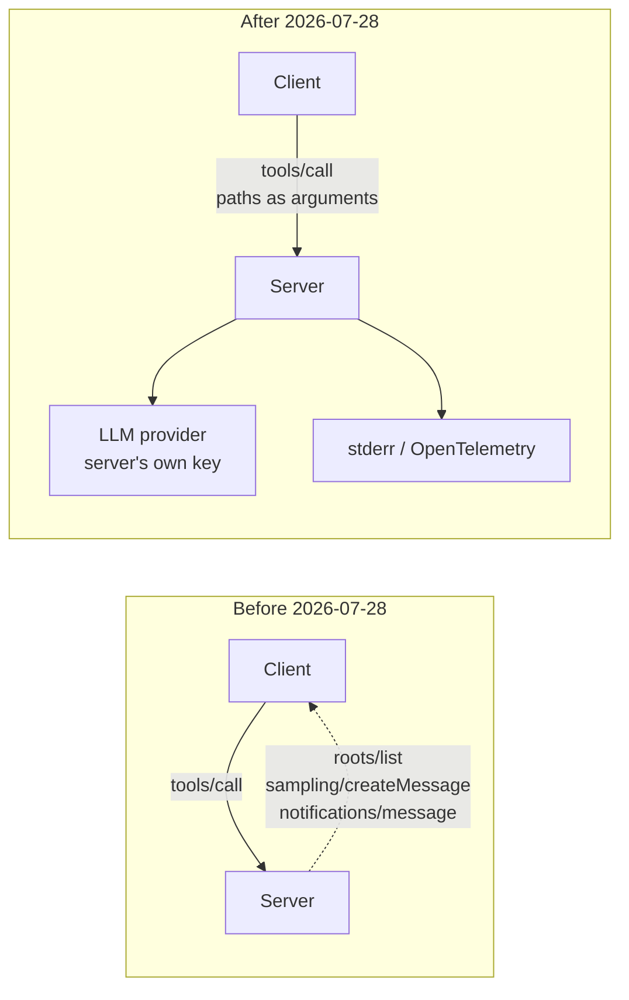

# 4.2 — Three things being taken away

## One-line answer

Roots, Sampling and Logging are the three features SEP-2577 put on the leaving list, and they share
one cause — each of them was the server reaching back into the client's world across a held
connection — so each migration moves the work out of the protocol rather than to a newer method.

## The story

The office is taking three things away.

The **tea trolley** that came round twice a day. It stops at the end of the month. Nothing better is
coming in its place; there is a kettle in the corner and you make your own.

The **pigeonholes by the door**, where somebody sorted the post into everyone's slot each morning.
Gone. Post will be dropped on each desk directly instead.

And the **stationery cupboard** that anyone could open. From now on you order what you need yourself,
on your own budget line.

None of the three is being replaced by a newer version of itself. There is no improved tea trolley.
Each one is being moved *out* of the shared middle and onto each desk, and the reason is the same in
all three cases: the shared middle was the part somebody had to keep running, and it was the part
that stopped working when the company grew past one floor.

## The idea in plain language

Three features were marked Deprecated in the 2026-07-28 revision by one proposal, SEP-2577. They look
unrelated until you notice what they have in common.

**Roots.** The client told servers which directories or files were in scope, and the server could ask
for the current list with `roots/list`. The point was that a server operating on a filesystem needed
to know where it was allowed to look.

**Sampling.** The server asked the *client's* model for a completion, with
`sampling/createMessage`. The point was that a server could use a model without having its own API
key or budget — it borrowed the client's.

**Logging.** The client set a verbosity level for the connection with `logging/setLevel`, and the
server pushed log lines back with `notifications/message`. The point was to see inside a server you
were talking to.

The common thread: **every one of them is connection-scoped state, and two of them are the server
initiating a request back at the client.** Roots is a list the client registered and the server
remembered. Logging is a level set once and applied afterwards. Sampling is the server calling the
client mid-request, which requires the connection that carried the request to still be open and still
be routed to the same instance.

The 2026-07-28 revision deleted sessions (Day 32's
[2.1](../../../day-32-mcp-stateless-core/parts/02-the-reframe/2.1-the-call-that-remembered-you.md)),
and once a connection is not a place where things are remembered, all three of these lose the ground
they stood on. This is not three coincidences; it is one architectural change with three consequences,
which is exactly why one proposal handled all three.

The migrations, quoted from the registry:

| Deprecated | What it did | Migrate to |
| --- | --- | --- |
| **Roots** | Client declared in-scope directories and files; server queried them | *"Pass directories or files via tool parameters, resource URIs, or server configuration"* |
| **Sampling** | Server asked the client's model for a completion | *"Integrate directly with LLM provider APIs"* |
| **Logging** | Per-connection verbosity plus server-pushed log notifications | *"Log to `stderr` for stdio transports; use OpenTelemetry for observability"* |

Read those three replacements again and notice what none of them is. Not one names a newer MCP
method. Every one of them says: **do this outside the protocol.** That is the shape of the whole
deprecation, and it is why [5.3](../05-the-replacement/5.3-what-the-migration-costs.md) exists —
"do it yourself" is a migration with a bill attached.

Around them sit outright **removals** in the same revision, which is a different state and worth
keeping separate. `ping`, `logging/setLevel` and `notifications/roots/list_changed` were removed
outright, and log level moved to a per-request `_meta` key,
`io.modelcontextprotocol/logLevel`. The changelog adds a rule that goes with it: servers **MUST NOT**
emit `notifications/message` for requests that did not include that field. So the *feature* Logging is
Deprecated while the *method* `logging/setLevel` is already gone — a distinction that will bite in
[6.2](../06-in-production/6.2-the-deprecation-your-library-never-mentions.md).

## Why Sutra needs it

Sutra uses none of the three, and that is worth stating because it is the *reason* this part is
recognition rather than repair. Phase 5 was written against the 2026-07-28 revision, so
`sutra_mcp` never had a Roots capability to remove, never borrowed a caller's model, and logs to
stderr because Day 33's
[2.3](../../../day-33-client-and-transports/parts/02-stdio/2.3-the-only-place-left-to-talk.md) said
stdout belongs to the protocol. Sutra arrived after the change, which is the cheapest way to migrate.

What Sutra does need is to **recognise** all three in somebody else's server, and to know what each
one implies. A server declaring `sampling` is telling you two things at once: it is old, and it wants
to spend your model budget. A server declaring `roots` wants filesystem scope from you. Both are
questions for an intake review, not surprises for production, and
[4.3](4.3-dating-somebody-elses-server.md) makes them a script.

There is one place where a Sutra decision was already shaped by this and it is worth connecting.
Sampling's replacement — *"integrate directly with LLM provider APIs"* — is what this project has been
doing since Day 9: Sutra owns its own key, its own free-tier roster and its own 429 handling
(Addendum 02). Had Sutra been built two years earlier, the tempting design would have been for
`sutra_mcp` to borrow the host's model via Sampling, and today that would be a migration with a
budget conversation in it.

## The mechanism

> 🎬 **The scene:** you are integrating a partner's MCP server. Its documentation proudly lists
> Sampling support: *"our server can use your model for summarisation — no API key required on our
> side."*
>
> 😬 **The naive fix:** treat it as a feature. It genuinely saves them a key, and it appears to save
> you an integration.
>
> 💥 **Why it fails:** Sampling is Deprecated as of 2026-07-28, and it is Deprecated because a server
> initiating a request back at a client needs a connection that stays open and stays pinned — which
> the revision removed. Adopting it now means building on the one part of the protocol with a
> published leaving date, and paying for their summarisation out of your quota while you do.
>
> 💡 **The insight:** all three deprecations move work out of the protocol and into whoever actually
> needs it. The migration is not a new method; it is an ownership change.

There is no code to run in this part, because the mechanism is a decision table rather than an
algorithm. What there is instead is the shape of the change, which is the same picture three times:



The dotted arrows are what went away. In the *before* picture the server has three ways to reach back
into the client's process, and every one of them requires the client to still be there, on that
connection, willing to answer. In the *after* picture the arrows all point outward from the server to
things the server owns.

The one case that genuinely needs a question answered mid-call did not disappear — it changed shape
entirely, into the multi-round-trip pattern that section 5 teaches. That is why the registry's
migration text for Sampling says *"integrate directly with LLM provider APIs"* rather than *"use
MRTR"*: MRTR is for asking the **user** something, and Sampling was mostly about borrowing a model,
which is a billing arrangement rather than an interaction. Where the interaction itself is the point,
[5.1](../05-the-replacement/5.1-the-question-that-comes-back-as-an-answer.md) is the replacement.

One more distinction, because it is the one people get wrong when reading the registry. The
`includeContext` values `"thisServer"` and `"allServers"` are listed as their own row, deprecated
earlier — in `2025-11-25` — and their earliest removal is written as *"Follows Sampling"*. They are a
field *inside* Sampling that was deprecated before Sampling itself was, which is why the registry has
five rows where you might have expected four.

## When it breaks

The failure is not an exception; it is an integration that works today and has a date on it. But
there are two error texts worth recognising, because they are how the removals in this revision
present themselves.

A client that still sends the removed `logging/setLevel` to a current server gets:

```text
{"jsonrpc": "2.0", "id": 4, "error": {"code": -32601, "message": "Method not found", "data": {"method": "logging/setLevel"}}}
```

That is `-32601`, and [2.3](../02-the-x-ray/2.3-the-error-you-threw-away.md) already argued that this
is information rather than a fault. Here it is dated information: a server that answers this is
current, and a server that *succeeds* is not.

The subtler one has no error at all. A client sets a log level, gets no error because the server is
old enough to accept it, and then receives nothing — because a modern server **must not** emit
`notifications/message` for a request that did not carry the `io.modelcontextprotocol/logLevel` key in
its `_meta`. So the level was accepted and the logs never come, and the client concludes the server is
quiet rather than that it is asking in the wrong place.

The mirror-image break is on the server side and is worse. A server built to use Sampling talks to a
current client, sends `sampling/createMessage` as a server-initiated request, and finds there is
nowhere to send it: the pattern of servers initiating requests was removed outright. The
specification's own wording is *"the previous pattern of server-initiated requests is no longer
supported. This is a breaking change."* A server built that way does not degrade; it stops.

## In production

**What a professional writes instead:** for scope, a tool parameter with a schema — `paths: string[]`
— so the permission is visible in the call and auditable in the log, rather than a capability
negotiated once and invisible thereafter. For a model, the server's own provider integration with its
own key, budget and rate-limit handling. For observability, structured logs to stderr and
OpenTelemetry spans, which the same revision made first-class by documenting `traceparent`,
`tracestate` and `baggage` as `_meta` keys.

The Roots migration in particular is a security improvement wearing a deprecation's clothes. A path
passed as a tool argument is in the request, in the audit trail, and in front of any policy engine you
have. A path that came from a capability handshake is a decision made once and then invisible in every
subsequent call — which is exactly the property that makes a permission hard to review. Day 40's
allowlist work and [Day 45](../../../day-45-the-mcp-audit/LESSON.md)'s audit both benefit.

**What degrades at scale:** the Sampling migration hits smallest-first. A server that borrowed its
caller's model had no budget line, no rate-limit strategy and no provider account. Now it needs all
three, and for a free or hobby server that is not a code change, it is a business-model change. Expect
some servers to answer this deprecation by disappearing rather than by migrating, and plan for the
partner integration that simply stops being maintained.

**The failure mode that only appears with real traffic:** cost, arriving as a surprise. A server using
Sampling spends the *client's* quota, so the load appears on your model bill under a workload you did
not write. At one user this is invisible. At a thousand it is a line item nobody can explain, and the
migration away from Sampling is the thing that makes it explicable — the spend moves to whoever caused
it.

**The review comment a senior engineer leaves:** *"this partner's server wants Sampling. That is
Deprecated as of 2026-07-28 under SEP-2577, and it means their summarisation runs on our quota. Ask
them for a timeline to their own provider integration, and until then treat their server as
short-lived — do not build anything on it we cannot remove in a sprint."*

**The interview question:** *"MCP deprecated Roots, Sampling and Logging in one go. Why those three?"*
The answer that shows you understood the revision rather than memorised the list: *"because they are
one thing, not three. All three were connection-scoped — a list registered once, a level set once, a
server calling back into the client mid-request — and the same revision removed sessions, so there is
no longer a connection for any of that to be scoped to. What I find telling is the migration text.
None of the three points at a newer MCP method: pass paths as tool arguments, integrate with a model
provider directly, log to stderr or OpenTelemetry. The protocol did not replace those features, it
handed the work back to whoever actually needed it — which is a smaller protocol and a bigger bill for
whoever was borrowing."*

## Check yourself

```bash
grep -n "Roots\|Sampling\|Logging" days/day-38-failure-and-migration-lab/lab/lifecycle.py
```

Read the three `migration` strings out of the registry in the file, then close it and write down what
each one asks you to build, and who pays for it.

**Out loud, without scrolling up:** name the one property all three deprecated features share, and
say which change in the same revision took that property away.

**Next:** [4.3 — Dating somebody else's server](4.3-dating-somebody-elses-server.md).
