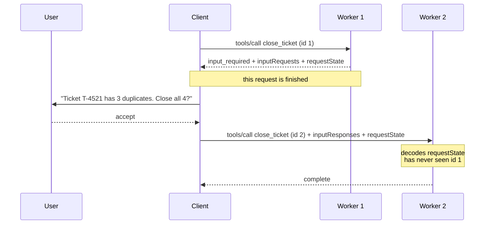

# 5.1 — The question that comes back as an answer

## One-line answer

Server-initiated requests were replaced by a single pattern: the server answers with
`resultType: "input_required"`, hands back the question and an opaque `requestState` blob, and the
client gathers the answer and re-issues the **original request** with a new id — so nothing is held
open and any instance can finish what another one started.

## The story

You go to the registration desk to get a document.

The clerk takes your form, reads it, and finds one thing missing — a photograph. He does not sit
there with your form on his desk waiting for you to come back. He writes on a small slip: your form's
reference, what stage it reached, and the one thing outstanding. He staples it to your form, hands
the whole lot back, and says *"bring a photo and go to any window."*

You come back after lunch with the photograph. Window four is free, so you go to window four. A
different clerk takes the slip and the form, reads the slip, knows exactly where the first clerk got
to, staples the photo on and finishes it.

The first clerk kept nothing. That is why any window could serve you. If he had kept your form in his
drawer and told you to come back to *him*, you would be standing in his queue at four o'clock,
watching three free windows.

## The idea in plain language

Before 2026-07-28, a server that needed something mid-request just asked. It sent a request back down
the connection to the client — `roots/list`, `sampling/createMessage`, `elicitation/create` — and
waited for a reply, holding its own work open the whole time.

That requires three things to be true: the connection is still open, it is still routed to the same
server process, and that process is still holding the half-finished work in memory. All three are
properties of a **session**, and the 2026-07-28 revision removed sessions.

So the pattern was inverted. Instead of the server asking, the server **answers with the question**:

1. The client sends a request — `tools/call`, `prompts/get` or `resources/read`.
2. The server finds it needs something, and **returns**. Its result carries
   `resultType: "input_required"`, an `inputRequests` map holding the questions, and a `requestState`
   string holding whatever the server needs to resume.
3. The client gathers the answers.
4. The client re-issues the **original request**, with a **new id**, adding `inputResponses` and
   echoing `requestState` back untouched.
5. The server has everything, and answers with `resultType: "complete"`.

This is **MRTR** — multi round-trip requests — introduced by SEP-2322. The specification is blunt
about the change: servers *"**MUST** send server-to-client requests (such as `roots/list`,
`sampling/createMessage`, or `elicitation/create`) using the MRTR pattern. The previous pattern of
server-initiated requests is no longer supported. This is a breaking change."*

The word that carries the design is **opaque**. `requestState` is *"an opaque string meaningful only
to the server"*, and clients *"**MUST NOT** inspect, parse, modify, or make any assumptions about its
contents"*. The client is a courier, not a reader. The server may encode it however it likes —
base64 JSON, an encrypted token, a serialised binary — because nobody else is entitled to look.

Four rules that are easy to get wrong and are all explicit in the specification:

| Rule | Why it exists |
| --- | --- |
| The retry's JSON-RPC id **MUST** differ from the original's | They are independent requests, not a continuation ([1.4](../01-the-clock/1.4-a-broken-stream-loses-the-request.md)) |
| The client **MUST** echo `requestState` exactly, and **MUST NOT** send one if none was given | It is the server's memory; editing or inventing it is corrupting the server's own state |
| At least one of `inputRequests` or `requestState` **MUST** be present | An `input_required` with neither asks for nothing and remembers nothing |
| Only `prompts/get`, `resources/read` and `tools/call` may return it | A `tools/list` that asked you a question would break every cache |

And one that catches people out: `resultType` is now required on **every** result, with `"complete"`
for an ordinary one. A result from an older server that omits the field **MUST** be treated as
`"complete"`.

This is the same idea as Day 32's
[3.4](../../../day-32-mcp-stateless-core/parts/03-headers-and-caches/3.4-state-that-travels-in-the-payload.md):
the state did not vanish, it moved into the payload. There it was a handle passed as a tool argument;
here it is a blob attached to an interim result. Same principle, two shapes.

## Why Sutra needs it

Day 37 built elicitation into `sutra_mcp` — the flow where `close_ticket` discovers duplicates and
asks whether to close all of them. That flow **is** MRTR; there is no other way to express it in this
revision. This part is where the shape underneath it gets taken apart.

[Day 43](../../../day-43-stateless-by-default/LESSON.md) is the day it pays off. That day makes
`sutra_mcp` deploy-shaped: `sutra_mcp/app.py`, any instance answering any request. A server that
needed to hold a pending question in memory could not pass that day's gate, because the retry would
land on an instance that had never heard of the first attempt — which is exactly what the second arm
below demonstrates.

And it changes what `sutra/mcp/client.py` has to do. A client that receives a result and reads
`result["content"]` without first checking `resultType` will treat an interim result as a final
answer, and hand a half-finished tool call to the model as though it were a fact. Checking
`resultType` is one line, and it is a line that does not exist yet.

## The mechanism

> 🎬 **The scene:** a tool call needs one confirmation from the user before it can finish. You are
> writing the server, and the obvious design is to hold the request open, ask, and continue.
>
> 😬 **The naive fix:** keep the pending question in a dictionary keyed by request id, ask the client,
> and look it up when the answer comes back. It works perfectly on your laptop, where there is one
> process.
>
> 💥 **Why it fails:** in production there are three instances behind one address. The answer comes
> back as a new request and the dispatcher sends it to whichever instance is free. That instance's
> dictionary is empty. The failure is not intermittent in the reassuring sense — it fails for
> two-thirds of calls, permanently, with an error that says the server has no pending question.
>
> 💡 **The insight:** put the memory in the reply. If everything the server needs to resume travels
> back with the retry, then the instance that resumes does not need to be the instance that asked.

Three workers behind one address, and one flag that decides where the memory lives:

```python
# days/day-38-failure-and-migration-lab/lab/mrtr.py
MRTR = os.environ.get("MRTR", "1") == "1"
USER_ANSWER = {"action": "accept", "content": {"confirm": True}}


class Worker:
    """One server instance. `pending` is the memory the old pattern depended on."""

    def __init__(self, name: str) -> None:
        self.name = name
        self.pending: dict[int, dict] = {}
```

**Line by line:**

- `Worker` is a class purely so that `pending` belongs to an **instance** rather than to the module. A
  module-level dictionary would be shared by all three workers and would make the old pattern appear
  to work, which is exactly the illusion a single-process laptop gives you. Day 32's
  [2.2](../../../day-32-mcp-stateless-core/parts/02-the-reframe/2.2-three-instances-one-url.md) made
  the same point about sessions.
- `USER_ANSWER` is the shape of an `ElicitResult`: an `action` of `accept`, `decline` or `cancel`,
  plus typed `content` when accepted. It is a constant because the user's answer is not what is being
  tested here.
- `pending: dict[int, dict]` keyed by request id is the honest version of the old pattern. It is not a
  straw man — it is what a reasonable person writes, and it is correct in exactly one deployment
  shape.

The handler, with both patterns side by side:

```python
        if answered is None:
            question = {
                "confirm_close": {
                    "method": "elicitation/create",
                    "params": {
                        "mode": "form",
                        "message": "Ticket T-4521 has 3 duplicates. Close all 4?",
                        "requestedSchema": {
                            "type": "object",
                            "properties": {"confirm": {"type": "boolean"}},
                            "required": ["confirm"],
                        },
                    },
                }
            }
            if MRTR:
                blob = base64.b64encode(json.dumps({"ticket": "T-4521", "n": 4}).encode()).decode()
                return {
                    "resultType": "input_required",
                    "inputRequests": question,
                    "requestState": blob,
                }
            self.pending[request_id] = {"ticket": "T-4521", "n": 4}  # held in THIS worker
            return {"resultType": "input_required", "inputRequests": question}
```

**Line by line:**

- `answered is None` is the branch on whether this is a first attempt or a retry. The server does not
  need any other way to tell, and that is the point: a retry is a self-describing request, not a
  continuation the server has to recognise.
- `question` is an `InputRequests` **map**, not a list. The keys — here `confirm_close` — are
  server-assigned identifiers that must be unique within the request, and the client uses the same
  keys when it answers. A map rather than a list because the server needs to match answers to
  questions without depending on ordering.
- The value is a whole request object: a `method` and its `params`. That is why the pattern replaced
  three separate protocols at once — an `ElicitRequest`, a `CreateMessageRequest` and a
  `ListRootsRequest` are all just values in this map.
- `mode: "form"` and `requestedSchema` are the elicitation shape Day 37 taught. The schema is here so
  the client can render a control and validate the answer before sending it, rather than passing free
  text back to a server that will have to parse it.
- The `MRTR` branch base64-encodes a small JSON object. **Base64 is an encoding, not protection** —
  the specification is explicit that a server must treat returned state as attacker-controlled, and
  [5.2](5.2-the-slip-somebody-rewrote.md) is that part. What base64 buys here is only the *opacity
  contract*: it signals to a client author that this is not theirs to read.
- The non-MRTR branch writes to `self.pending` and returns **no** `requestState`. That absence is the
  whole difference between the two arms, and it is one line.
- Both branches return `resultType: "input_required"`. The old pattern still had to tell the client
  something; what it did not do was hand back the means to resume.

And the resume path:

```python
        if MRTR:
            context = json.loads(base64.b64decode(state))
        else:
            context = self.pending.get(request_id - 1)  # the original attempt's id
            if context is None:
                return {"error": f"{self.name} has no pending question for this call"}
```

**Line by line:**

- `json.loads(base64.b64decode(state))` is the server reading its own note. No lookup, no shared
  store, no coordination between instances. This is the line that makes the whole pattern work with
  three instances or three hundred.
- `self.pending.get(request_id - 1)` reconstructs the original id by arithmetic, which is a fiction the
  script is honest about: **there is no correct way to do this**. The retry has a new id by rule, so
  the old pattern has no legitimate way to find the original attempt's entry — which is not a detail,
  it is the reason the pattern could not survive the revision.
- Returning an error object rather than raising keeps both arms printing a comparable line, so the
  transcript shows a failure rather than a traceback.

The picture, which is the specification's own flow:



The note in the middle is the part that matters. After step two the first request is **over** —
nothing is held, nothing is pending, and worker 1 could be restarted or scaled away without losing
anything.

Run both arms:

```bash
cd days/day-38-failure-and-migration-lab/lab
MRTR=1 uv run python mrtr.py
MRTR=0 uv run python mrtr.py
```

**Line by line:**

- `MRTR=1` is the current pattern; `MRTR=0` is the pre-2026 one, against the same three workers.
- The script sends the retry to `workers[1]` deliberately rather than randomly, so the transcript is
  the same every time. Round-robin is what a real dispatcher does; here it is written out so the
  finding is reproducible. **Zero model calls** — the user's answer is a constant.

Measured on 2026-09-04:

```text
pattern: MRTR (InputRequiredResult)
attempt 1 -> worker-1: resultType=input_required
            question: ['confirm_close']
            requestState: eyJ0aWNrZXQiOiAiVC00NTIxIiwgIm4iOiA0fQ==
attempt 2 -> worker-2: {"resultType": "complete", "content": [{"type": "text", "text": "closed 4"}]}
completed: True
```

```text
pattern: server-initiated (pre-2026)
attempt 1 -> worker-1: resultType=input_required
            question: ['confirm_close']
            requestState: (none - held in memory)
attempt 2 -> worker-2: {"error": "worker-2 has no pending question for this call"}
completed: False
```

Same workers, same question, same answer from the user. The only difference is whether the server's
memory travelled in the reply or stayed in worker 1, and that difference is `completed: True` against
`completed: False`.

You can decode the blob yourself — it is base64 of `{"ticket": "T-4521", "n": 4}` — and the fact that
you *can* is [5.2](5.2-the-slip-somebody-rewrote.md)'s subject.

## When it breaks

The most common client-side break is not checking `resultType` at all. A client written before this
revision reads `result["content"]` unconditionally, and an interim result does not have one:

```text
Traceback (most recent call last):
  File "client.py", line 63, in call_tool
    text = result["content"][0]["text"]
           ~~~~~~^^^^^^^^^^^
KeyError: 'content'
```

That is the good version, because it stops. The bad version is a client that uses `.get("content", [])`
to be safe, gets an empty list, and reports the tool as having returned nothing — so a question the
user was supposed to answer becomes a blank result and a confused agent.

The second break is echoing `requestState` wrongly. The rules are exact and asymmetric: echo it
**exactly** if you were given one, and send **none** if you were not. A client that helpfully
round-trips it through `json.loads` and `json.dumps` — because it looked like base64 of JSON, and it
was — changes the bytes and gets:

```text
{"jsonrpc": "2.0", "id": 2, "error": {"code": -32602, "message": "Invalid params", "data": {"field": "requestState"}}}
```

The third is a server assuming the client will come back. The specification says servers *"**MUST
NOT** assume that clients will fulfill the `inputRequests` or retry the original request."* A user can
close the tab. Any resource the server allocated in the first attempt and expected to release in the
second is now leaked, which is an argument for putting everything in `requestState` and holding
nothing at all.

## In production

**What a professional writes instead:** a `requestState` that is signed and short-lived, carrying the
authenticated principal, an expiry and an identifier for the originating request — which is what
[5.2](5.2-the-slip-somebody-rewrote.md) builds and what the specification requires of anything whose
state influences authorisation. On the client side, a result handler that switches on `resultType`
before anything else touches the result, so `input_required` can never be mistaken for an answer.

**What degrades at scale:** the size of the blob. Everything the server needs to resume travels twice
— out in the interim result and back in the retry — so a `requestState` that carries a whole search
result rather than a search *key* is paid for on every round trip. The discipline is the same one that
applies to a session cookie: put an identifier in the blob and the data behind it in a store, unless
the data is genuinely tiny.

**The failure mode that only appears with real traffic:** the abandoned round trip. Some fraction of
users never answer the question, so some fraction of interim results are never retried. If the server
did anything in the first attempt — reserved a row, took a lock, started a job — that thing is now
orphaned, and the rate is invisible until it is a table full of half-finished work. A server that
holds nothing between the two attempts has no such rate.

**The review comment a senior engineer leaves:** *"this reads `result['content']` straight away. Since
2026-07-28 every result carries `resultType`, and `input_required` results have no content — they have
a question. Switch on `resultType` at the top of the handler, and treat a missing field as `complete`
for older servers, which is what the spec requires."*

**The interview question:** *"MCP removed server-initiated requests. What replaced them?"* The answer
should name the pattern and then the reason: *"multi round-trip requests. Instead of the server
calling back into the client mid-request, it returns `resultType: 'input_required'` with an
`inputRequests` map and an opaque `requestState` blob, and the client gathers the answers and
re-issues the original request — new JSON-RPC id, `inputResponses` attached, `requestState` echoed
byte for byte. The reason is statelessness: the old pattern needed the connection open, pinned to one
instance, holding half-finished work. We ran both against three workers where the retry lands on a
different one from the first attempt: the MRTR arm completes, and the server-initiated arm comes back
with 'no pending question for this call'. The client-side rule people miss is that the id must
*change*, and the state must be echoed *unchanged* — two identifiers doing opposite jobs."*

## Check yourself

```bash
cd days/day-38-failure-and-migration-lab/lab
MRTR=1 uv run python mrtr.py
MRTR=0 uv run python mrtr.py
```

Now change the retry in `main` to go to `workers[0]` instead of `workers[1]` and run the `MRTR=0` arm
again. It completes. Say why that is the most misleading result in this whole day, and say which
deployment it corresponds to.

**Out loud, without scrolling up:** say what a client is allowed to do with `requestState`, and say
what the JSON-RPC id must do between the first attempt and the retry.

**Next:** [5.2 — The slip somebody rewrote](5.2-the-slip-somebody-rewrote.md).
