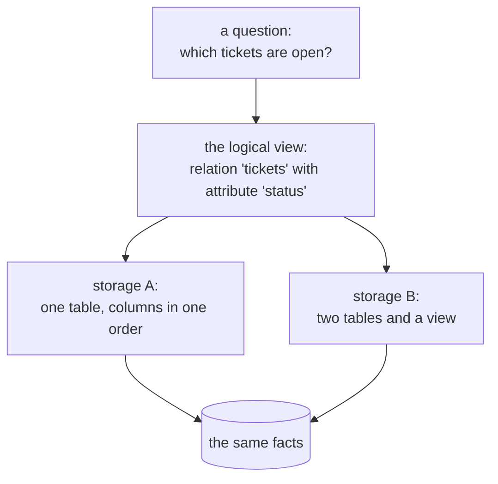

# A Relational Model of Data for Large Shared Data Banks

> **Read this after the parts.** You have written `SELECT` statements against named tables, watched
> a description drift away from a schema, and listed exactly which of your tools would survive a move
> to Postgres. This is the 1970 paper that argued for the property that makes that list short — and
> it is the reason you were able to write down what survives before you migrated rather than
> discovering it afterwards.

## One-line answer

It argued that a program should ask questions about **named relations with named attributes**, never
about how the data is physically arranged — so that the storage can be reorganised underneath a
working program without breaking it.

## The story

The hardware shop at the corner has one boy who knows where everything is.

Ask for a 12 mm bolt and he goes straight to it: third rack from the back, second shelf, the tray on
the left with the lid missing. Ask for hinges and he is already walking. He does not think about it.
The shop runs on him, and it runs well — the owner has said more than once that he does not need a
computer, he has this boy.

Then the shop is repainted over a weekend and the racks come back in a different order, because the
painters put them back the way that fitted.

Monday morning nobody can find anything. Not the boy — he is fine after an hour, because he learned a
shop and can learn it again. It is everybody else: the owner, the two people who help on Saturdays,
the customer who has been coming for nine years and could always fetch his own washers. All of them
knew the shop as *positions*. The positions changed and the knowledge went with them.

The stock did not change. Not one bolt moved out of the shop. Everything anybody knew about where
things were became wrong at once, because what they knew was where, not what.

## The idea in plain language

By 1970, data was stored in ways that a program had to know about. Records held pointers to other
records; a program navigated from one to the next along paths that existed in the file; and the order
in which things were stored was part of how you found them. It worked, and it worked for a long time.

The cost was that the program and the storage were welded together. Add an index, split a file,
reorder some fields, and the programs that navigated the old arrangement stopped working — not
because the facts changed, but because the route did. Every reorganisation was a rewrite, so
reorganisations did not happen, so systems ossified around whatever the first arrangement had been.

The paper's abstract states the errand plainly. This is the exact text, from the record:

> *"Future users of large data banks must be protected from having to know how the data is organized
> in the machine (the internal representation). A prompting service which supplies such information
> is not a satisfactory solution. Activities of users at terminals and most application programs
> should remain unaffected when the internal representation of data is changed and even when some
> aspects of the external representation are changed. Changes in data representation will often be
> needed as a result of changes in query, update, and report traffic and natural growth in the types
> of stored information. Existing noninferential, formatted data systems provide users with
> tree-structured files or slightly more general network models of the data. In Section 1, inadequacies
> of these models are discussed. A model based on n-ary relations, a normal form for data base
> relations, and the concept of a universal data sublanguage are introduced. In Section 2, certain
> operations on relations (other than logical inference) are discussed and applied to the problems of
> redundancy and consistency in the user's model."*

Four terms in that paragraph carry the paper, and each needs defining before the mechanism makes
sense.

A **relation** is a set of rows that all have the same named fields. Nothing more. `tickets` with
columns `id`, `title`, `body`, `status` and `opened_on` is a relation. The word comes from
mathematics — a relation over five sets — and the useful consequence of that definition is what it
leaves out: a relation has no order, no position, and no pointers.

A **tuple** is one row of a relation. The order of the *columns* is a convenience of how you write it
down; the fields are identified by name, not by position.

The **internal representation** is how the data actually sits: which file, which page, which order,
which indexes exist. The paper's central demand is that this be invisible to the person asking a
question.

A **data sublanguage** is a language for asking questions about relations, embeddable in a
programming language. The paper proposes one. SQL is what the field eventually built instead, and
the difference between those two facts is most of *In production* below.

## Why Sutra needs it

Because [1.2](../parts/01-the-archive/1.2-one-file-one-engine.md) had you write
`SELECT id, title FROM tickets WHERE status = ? ORDER BY opened_on DESC LIMIT ?` and never once say
where a ticket is stored — and that absence is not a convenience of SQLite. It is the property this
paper asked for.

And because [6.2](../parts/06-in-production/6.2-when-sqlite-is-not-the-database.md) is the payoff,
written down as a table: the queries survive a change of engine, the connection helper does not. A
tool that navigated the storage would have had nothing on the left-hand side of that table. The
reason Sutra can plan a migration it has not performed is that the questions were never about the
file.

It matters again on [Day 47](../../day-47-persistent-sessions/LESSON.md), where sessions move behind
`DatabaseSessionService` and the same argument decides how much of the session code cares which
database is underneath.

## The mechanism

The paper's method is three moves, and they build on each other.

**Move one: every fact is a relation.** Not a record with pointers to other records — a table of
named columns. Where the older models expressed "this ticket belongs to this customer" as a link you
follow, the relational model expresses it as a **value that appears in both relations**. The
connection is data, not structure.

That single change is what removes the routes. There is nothing to navigate, because there are no
paths; there are only relations and the values in them.

**Move two: separate the logical view from the stored representation.** What the user sees is a
relation with a name and named attributes. What the machine does — which file, which order, which
index — is unconstrained by that view and may change freely. The paper's term for the property is
**data independence**, and the whole argument is that you get it by making the user's model a
mathematical object rather than a description of storage.



**Move three: normal form, and the argument about redundancy.** The paper's second section is the
part people forget, and it is where the model earns its keep in practice. It defines a **normal
form** — organising relations so that a fact is stored in exactly one place — and then makes an
argument about what redundancy costs.

The argument is worth stating carefully, because it is more subtle than "duplicate data is
wasteful". The paper distinguishes:

- **Derivability.** One relation is derivable from others if it can be computed from them. A relation
  you can compute is a relation you do not need to store.
- **Redundancy.** Storing something derivable is redundancy — and the paper separates *strong*
  redundancy, where the stored copy is derivable in full, from the weaker kinds.
- **Consistency.** Every redundancy is a **constraint** you have now promised to maintain. Two copies
  of a fact must agree, and nothing in the machine makes them agree; some program has to.

So the reason to normalise is not disk space. It is that each duplicated fact is a consistency
obligation, and a data bank accumulates obligations faster than it accumulates programs to honour
them. This is the phone number on two electricity bills from
[1.1](../parts/01-the-archive/1.1-the-numbers-on-the-back-of-a-bill.md), stated as theory: the second
copy is not extra information, it is a promise that somebody will update both.

And the paper is explicit that the system should **know** about its redundancies — that they should
be declared, so the machine can check consistency rather than trusting every program to. That idea
becomes constraints, foreign keys and triggers.

## The paper in one demo

The claim, stripped to nothing else: **a question asked of a named relation survives a change to the
physical layout; a question asked of the stored representation does not.**

Two files. The ablation switch is `LAYOUT`, and what it switches is the storage underneath — which is
the only honest way to test a claim about data independence.

```text
days/day-39-database-tools/lab/papers/relational-model/
├── layout.py    # the same five facts, stored two ways. The switch.
└── answer.py    # one question, answered by navigation and by query.
```

`layout.py` — the storage, and nothing else:

```python
FACTS = [
    ("4521", "Keeps getting logged out", "open", "2026-08-31"),
    ("4522", "CSV export empty", "open", "2026-08-31"),
    ("4610", "Login loop on the mobile app", "closed", "2026-09-01"),
    ("4633", "Password reset email never arrives", "open", "2026-09-02"),
    ("4701", "Dashboard blank after login", "closed", "2026-09-03"),
]

V1 = """
CREATE TABLE tickets (
    id        TEXT PRIMARY KEY,
    title     TEXT NOT NULL,
    status    TEXT NOT NULL,
    opened_on TEXT NOT NULL
);
"""

V2 = """
CREATE TABLE ticket_core (
    opened_on TEXT NOT NULL,
    id        TEXT PRIMARY KEY,
    title     TEXT NOT NULL
);
CREATE TABLE ticket_status (
    ticket_id TEXT PRIMARY KEY,
    status    TEXT NOT NULL
);
CREATE VIEW tickets AS
    SELECT c.id AS id, c.title AS title, s.status AS status, c.opened_on AS opened_on
    FROM ticket_core AS c JOIN ticket_status AS s ON s.ticket_id = c.id;
"""


def build(layout: str = LAYOUT) -> Path:
    """Write the archive to disk in the requested physical layout."""
    ARCHIVE.unlink(missing_ok=True)
    con = sqlite3.connect(ARCHIVE)
    try:
        if layout == "v1":
            con.executescript(V1)
            con.executemany("INSERT INTO tickets VALUES (?, ?, ?, ?)", FACTS)
        elif layout == "v2":
            con.executescript(V2)
            con.executemany(
                "INSERT INTO ticket_core VALUES (?, ?, ?)",
                [(opened, tid, title) for tid, title, _status, opened in FACTS],
            )
            con.executemany(
                "INSERT INTO ticket_status VALUES (?, ?)",
                [(tid, status) for tid, _title, status, _opened in FACTS],
            )
        con.commit()
    finally:
        con.close()
    return ARCHIVE
```

**Line by line:**

- `FACTS` is the data, once, in one place. Both layouts are built from it, so the two archives hold
  identical information and any difference in the answers is a difference in **storage**, which is
  what the claim is about.
- `V1` is the arrangement anybody would write first: one table, four columns, in the order somebody
  thought of them.
- `V2` is an ordinary maintenance change, not a contrived one. `status` moves to its own table —
  exactly what happens when statuses grow attributes such as who set them and when — and the
  remaining columns come back in a different order, which is what happens when a table is rebuilt.
- The `CREATE VIEW tickets` in `V2` is the whole of move two in four lines. The **relation** named
  `tickets`, with attributes `id`, `title`, `status`, `opened_on`, still exists. It is no longer a
  stored table; it is computed from two. A question about the relation cannot tell.
- The `INSERT` for `V2` reorders the tuple to match the new column order — `(opened, tid, title)`.
  That reordering happens once, here, in the code that owns the storage. Nothing outside this file
  knows it happened.
- `executescript` runs several statements from one string; `executemany` runs one statement per row,
  with `?` placeholders, so the demo does not quietly teach the bug from
  [2.1](../parts/02-the-five-brakes/2.1-the-argument-that-became-syntax.md).

`answer.py` — the same question, two ways:

```python
TRUTH = sorted(tid for tid, _title, status, _opened in FACTS if status == "open")

STORED_TABLE_POSITION = 0
STATUS_FIELD_POSITION = 2
ID_FIELD_POSITION = 0


def navigate(con) -> list[str]:
    """Answer by position: find the stored table, then read fields by index."""
    tables = [
        row[0]
        for row in con.execute(
            "SELECT name FROM sqlite_master WHERE type = 'table' ORDER BY rootpage"
        )
    ]
    table = tables[STORED_TABLE_POSITION]
    rows = con.execute(f'SELECT * FROM "{table}"').fetchall()
    return sorted(row[ID_FIELD_POSITION] for row in rows if row[STATUS_FIELD_POSITION] == "open")


def query(con) -> list[str]:
    """Answer by naming the relation and the attribute, and nothing else."""
    return [
        row[0] for row in con.execute("SELECT id FROM tickets WHERE status = 'open' ORDER BY id")
    ]
```

**Line by line:**

- `TRUTH` is computed from `FACTS` in Python, so the correct answer is derived from the data and not
  from either database. Both arms are judged against it.
- The three `*_POSITION` constants are the pre-relational program's knowledge, written down: *the
  archive is the first table in the file, its first field is the id, its third field is the status*.
  That is exactly what a program navigating a stored representation knows, and it is exactly what the
  paper says a program should not have to know.
- `SELECT name FROM sqlite_master ... ORDER BY rootpage` asks the file what tables it physically
  contains, in the order they were stored. `type = 'table'` excludes views, because a view is a
  logical object and this arm is deliberately looking at storage.
- The table name is formatted into the statement because **an identifier cannot be bound** — `?`
  stands for a value, never for a name. The name came from `sqlite_master` one line earlier, not from
  any caller, which is the condition under which that is acceptable.
- `row[STATUS_FIELD_POSITION]` is the bug the paper is about, sitting in plain sight. It is correct
  code against one arrangement of the bytes.
- `query` names two things: the relation `tickets` and the attribute `status`. It says nothing about
  files, tables, positions or order of storage. `ORDER BY id` is there because
  [2.4](../parts/02-the-five-brakes/2.4-a-ceiling-the-caller-cannot-raise.md)'s rule applies to demos
  too — a result with no stated order is not reproducible.

Run both arms:

```bash
cd days/day-39-database-tools/lab/papers/relational-model
LAYOUT=v1 uv run python answer.py
LAYOUT=v2 uv run python answer.py
```

**Line by line:**

- `LAYOUT` is read from the environment by `layout.py`, so the switch changes the storage and nothing
  else. Neither `navigate` nor `query` is aware of it.
- The archive is rebuilt on every run, so the two arms cannot contaminate each other.
- Zero model calls, zero network, one SQLite file. The demo needs no key and no account.

The real output, run on 2026-09-04:

```text
LAYOUT=v1
  objects in the file : ['tickets', 'sqlite_autoindex_tickets_1']
  correct answer      : ['4521', '4522', '4633']
  navigate  -> SURVIVED     ['4521', '4522', '4633']
  query     -> SURVIVED     ['4521', '4522', '4633']

LAYOUT=v2
  objects in the file : ['tickets', 'ticket_core', 'sqlite_autoindex_ticket_core_1', 'ticket_status', 'sqlite_autoindex_ticket_status_1']
  correct answer      : ['4521', '4522', '4633']
  navigate  -> WRONG ANSWER []
  query     -> SURVIVED     ['4521', '4522', '4633']
```

The ablation is the two arms together, and it is the `v1` block that makes the demo honest: with the
original layout, both approaches are right. If only `v2` had been shown, the navigating version would
look like bad code rather than like code whose assumptions stopped holding.

In `v2`, `navigate` returns `[]`. Not an exception — an **empty list**, reported as an answer. It
found `ticket_core` as the first stored table, read field 2 of each row, and field 2 is now `title`,
which is never the string `"open"`. Every step of that program did exactly what it was written to do,
against a file whose facts are unchanged, and the result is a support desk being told there are no
open tickets.

`query` returns the same three ids in both layouts, because `tickets` still names the same relation
with the same attributes. The relation is a stored table in one arm and a computed view in the other,
and the question could not tell.

## When it breaks

The paper is fifty-six years old and it was not right about everything. Four places where the claim
does not hold, or holds at a price:

**Data independence is not free; it is bought with a query planner.** If a program may not know how
the data is arranged, something must work out how to answer efficiently. That something is the
optimiser, and it is one of the hardest components in a database. When it chooses badly — a table
scan where an index existed — the symptom is a query that is correct and a hundred times too slow,
and the fix requires knowing exactly the physical facts the model promised to hide. Every working
database engineer eventually reads query plans, which is the abstraction leaking by design.

**Normalisation to the fullest degree is not what production systems do.** The paper's argument
against redundancy is sound and it is a *consistency* argument. Real systems denormalise on purpose —
a cached count, a duplicated name, a materialised view — because a join costs something at read time
and reads outnumber writes. The paper's framework is still the right way to think about it: you are
accepting a consistency obligation in exchange for speed, and you should know you are doing it.

**Not everything is a relation.** The model assumes data that fits into rows of named atomic
attributes. Documents with variable structure, graphs where traversal *is* the question, time series,
blobs — each of these has an industry because relations were an awkward fit. The paper's own claim
was narrower than the field's later enthusiasm for it.

**The universal data sublanguage did not arrive.** The paper proposes one. What the field built was
SQL, which is not the paper's language and does not obey its algebra strictly — SQL tables permit
duplicate rows, so they are not sets, and `NULL` introduces a three-valued logic the model has no
place for. The relational *model* won; the paper's specific language did not.

## In production

**What survived**, and it is most of the paper:

*The logical/physical split* is now so ordinary it is invisible. Every part of this day depends on
it. You wrote `SELECT ... FROM tickets` and never asked where a ticket is, and
[6.2](../parts/06-in-production/6.2-when-sqlite-is-not-the-database.md) could list what survives a
change of engine because of it.

*The declarative query* — describe the answer, let the engine choose the route — is the default way
the world queries data, well beyond SQL. It is the same idea in ORMs, in query builders, and in the
query languages of stores that are not relational at all.

*Normalisation as a design discipline* is the standard way to think about schema design, and the
consistency argument is the reason, exactly as the paper framed it.

*Relations as values, not pointers* is why a database can be reorganised, replicated, sharded and
rebuilt while programs keep working. A pointer is an address in one arrangement of one machine's
storage; a key is a value that means the same thing anywhere.

**What did not:**

*The paper's own sublanguage.* SQL is what everyone uses and it is a different thing, with duplicate
rows and `NULL` and a syntax the paper would not recognise. Being right about the model and wrong
about the language is a common and honourable outcome.

*The assumption that the relational view is the only one anyone needs.* The paper writes about "large
shared data banks" as though there is one shape of data. There is not, and the last twenty years of
document stores, graph databases and time-series engines are the field disagreeing — usually while
keeping the paper's real lesson, which is that the question should not name the storage.

*Strict adherence to the algebra.* Real SQL engines allow duplicates, allow ordering, and expose
physical concepts through hints and plans. The model is the north star, not the specification.

One more thing worth knowing, because it is a citation trap. This paper was reprinted in the CACM
25th-anniversary issue in 1983 under `doi:10.1145/357980.358007`. That reprint is a real document and
it is **not** the citation. The paper is the 1970 original, `doi:10.1145/362384.362685`, and a
reference list that gives 1983 for it is a reference list where somebody copied from memory —
precisely the failure §17.4.1 rule 5 exists to prevent.

## Check yourself

```bash
cd days/day-39-database-tools/lab/papers/relational-model
LAYOUT=v2 uv run python answer.py
```

Then find the four lines in `layout.py`'s `V2` that make `query` survive, and delete the `CREATE
VIEW` block. Run it again and say what `query` now does, and which of the paper's three moves you
just removed.

**Out loud, without scrolling up:** what did this paper actually claim, and what do we do differently
now? Answer both halves — the split between the logical view and the storage is the half that won,
and the sublanguage it proposed is the half the field replaced with SQL.

**Next:** back to the hub — [`../LESSON.md`](../LESSON.md).
