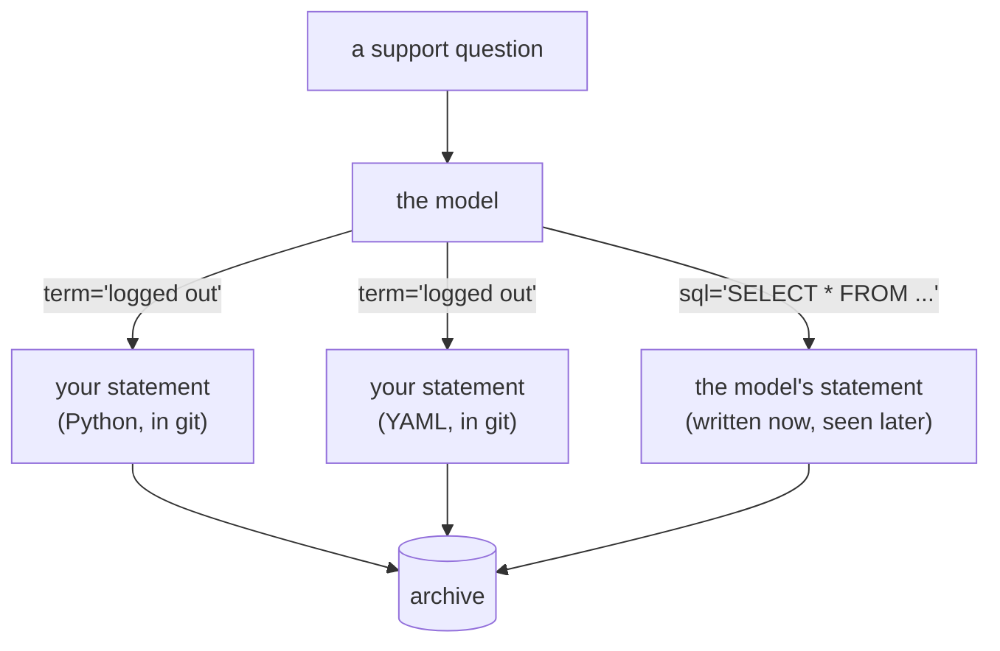

# 4.2 — Who writes the SQL

## One-line answer

The real question is not "generated tools or hand-written tools" but **who authors the statement and
when** — a statement written by you and reviewed in a diff, or a statement written by a model at
request time — and every difference that matters follows from that one.

## The story

You want a shirt made, and there are two ways to ask.

The first is to hand the tailor a pattern. Somebody cut it, it fits, and the only decisions left are
which cloth and how many. He will make that shirt, and if you come back in a year with the same
pattern you will get the same shirt.

The second is to say "make me something nice for a wedding". He is good, and he will probably produce
something you like. He will also make thirty decisions you did not know were decisions — collar,
length, how much room across the shoulders — in the shop, on the day, based on what he thinks you
meant.

The cloth is the same either way. The tailor is the same. What changed is when the shirt was decided
and by whom, and therefore whether anybody can check it before it exists.

## The idea in plain language

Line up the three arrangements this day has shown you, against the one question:

| | Hand-written tool | Toolbox custom `tools.yaml` | Toolbox prebuilt `execute_sql` |
| --- | --- | --- | --- |
| Who authors the statement | you | you | **the model, per request** |
| When | before it ships | before it ships | while it runs |
| Where a reviewer sees it | a Python diff | a YAML diff | a log, afterwards |
| Bound parameters | yours | the server's | whatever the model wrote |
| Row ceiling | in your SQL, clamped in code | in the YAML statement | **none** |
| Work budget | yours to install | the server's | the server's |
| Pooling, auth, metrics | you build them | included | included |
| New database next quarter | new Python | new YAML, same binary | one environment variable |
| Truncation flag, custom shape | yes | no — rows are rows | no |

Read the first two rows before any of the others. Columns one and two differ in **language**; column
three differs in **kind**. A YAML statement and a Python statement are both reviewed artefacts in
version control. A model-written statement is not an artefact at all until it has already run.

That reframes the whole comparison, and it is the sentence to carry out of this day: *the choice is
not between writing tools and generating them, it is between a reviewed statement and an unreviewed
one.* Toolbox is on both sides of that line depending on which mode you run. So is a hand-written
tool, if somebody gives it a `sql: str` parameter.

Which does not make the generated option worse. Look down the bottom half of the table: pooling,
auth, metrics and fifty database drivers are real engineering that you would otherwise write, badly,
in a hurry. A team on Postgres with six services and an SRE on call is trading away work they do not
want in exchange for a config file, and that is a good trade.

## Why Sutra needs it

Because today the decision has to be made and written down, and `sutra_mcp/db_tools.py` is what
comes out of it.

**Sutra's decision:** hand-written narrow tools, in the server
[Day 34](../../../day-34-building-sutra-mcp-tools/LESSON.md) built, with the five brakes from
section 2. The reasons, in order of weight:

1. **The archive is one SQLite file.** Pooling, auth hooks and a driver matrix are the majority of
   what Toolbox provides, and none of them apply to a file opened in-process. We would be adding a
   compiled binary to buy features we cannot use.
2. **A required step may not need an installed server** (Addendum 02). Toolbox is a binary to
   download and pin. That is a real dependency with a `docs/PACKAGES.md` row and a supply-chain
   surface, in exchange for two functions.
3. **The tool result shape is ours.** `truncated`, `status`, the snippet length — those come from
   the tool's Python, not from rows, and they are what makes the answer honest rather than merely
   correct.

And **when Sutra would switch:** the day the archive moves to Postgres and a second service needs the
same tools. At that point pooling stops being theoretical, the driver matters, and a `tools.yaml`
with declared statements gives the same narrow doors with somebody else maintaining the serving
layer. That is [6.2](../06-in-production/6.2-when-sqlite-is-not-the-database.md)'s subject, and it is
written down here so that the decision has a stated expiry rather than becoming a habit.

## The mechanism

The same question, asked three ways. First, the hand-written tool's whole surface:

```python
def search_tickets(term: str, limit: int = 3) -> dict:
    """Search the ticket archive for a symptom and return matching tickets."""
    capped = max(1, min(int(limit), MAX_ROWS))
    con = connect_readonly()
    try:
        rows = con.execute(
            "SELECT id, title, substr(body, 1, 160) FROM tickets "
            "WHERE status = 'open' AND (body LIKE ? OR title LIKE ?) LIMIT ?",
            (f"%{term}%", f"%{term}%", capped + 1),
        ).fetchall()
    finally:
        con.close()
    return {
        "status": "ok",
        "tickets": [{"id": r[0], "title": r[1], "snippet": r[2]} for r in rows[:capped]],
        "truncated": len(rows) > capped,
    }
```

**Line by line:**

- Everything a caller can influence is in that one tuple of three bound values. The statement, the
  status filter, the column list, the snippet length and the ceiling are all fixed text.
- `capped + 1` and the `truncated` flag are the part no configuration file can express, because they
  are a computation over the result rather than a property of the query.
- The return is a dict of the tool's own design. A column added to `tickets` tomorrow does not
  appear in it, which means a schema change cannot silently start leaking data into a model's
  context.
- `connect_readonly()` and `MAX_ROWS` are the brakes from section 2, reachable because this is code.

Second, the same question in Toolbox's narrow mode — the statement moves from Python to YAML and
nothing else about who wrote it changes:

```yaml
kind: tool
name: search_tickets
type: sqlite-sql
source: sqlite-source
description: Search the ticket archive for a symptom and return matching tickets.
statement: |
  SELECT id, title, substr(body, 1, 160) FROM tickets
  WHERE status = 'open' AND body LIKE '%' || ? || '%'
  LIMIT 5
parameters:
- name: term
  type: string
  description: words from the symptom, for example "logged out"
```

Third, the prebuilt hallway. There is no statement to show, which is the point — this is the entire
tool definition, quoted from the repository on 2026-09-04:

```yaml
kind: tool
name: execute_sql
type: sqlite-execute-sql
source: sqlite-source
description: Use this tool to execute SQL.
```

Where the decision lives in each:



## When it breaks

The prebuilt path breaks in the way this whole day has been circling, and it breaks while being
helpful. Ask an innocent question of an agent holding `execute_sql`:

```text
user: the archive has test junk in it, clean up any tickets that look like test data

tool call: execute_sql
  sql: DELETE FROM tickets WHERE title LIKE '%test%' OR body LIKE '%test%'
```

If the underlying connection is read-only, the engine refuses and you get the best possible outcome:

```text
sqlite3.OperationalError: attempt to write a readonly database
```

Read where that refusal came from. Not the prompt. Not the model. Not the tool description, which
said nothing about writes. The **database**. That is
[2.2](../02-the-five-brakes/2.2-the-connection-that-cannot-write.md) doing its job on a tool that
gave it no help — and it is the argument for keeping brakes underneath whichever option you choose,
because the brake that saved you is the one furthest from the decision.

The narrow paths break differently, and much more boringly. A hand-written tool with a wrong `LIKE`
returns no rows. A YAML tool with a typo fails to load and the server will not start. Both are
failures you meet during development, in your own terminal, before anything ships.

## In production

**What a professional writes instead:** the decision, in an ADR, with an expiry condition. Not "we
hand-write our database tools" but "we hand-write them because the store is one file; revisit when it
is not". A choice with no stated trigger for revisiting becomes a rule nobody remembers making, and
in three years somebody is hand-writing connection pooling.

**What degrades at scale:** the hand-written column. Two narrow tools are easy; twenty are a
maintenance surface, and twenty across three services is duplicated SQL going stale in different
directions. That is precisely the point where Toolbox's config-driven model starts paying, and it is
worth being honest that the argument in this part has a size beyond which it inverts.

**The failure mode that only appears with real traffic:** the hybrid. A team adopts narrow tools,
then adds one `execute_sql` "just for the analytics agent, in staging". It reaches production, and
the whole security posture is now the weakest tool in the list, because the model does not know which
of its tools you were proud of.

**The review comment a senior engineer leaves:** *"this pull request adds a tool whose only parameter
is a SQL string. Whatever we say in the description, this is the one tool in our list that decides
what our agent can do, and it decides it at runtime. What question is it for?"*

**The interview question:** *"generated database tools or hand-written ones?"* *"I would push back on
the framing, because the split that matters is not generated versus hand-written — it is whether the
statement was reviewed before it ran. Toolbox in custom mode writes the statement in YAML, in the
repository, with bound parameters; that is a reviewed statement in a different language, and it comes
with pooling and auth I did not have to build. Toolbox's prebuilt mode gives you `execute_sql`, and
that is a different kind of thing: the statement is authored by the model per request, so the first
time a human sees it is in a log. I chose hand-written for our case for narrow reasons — the archive
is one SQLite file, so the serving features buy us nothing, and the tool result shape is ours, which
is how we return a truncation flag. On Postgres with three services I would expect the trade to
flip, and I wrote that trigger into the decision record so it gets revisited rather than
inherited."*

## Check yourself

```bash
cd days/day-39-database-tools/lab && uv run python brakes.py; echo "exit: $?"
```

Look at brake 2's line. Say which of the three columns in this part's table would still have been
protected by it, and which would not have needed it.

**Out loud, without scrolling up:** state the difference between the two Toolbox modes in one
sentence that does not use the words "prebuilt" or "custom".

**Next:** [4.3 — The extras map](4.3-the-extras-map.md).
