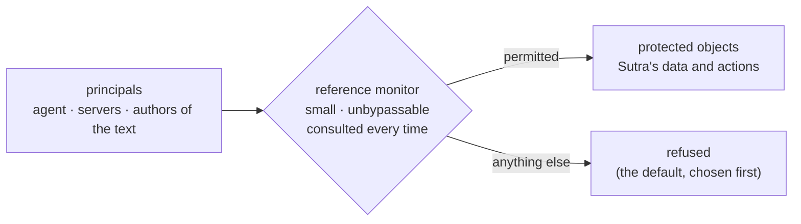

# The protection of information in computer systems

> **The protection of information in computer systems** · `doi:10.1109/PROC.1975.9939` · 1975 ·
> `https://doi.org/10.1109/PROC.1975.9939`

## One-line answer

It gave the field eight named design principles for protection — least privilege, fail-safe defaults,
complete mediation, economy of mechanism, open design, separation of privilege, least common mechanism
and psychological acceptability — and fifty years later they are still the words people argue in.

## The story

In the early days of shared computers, every machine had a different answer to the same question.

Several people were now using one computer at once, which had not been true a decade earlier. Their
files sat on the same disks. Their programs ran in the same memory. So each installation had to work
out, on its own, how to stop one person's program from reading another person's data — and each one
worked it out differently, in the hardware, in the operating system, and in whatever the local team
happened to think of.

The results were not obviously wrong. They were untested, incomparable and, worst of all,
**undiscussable**. Two engineers from two installations could not compare their designs, because they
had no shared words for what they had each built. One would say the system was secure and mean that
programs could not read each other's memory. The other would say it and mean that files had owners.
Neither could tell the other what was missing, because "what is missing" is a question you can only
ask once you have a list of things to be missing.

Everybody was reinventing protection, and nobody could review anybody else's.

## The idea in plain language

The paper's lasting contribution is not a mechanism. It is a **vocabulary**: eight principles for
designing protection, each stated in a sentence, each independently arguable.

| Principle | In plain words |
| --- | --- |
| **Economy of mechanism** | keep the protecting part small enough that somebody can read all of it and be convinced |
| **Fail-safe defaults** | decide by permission, not exclusion: what is not explicitly allowed is refused |
| **Complete mediation** | every access is checked, every time, with no cached "I checked this earlier" |
| **Open design** | the design may be public; the secret is the key, not the mechanism |
| **Separation of privilege** | needing two independent conditions is stronger than needing one |
| **Least privilege** | every part runs with the smallest set of powers that lets it finish its job |
| **Least common mechanism** | the less that is shared between users, the fewer paths between them |
| **Psychological acceptability** | if the safe way is painful, people route around it, and then it protects nothing |

Two of them are worth a longer sentence each, because they are the two this day is built on.

**Fail-safe defaults** is a statement about the answer to a question you did not anticipate. Base
access decisions on permission rather than exclusion — so the default is *no*, and a mistake in the
rules shows up as something that does not work rather than as something that quietly does. The paper's
argument for it is not that refusing is safer in the abstract. It is about **detectability**: a
conservative design fails visibly, so the error is found in use, while a permissive design's errors are
found only when someone exploits them.

**Complete mediation** says every access must be checked, every time. Not once at the start, not
cached, not "we validated this at setup". Its enemy is exactly the optimisation everybody reaches for:
remembering the answer.

The word that has outlived the rest is **least privilege**, which has become a phrase people use
without knowing it was named here. That is what success looks like for a vocabulary paper: the words
detach from the document.

## Why Sutra needs it

Because this day is those principles applied to a tool list, and naming them turns eight separate
opinions into one argument.

Every part in this day is one of the rows above:

- [1.1](../parts/01-the-list-you-agreed-to/1.1-the-list-of-things-you-thought-of.md) is **fail-safe
  defaults**: a deny-list defaults to yes, an allowlist defaults to no, and the difference only shows
  up on a name nobody anticipated.
- [1.2](../parts/01-the-list-you-agreed-to/1.2-a-tool-list-is-a-strangers-text.md) is **least
  privilege**: cut the tool list to what the agent needs, before you know whether anything in it is
  hostile.
- [2.4](../parts/02-the-filter-in-adk/2.4-the-empty-list-that-admits-everything.md) is **economy of
  mechanism** failing on its own terms — `if not x` is as small as a mechanism gets and it is still
  wrong, because small and correct are different properties.
- [3.3](../parts/03-when-the-server-changes/3.3-the-list-you-kept-is-the-list-you-trust.md) is
  **complete mediation** and its price: caching the listing is precisely the "I checked this earlier"
  the principle warns about, and the paper would have predicted the staleness window.
- [4.1](../parts/04-the-policy-module/4.1-one-door-and-a-check-there-is-one.md) is **economy of
  mechanism** used correctly — one module small enough to read, plus a check that nothing else does the
  job.
- [6.3](../parts/06-the-posture/6.3-the-host-decides-not-the-server.md) is **open design**: the policy
  is public, in the repository, and nothing about the protection depends on a server not knowing how it
  works.
- The intake in [6.4](../parts/06-the-posture/6.4-what-you-write-down-before-you-connect.md) is
  **psychological acceptability**, and it is why the form is eight questions and not twenty.

Day 44 hardens the client, Day 45 audits everything Phase 6 built, and Phase 9 adds the approval gates
that are **separation of privilege**. The vocabulary is what lets those days be argued about rather
than merely built.

## The mechanism

The method the paper describes is not an algorithm. It is a **design procedure**, and it is worth
writing out as one rather than paraphrasing the list again.

**Step 1 — name the protected objects and the principals.** Not "the system", but: which specific
things need protecting, and which specific actors might reach them. For this day: the objects are
Sutra's data and its ability to act; the principals are the agent, the servers it connects to, and
whoever wrote the text those servers serve.

**Step 2 — put a single point of decision between them.** The paper's term for the thing that makes the
decision is a **reference monitor**, and its requirements are the three that follow: it must be
consulted on every access (complete mediation), it must be small enough to verify (economy of
mechanism), and it must be impossible to bypass. `sutra/mcp/filtering.py` is exactly this — one module,
small, and [4.1](../parts/04-the-policy-module/4.1-one-door-and-a-check-there-is-one.md)'s check exists
to enforce the third requirement.

**Step 3 — choose the default before you enumerate the rules.** This is the step everybody skips,
because the rules feel like the work. The paper's point is that the default decides every case the
rules do not cover, and the rules will never cover every case, so the default is doing more work than
the rules are.

**Step 4 — make the mechanism reviewable rather than secret.** Publishing the design costs nothing if
the design is sound and reveals a great deal if it is not, which is why the exposure is a feature.

**Step 5 — check that a person will actually use it.** A protection people route around protects
nothing, and routing around it is not a discipline problem — it is a design defect in the protection.



The diagram is the paper's whole architecture, and the interesting box is the bottom-right one. Every
system has it. The question the paper forces you to answer out loud is which arrow points into it.

## The paper in one demo

The demo implements **fail-safe defaults and nothing else**. Two files, no framework, no network, no
model, no argument parser. It is the same toolset built twice — once deciding by exclusion, once by
permission — with a tool appearing on the server in between.

```text
lab/papers/protection-of-information/
├── catalog.py    # what was reviewed, and what the server ships now
└── mediate.py    # one decision function, and the switch
```

`catalog.py` is data and only data:

```python
"""The tool catalogue a server offers, on two different days. Data only.

REVIEWED is what a human read and signed off. SHIPPED is what the running
server answers `tools/list` with now. The gap between them is the only thing
this demo is about.
"""

from __future__ import annotations

REVIEWED: list[str] = ["check_status", "list_regions"]

SHIPPED: list[str] = ["check_status", "list_regions", "open_incident"]
```

**Line by line:**

- Two lists, one difference. `open_incident` is present in `SHIPPED` and absent from `REVIEWED`,
  which is the entire scenario: a server added a tool after somebody read it.
- They are in a file of their own so that the decision function can be read without the data next to it,
  and so that the ablation switch cannot be confused with a change to the inputs. Both arms of the
  experiment import the same two lists.
- No timestamps, no server object, no protocol. The paper's principle is about defaults, and everything
  that is not a default has been deleted.

`mediate.py` is the mechanism and the switch:

```python
"""Fail-safe defaults, and nothing else.

FAIL_SAFE=1 python mediate.py    # unknown -> refuse (permission)
FAIL_SAFE=0 python mediate.py    # unknown -> admit  (exclusion)
"""

from __future__ import annotations

import os
import sys

from catalog import REVIEWED, SHIPPED

RULES: dict[str, bool] = {
    "check_status": True,
    "list_regions": True,
    "execute_sql": False,
    "delete_ticket": False,
}

FAIL_SAFE = os.environ.get("FAIL_SAFE", "1") == "1"


def decide(name: str) -> bool:
    """Admit this tool? The only difference between the arms is the last line."""
    if name in RULES:
        return RULES[name]
    return not FAIL_SAFE


def main() -> int:
    arm = "permission (fail-safe)" if FAIL_SAFE else "exclusion (fail-open)"
    print(f"default for an unlisted tool: {arm}")
    admitted: list[str] = []
    for name in SHIPPED:
        listed = "listed" if name in RULES else "UNLISTED"
        verdict = "admit" if decide(name) else "refuse"
        print(f"  {name:<14} {listed:<8} -> {verdict}")
        if decide(name):
            admitted.append(name)
    unreviewed = [name for name in admitted if name not in REVIEWED]
    print(f"admitted: {admitted}")
    print(f"admitted but never reviewed: {unreviewed}")
    return 1 if unreviewed else 0


if __name__ == "__main__":
    sys.exit(main())
```

**Line by line:**

- `RULES` is **identical in both arms**. That is what makes this an ablation rather than a comparison
  of two programs: the rules a human wrote do not change, only the answer for a name they do not cover.
  Two of the four entries are explicit refusals, which is exactly what a deny-list contains — the
  demo is not straw-manning the exclusion posture, it is giving it its best rules.
- `open_incident` is not in `RULES`, and the docstring in `catalog.py` says why: on the day the table
  was written, it did not exist. That is the honest reason a rule is missing, and it is the only reason
  that matters, because it is the one that recurs forever.
- `FAIL_SAFE = os.environ.get("FAIL_SAFE", "1") == "1"` is the ablation switch. It defaults to `"1"`,
  the safe arm, so running the demo with no environment set demonstrates the principle rather than its
  absence.
- `decide()` is the reference monitor: **one function, four lines, consulted for every name.** Economy
  of mechanism made literal — you can read all of it — and complete mediation made literal, because
  there is no other path to a verdict.
- `if name in RULES: return RULES[name]` handles every case a human thought about. Both arms agree
  completely here, which is why the first two rows of both transcripts are identical.
- `return not FAIL_SAFE` is **the entire paper, in one line**. When the rules have nothing to say:
  refuse under permission, admit under exclusion. Everything else in these two files exists to make
  this line's consequence visible.
- `unreviewed` compares what was admitted against `REVIEWED` — what a human actually read — rather than
  against `RULES`. The question is not "did the code follow its rules", which it always does, but "was
  anything admitted that nobody approved".
- `return 1 if unreviewed else 0` makes the demo an eval that can go red (Principle 11), and it is red
  in exactly one arm.
- **Zero model calls, zero network, zero dependencies.** Two standard-library imports, and one of them
  is only for the exit code.

Run both arms:

```bash
cd days/day-40-filtering-and-allowlists/lab/papers/protection-of-information
FAIL_SAFE=1 uv run --project ../../../../.. python mediate.py; echo "exit: $?"
FAIL_SAFE=0 uv run --project ../../../../.. python mediate.py; echo "exit: $?"
cd -
```

**Line by line:**

- `cd` into the demo directory first, because `mediate.py` imports `catalog` as a top-level module. Two
  files in one folder, run from that folder — the alternative is a package with an `__init__.py`, which
  is a file that could be deleted and the claim would still land.
- `uv run --project ../../../../..` points uv at the repository root's environment from inside the
  demo directory. The demo itself needs nothing from that environment; this is only so the command
  matches every other command in this curriculum.
- `FAIL_SAFE=1` then `FAIL_SAFE=0`. Same command otherwise, same files, same rules.
- `echo "exit: $?"` on both, because the exit codes differ and the difference is the point.

**Arm one — permission (the paper's recommendation).** Measured on 2026-09-04:

```text
default for an unlisted tool: permission (fail-safe)
  check_status   listed   -> admit
  list_regions   listed   -> admit
  open_incident  UNLISTED -> refuse
admitted: ['check_status', 'list_regions']
admitted but never reviewed: []
exit: 0
```

**Arm two — exclusion, the idea switched off.** Same day, same files:

```text
default for an unlisted tool: exclusion (fail-open)
  check_status   listed   -> admit
  list_regions   listed   -> admit
  open_incident  UNLISTED -> admit
admitted: ['check_status', 'list_regions', 'open_incident']
admitted but never reviewed: ['open_incident']
exit: 1
```

Two identical rows, then one that differs. The rules were the same, the catalogue was the same, and the
line that changed the outcome was `return not FAIL_SAFE`. `open_incident` files a public record with a
vendor, and under exclusion it was admitted with nobody asked.

## When it breaks

**The principles are not a checklist and cannot be scored.** They pull against each other, and the
paper says so. Least privilege pushes toward many small, separately-permitted components; least common
mechanism agrees; economy of mechanism pulls the other way, because many components with many
permissions is a protection system nobody can read in an afternoon. Psychological acceptability
contradicts almost all of them at some point, because every additional control is friction. A design
that "satisfies all eight" has usually not noticed the tensions.

**Complete mediation is routinely violated on purpose, including in this day.** Checking every access
every time means never caching an authorisation decision, and caching authorisation decisions is what
half of modern performance engineering consists of.
[3.3](../parts/03-when-the-server-changes/3.3-the-list-you-kept-is-the-list-you-trust.md) is a
deliberate violation: ADK caches the tool listing, and the staleness window is the price. The paper
would not call that wrong; it would call it a documented departure, which is exactly what that part
tries to make it.

**The threat model has moved.** In 1975 the adversary was another program on the same machine, and the
mechanisms were about memory and files. The paper's principles survive that shift precisely because
they are about *design* rather than about hardware. But they were never written for the case in this
day — an authorised program, given correct inputs, persuaded by text to use its legitimate authority
badly. Least privilege limits the damage; nothing in the eight principles addresses the persuasion,
because in 1975 programs were not persuadable.

**Open design has a boundary the slogan hides.** "The design may be public, the key is the secret"
works when there is a key. A tool allowlist has no key: publishing it tells an attacker exactly which
tools to point an injected instruction at. That does not make open design wrong here — hiding the list
would be security by obscurity and would fail the same way it always does — but the honest statement is
that the principle costs something in this setting and the paper's version of it does not price that.

## In production

**What survived, and it is most of it.** The eight names are the working vocabulary of security review
today. "Least privilege" appears in cloud identity documentation, container defaults and code review
comments, usually by people who have never seen this paper. "Fail-safe defaults" is why a firewall's
default policy is deny, why a permissions system starts empty, and why this day argues for allowlists.
"Complete mediation" is the reason a session token gets re-validated rather than trusted for its
lifetime. The reference monitor idea — small, unbypassable, always consulted — is the shape of every
policy engine and every sidecar proxy doing authorisation.

**What did not survive: the machinery.** Most of the paper's length is spent on mechanisms for the
hardware of its era — segmentation and paging as protection primitives, capability lists and access
control lists compared as implementations, and **protection rings**, the hierarchical privilege levels
where ring 0 is the kernel and higher numbers are less trusted. Rings still exist in processors and are
barely used as designed: operating systems settled on two levels rather than eight, and the interesting
protection boundaries moved to processes, containers and virtual machines. The specific answers are
history. The questions are not.

**What the field added afterwards.** Two things the paper does not have. **Defence in depth** — layers
that assume the one above failed — is the shape of
[6.2](../parts/06-the-posture/6.2-the-attacks-a-filter-does-not-stop.md)'s prevention, detection,
containment, and it is a response to the discovery that reference monitors have bugs. And **detection
as a first-class goal**: the paper is almost entirely about prevention, whereas
[3.2](../parts/03-when-the-server-changes/3.2-the-name-held-the-sentence-moved.md)'s pin prevents
nothing and is one of the most valuable controls in this day.

**Where an interviewer will probe.** The give-away answer names least privilege and stops. The useful
one names fail-safe defaults and complete mediation as a pair, because they are the two that shape
code rather than intentions, and then names the tension — that complete mediation is the one you break
whenever you cache, and that knowing you broke it is what makes it a decision rather than an accident.

## Check yourself

```bash
cd days/day-40-filtering-and-allowlists/lab/papers/protection-of-information
FAIL_SAFE=0 uv run --project ../../../../.. python mediate.py; echo "exit: $?"
cd -
```

Now add `"open_incident": False` to `RULES` and run the failing arm again. It goes green. Then add a
fifth tool to `SHIPPED` and watch it go red again, and say out loud how many times you are willing to
repeat that cycle — which is [1.1](../parts/01-the-list-you-agreed-to/1.1-the-list-of-things-you-thought-of.md)'s
question arriving from the paper's direction.

**Out loud, without scrolling up:** name four of the eight principles, say what fail-safe defaults
actually claims and why the paper argues for it on grounds of detectability rather than caution, and
name one principle this day deliberately violates and what it bought.

**Next:** back to the hub, [`../LESSON.md`](../LESSON.md), for the build brief and the ledger.
