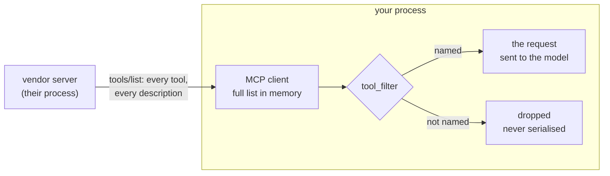

# 1.3 — The filter is on your side of the wire

## One-line answer

An allowlist runs inside your own process, after the server has already sent you everything it has,
so it decides what the **model** sees and never what the **network** carries.

## The story

The laundry comes back on Friday in one big bundle.

You do not put the bundle in the cupboard. You untie it on the bed, count the shirts, find the one
that came back with somebody else's collar stain, put that one aside, and only then does anything go
onto a shelf. The cupboard gets what you approved. The bed got everything.

Two things are true at once and people mix them up. Somebody else's shirt **was** in your house — it
came through the door, it sat on your bed, you handled it. And it never went into the cupboard, which
is where clothes get worn without being looked at again.

If you told a neighbour "I don't accept other people's clothes", you would be describing the cupboard
and not the door. The distinction sounds pedantic right up until something in the bundle is not just
wrong but dirty, at which point where you stopped it matters a great deal.

## The idea in plain language

There are three places a tool could be kept out, and only one of them is yours.

1. **The server never advertises it.** The server decides who sees what. Modern MCP explicitly
   permits this: a server's tool set *"**MAY** vary by the authorization presented on the request"*.
   That is somebody else's control, and you cannot verify it.
2. **Your client drops it after the listing arrives.** The whole list crossed the network into your
   process. Your code then decides what to keep. This is the one you own.
3. **You tell the model not to use it.** The tool is in the list and in the context. You are now
   arguing with a sentence rather than removing it, which Day 33's
   [1.4 — The allowlist is a constructor argument](../../../day-33-client-and-transports/parts/01-the-connector/1.4-the-allowlist-is-an-argument.md)
   already established is a request rather than a grant.

`tool_filter` is number two. Being precise about that is not pedantry — it changes three real
answers:

- **Bandwidth and latency are not saved.** You paid for the full listing either way.
- **Descriptions of dropped tools did reach your process.** They are in your memory, they are in
  your logs if you log the raw response, and they are available to you to hash and compare — which
  is the only reason [3.2](../03-when-the-server-changes/3.2-the-name-held-the-sentence-moved.md)'s
  pin is possible at all.
- **What is protected is the model's context window.** Nothing else. If your worry is that a
  malicious server can see that you connected, filtering does not help; if your worry is that a
  sentence a stranger wrote will be read by your model as an instruction, filtering is exactly the
  control.

Day 33's [1.3 — Before the model sees a tool](../../../day-33-client-and-transports/parts/01-the-connector/1.3-before-the-model-sees-a-tool.md)
laid out the five steps between "connect" and "the model has a tool". This part is a magnifying glass
on the boundary between step four and step five.



The dashed half of everyone's mental model — the idea that a filtered tool "never arrives" — is the
arrow from the server. It arrives. It is dropped one box later.

## Why Sutra needs it

Because two of the day's later decisions only make sense once this boundary is clear.

[3.2](../03-when-the-server-changes/3.2-the-name-held-the-sentence-moved.md) pins a hash of the
descriptions you reviewed and compares it on each listing. That is only possible because the
descriptions reach you. If filtering happened at the server, you would have nothing to hash.

[5.2](../05-failure-lab/5.2-filtered-after-it-was-read.md) is the mirror image: a filter applied one
box too late, after the request to the model was already built. The difference between "filtered in
your process" and "filtered before the model" is the entire content of that failure, and you cannot
see it without this diagram.

Day 44 hardens the client that carries these calls, and its retry logic re-lists. Day 45's audit asks
where each server's filter is applied. Both assume you know which side of the wire the decision sits
on.

## The mechanism

ADK's `McpToolset.get_tools()` is where both halves happen, and the framework's own comment says so.
Read it out of the installed package rather than believing this page:

```bash
sed -n '552,567p' .venv/Lib/site-packages/google/adk/tools/mcp_tool/mcp_toolset.py
```

**Line by line:**

- `sed -n 'A,Bp' <file>` prints only lines A to B. It is the smallest way to quote a source file
  without opening an editor, and it keeps the line numbers honest — you can re-run it and see whether
  the code moved under you.
- The path is inside `.venv`, so this is the version actually installed here (`google-adk==2.7.1`),
  not the version on a documentation site. Principle 8 says never invent an API; reading the package
  is how you avoid it.

On 2026-09-04 that printed:

```text
    if mcp_tools is None:
      # Fetch available tools from the MCP server
      tools_response: ListToolsResult = await self._execute_with_session(
          lambda session: session.list_tools(),
          "Failed to get tools from MCP server",
          readonly_context,
          headers=headers,
      )
      mcp_tools = tools_response.tools
      self._write_tool_list_cache(cache_key, mcp_tools)

    # Apply filtering based on context and tool_filter. This runs on every call
    # even on a cache hit, so only the round trip is skipped.
    tools = []
    for tool in mcp_tools:
```

Two facts, both load-bearing for the rest of the day. `session.list_tools()` returns
`tools_response.tools` — **everything the server offered** — and the filtering loop starts on the next
line, over that same complete list. And the comment says the filter runs on every call *"even on a
cache hit"*, which is the sentence [3.3](../03-when-the-server-changes/3.3-the-list-you-kept-is-the-list-you-trust.md)
is built on.

The same thing, from your own code:

```python
# lab/resolve.py
async def resolved(posture: str) -> list[str]:
    """Tool names an agent would be handed under this posture."""
    toolset = McpToolset(
        connection_params=StdioConnectionParams(
            server_params=StdioServerParameters(
                command=sys.executable,
                args=[str(PROP)],
                env={**os.environ},
            ),
            timeout=20,
        ),
        tool_filter=POSTURES[posture],
    )
    try:
        return [tool.name for tool in await toolset.get_tools()]
    finally:
        await toolset.close()
```

**Line by line:**

- `McpToolset` is ADK's client-side collection of tools backed by one MCP server. Verified against
  `https://adk.dev/tools-custom/mcp-tools/` on 2026-09-04, which calls `tool_filter` *"Optional:
  Filter which tools from the MCP server are exposed"*.
- `StdioConnectionParams` wraps `StdioServerParameters` and adds a `timeout`. The bare
  `StdioServerParameters` is accepted too and has no timeout, which is why the ADK docstring
  recommends the wrapper — a server that never answers otherwise hangs the agent.
- `timeout=20` is seconds, and it is the connection timeout rather than a per-call one. Day 44 owns
  the full retry-and-timeout story.
- `tool_filter=POSTURES[posture]` is the only line that varies between the script's five modes. Every
  other line — same server, same transport, same everything — is held constant on purpose, so the
  output difference has exactly one cause.
- `await toolset.get_tools()` is the call that both lists and filters. **The listing has already
  happened by the time this returns**, which is this part's whole claim, made executable.
- `finally: await toolset.close()` shuts the child process down even when `get_tools()` raises.
  Without it a failed run leaves a Python process holding a pipe, and you find out when your machine
  is running eleven of them.

```bash
uv run python days/day-40-filtering-and-allowlists/lab/resolve.py none
uv run python days/day-40-filtering-and-allowlists/lab/resolve.py allow
```

**Line by line:**

- `none` passes `tool_filter=None`, ADK's default: no filtering, everything the server offered.
- `allow` passes the two names you reviewed. Same listing on the wire, different handover to the
  agent.

Measured on 2026-09-04, with the server's own chatter left in so you can see the listing happen:

```text
Processing request of type ListToolsRequest
server v1 (reviewed), posture 'none' -> tool_filter=None
  the agent is handed: ['check_status', 'list_regions']

Processing request of type ListToolsRequest
server v1 (reviewed), posture 'allow' -> tool_filter=['check_status', 'list_regions']
  the agent is handed: ['check_status', 'list_regions']
```

`Processing request of type ListToolsRequest` appears in **both** runs. The server did the same
amount of work and sent the same bytes whether you were filtering or not.

## When it breaks

The break is a claim, not a crash: somebody says the filter protects the network, and builds on it.

The concrete version is a compliance answer. *"We don't receive that server's write tools at all"* is
false, and the way you find out is with a packet capture or a proxy log during an audit, where the
full listing is sitting in plain view. There is no exception to catch here. The error is in a
sentence somebody wrote in a document.

The measurable version is in [5.2](../05-failure-lab/5.2-filtered-after-it-was-read.md), and it has a
number: filter at construction and 36 characters of stranger-written text are in the request; drop the
tool from the reply afterwards and 103 characters are, because the model already read all of them.
Same allowlist, same server, one box of difference.

The other thing that breaks is a habit. If you believe the filter is a network control, you will not
bother to keep the raw listing — and then the day a description changes you have nothing to compare
it against, which is
[3.2](../03-when-the-server-changes/3.2-the-name-held-the-sentence-moved.md)'s failure arriving
through the front door.

## In production

**What a professional writes instead:** they log the full listing at debug level, hashed, once per
connection — the names, the description digests and the schema digests. It costs almost nothing and it
turns "the server changed" from an argument into a diff. What they do **not** do is log the raw
description text at info level, because a description is untrusted content and untrusted content in a
log is untrusted content in whatever reads your logs.

**What degrades at scale:** the listing itself. The filter saves you nothing on the wire, so ten
servers is ten full listings on every cold start, and a server with two hundred tools sends two
hundred descriptions so that you can keep three. That is what
`tool_list_cache_ttl_seconds` is for, and
[3.3](../03-when-the-server-changes/3.3-the-list-you-kept-is-the-list-you-trust.md) is the part about
what it costs you in exchange.

**The failure mode that only appears with real traffic:** a server whose tool list varies by caller.
Your reviewer listed it with their own credentials and saw four tools; production lists it with a
service identity and sees nine. The four you allowlisted still work, so nothing fails, and the belief
that "we have seen this server's tools" is now wrong in a way no test will report.

**The review comment a senior engineer leaves:** *"the security note says filtered tools are 'never
received'. They are received and then dropped. Please fix the wording — somebody is going to quote
this document to an auditor, and the difference is a packet capture away from being embarrassing."*

**The interview question:** *"where does MCP tool filtering happen, client or server?"* The honest
spoken answer: *"Client, and specifically inside the toolset's `get_tools` after `tools/list` has
already returned the complete set. I read the ADK source to be sure rather than trusting the docs
page, because the answer changes what the control is worth: it protects the model's context, not the
network. A server can also vary its tool list by the authorization on the request, and the current
spec explicitly allows that, but that is their control and I cannot verify it. So I treat the server
as offering everything it has, always, and I make the decision on my side where I can test it."*

## Check yourself

```bash
uv run python days/day-40-filtering-and-allowlists/lab/resolve.py allow
```

Count the `Processing request of type ListToolsRequest` lines. Now run it with `none` and count them
again. Say why the number is the same.

**Out loud, without scrolling up:** name the three places a tool could be kept out, say which one
`tool_filter` is, and say one thing that becomes possible *because* the descriptions reach your
process.

**Next:** [2.1 — One argument, three spellings](../02-the-filter-in-adk/2.1-one-argument-three-spellings.md).
