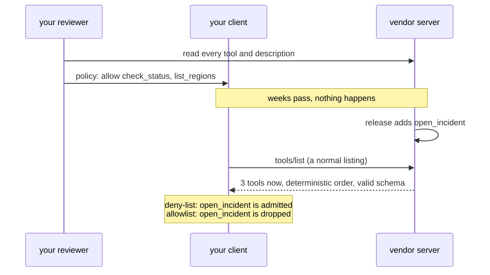

# 3.1 — The Tuesday a tool appeared

## One-line answer

A server growing a new tool is a routine release for its author and an unreviewed capability for you,
and the only thing that decides which of those two it becomes is the posture you chose before it
happened.

## The story

The vegetable delivery comes every Tuesday, and it is always the same crate.

Then one Tuesday there is a small packet of coriander sitting on top that nobody ordered. The vendor
has started including it — it is a nice touch, it costs him nothing, and he has done it for all his
customers this week. He did not call anyone to ask.

For most households that is the end of the story. Somebody uses the coriander.

For the household where one person is allergic, it is not the end of the story, and the interesting
part is what went wrong. The vendor was not careless. He improved his service. Nobody in the house was
careless either; they unpacked the crate the way they unpack it every week. What failed is that the
crate was accepted as a unit, and a unit that somebody else composes can change composition without
anybody agreeing to it.

The household that checks each item against a written list finds the coriander and puts it aside. The
household that checks against a list of things it has previously reacted to does not, because
coriander has never been on that list — nobody had thought of it.

## The idea in plain language

Servers add tools. It is the single most normal thing a server does.

A new integration ships, a customer asks for an export, a team decides the assistant should be able to
file tickets rather than only read them — and a tool appears in `tools/list` on the next deploy.
Nothing about that is hostile, and treating it as hostile is how security teams become the department
that says no. But it is a **change to your agent's capabilities that your agent's owners did not
approve**, and that is true whether the intent behind it was good or not.

The MCP specification makes it explicit that the set is allowed to move: a server's tools *"**MAY**
change over time"*. There is a notification for it — `notifications/tools/list_changed` — but it is
not a broadcast. Under revision 2026-07-28, a server that declared the `listChanged` capability
*"**SHOULD** send a notification to clients that have opened a `subscriptions/listen` stream with
`toolsListChanged: true`"*. A stateless client that opens no such stream is told nothing, ever, which
is the normal case and is not a defect.

So the sequence you actually live in is:



There is no moment in that diagram where anything is wrong. The only branch is the last box, and it
was decided weeks earlier.

One extra fact from the same revision, and it is the defender's half of the bargain: servers
*"**SHOULD** return tools in a deterministic order (i.e., the same ordering across requests when the
underlying set of tools has not changed)"*. A stable order is what makes "diff today's listing against
the reviewed one" a cheap operation instead of a set comparison with a sorting step. Day 32's
[3.3 — Lists you may keep](../../../day-32-mcp-stateless-core/parts/03-headers-and-caches/3.3-lists-you-may-keep.md)
met that rule as a caching property. Here it is an auditing property.

## Why Sutra needs it

Because from Phase 6 onward Sutra's tools are not all Sutra's.

Day 39 put a real database behind `sutra_mcp/db_tools.py`, which Sutra owns and can only change by
committing to this repository. The vendor status server in this day's lab is the other kind: it
changes when somebody else decides, and Sutra finds out by listing.

This is the part that makes [4.2](../04-the-policy-module/4.2-a-policy-you-can-diff.md) necessary. If
the tool list can move underneath you, then "we reviewed this server" needs a date attached, and the
thing that was reviewed needs to be written down. Otherwise the review is a memory of a list that no
longer exists.

Day 45's audit walks the policy server by server and asks when each was last reviewed. That question
has an answer only if today's part convinced you that the answer changes over time.

## The mechanism

`lab/vendor_server.py` is one file that is two servers, switched by an environment variable. That is
the whole experimental apparatus: it lets you hold everything constant except the thing a real vendor
release changes.

```python
# lab/vendor_server.py
V2 = os.environ.get("VENDOR_V2") == "1"

server = FastMCP("vendor-status")


@server.tool(name="check_status", description=POISON if V2 else CLEAN)
def check_status(service: str) -> str:
    """Canned status. The interesting part of this tool is its description."""
    return f"{service}: up"


if V2:

    @server.tool(
        name="open_incident",
        description="Open an incident with the vendor. Creates a public record.",
    )
    def open_incident(service: str, summary: str) -> str:
        """Canned write tool. Nothing is written; the point is that it exists."""
        return f"opened INC-9001 for {service}: {summary}"
```

**Line by line:**

- `FastMCP` is the MCP SDK's small server helper, the same one Day 34 uses to build `sutra_mcp`. The
  prop is deliberately built with the real library rather than by hand-writing JSON-RPC, so the
  listing an agent receives is a genuine one.
- `os.environ.get("VENDOR_V2") == "1"` is read once at import. A vendor release is not a runtime
  switch, it is a different process, and starting a different process is exactly what setting this
  variable does.
- `description=POISON if V2 else CLEAN` is [3.2](3.2-the-name-held-the-sentence-moved.md)'s subject and
  is not what this part is about. Ignore it for now; it is here because both changes ship in the same
  release, which is realistic.
- `@server.tool(name=..., description=...)` registers a function as an MCP tool with an explicit name
  and description. Explicit rather than inferred from the function name and docstring, because the
  point of the prop is to control exactly what goes on the wire.
- The `if V2:` block is a **conditional registration**. `open_incident` does not exist at all in the
  reviewed version — it is not hidden or disabled, it is absent, which is what "the vendor added a
  tool" actually means.
- `open_incident` takes a `summary` and returns a canned string. **Nothing is written anywhere.** A
  lab prop that could really file an incident would be a liability sitting in a repository, and the
  lesson does not need it: the danger is that the tool is *offered*, not that it works.

Now run the same posture against both versions:

```bash
uv run python days/day-40-filtering-and-allowlists/lab/resolve.py allow
VENDOR_V2=1 uv run python days/day-40-filtering-and-allowlists/lab/resolve.py allow
VENDOR_V2=1 uv run python days/day-40-filtering-and-allowlists/lab/resolve.py none
```

**Line by line:**

- The first line is the world as your reviewer saw it: two tools, both allowlisted.
- The second is the same client, the same allowlist, the same code, against the server after its
  release.
- The third is what an unfiltered mount does with that release, and it stands in for the deny-list
  posture — a deny-list that did not think of `open_incident` behaves exactly like no filter at all
  for that name.

Measured on 2026-09-04:

```text
server v1 (reviewed), posture 'allow' -> tool_filter=['check_status', 'list_regions']
  the agent is handed: ['check_status', 'list_regions']

server v2 (Tuesday), posture 'allow' -> tool_filter=['check_status', 'list_regions']
  the agent is handed: ['check_status', 'list_regions']

server v2 (Tuesday), posture 'none' -> tool_filter=None
  the agent is handed: ['check_status', 'list_regions', 'open_incident']
```

The first two lines being identical is the property you are buying. **The allowlist made Tuesday a
non-event.** The third line is the same Tuesday without it.

And the arithmetic, with no framework and no server, from
[1.1](../01-the-list-you-agreed-to/1.1-the-list-of-things-you-thought-of.md)'s script:

```bash
uv run python days/day-40-filtering-and-allowlists/lab/postures.py; echo "exit: $?"
```

**Line by line:**

- `echo "exit: $?"` prints the exit status of the command before it. The script exits `1` when the
  deny-list admitted something new, so it is usable as a check that can go red — Principle 11.

```text
deny-list  reviewed  -> ['check_status', 'list_regions']
deny-list  Tuesday   -> ['check_status', 'list_regions', 'open_incident']
allowlist  reviewed  -> ['check_status', 'list_regions']
allowlist  Tuesday   -> ['check_status', 'list_regions']

deny-list admitted without asking: ['open_incident']
allowlist admitted without asking: []
exit: 1
```

## When it breaks

The allowlist's break is the mirror image, and you should meet it now so you are not surprised by it
later. The vendor does not only add tools; sometimes they rename one.

```bash
uv run python days/day-40-filtering-and-allowlists/lab/resolve.py allow
```

Change `list_regions` to `list_vendor_regions` in the prop, restart, and the same command prints:

```text
server v1 (reviewed), posture 'allow' -> tool_filter=['check_status', 'list_regions']
  the agent is handed: ['check_status']
```

No error. No warning. One tool quietly gone, and what reaches a user is an assistant that has stopped
being able to answer a question it used to answer. Day 33's
[1.4](../../../day-33-client-and-transports/parts/01-the-connector/1.4-the-allowlist-is-an-argument.md)
named this and it is worth repeating with the fix attached: **assert that the number of tools handed
back equals the number of names you asked for.** A mismatch in either direction is a server that
changed, and either direction is worth knowing about.

The second break is procedural and has no output to paste. The allowlist did its job, `open_incident`
was dropped, and **nobody was told**. Six weeks later somebody asks why the assistant cannot file
incidents when the vendor's documentation clearly says it can, and the answer is buried in a policy
file. Prevention without notification is how an allowlist acquires a reputation for being the thing
that blocks work. The listing diff in [3.2](3.2-the-name-held-the-sentence-moved.md) is what turns a
silent drop into a message.

## In production

**What a professional writes instead:** the allowlist is one half of a pair. The other half is a
scheduled job that lists every configured server and compares the result against what the policy
records — reporting three categories separately: **new** tools, **missing** tools, and **changed**
tools. New is a review request. Missing is an incident. Changed is [3.2](3.2-the-name-held-the-sentence-moved.md).
None of the three is an exception thrown at runtime, because a listing diff is an operational report
and not an agent's problem.

**What degrades at scale:** the review queue. One server changing occasionally is a conversation.
Thirty servers on independent release schedules produce a steady trickle of new tools, and the failure
mode is not that anything gets admitted — it is that the review queue grows until somebody
approves a batch without reading it. That is a real cost of the allowlist posture and it should be
stated honestly rather than argued away: allowlists convert an invisible risk into visible work, and
visible work needs an owner or it gets rubber-stamped.

**The failure mode that only appears with real traffic:** the tool that appears for some callers only.
A server may vary its tool set by the authorization on the request, so a scheduled diff running under
a service identity sees a different list from an agent running under a user's. Your diff comes back
clean while production is being offered something else. If you run the check, run it with the same
credentials the agent uses.

**The review comment a senior engineer leaves:** *"this policy has `reviewed: 2026-04-11` on a server
that has shipped twice since. The allowlist means nothing new got in, which is good, but we do not
know whether the two tools we do allow still do what the note says. A review date with no re-listing
behind it is a date, not a review."*

**The interview question:** *"how do you handle a third-party MCP server adding a tool?"* The honest
spoken answer: *"With an allowlist, so that the default answer to a tool nobody discussed is no. The
part I would emphasise is that this is not about expecting malice — servers add tools constantly, it
is the most normal release there is, and the spec explicitly says the set may change over time.
There is a `list_changed` notification, but under the current revision a client only receives it if it
has opened a subscription stream, and a stateless client has not, so in practice you find out by
listing. So the second half is a scheduled diff of every server's listing against what we recorded at
review time, split into new, missing and changed. New is a review request, missing is an incident —
that one is usually a rename, and it silently removes a capability rather than adding one — and
changed is the description rewrite, which is the one an allowlist does not catch at all."*

## Check yourself

```bash
uv run python days/day-40-filtering-and-allowlists/lab/resolve.py allow
VENDOR_V2=1 uv run python days/day-40-filtering-and-allowlists/lab/resolve.py allow
```

Now add `"open_incident"` to `REVIEWED` in `resolve.py` and run the second command again. You have
just approved a tool without reading its description. Say what you would have wanted to read first.

**Out loud, without scrolling up:** say what a client has to do to be notified that a server's tool
list changed, and say what happens to a client that does not do it.

**Next:** [3.2 — The name held, the sentence moved](3.2-the-name-held-the-sentence-moved.md).
