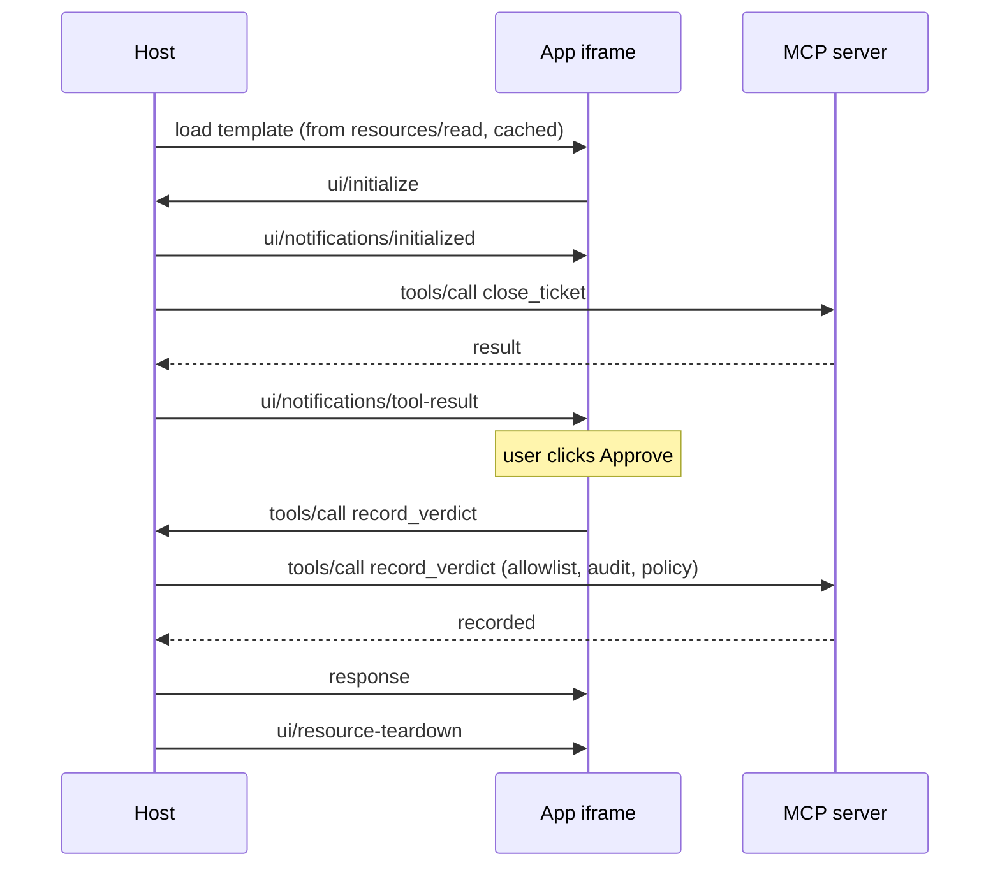

# 4.4 — The dialect spoken through the glass

## One-line answer

The panel's only wire to the world is a JSON-RPC dialect over `postMessage`, with a fixed vocabulary
of `ui/`-prefixed methods plus a handful of ordinary MCP ones — so everything the page can say is on a
list, and every tool call it makes is routed by the host and audited like any other.

## The story

The food-delivery app will not let you type a message to the rider.

You get six buttons. *I am at the gate. Please call when you arrive. Leave it with the guard. I will
be five more.* Two more you never use. That is the whole vocabulary, and the first time you want to
say something outside it — the lift is broken, come round the back — you find it genuinely annoying.

Then you think about it from the other side. The rider is on a motorbike, in traffic, in a language
that may not be yours. A free-text box would be six lines of prose to read at a junction. The six
buttons render as six words on a screen he glances at, they mean the same thing every time, and they
can be logged, translated and counted.

The vocabulary is small because both ends have to be able to act on everything in it, every time,
without thinking.

## The idea in plain language

[4.3](4.3-what-the-sandbox-actually-stops.md) established what the panel *cannot* do: no parent DOM,
no host cookies, no network beyond declared origins. This part is the other half — the one channel it
*can* use, and exactly what may travel down it.

That channel is `postMessage`, the browser's own mechanism for a page and an embedded frame to send
each other messages. On top of it the Apps extension defines a **JSON-RPC dialect**: the same message
shapes as MCP, a different transport, and its own method names.

From the official overview (`https://modelcontextprotocol.io/extensions/apps/overview`, read
2026-09-04):

> *"The app and host communicate through a JSON-RPC protocol that forms its own dialect of MCP. Some
> requests and notifications are shared with the core MCP protocol (e.g., `tools/call`), some are
> similar (e.g., `ui/initialize`), and most are new with a `ui/` method name prefix."*

The vocabulary, from the extension's specification
(`https://github.com/modelcontextprotocol/ext-apps/blob/main/specification/2026-01-26/apps.mdx`, read
2026-09-04). It is short, and reading it once is most of what you need:

| Direction | Method | What it is for |
| --- | --- | --- |
| page → host | `ui/initialize` | the handshake; the page says it is ready |
| host → page | `ui/notifications/initialized` | the handshake acknowledged |
| host → page | `ui/notifications/tool-input` | the complete arguments the tool was called with |
| host → page | `ui/notifications/tool-input-partial` | those arguments while they are still streaming |
| host → page | `ui/notifications/tool-result` | the tool's result, pushed in |
| host → page | `ui/notifications/tool-cancelled` | the call the panel was drawn for was cancelled |
| host → page | `ui/notifications/host-context-changed` | the host's context changed around the panel |
| host → page | `ui/resource-teardown` | the host is about to remove the panel |
| page → host | `ui/open-link` | asks the host to open an external URL |
| page → host | `ui/message` | sends text into the host's conversation |
| page → host | `ui/request-display-mode` | asks to be bigger, smaller, inline, fullscreen |
| page → host | `ui/update-model-context` | adds something to what the model sees next turn |
| page → host | `ui/notifications/size-changed` | the panel's own dimensions changed |
| page → host | `tools/call` | **an ordinary MCP tool call**, forwarded by the host |
| page → host | `resources/read` | an ordinary MCP resource read, forwarded by the host |
| page → host | `ping` | is anyone there |
| proxy → host | `ui/notifications/sandbox-proxy-ready` | web hosts only: the sandbox frame is up |
| proxy → host | `ui/notifications/sandbox-resource-ready` | web hosts only: the HTML is ready to load |

Two rows deserve reading twice.

**`tools/call` is not a new method.** The panel calls a tool the same way the model does, and the host
forwards it to the server the same way. That is why a click inherits everything: Day 40's allowlist,
the same policy, the same log line, the same audit trail. A button is another way of filling in the
form Day 4 taught, not a second door into the server.

**`ui/update-model-context`** is the one to be careful with. The panel can put text into what the model
reads on the next turn. That is a server-authored page writing into the model's context — the exact
shape of the injection risk this curriculum has been circling since Day 29, arriving through a
sanctioned channel. It is legitimate and it is the field a reviewer should ask about first.

## Why Sutra needs it

Because if Sutra ever renders somebody else's panel, this list is the complete set of things that
panel can ask Sutra's host to do — and a host is not obliged to honour all of it.

The overview says so directly: *"The host controls which capabilities your app can access. For example,
a host might restrict which tools an app can call or disable the `sendOpenLink` capability."* So the
list above is a menu of decisions, not a set of guarantees. Sutra's answer to each row is a policy
question, and [6.2](../06-in-production/6.2-before-a-stranger-draws-on-your-screen.md) is where those
questions get asked in order.

And on the server side, this is the mechanism that makes the two-tool split in
[4.1](4.1-a-tool-that-brings-its-own-window.md) work. `record_verdict` is marked
`visibility: ["app"]`, and the only thing that can reach an app-only tool is a `tools/call` arriving
over this bridge from that server's own panel. Not the model, not another server's panel — the
specification's wording is *"callable by the app, from the same server connection only."*

## The mechanism

The full loop, with the dialect's method names on the arrows:



Eleven arrows and not one of them goes from the panel to the server. Every message crosses the host.
That single structural fact is what makes the whole feature reviewable, and it is worth being able to
say out loud.

Here is the page's side, written against the browser's own `postMessage` rather than the extension's
convenience wrapper, so nothing is hidden:

```javascript
window.parent.postMessage(
  { jsonrpc: "2.0", id: 1, method: "ui/initialize", params: {} },
  "*"
);

window.addEventListener("message", (event) => {
  const msg = event.data;
  if (msg.method === "ui/notifications/tool-result") {
    document.getElementById("summary").textContent = msg.params.summary;
  }
});

document.getElementById("approve").addEventListener("click", () => {
  window.parent.postMessage(
    { jsonrpc: "2.0", id: 2, method: "tools/call",
      params: { name: "record_verdict", arguments: { verdict: "approve" } } },
    "*"
  );
});
```

**Line by line:**

- `window.parent.postMessage(...)` — the page speaks to whatever embedded it. It has no other route:
  the sandbox from [4.3](4.3-what-the-sandbox-actually-stops.md) means `window.parent.document` is not
  reachable, so a message is the only thing that crosses.
- `{ jsonrpc: "2.0", id: 1, method: ..., params: ... }` is a JSON-RPC request object, identical in
  shape to what travels over stdio in Day 33's
  [2.2](../../../day-33-client-and-transports/parts/02-stdio/2.2-one-message-per-line.md). Same
  protocol, different pipe.
- `"*"` as the target origin is what the extension's own examples use, because the page does not know
  the host's origin. It is safe **outbound** — the message goes to the parent regardless — and it is
  emphatically not safe as a pattern for *receiving*, which is the next bullet.
- `window.addEventListener("message", ...)` receives. Production code must check `event.origin` here
  against the host's real origin before acting on anything, because any frame can post to any frame.
  This example omits the check to keep the shape visible, and omitting it in real code is a
  vulnerability, not a shortcut.
- `msg.method === "ui/notifications/tool-result"` — a notification, so it has no `id` and expects no
  reply. The page reads `params` and updates itself.
- `.textContent = msg.params.summary` and **never** `.innerHTML`. This is the one line in the whole
  file that decides whether ticket text is displayed or executed;
  [5.1](../05-failure-lab/5.1-the-panel-that-grew-a-button.md) is the measurement.
- `method: "tools/call"` in the click handler, with the same `name` and `arguments` shape as any MCP
  tool call. The panel does not invent a way to talk to its server — it uses the protocol, and the
  host does the forwarding.
- `id: 2` because it is a request and expects a response. A collision with an outstanding id is the
  same bug it is on any other transport.

**None of the above runs in this repository.** There is no browser and no host that implements the
dialect, so this code is read rather than executed. What *can* run here is everything on the server
side of the second arrow — [4.2](4.2-the-template-is-declared-the-data-flows-in.md) ran it — and the
honest split is exactly the one `lab/apps_sketch.py` prints at the end of its output:

```text
what ran here  : declaring the ui:// resource, the _meta link, the visibility field
what did not   : the iframe, the sandbox proxy, the ui/ postMessage dialect, any pixel
```

## When it breaks

The break is a page that acts on any message it receives.

Leave out the `event.origin` check and the panel will process a message from anything that can get a
handle on it. That is not a theoretical set: a page embedded in a page, a browser extension, an
opener. The panel then receives a forged `ui/notifications/tool-result` carrying attacker-chosen
`summary` text, renders it, and the human approves a closure described by somebody who is not the
server.

There is no error text for this. It works perfectly, which is the problem — the whole symptom is a
user who saw something different from what the server sent.

The guard is three lines and belongs at the top of every handler:

```javascript
window.addEventListener("message", (event) => {
  if (event.origin !== EXPECTED_HOST_ORIGIN) return;
  handle(event.data);
});
```

**Line by line:**

- `event.origin` is set by the browser and cannot be forged by the sender. It is the only trustworthy
  field on the event.
- `!== EXPECTED_HOST_ORIGIN` compares against a single expected value, not a list and not a prefix. A
  prefix test — `startsWith("https://host.example")` — also matches
  `https://host.example.attacker.net`, which is Day 37's
  [2.2](../../../day-37-auth-and-elicitation/parts/02-issuer-checks/2.2-the-comparison-that-must-not-be-helpful.md)
  exactly: the comparison that must not be helpful.
- `return` and nothing else. No log to the console, no error to the user — a page that reports what it
  rejected is a page that tells an attacker how close they got.

The second break is the mirror image, on the host: a host that forwards a panel's `tools/call` without
running it through the same filter the model's calls go through. The panel is then a way to reach
tools that Day 40's allowlist removed, and the audit trail records them as if a user had asked. The
rule is that a click and a completion arrive at exactly the same gate.

## In production

**What a professional writes instead:** the extension's `App` class from `@modelcontextprotocol/ext-apps`
rather than raw `postMessage`, because it does the origin check, the id bookkeeping and the handshake
correctly and in one place. Raw `postMessage` is what you read to understand the mechanism; it is not
what you ship, for the same reason nobody hand-writes JSON-RPC framing after Day 33.

**What degrades at scale:** the host's forwarding path becomes a second front door with the same
security requirements as the first, and it is easy for it to fall behind. Every filter, rate limit,
audit hook and consent prompt that applies to a model's tool call must apply to a panel's, and the
number of places those two paths can diverge grows with every feature. The design that survives is one
function both paths call.

**The failure mode that only appears with real traffic:** `ui/update-model-context` used as a channel
rather than a courtesy. A panel that writes a summary into the model's context on every interaction is
adding tokens to every subsequent turn, from a source the user did not type and the model treats as
context. Day 20's compaction work is what pays for that, and the person who added the line will not be
the person who notices the context window filling up.

**The review comment a senior engineer leaves:** *"the panel handles every `message` event without
checking `event.origin`, so anything that can post to that frame can drive it. Add the exact-match
check before the handler runs. And on our side, the host is forwarding the panel's `tools/call`
straight to the transport — route it through the same filter the model's calls go through, or Day 40's
allowlist has a hole in it shaped like a button."*

**The interview question:** *"how does the UI talk back to the server?"* The answer: *"It does not. It
talks to the host, over `postMessage`, in a JSON-RPC dialect — `ui/initialize` to start, a set of
`ui/notifications/*` messages the host pushes in like the tool's input and result, a few requests the
page can make such as opening a link or updating the model's context, and then ordinary `tools/call`
and `resources/read` that the host forwards on its behalf. The structural point is that every message
crosses the host, so a click becomes a normal tool call and inherits the same allowlist, policy and
audit trail as a call the model made. The two things I would check in a review are that the page
verifies `event.origin` with an exact match before acting on any message, and that the host runs a
forwarded `tools/call` through the same filter as a model-initiated one — otherwise the panel is a way
around your own tool filtering."*

## Check yourself

```bash
uv run python days/day-41-capabilities-and-mcp-apps/lab/apps_sketch.py
```

The last two lines of output say what ran and what did not. Using the table in *The idea in plain
language*, write down which single method in the dialect you would disable first if you were a host
enabling a stranger's App, and say what you lose by disabling it.

**Out loud, without scrolling up:** say how many of the dialect's messages travel directly between the
panel and the server, and name the one field on a browser message event that cannot be forged.

**Next:** [4.5 — 🅿️ Why Sutra ships no App](4.5-parked-why-sutra-ships-no-app.md).
