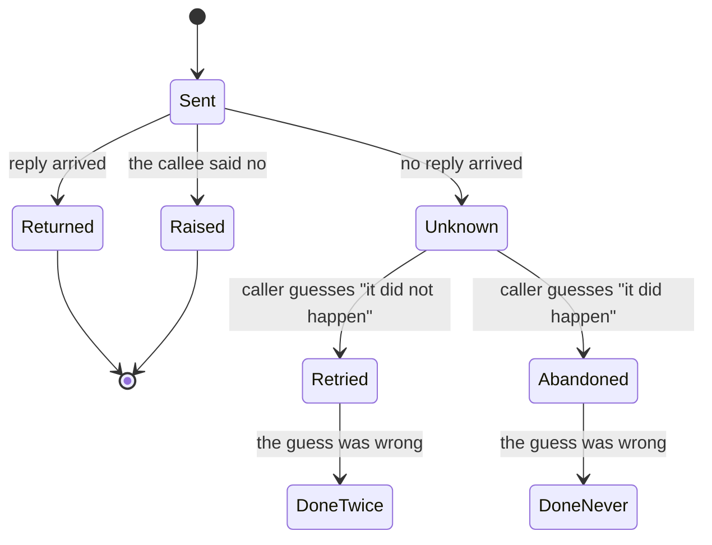

# A note on distributed computing

## One-line answer

A local call and a remote call differ **in kind, not in degree** — latency, memory access, partial
failure and concurrency do not go away because the two calls are spelled the same — so any framework
that promises to make the network invisible is promising something it cannot deliver, and the systems
built on that promise fail on the network rather than on the developer's machine.

## The story

The shop has always worked the same way. You stand at the counter, you ask for the part, and the man
says *"one minute"* and goes through the door behind him. Sometimes he comes back with it and
sometimes he comes back and says there are none left. Those are the only two things that have ever
happened.

Then the business grows and the stock moves to a godown two streets away, because the room behind the
counter is not big enough any more. Nothing else changes. You still stand at the same counter and ask
the same man for the same part in the same words. He says *"one minute"* and picks up the phone.

And now there is a third thing that can happen, and it happens for the first time on a Thursday. He
asks the godown to set aside one belt. The line goes dead halfway through the answer. He rings back
and the boy who picked up before has gone for lunch, and nobody at the godown can say whether the
belt was set aside or not. He cannot see the shelf. You cannot see the shelf. He asks again, to be
safe, and now two belts are set aside for you and the shop's stock figure is wrong by one — and
nobody will notice until the month-end count.

Same counter. Same question. Same words. A different kind of thing entirely, and the difference
arrived with the phone.

## The idea in plain language

In the early 1990s the industry was building **distributed object systems**: frameworks that let a
program call a method on an object without knowing, or caring, whether that object was in the same
process or on a machine in another building. The syntax was identical either way. That was the
selling point, and it had a name — **transparency**.

The argument goes like this. Objects are good. Objects hide their implementation behind an interface.
Where the object *lives* is an implementation detail. Therefore a good framework hides it, and a
programmer writes one kind of code and deploys it either way.

This paper says that the argument is wrong, and it says so for a specific reason: **the difference is
not an implementation detail.** Four things separate a call inside a process from a call across a
network, and none of them can be hidden by a compiler:

**Latency.** The two differ by four or five orders of magnitude. A design that is correct at
nanoseconds — a loop that touches an object a hundred thousand times — is not merely slower over a
network, it is unusable, and no amount of faster hardware changes the ratio.

**Memory access.** In one process you pass a pointer. Across a boundary there are no shared
addresses, so something has to be copied and rebuilt on the other side. Whether the copy behaves like
the original is now a design question with no automatic answer, and it is a question the local
version never had to ask.

**Partial failure.** This is the one the paper treats as decisive. A local call has two outcomes: it
returns, or it raises. Both are complete pieces of information. A remote call has a third — **no
answer arrived and the work may or may not have happened** — and that third outcome is not an error
you can raise, because the point of it is that nobody knows what to raise.

**Concurrency.** A local object is called by your thread when you call it. A remote object is being
called by other people at the same time, so its methods must be correct under interleaving that the
caller cannot see, cannot control and cannot reproduce.

The paper's conclusion is not *"do not build distributed systems"*. It is that **the interface has to
tell you which kind of call it is**, so the programmer can reason about the four differences instead
of being protected from them. A single interface hiding both is a design that works in testing and
fails in production, because testing is where everything is local.

## Why Sutra needs it

Because today is that paper, performed on Sutra's own agent, in one line of code.

`to_mcp_server(build_desk())` takes an object that has only ever been called in-process and makes it
callable across a boundary, with no change to the object. That is exactly the transparency promise —
and every part of this day is one of the four differences arriving to collect.

| The paper's difference | Where Sutra met it today |
| --- | --- |
| Latency | [5.2](../parts/05-failure-lab/5.2-you-knock-and-walk-away.md) — a two-second timeout against three model round-trips |
| Memory access | [2.2](../parts/02-what-crosses-the-counter/2.2-the-interpreter-who-relays-the-last-sentence.md) — parts converted, tool calls dropped, images base64-encoded |
| Partial failure | [5.2](../parts/05-failure-lab/5.2-you-knock-and-walk-away.md) again — the server finishing work the caller stopped waiting for |
| Concurrency | [4.2](../parts/04-what-a-call-costs/4.2-the-family-data-pack.md) — forty callers sharing one daily quota |

And it decides [3.3](../parts/03-tool-or-peer/3.3-the-guillotine-and-the-press.md). The reason Sutra
serves a read-only agent is the third row: with no way to answer *"did it happen"*, the only safe
thing to put behind a retryable call is something with nothing to repeat.

You meet it again on Day 44, where *The tail at scale* (`doi:10.1145/2408776.2408794`) is the latency
row taken seriously at volume, and on Day 89, where A2A's task-with-a-status exists precisely to give
the third outcome somewhere to live.

## The mechanism

The method here is not an algorithm; it is a discipline for reading an interface. The paper's own
structure is the mechanism: take the four differences, and for each one ask what a framework would
have to do to hide it.

**Latency — can it be hidden?** Only by making the local case as slow as the remote one, which nobody
will accept, or by making the remote case as fast as the local one, which physics does not allow. So
the framework cannot hide it. The best it can do is let you *measure* it, and a design that assumed
transparency has already been written by then.

**Memory access — can it be hidden?** Only by a distributed shared memory that makes every pointer
dereference a potential network round-trip, which reintroduces the latency problem at every field
access. So in practice the framework copies, and the moment it copies, "the same object" means two
different things on the two sides.

**Partial failure — can it be hidden?** This is the interesting one. There are two directions and
both fail:

- *Treat every call as possibly-remote.* Now local calls must be written defensively against a
  failure mode they cannot have, which is a large permanent tax on the ninety-nine per cent of calls
  that are local.
- *Treat every call as local.* Now remote calls are written without handling the one outcome that
  distinguishes them, which is the design the paper is warning about, and it fails exactly when the
  network does.

The paper's answer is neither: the interface says which it is, and the two kinds of call are written
differently on purpose.

**Concurrency — can it be hidden?** Only by serialising everything, which is a performance decision
disguised as a correctness decision, and one the caller cannot see.

Written as a state machine, the third outcome is the whole argument:



A local call has the first three states and no others. Everything below `Unknown` is what the network
added, and no amount of identical syntax removes a state from that diagram.

## The paper in one demo

The whole claim, in two files, no model, no framework, no network beyond `127.0.0.1`. One function.
One process boundary. One reply dropped on purpose *after* the work was done.

```text
days/day-42-serving-agents-over-mcp/lab/papers/a-note-on-distributed-computing/
├── warehouse.py   # the one function, and the socket server that offers it remotely
└── shop.py        # the caller, run locally (REMOTE=0) or remotely (REMOTE=1)
```

`warehouse.py` — the subject of the experiment:

```python
# The whole "database". One part, ten in stock.
STOCK: dict[str, int] = {"belt-9": 10}


def reserve(part: str, count: int) -> int:
    """Take `count` units off the shelf and return what is left.

    Two outcomes and no third one: it raises, or it returns a number. The caller
    of a local `reserve` always knows which of those happened.
    """
    have = STOCK.get(part, 0)
    if have < count:
        raise ValueError(f"only {have} of {part} left")
    STOCK[part] = have - count
    return STOCK[part]


def serve(port: int, drop_reply_on_call: int) -> None:
    """Offer `reserve` over a socket, dropping exactly one reply on purpose."""
    listener = socket.socket(socket.AF_INET, socket.SOCK_STREAM)
    listener.setsockopt(socket.SOL_SOCKET, socket.SO_REUSEADDR, 1)
    listener.bind(("127.0.0.1", port))
    listener.listen(8)
    print(f"warehouse listening on 127.0.0.1:{port}", flush=True)

    calls = 0
    while True:
        conn, _ = listener.accept()
        with conn:
            line = conn.recv(4096).decode("utf-8").strip()
            if not line or line == "stop":
                conn.sendall(b"bye\n")
                break
            calls += 1
            _, part, raw_count = line.split()
            try:
                left = reserve(part, int(raw_count))
                reply = f"ok {left}\n"
            except ValueError as exc:
                reply = f"err {exc}\n"
            if calls == drop_reply_on_call:
                # Applied, then silent. conn closes on leaving the `with` block.
                print(f"warehouse: applied call {calls}, dropping the reply", flush=True)
                continue
            conn.sendall(reply.encode("utf-8"))
    listener.close()
```

**Line by line:**

- `STOCK` is a module-level dict and it is the only state in the experiment. Ten of one part. Keeping
  it this small is deliberate: the finding has to be a number you can count on your fingers.
- `reserve` raises **before** it mutates. That ordering is what makes the local version have exactly
  two outcomes — there is no path where the shelf moved and the caller was told it did not.
- The docstring says *"two outcomes and no third one"* in the code rather than only in this document,
  because the claim being tested is a claim about this function's contract.
- `SO_REUSEADDR` so a re-run does not fail with `OSError: [Errno 98] Address already in use` on the
  port left in `TIME_WAIT`. A demo that only works the first time is a demo people stop running.
- `left = reserve(...)` happens **before** the drop check. This is the entire injected failure: the
  work is applied, *then* the answer is withheld. The failure being modelled is not "the server was
  down" — a server that is down is easy, because nothing happened. It is *"the work happened and the
  answer did not arrive"*, which is the outcome a local call cannot produce.
- `continue` rather than `conn.sendall(...)` leaves the `with conn:` block, which closes the socket.
  The caller's `recv` then returns empty bytes, which is indistinguishable from every other reason a
  connection closes.
- `drop_reply_on_call` is a parameter rather than a constant so the ablation is a command-line
  argument rather than an edit.

`shop.py` — the caller, and the ablation switch:

```python
REMOTE = os.environ.get("REMOTE", "0") == "1"


class CallFailed(Exception):
    """The call did not produce an answer. Whether it produced an effect is unknown."""


def main() -> None:
    call = call_remote if REMOTE else call_local
    ...
    believed = 0
    for attempt in (1, 2, 3):
        try:
            left = call("belt-9", 1)
            believed += 1
            print(f"  reserve belt-9 x1            -> {left} left")
        except CallFailed as exc:
            print(f"  reserve belt-9 x1            -> FAILED: {exc}")
            print("  the caller cannot tell whether the shelf moved, so it retries")
            left = call("belt-9", 1)
            believed += 1
            print(f"  reserve belt-9 x1 (retry)    -> {left} left")

    left = stock_left()
    print(f"reservations the caller believes it made: {believed}")
    print(f"units actually gone from the shelf      : {10 - left}")
```

**Line by line:**

- `REMOTE` is the **ablation switch** and it is an environment variable rather than a flag, so the
  two runs are visibly the same command with one thing changed.
- `call = call_remote if REMOTE else call_local` binds one name to one of two functions with
  identical signatures. That single line is the transparency promise the paper is arguing with: from
  here down, nothing in `main` knows which kind of call it is making.
- `CallFailed`'s docstring is the paper's thesis in one sentence, and it is a *different* exception
  from `ValueError`. `ValueError` means the callee decided no. `CallFailed` means nobody knows.
- The retry inside `except CallFailed` is **the correct thing for the caller to do with the
  information it has**, and that is why the demo is honest rather than a straw man. The caller cannot
  distinguish "not done" from "done, answer lost", and doing nothing risks not having reserved the
  part at all.
- `believed` counts what the caller thinks it achieved; `10 - left` counts what actually happened.
  Two numbers that must agree, computed from opposite sides of the boundary.
- `stock_left()` reads the shelf directly in the local arm and asks the server for it in the remote
  arm, so the *measurement* is not what differs between the two runs. Only the calls are.

Run both arms:

```bash
cd days/day-42-serving-agents-over-mcp/lab/papers/a-note-on-distributed-computing
REMOTE=0 uv run python shop.py
REMOTE=1 uv run python shop.py
```

**Line by line:**

- The `cd` is for readability rather than correctness. Both arms also run from the repository root,
  because Python puts a script's own directory on `sys.path` — which is how `call_local`'s
  `import warehouse` resolves — and `shop.py` spawns the server with `cwd=HERE` rather than
  inheriting yours. The `HERE = Path(__file__).resolve().parent` line in `shop.py` is what buys that,
  and it is the same anchoring rule Day 27's `build_desk()` used for the skill shelf.
- `REMOTE=0` and `REMOTE=1` are the same command with one environment variable changed. That is the
  ablation switch, and putting it in the environment rather than in an argument is deliberate: the
  two lines are visibly identical everywhere else.
- No flag is passed to `warehouse.py` here. `shop.py` spawns it with the port and
  `DROP_REPLY_ON_CALL` already chosen, so the injected failure is part of the experiment rather than
  something the operator has to remember to turn on.
- The two runs are independent processes with independent `STOCK` dictionaries, so the local arm's
  reservations do not affect the remote arm's shelf. Both start from ten.

**Arm A — local. `REMOTE=0`.** Measured on 2026-09-05:

```text
mode: local (REMOTE=0)
  reserve belt-9 x1            -> 9 left
  reserve belt-9 x1            -> 8 left
  reserve belt-9 x1            -> 7 left
reservations the caller believes it made: 3
units actually gone from the shelf      : 3
stock left                              : 7
```

Three and three. The caller's belief and the shelf agree, and there was never a moment when they
could have disagreed.

**Arm B — remote. `REMOTE=1`.** The same three reservations, the same retry rule, one process
boundary:

```text
warehouse listening on 127.0.0.1:8842
warehouse: applied call 2, dropping the reply
mode: remote (REMOTE=1)
  reserve belt-9 x1            -> 9 left
  reserve belt-9 x1            -> FAILED: connection closed before a reply arrived
  the caller cannot tell whether the shelf moved, so it retries
  reserve belt-9 x1 (retry)    -> 7 left
  reserve belt-9 x1            -> 6 left
reservations the caller believes it made: 3
units actually gone from the shelf      : 4
stock left                              : 6
```

**Three believed, four gone.** The caller behaved correctly at every step. The server behaved
correctly at every step — it applied the reservation and then the reply was lost, which is a thing
networks do. Nothing raised an unexpected exception. Nothing was written badly. And the two numbers at
the bottom disagree, which is exactly the state the local arm has no way to reach.

Notice also that the retry's answer, `7 left`, is itself a clue nobody looks at: the caller expected
`8` and got `7`, because its earlier call had already taken one. In a real system that discrepancy is
buried under concurrent traffic from other callers, which is the paper's fourth difference arriving to
hide the evidence of its third.

## When it breaks

Where the paper's claim does **not** hold, or holds less than people quote it as holding.

**It is an argument about interfaces, not a prohibition.** It is frequently cited as "distributed
objects were a bad idea", which is not what it says. It says a *unified* interface for local and
remote is a bad idea. Remote calls with an honest interface are the entire modern industry.

**The four differences are not equally hard.** Latency and concurrency have decades of good tooling
now — asynchronous programming, connection pooling, structured concurrency. Partial failure has not
been solved so much as *named*, and the practical answers — idempotency keys, exactly-once semantics
built on at-least-once delivery plus deduplication — are patterns rather than fixes.

**Its examples are of their moment.** The systems being argued about were distributed object
frameworks of the early nineties. A reader looking for a critique of HTTP APIs, message queues or
MCP will not find it, and applying the argument to those is the reader's work rather than the paper's.

**The boundary can be softer than the paper implies.** Two processes on one machine over a Unix pipe
— which is `transport="stdio"`, the transport this day uses — have far less latency variance and far
lower failure rates than two machines across a datacentre. The four differences are all still there;
their magnitudes differ by orders of magnitude, and a design that treats every boundary as identically
dangerous over-engineers the cheap ones.

**And the third outcome is not always expensive.** For a read-only call, "did it happen" does not
matter, because repeating it costs only the repeat. That is not a hole in the argument — it is the
argument being *used*, and it is precisely why
[3.3](../parts/03-tool-or-peer/3.3-the-guillotine-and-the-press.md) serves a read-only agent.

## In production

**What survived.** Almost all of it, and one thing so completely that it is now invisible.

*Partial failure as a first-class concern* is the big survivor. Idempotency keys on payment APIs,
at-least-once delivery with deduplication in message queues, the `idempotentHint` field sitting
unused in MCP's own `ToolAnnotations`, retry budgets, circuit breakers — every one of those exists
because somebody accepted that "did it happen" is unanswerable and designed around it rather than
through it. Day 38's
[2.4](../../day-38-failure-and-migration-lab/parts/02-the-x-ray/2.4-the-reply-that-arrived-twice.md)
is that whole family of patterns in Sutra's own client.

*The death of transparent distribution* is the other. The frameworks the paper was arguing with are
gone. What replaced them are protocols that are **explicitly** remote: HTTP, gRPC, message queues,
MCP. Nobody today ships a framework whose selling point is that you cannot tell whether a call is
local. The argument won so decisively that the position it attacked now sounds absurd, which is the
usual fate of a winning argument and the reason it is still worth reading.

*The four differences as a checklist* survived into ordinary practice. "What is the latency?", "what
gets copied?", "what if the reply is lost?", "what if two arrive at once?" is a competent design
review, and it is this paper's table of contents.

**What did not survive.** The paper's implicit assumption that the *programmer* holds the distinction
in their head has been eroded by a good version of the thing it warned about: modern async runtimes,
service meshes and RPC frameworks genuinely do hide a great deal, and hide it well enough that most
code most of the time does not think about it. The difference from the systems the paper attacked is
that the hiding is now *leaky by design* — timeouts, deadlines, retries and cancellation are in the
interface, so the four differences are visible when they matter and out of the way when they do not.

And what has come back, uncomfortably, is the transparency promise itself, in new clothes.
`to_mcp_server(agent)` is one line that makes a local object remote with no change to the object and
no change to how it is written. It is genuinely useful and it is exactly the shape the paper warns
about, which is why this day spends six parts on what that one line does not tell you.

## Check yourself

```bash
cd days/day-42-serving-agents-over-mcp/lab/papers/a-note-on-distributed-computing
REMOTE=0 uv run python shop.py
REMOTE=1 uv run python shop.py
```

Change `DROP_REPLY_ON_CALL` in `shop.py` to `1` and run the remote arm again. Say why the numbers
still disagree, and by how much, before you run it.

**Out loud, without scrolling up:** name the four differences, say which one the paper treats as
decisive and why, and give one thing in a system you have used that exists only because of it.

**Next:** back to the hub — [`../LESSON.md`](../LESSON.md) — for the build brief and the ledger.
