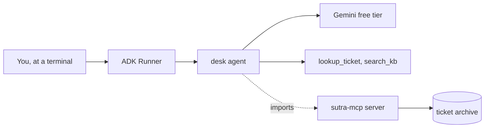
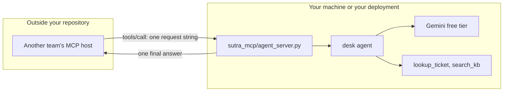

# 1.1 — The colleague you can now phone

## One-line answer

Serving an agent over MCP does not publish a new capability; it publishes an existing one **to
people who were never in the room**, and everything that used to be understood without saying now
has to be said.

## The story

There is someone two desks away who knows the ticket archive better than anybody. When you are
stuck, you roll your chair over and say four words, and she says three back, and you carry on.

Neither of you has ever written any of that down. You do not tell her which system you mean,
because there is only one you would be asking about. You do not tell her who you are. If she needs
something, she asks, and you answer, and the whole thing takes one exchange.

Now the second branch opens. They have the same customers and the same archive, and they are three
hundred kilometres away. They send an email: *"Can we ask her things too?"*

The answer is yes, and it changes everything about the exchange. The email has to say which system.
It has to say who is asking, because she does not recognise the address. She cannot roll her chair
over to ask a follow-up question and get an answer in four seconds, so she has to guess what they
meant or send the question back and wait a day. And nobody at the second branch can see her; they
only see that a reply arrived, or that one did not.

Her knowledge did not change. What changed is that the people using it are no longer in the room.

## The idea in plain language

An **agent** is a program that takes a request in ordinary language, decides what to do, calls
tools, reads the results, and decides again, until it has an answer. Sutra's desk agent has done
exactly that since [Day 3](../../../day-03-loop-hand-rolled/parts/01-loop-anatomy/1.1-the-navigator-and-the-driver.md):
it reads the ticket, searches the knowledge base, and answers.

Until today, the only way to run it was to import Sutra's Python and call it yourself. **Serving the
agent over MCP** means putting it behind the same protocol Sutra has been *consuming* since
[Day 33](../../../day-33-client-and-transports/parts/01-the-connector/1.1-the-tool-that-lives-somewhere-else.md),
so that any MCP client — another team's agent, an editor, a command-line host — can send it a
question without importing a line of your code.

**MCP** is the Model Context Protocol: a small set of JSON-RPC methods a client uses to ask a server
what it offers (`tools/list`) and to run one of those things (`tools/call`). Day 32's
[1.2](../../../day-32-mcp-stateless-core/parts/01-the-socket/1.2-host-client-server.md) drew the
three roles — the **host** the person talks to, the **client** the host uses to speak the protocol,
and the **server** that offers the work.

Today those three roles collapse in an interesting way. Sutra has been the host and the client all
through Phase 5. Now Sutra is a **server**, and the thing behind the server is not a function that
reads a dictionary. It is the entire think-act-observe loop, with a model in the middle of it.

That distinction is the whole day, and it has a name you will use again on Day 89:

- **Agent-as-tool** — the caller *uses* the agent. One request goes in, one answer comes out, and
  the caller treats it exactly like the ticket lookup it called a moment ago. This is what MCP
  gives you, and it is what you build today.
- **Agent-as-peer** — the caller *talks to* the agent. There are two parties, each with an
  identity, a conversation that has a lifetime, and the ability to ask each other questions. This is
  what A2A gives you, and section 3 is where you learn to choose.

## Why Sutra needs it

Because everything Sutra has built so far only works from inside Sutra's own process.

The desk agent, its handbook, its two skills and its two tools all live in this repository, and the
only entry points are `uv run adk web sutra/desk` and the scripts under `sutra/desk/`. Nobody else
can reach any of it. The MCP server Day 34 built put `lookup_ticket` and `search_kb` on the wire, so
outsiders can now read the archive — but reading the archive is not the same as asking the desk.

Today `sutra_mcp/agent_server.py` closes that gap, and section 3 decides how far to open it. Then
Day 43 asks whether the thing you are serving can survive being run on three machines at once, and
Day 45 audits every server this phase produced, this one included.

The larger reason is that **the boundary you are about to cross is the one this whole phase is
about.** Day 34 showed what changes when a *function* crosses it. This day shows what changes when
an *agent* crosses it, and the answer is more than it looks: a function has one cost and two
outcomes, and an agent has a variable cost and a conversation's worth of state.

## The mechanism

The mechanism at this level is a picture, not code. Here is where Sutra sits before and after.

Before today, everything is in one process and the arrow only goes one way:



After today there is a second door into the same agent, and the people using it are outside the
box:



Three things are worth naming in the second picture before you meet them in code.

**The caller sees one tool.** Not `lookup_ticket` and `search_kb` — one tool, named after the agent,
taking one string. The agent's own tools stay on your side of the line. Part
[2.1](../02-what-crosses-the-counter/2.1-the-enquiry-slip-with-one-box.md) is what that tool's
declaration actually says.

**The model is on your side of the line.** Every call the outside world makes runs a generation
against *your* quota, from *your* key. Section 4 is that arithmetic, and it is the part of this day
most likely to change your mind about whether to serve at all.

**The arrow into `Model2` is the one that has no equivalent in Day 34's picture.** Day 34's server
answered from a dictionary. This one answers by thinking, and thinking is slow, variable, priced,
and occasionally refused. Section 5 is what each of those does to the caller.

## When it breaks

The first break is not code. It is the assumption that arrives with the second branch.

🎬 **The scene:** you tell the other team the desk is on MCP now, and give them the connection
details. They mount it, their host shows one new tool, and they start using it.

😬 **The naive fix:** nothing, because it works. The first questions come back with good answers.

💥 **Why it fails:** they are treating it like every other tool on their list. Their host has a
timeout it chose while looking at tools that read a dictionary. Their retry policy calls the tool
again when a call fails, because that is what you do with a lookup. Their prompt tells the model it
may call any tool it likes, as often as it likes. None of that is wrong for a lookup, and every part
of it is wrong for a thing that runs a model loop on somebody else's quota. You find out on the
afternoon their agent decides to ask your desk eleven questions in a row and your key stops
answering for everybody, including you.

💡 **The insight:** **a served agent looks exactly like a tool to every client on earth, and behaves
nothing like one.** The protocol has no field for "this one is expensive", no field for "this one
takes a while", and no field for "do not retry this blindly". Everything you want the caller to know
has to go into the one place the caller reads: the tool's description. Part
[2.1](../02-what-crosses-the-counter/2.1-the-enquiry-slip-with-one-box.md) is where that lands, and
part [4.3](../04-what-a-call-costs/4.3-the-notice-on-the-ration-shop-board.md) is what it must
say.

## In production

**What a professional writes instead:** they do not start with `to_mcp_server`. They start with a
sentence naming the caller: *"the search team's agent needs an answer to one self-contained
knowledge-base question, at most a few times an hour, and does not need a conversation."* Then the
thing they serve is shaped to that sentence — usually a small, narrow agent built for the purpose
rather than the whole desk. Section 3 makes that choice explicit and section 3.3 makes it for Sutra.

**What degrades at scale:** the number of people who can now cause a model call. Before today, the
set of people who could spend Sutra's quota was one: you. After today it is everyone with the
connection details, and none of them can see the meter. That is not a load problem you can solve
with a bigger machine, because the constraint is a per-day request count on a free tier, not CPU.

**The failure mode that only appears with real traffic:** the caller's model deciding your tool is
the answer to everything. A tool description that says *"answers support questions"* is an
invitation, and a model on the other side that has been told to be helpful will route half its
traffic through it. You will see this as an unexplained collapse in your own remaining quota,
several hours after the actual cause.

**The review comment a senior engineer leaves:** *"this exposes the desk agent to anyone who can
reach the port, and the description does not tell them a single thing they need to know: not that
each call costs a model generation, not that we are on a free tier with a daily ceiling, not that
calls are not safe to retry. Right now the only rate limit is politeness."*

**The interview question:** *"what actually changes when you put an agent behind a protocol?"* The
honest answer: *"Not the agent. What changes is that the callers are no longer people who know how
it works. Everything that was understood by being in the same codebase now has to be stated: what
the input means, what one call costs, how long it takes, whether it is safe to call twice. And one
thing genuinely does change on your side — the set of people who can spend your model quota goes
from one to everyone with the address. I would not serve an agent until I could name the caller and
write down what one call costs them and me."*

## Check yourself

```bash
uv run python days/day-42-serving-agents-over-mcp/lab/served_surface.py
```

Read the JSON it prints and find the one thing a caller is given to decide *when* to use this tool.
There is exactly one field, and it is prose.

**Out loud, without scrolling up:** say what is different about a served agent compared with a
served function, in one sentence that does not use the words "agent" or "protocol".

**Next:** [1.2 — Twelve words in the classifieds](1.2-twelve-words-in-the-classifieds.md).
