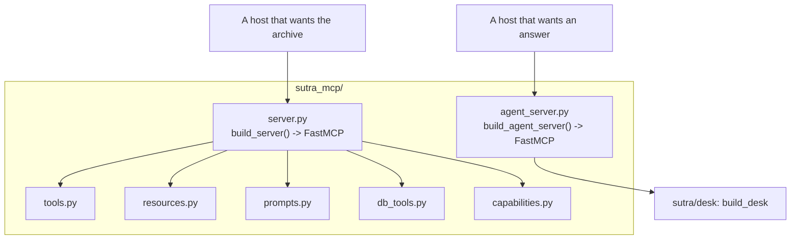

# 1.4 — The counter by the side door

## One-line answer

Today is the first day since Day 34 that does **not** add a line to `build_server()`, because
`to_mcp_server` builds a whole server of its own rather than a handler you can register — so
`sutra_mcp/` ends the day with two servers, deliberately.

## The story

The kitchen has one pass. Plates go up on it, waiters take them down, and every order in the
building has gone through that one strip of steel for nine years. Everybody knows where to stand.

Then the owner signs up for home delivery, and the obvious plan is that delivery orders go up on the
pass like everything else. It survives one Saturday. The delivery riders have to walk through the
dining room in helmets. The waiters, reaching for a plate, keep taking the wrong one. The riders are
in a hurry in a way that waiters are not, because they are paid per drop and the waiters are not, and
the two kinds of hurry do not queue politely together.

By the second Saturday there is a small counter by the side door, with its own bell, its own stack of
bags and its own paper list. The same kitchen. The same cooks. The same food coming off the same
stoves. But a second place to hand it over, because the people collecting are a different kind of
person on a different kind of errand, and stacking them into one queue helped nobody.

## The idea in plain language

Since Day 34 every MCP day in this curriculum has followed one convention. Day 34's
[1.4](../../../day-34-building-sutra-mcp-tools/parts/01-the-server-object/1.4-the-shape-later-days-register-into.md)
fixed it: `sutra_mcp/server.py` holds `build_server()`, each later day adds **one module** beside it
and **one line** inside it, and the import arrow runs one way — `server.py` imports the module, the
module never imports `server.py`.

Day 35 added `register_resources(server)`. Day 36 added `register_tasks`-shaped functions. Day 37
added auth. Day 39 added database tools. Day 41 added capabilities. Every one of them is a function
that takes a server it is handed and attaches something to it.

**`to_mcp_server` cannot be that.** Look at what it returns: a `FastMCP` instance. It does not take a
server; it *makes* one. There is no `register_agent(server)` shape available, because the function's
whole contract is "hand me an agent, receive a server".

You have three options and only one of them is honest.

| Option | What it means | Verdict |
| --- | --- | --- |
| Register the agent as a tool on `build_server()`'s server by hand | write your own `@server.tool()` that calls a `Runner`, ignoring `to_mcp_server` | rejected: you would be reimplementing the function this day closes an ID on |
| Copy `to_mcp_server`'s single tool onto Sutra's existing server | reach into the returned server, pull the tool out, add it to the other one | rejected: undocumented internals, and it merges two very different cost profiles into one catalogue |
| Two servers, two processes, two endpoints | `sutra_mcp/server.py` stays as it is; `sutra_mcp/agent_server.py` is separate | **this one** |

The third is the counter by the side door.

## Why Sutra needs it

Because the two servers have nothing in common except the package they live in, and pretending
otherwise would hide the single most important fact about today.

`sutra-mcp` — Day 34's server — answers `lookup_ticket` and `search_kb` from an archive. Every call
costs a database read. It can be called a thousand times in an afternoon and nobody notices. Its
failures are `isError: true` with a sentence.

The agent server answers by running a model loop. Every call costs one to four generations against a
free-tier ceiling of twenty a day, and section 4 does that arithmetic in full. Its failures include
quota refusals, timeouts against a caller who set its patience while looking at a lookup tool, and
answers that are wrong rather than absent.

Put those in one `tools/list` and a caller — a *model*, choosing — sees three tools that look
interchangeable. Day 34's
[3.1](../../../day-34-building-sutra-mcp-tools/parts/03-the-two-calls/3.1-the-list-and-who-may-keep-it.md)
established that a tool list is cacheable and shared. A cheap catalogue and an expensive one behind
one cache entry, with one `ttlMs` and one `cacheScope` covering both, is a design that cannot express
what it needs to express.

**Two endpoints let a host mount one and not the other.** That is the actual product of this
decision, and Day 45's audit will check that they are still separate.

## The mechanism

The shape of `sutra_mcp/` at the end of today:



`agent_server.py` has no arrow into it from `server.py`. That absence is the design.

Two entry points, and they are different processes:

```bash
# the archive server - Day 34's, unchanged
uv run python -m sutra_mcp.server

# the agent server - today's, separate
uv run python -m sutra_mcp.agent_server
```

**Line by line:**

- `python -m sutra_mcp.server` runs the module as a script, so its `if __name__ == "__main__":`
  block fires and `run(transport="stdio")` blocks. This is Day 34's entry point and nothing about it
  changes today.
- `python -m sutra_mcp.agent_server` is a *second* process, with a second stdio pipe and a second
  set of environment requirements — this one needs `GOOGLE_API_KEY`, and Day 34's does not.
- `-m` rather than a path, because `sutra_mcp` is a package and a path invocation puts the wrong
  directory on `sys.path`. Day 34's [1.2](../../../day-34-building-sutra-mcp-tools/parts/01-the-server-object/1.2-a-server-you-build-not-one-that-runs.md)
  covers why the run call is under the `__main__` guard at all.
- Two processes means two mount entries in a host's configuration, which is exactly the property
  this part is buying: a host can mount the archive and refuse the agent.

And the rule the day's gate enforces, in one line:

```python
source = (REPO / "sutra_mcp" / "server.py").read_text(encoding="utf-8")
if "agent_server" in source:
    out.append("sutra_mcp/server.py imports agent_server; the two servers must stay separate")
```

**Line by line:**

- `read_text(encoding="utf-8")` reads the file as text rather than importing it, because importing
  `sutra_mcp.server` runs its module body, and a check that has side effects is a check you stop
  running.
- `"agent_server" in source` is a substring test, not an AST walk, and that is a deliberate choice
  for a gate: it is trivially readable, it has no dependencies, and its false-positive case — the
  string appearing in a comment — is a comment somebody should have to justify anyway.
- The finding is a **sentence**, not a boolean, following the pattern Day 41's
  [3.2](../../../day-41-capabilities-and-mcp-apps/parts/03-declared-versus-implemented/3.2-probing-every-promise.md)
  established: a gate that prints `False` tells you nothing at 11pm.
- `encoding="utf-8"` explicitly, because the default on Windows is the system code page and a file
  with an em-dash in a comment then raises `UnicodeDecodeError` on one developer's machine and
  nobody else's.

## When it breaks

The break is what happens if you ignore this and register the agent onto Day 34's server anyway.

Nothing fails. That is the problem. You get a server with three tools, and a caller's `tools/list`
looks like this:

```text
lookup_ticket   Read one ticket from the archive by id.
search_kb       Find one knowledge-base article matching a symptom.
sutra_desk      The support desk: reads tickets, answers from the KB, closes what it can.
```

A routing model reading those three descriptions has no way to know that the third one costs three
generations and the first two cost none. It will pick the third, because the third sounds the most
capable, and *sounding capable* is the only signal in the list. Day 28's
[2.4](../../../day-28-progressive-disclosure-design/parts/02-descriptions-as-routing/2.4-the-crowded-shelf.md)
made this argument about skills; the same shelf problem applies here with a much worse price tag.

The second break is the one that bites on Day 43. `build_server()` is called with
`stateless_http=True` and is deploy-shaped: any instance answers any request. The agent server holds
a `Runner` with an in-memory session store, which
[1.3](1.3-the-hall-that-came-with-its-own-chairs.md) just measured. Fold them into one process and
you have one deployment unit with two contradictory statelessness stories, and Day 43 has to
untangle it before it can teach anything.

## In production

**What a professional writes instead:** two deployables, and they say so in the repository layout,
not just in a comment. Different processes, different health checks, different scaling rules,
different secrets. The archive server needs a database connection string; the agent server needs a
model key. Neither should be able to fail because of the other's dependency, and neither should be
able to exhaust the other's budget.

**What degrades at scale:** shared fate. One process serving both means a quota-exhausted agent
loop, a runaway session dictionary or a hung model call takes the archive server down with it. The
archive server is the one that answers a thousand cheap calls an afternoon, so the blast radius of
the expensive thing is the cheap thing's availability.

**The failure mode that only appears with real traffic:** the tool list cache. Day 34's
[3.1](../../../day-34-building-sutra-mcp-tools/parts/03-the-two-calls/3.1-the-list-and-who-may-keep-it.md)
established that `tools/list` carries `ttlMs` and `cacheScope`, and that `"public"` lets a shared
proxy serve one caller's list to another. A merged catalogue forces one policy across both. The
archive list is genuinely public and cacheable for a long time; whether the agent should even be
*visible* to a given caller is an authorisation question. One list cannot answer both.

**The review comment a senior engineer leaves:** *"we have two servers in one package and that is
correct, but nothing enforces it. Add the check to the gate: `sutra_mcp/server.py` must not mention
`agent_server`. The first person to 'tidy up' by merging them will not know why they were separate,
because the reason is a cost profile and a statelessness story, not anything visible in the code."*

**The interview question:** *"you had a working MCP server and you added a second one instead of a
third tool. Why?"* The honest answer: *"Because the two things have different cost profiles and
different failure modes, and a tool list has no field for either. The archive tools are cheap,
retryable and safe to cache for a long time. The agent tool runs a model loop, so it is expensive,
not safe to blind-retry, and how long its list may be cached is really an authorisation question.
Merging them would force one caching policy and one mount decision across both, and it would put a
routing model in front of three descriptions where the most expensive one sounds the most capable.
Two endpoints let a host take the cheap half and refuse the expensive half, which is the actual
thing I wanted to be able to offer."*

## Check yourself

```bash
uv run python days/day-42-serving-agents-over-mcp/lab/gate.py; echo "exit: $?"
```

Before you write anything it prints `sutra_mcp.agent_server is not importable` and exits `1`. After
you have written the module, add the line `from sutra_mcp import agent_server` to
`sutra_mcp/server.py`, run the gate again, read the finding, and take the line out.

**Out loud, without scrolling up:** say why `to_mcp_server` cannot follow the `register_x(server)`
convention every day since 34 has used, and name the one property two endpoints buy a host that one
endpoint cannot.

**Next:** [2.1 — The enquiry slip with one box](../02-what-crosses-the-counter/2.1-the-enquiry-slip-with-one-box.md).
