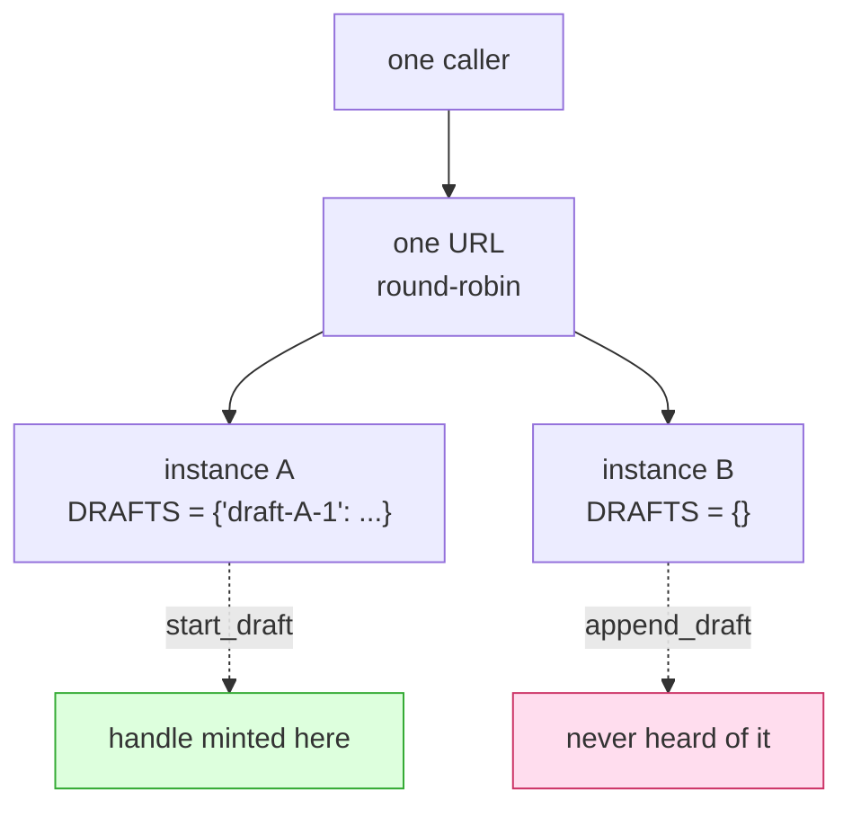

# 1.1 — The dictionary nobody called state

## One-line answer

A dictionary written at the top of a module is one dictionary **per running process**, so the moment
a second copy of your server exists, half your callers are talking to an empty one — and nobody ever
wrote a line of code that said "remember this".

## The story

There are two fridges in the shared kitchen of the building you live in.

You buy milk, write your flat number on the carton in marker, and put it in the fridge by the
window. Nobody objects. This works for a month.

Then one evening you come down and the door to the kitchen is propped open from the other side, so
you walk in past the second fridge instead of the first. You open it, and there is no milk with your
number on it. Not stolen, not finished — just not in this fridge. Your milk is four steps away
behind the other door, exactly where you left it, in perfect condition.

Nothing broke. Nobody did anything wrong. You put a thing in *a* fridge and then went looking in
*the* fridge, and those turned out to be two different sentences.

The part that stings is that the system worked for a month. Not because it was correct, but because
you always came in through the same door.

## The idea in plain language

Two words first, and then the whole part is a consequence of them.

A **process** is one running copy of a program. When you type a command that starts your server,
the operating system loads the code, gives it a block of memory, and starts running it. That block
of memory belongs to that copy and to nothing else. Start the same program again and you get a
second process with a second block of memory that happens to contain the same code.

**Module level** means the top of a Python file, outside every function and class. Code at module
level runs exactly once, when the file is first imported — which, for a server, is while it is
starting up. So this line:

    DRAFTS = {}

does not describe a dictionary. It *creates* one, in this process's memory, at start-up, and binds
the name `DRAFTS` to it. Run the program twice and there are two dictionaries. They have the same
name and no other connection to each other whatsoever.

Now the sentence that makes it a bug rather than a fact: **a function that writes into `DRAFTS` is
remembering something.** It does not feel like remembering. It feels like using a dictionary. There
is no `save()`, no database, no file, no obvious moment where a decision was taken. But the next
request to arrive can read what the previous one wrote, and that is the entire definition of state.

This is why the day is not called "do not use a database". Nobody sets out to make a server
stateful. State **accumulates**, one convenient line at a time:

- a dictionary to hold half-finished work, because passing it around was tedious;
- a set of identifiers already processed, to avoid doing them twice;
- a list that collects things for a background job;
- a counter, because someone wanted a number in the logs.

Every one of those is a fridge. On one instance you always come in through the same door.

## Why Sutra needs it

Because `sutra_mcp/` is about to be run twice.

Everything Phase 5 and Phase 6 built — the tools from
[Day 34](../../../day-34-building-sutra-mcp-tools/parts/01-the-server-object/1.4-the-shape-later-days-register-into.md),
the resources and prompts from Day 35, the task handles from Day 36, the database tools from Day 39
— has only ever run as one process on one laptop, answering one caller. Under those conditions a
module-level dictionary and a database row behave identically, which is precisely why the mistake is
invisible while you are making it.

[Day 32's 2.2](../../../day-32-mcp-stateless-core/parts/02-the-reframe/2.2-three-instances-one-url.md)
already gave you the arithmetic: three instances, one held session, two of every four requests
refused. Today is not that lesson again. Today is the narrower and more practical question that
lesson leaves behind: **the protocol no longer holds state for you, so where did yours go?** It went
into module level, quietly, in whatever you were writing at the time — and section 2 is how you find
it without reading every file by hand.

## The paper behind it

> **Principled design of the modern Web architecture** · `doi:10.1145/514183.514185` · 2002 ·
> `https://doi.org/10.1145/514183.514185`

It argued that a system scales because of the constraints it accepts rather than the features it
adds, and that **statelessness** — every request carrying everything needed to understand it — is
what allows any server to answer any request.

That paper is taught on Day 32, in
[`../../../day-32-mcp-stateless-core/papers/01-modern-web-architecture.md`](../../../day-32-mcp-stateless-core/papers/01-modern-web-architecture.md).
Read it there; this part is only the address.

## The mechanism

Here is the whole bug, small enough to hold in your head, from this day's lab server:

```python
# days/day-43-stateless-by-default/lab/leaky_server.py  (extract)
INSTANCE = os.environ.get("INSTANCE", "?")

# --- leak 1: a module-level dict. One per process, empty in every other one. ---
DRAFTS: dict[str, str] = {}


@mcp.tool()
def start_draft(first_line: str) -> str:
    """Mint a handle for a reply that is written across several calls."""
    handle = f"draft-{INSTANCE}-{len(DRAFTS) + 1}"
    DRAFTS[handle] = first_line
    return handle


@mcp.tool()
def append_draft(handle: str, text: str) -> str:
    """Add a line to an existing draft, named by its handle."""
    if handle not in DRAFTS:
        return f"ERROR {INSTANCE}: unknown handle {handle!r}"
    DRAFTS[handle] = DRAFTS[handle] + " " + text
    return DRAFTS[handle]
```

**Line by line:**

- `INSTANCE = os.environ.get("INSTANCE", "?")` is a label the lab passes in so that every answer says
  which copy produced it. Real servers do the same thing with the container or pod identifier, and
  you will want it on every log line long before you want it in a tool result.
- `DRAFTS: dict[str, str] = {}` is the leak. The type annotation makes it look considered; it is
  still one dictionary in one process's memory, created at import time.
- `start_draft` writes into `DRAFTS` and hands back a key. Nothing here says "state" — it reads like
  a function that returns an identifier, which is exactly the shape
  [Day 32's 3.4](../../../day-32-mcp-stateless-core/parts/03-headers-and-caches/3.4-state-that-travels-in-the-payload.md)
  told you was correct. The **shape** is right. The **storage** is wrong, and the shape hides it.
- `f"draft-{INSTANCE}-..."` puts the instance letter inside the handle. That is a confession written
  into the data: the handle is not a pointer to a draft, it is a pointer to a draft *on A*. A real
  handle carries no such thing, because who made it must not matter.
- `len(DRAFTS) + 1` numbers the drafts. On two instances both start at 1, so A and B can mint the
  same handle for two different drafts. Guessable identifiers are a separate problem
  ([Day 32's 3.4](../../../day-32-mcp-stateless-core/parts/03-headers-and-caches/3.4-state-that-travels-in-the-payload.md)
  again); colliding ones are this one.
- `if handle not in DRAFTS` is the only line that will ever fail, and it fails by returning a
  sentence rather than raising. That is deliberate and it is what makes the bug survive: the caller
  gets an ordinary successful reply containing a complaint.
- `@mcp.tool()` is the decorator Day 34's
  [2.1](../../../day-34-building-sutra-mcp-tools/parts/02-function-to-declaration/2.1-the-decorator-that-writes-your-schema.md)
  explained: it reads the signature and publishes a schema. It does not read the body, so nothing in
  the declaration hints that this tool has a memory.

Now the shape of the failure, before you run anything:



Two boxes, one of which holds the milk.

## When it breaks

Run this day's two-instance probe and the third block of output is the break, measured on
2026-09-05:

```text
-- the handle: minted by one instance, used by the next --
   minted: draft-A-1
   ERROR B: unknown handle 'draft-A-1'
   Sorry about the delay. Line 3.
```

Read the three lines slowly, because the third one is the dangerous part.

The draft was created on A. The first append landed on B, which correctly said it had never seen
that handle. The second append landed back on A and **succeeded** — and look at what it produced:
`Sorry about the delay. Line 3.` Line 2 is missing. The draft is not broken, not empty and not
obviously wrong. It is quietly incomplete, and it will be sent to a customer that way.

That is the failure mode worth being afraid of. A hard error gets noticed. This is a reply that lost
a sentence somewhere between two machines, on a request that returned HTTP 200 with a normal-looking
result.

Note also what the error is *not*. It is not a traceback, not a 500, not a JSON-RPC error object. It
came back as a successful tool call carrying the text `ERROR B: unknown handle 'draft-A-1'`, because
[Day 34's 4.1](../../../day-34-building-sutra-mcp-tools/parts/04-two-kinds-of-no/4.1-the-tool-said-no.md)
established that a tool's own refusal is an ordinary result. Every dashboard that counts errors saw
nothing at all.

## In production

**What a professional writes instead:** nothing at module level that a request handler writes to.
The draft goes in a store both instances can reach, behind a handle that carries no instance
identity ([4.1](../04-where-state-goes/4.1-down-out-or-nowhere.md) is the decision table). If a
module-level container genuinely must exist — a lookup table loaded once and never written — it is
made immutable so the compiler and the reader agree it is not memory:
`STATUSES = frozenset({"open", "closed"})`, not `STATUSES = {"open", "closed"}`.

**What degrades at scale:** the failure rate follows the instance count, not the load. With two
instances half the follow-up calls miss. With five, four in five miss. So the bug gets *worse* the
better your service is doing, which is the opposite of the intuition everyone has about capacity
problems, and it is why the first autoscaling event is when this arrives.

**The failure mode that only appears with real traffic:** partial success. Every example in this
part had one caller doing one thing. Real traffic gives you a caller who retries, lands on the right
instance the second time, and never reports anything — while the draft on the other instance sits in
memory until the container is replaced. You do not get a bug report. You get a slow, unattributable
drift between what the system did and what people remember asking for.

**The review comment a senior engineer leaves:** *"`DRAFTS` is module-level and `start_draft` writes
to it, so this tool has memory that lives in one process. We run more than one process. Either move
it behind the store or show me the request that can rebuild it — and the handle should not have the
instance letter in it, because that string is going to end up in a customer's transcript."*

**The interview question:** *"what is wrong with keeping a dictionary at module level in a web
service?"* The honest answer: *"It is one dictionary per process, so it is only correct while there
is exactly one process — which is true on my laptop and false in every deployment. The part people
miss is that it does not fail loudly. A follow-up call that lands on the wrong instance gets a
'not found' that looks like a client mistake, and if the caller retries it may succeed, so you end
up with silent partial results instead of an error rate. My rule is that anything a request handler
writes to has to live somewhere every instance can reach, and anything at module level that is
genuinely read-only gets declared immutable so it is obvious which is which."*

## Check yourself

```bash
cd days/day-43-stateless-by-default/lab
uv run python twoup.py
```

Find the three lines under `-- the handle --` and say, out loud, what happened to Line 2.

**Out loud, without scrolling up:** explain why a module-level dictionary is correct on a laptop and
wrong in a deployment, without using the word "state".

**Next:** [1.2 — The cache that becomes a second opinion](1.2-the-cache-that-becomes-a-second-opinion.md).
