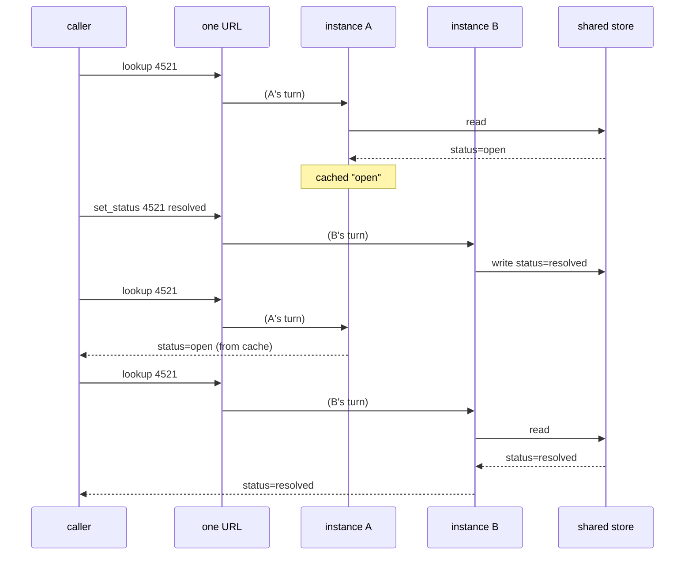

# 1.2 — The cache that becomes a second opinion

## One-line answer

A cache is a copy of an answer, so two instances holding two caches hold **two answers**, and the
one a caller receives depends on which machine picked up the request — which is a coin flip nobody
put in the design.

## The story

Your cousin moved from flat 12 to flat 14, one floor up, in the same building.

You were there on the day, so you know. Your brother was not, and nobody thought to tell him,
because he has known that address for years and there was nothing to tell.

A visitor from out of town phones the two of you an hour apart. You say flat 14. Your brother says
flat 12. Neither of you looked anything up, neither of you hesitated, and neither of you is lying.
You are both answering from memory, and one of the two memories was written before the move.

The visitor now has two confident answers and no way to tell which is current. What makes this
awkward is not that somebody was wrong. It is that **both of you sounded exactly as sure as the
other**, because a remembered answer does not come with the date it was remembered on.

## The idea in plain language

A **cache** is a saved copy of an answer, kept close to whoever needs it, so the answer can be given
again without doing the work that produced it.

That is a good idea and it is everywhere. Python has one built into the standard library:

    @functools.lru_cache(maxsize=128)
    def summary(ticket: str) -> str:
        ...

Put that decorator on a function and the first call runs the body; every later call with the same
arguments returns the saved result without running anything. `lru` stands for *least recently
used*: when the cache is full, the entry that has gone longest without being asked for is thrown out
to make room. `maxsize=128` is how many entries it keeps.

Two facts about that cache decide everything in this part.

**It lives in the process.** It is a dictionary attached to the function object, created when the
module is imported. It is [1.1](1.1-the-dictionary-nobody-called-state.md)'s dictionary wearing a
decorator, so everything that part said applies unchanged.

**It has no idea whether the answer is still true.** `lru_cache` has no expiry, no version, no
notification. It evicts entries when it runs out of room, and for no other reason. If the underlying
fact changes, the cache does not find out. It cannot: nothing tells it.

On one instance that produces a familiar, manageable bug — a **stale** answer. Annoying, well
understood, fixable with an expiry.

On two instances it produces a different and worse bug. Instance A cached the answer before the
change; instance B was started later, or simply never asked that question, so its cache is empty and
it goes and reads the current value. Now the same question, asked twice through the same URL, comes
back two different ways. Not stale then fresh in a predictable order — **alternating**, according to
which instance the load balancer happened to pick.

The distinction worth carrying: a stale cache is *wrong for a while*. Two caches are *inconsistent*,
and inconsistency is much harder to reason about, because there is no single answer to be wrong.

## Why Sutra needs it

Because caching is not a hypothetical temptation in `sutra_mcp/` — it is already half-built.

[Day 34's 3.1](../../../day-34-building-sutra-mcp-tools/parts/03-the-two-calls/3.1-the-list-and-who-may-keep-it.md)
had you choose a `ttlMs` and a `cacheScope` for the tool list, which is an instruction to *clients*
to keep a copy. [Day 39](../../../day-39-database-tools/) put a SQLite archive behind the tools, and
the first thing anybody does when a database read shows up in a hot path is put a cache in front of
it. The ticket status is exactly the kind of value that invites one: read constantly, changed
rarely.

Changed rarely is not changed never, and "rarely" is what makes this bug survive testing. A value
that changes on every request would expose the cache immediately. A value that changes once a week
gives you a cache that is correct in every test you write and wrong on the day somebody resolves a
ticket.

Section 3 measures it on the real server. This part is so that when you see the two lines of output,
you already know why they differ.

## The mechanism

The lab server caches one function and reports whether the answer came from the cache:

```python
# days/day-43-stateless-by-default/lab/leaky_server.py  (extract)
# --- leak 3: an lru_cache. A speed-up with one instance, a fork in the truth with two. ---
@functools.lru_cache(maxsize=128)
def _cached_summary(ticket: str) -> str:
    return store.summary(ticket)


@mcp.tool()
def lookup(ticket: str) -> str:
    """Summarise a ticket, and say whether this instance answered from its cache."""
    if SHARED:
        return f"{INSTANCE} cached=False {store.summary(ticket)}"
    misses_before = _cached_summary.cache_info().misses
    text = _cached_summary(ticket)
    hit = _cached_summary.cache_info().misses == misses_before
    return f"{INSTANCE} cached={hit} {text}"
```

**Line by line:**

- `@functools.lru_cache(maxsize=128)` is the whole leak, and it is one line that a reviewer reads as
  a performance improvement. There is no dictionary in sight.
- `_cached_summary` is separate from the tool on purpose. You cannot usefully decorate the tool
  itself, because the tool's answer contains the instance letter and the cache flag — caching that
  would cache the diagnostics along with the data, which is its own small lesson in what belongs
  inside a cached function.
- `store.summary(ticket)` reads the current row from the shared SQLite file every time it is called.
  The store is **not** the problem here; it is correct and it is shared. The cache in front of it is
  what forks the truth.
- `SHARED` is the day's ablation switch, read from the `SUTRA_STATE` environment variable. When it
  is on, the tool skips the cache entirely and reads through. One variable, two behaviours, so the
  difference in the output can only be the cache.
- `cache_info().misses` before and after is how the tool knows whether it answered from memory.
  `lru_cache` exposes `hits`, `misses`, `maxsize` and `currsize`; comparing the miss count is more
  robust than comparing hits, because a miss is what actually ran the body.
- `hit` is reported to the caller only because this is a teaching server. In a real one it belongs in
  a log line or a metric, never in the tool result — a caller should not be able to tell, and the
  model certainly should not start reasoning about it.

The two-instance shape, before any code runs:



Nothing in that diagram is a bug in isolation. A cached read, a write, another cached read, another
uncached read. The bug is the last two lines being different.

## When it breaks

Measured on 2026-09-05, from the two-instance probe:

```text
-- the cache: one ticket, one status change, two answers --
   A cached=False 4521: printer offline since Tuesday [status=open]
   B wrote 4521 -> resolved
   A cached=True 4521: printer offline since Tuesday [status=open]
   B cached=False 4521: printer offline since Tuesday [status=resolved]
```

Two `lookup` calls for ticket 4521, sent to the same URL, one after the other, with nothing in
between. One says `status=open`, the next says `status=resolved`.

There is no error here. No status code to alert on, no exception, no log line at level `ERROR`.
Every request succeeded. The tool worked. The store is correct — the write did land, and it landed
once. What is wrong lives entirely in the difference between two successful answers.

This is close to the hardest class of bug to diagnose in production, for a specific reason: **the
variable that predicts the answer is not in your logs.** You can group by ticket, by caller, by
tool, by time — and see nothing, because the thing that decides the answer is which container
picked up the request, and nobody logged that.
[Day 22's correlation identifier](../../../day-22-structured-logging/parts/02-wiring-the-run/2.2-the-correlation-id.md)
ties one request's lines together; it does not tell you which machine produced them. Add the
instance identifier to every log line before you need it, because the day you need it you will not
be able to add it retroactively to yesterday's logs.

## In production

**What a professional writes instead:** a cache that is allowed to be empty and allowed to be wrong
for a bounded, chosen period. Three things a real cache has that `lru_cache` does not: an **expiry**,
so staleness has a maximum; an **invalidation** path, so a write can clear the entry it invalidates;
and a **shared home**, so all instances see one copy. That is a cache in front of the store, not
inside the process. The rule of thumb is short: *if two instances disagreeing would be a wrong
answer rather than a slow one, the cache does not go in the process.*

**What degrades at scale:** the disagreement window widens with the instance count and with the
cache's usefulness. Ten instances mean ten independent copies of the truth, and the more successful
the cache is — the higher the hit rate — the longer each copy holds on to its version. Improving the
cache makes the inconsistency worse, which is a genuinely counter-intuitive property to have to
explain in a review.

**The failure mode that only appears with real traffic:** the retry that "fixes" it. A caller gets
the stale answer, retries, lands on the other instance, gets the fresh one and carries on. Nobody
files anything. The bug is invisible until something downstream cannot tolerate two answers — a
payment, an approval, a closure — and by then the cache has been in place for months and is
load-bearing.

**The review comment a senior engineer leaves:** *"`lru_cache` on a function that reads ticket
status. That is a per-process copy of a mutable fact with no expiry and no invalidation, so after a
status change our instances will give different answers to the same question until one of them
restarts. If we need the speed, put it in the shared cache with a TTL; if we do not, delete the
decorator."*

**The interview question:** *"you add an `lru_cache` to speed up a hot read. What did you just
change?"* The honest answer: *"Three things, and only the first one is the one I intended. I made
the read faster. I made the answer possibly stale, with no bound on how stale, because `lru_cache`
only evicts on size. And — the one that actually bites — I gave every instance its own copy, so
after a write, different instances answer the same question differently and which one you get
depends on the load balancer. Staleness I can reason about. Inconsistency between replicas I
cannot, because there is no single answer to be wrong. So the question I ask before adding one is
whether disagreement would be a wrong answer or just a slow one."*

## Check yourself

```bash
cd days/day-43-stateless-by-default/lab
uv run python twoup.py
uv run python twoup.py --shared
```

Compare the four lines under `-- the cache --` in the two runs. One line changes between them; say
which, and say what turning `SUTRA_STATE=shared` on actually did to the code path.

**Out loud, without scrolling up:** say the difference between a *stale* cache and *inconsistent*
caches, and say which one an expiry fixes.

**Next:** [1.3 — The state that is not a dictionary](1.3-the-state-that-is-not-a-dictionary.md).
