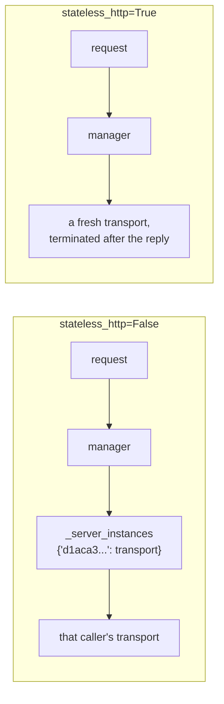

# 1.4 — The session your SDK keeps for you

## One-line answer

The largest module-level dictionary in `sutra-mcp` is not one you wrote: the installed SDK keeps a
`dict` of live sessions inside each server process, and a single constructor argument —
`stateless_http=True` — is what decides whether your deployment depends on it.

## The story

You check into a hotel that has two reception desks, one at each end of a long lobby.

The person at the left desk takes your details, prints a key card, and tells you room 402. You go
up, drop your bag, come back down, and walk out through the doors nearest the *right* desk. Later
you come back the same way and ask for a second key card for your partner.

The person at the right desk asks for your booking. You hand over the card. She looks at her screen
and says, politely, that she has no record of it.

The card is real. The room is real. You are standing in the correct hotel. But the record of your
check-in was made at the other desk, on the other machine, and the two desks were never joined up.
From where you are standing, the only difference between "this card is invalid" and "you walked to
the wrong end of the lobby" is nothing you can see.

## The idea in plain language

Everything up to here has been state *you* wrote. This part is state your library wrote for you, and
it is the one people miss, because it does not appear in your files at all.

Some vocabulary, defined here and used for the rest of the day.

A **session** is a record the server keeps about a caller, created by a first message and referred to
by later ones. Under MCP revisions `2025-03-26` through `2025-11-25`, an HTTP server could assign one
with a header named `Mcp-Session-Id`, and the client sent that header on every later request.

The current revision removed it. From the specification's Streamable HTTP page, read on 2026-09-05:

> *"Revision 2026-07-28 changed the behavior of Streamable HTTP. […] Changes included: Removal of
> the GET stream endpoint. Removal of protocol-level sessions."*

And from the base protocol page, the rule that replaces it:

> *"A server processes each request independently; no state should be inferred from previous
> requests, even those on the same connection or stream."*

So the protocol no longer has sessions. **The installed library still does**, because
`mcp==1.29.1` implements revision `2025-11-25` — the gap
[Day 34's 5.2](../../../day-34-building-sutra-mcp-tools/parts/05-lifecycle/5.2-what-your-server-actually-answers.md)
measured and did not close. Inside it there is a class whose job is to remember callers, and by
default it is switched on.

The constructor argument that decides this is `stateless_http`, and its default is `False`. That
default is not a mistake — it is the correct default for a library that must keep working with
clients written against the older revision. It is simply the wrong choice for a server that will be
run more than once, and it is one keyword argument long.

## Why Sutra needs it

Because [Day 34's build brief](../../../day-34-building-sutra-mcp-tools/) already told you to pass
`stateless_http=True` when you construct the server in `sutra_mcp/server.py`, and
[its 5.3](../../../day-34-building-sutra-mcp-tools/parts/05-lifecycle/5.3-building-for-the-revision-you-are-not-on.md)
told you the flag does nothing at all on stdio.

Today is the day that stops being a note in a build brief. `sutra_mcp/app.py`
([5.1](../05-deploy-shape/5.1-an-object-not-a-program.md)) serves over HTTP, and over HTTP that flag
is the difference between a server two instances can share and a server that hands out room keys one
desk has never heard of. If it was set months ago and never checked, today is when you check it —
and the check is not reading the source, it is
[3.5](../03-two-instances/3.5-the-handle-b-had-never-heard-of.md) sending two requests and watching
what comes back.

## The mechanism

The state lives in the SDK's session manager. This is the installed code, read at
`.venv/Lib/site-packages/mcp/server/streamable_http_manager.py` on 2026-09-05:

```python
# mcp/server/streamable_http_manager.py  (extract, mcp==1.29.1)
        # Session tracking (only used if not stateless)
        self._session_creation_lock = anyio.Lock()
        self._server_instances: dict[str, StreamableHTTPServerTransport] = {}
```

**Line by line:**

- The comment is the library telling you the whole story: *only used if not stateless*. Everything
  below it exists to be skipped.
- `self._server_instances: dict[str, StreamableHTTPServerTransport]` is a dictionary keyed by session
  identifier. It is not at module level — it is an attribute of a manager object that is itself
  created once per process — which comes to the same thing and is why
  [section 2's scan](../02-finding-the-state/2.3-the-waiver-that-has-a-reason-on-it.md) can never
  find it. A tool that greps for module-level containers finds yours, not your dependencies'.
- `anyio.Lock()` is [1.3](1.3-the-state-that-is-not-a-dictionary.md)'s lock, in the wild: it
  serialises session creation within this process. Correct, careful, and per instance.

And the branch that decides which path a request takes:

```python
# mcp/server/streamable_http_manager.py  (extract, mcp==1.29.1)
        # Dispatch to the appropriate handler
        if self.stateless:
            await self._handle_stateless_request(scope, receive, send)
        else:
            await self._handle_stateful_request(scope, receive, send)
```

**Line by line:**

- `self.stateless` is set from `stateless_http` in `FastMCP.__init__` — one argument, carried down
  two layers and consulted here, on every request.
- `_handle_stateless_request` builds a fresh transport for this request, runs it, and terminates it.
  Its own comment reads *"No session ID needed in stateless mode"*, and it passes `stateless=True`
  down to the low-level server, which is what makes the deleted `initialize` handshake unnecessary
  rather than merely optional.
- `_handle_stateful_request` is the other world: look up `_server_instances`, create an entry if
  this is a new caller, reject the request if the identifier is one this process did not mint.
- Nothing in either branch touches disk, so **both branches are correct on one instance**. That is
  the entire reason this survives to production.

The two shapes side by side:



You can see which one your object is without starting a server:

```python
# days/day-43-stateless-by-default/lab/deploy_shape.py  (extract)
server = FastMCP("sutra-mcp", stateless_http=stateless, json_response=True)
app = server.streamable_http_app()
print(f"   manager.stateless : {server.session_manager.stateless}")
print(f"   session table     : {server.session_manager._server_instances}")
```

**Line by line:**

- `FastMCP(...)` builds the server object; nothing listens on a port and nothing is running.
- `streamable_http_app()` is what actually creates the session manager — it is built lazily on first
  call, so asking for `session_manager` before this line would build one with the settings as they
  are at that moment. Build the app first, then inspect.
- `server.session_manager.stateless` is the flag as the manager received it, which is the honest
  place to read it: it is what the request path will consult, rather than what you meant to pass.
- `_server_instances` has a leading underscore, so it is private and you should not build anything on
  it. Printing it in a lab to see that it exists is fine; importing it into `sutra_mcp/` is not.

## When it breaks

Set the flag wrong and the break is precise. From the day's probe, run against two instances behind
one URL on 2026-09-05, with `stateless_http=False`:

```text
   request 1  initialize        -> session d1aca30136b84ffb95fa81041633ec4c
   request 1  answered by       -> sutra-mcp-leaky
   request 2  same session      -> {"http_status": 404, "jsonrpc": "2.0", "id": "server-error", "error": {"code": -32600, "message": "Session not found"}}
   request 3  same session      -> {"jsonrpc": "2.0", "id": 3, "result": {"content": [{"type": "text", "text": "A"}], "structuredContent": {"result": "A"}, "isError": false}}
```

Three requests. The same session identifier on requests 2 and 3. One `404 Session not found` and one
perfectly good answer, and the only difference between them is which instance the round-robin picked.

That is [Day 32's 2.2](../../../day-32-mcp-stateless-core/parts/02-the-reframe/2.2-three-instances-one-url.md)
arithmetic, no longer as a table but as a real HTTP status code out of the installed SDK. With two
instances it is one in two. With three it is two in three.

The reason this is hard on a support desk: **retrying fixes it**. Request 3 is a retry of request 2
and it worked. So the client library's ordinary retry logic will make most of these disappear, the
error rate will sit at some small non-zero number nobody can attribute, and the load will quietly
concentrate on whichever instances happen to hold sessions.

Two more details worth keeping. The message is `Session not found` with code `-32600`, which is
`INVALID_REQUEST` — a **JSON-RPC error**, not a tool result with `isError: true`, so unlike
[Day 34's 4.1](../../../day-34-building-sutra-mcp-tools/parts/04-two-kinds-of-no/4.1-the-tool-said-no.md)
failures this one *is* visible to anything counting protocol errors. And the SDK returns exactly the
same body when a session exists but was created by a different credential, which is deliberate: an
attacker must not be able to tell "not yours" from "does not exist".

## In production

**What a professional writes instead:** the flag is set once, in `build_server()`, with a comment
saying why — and then it is asserted. A boolean that matters this much and is checked by nobody will
eventually be flipped by somebody debugging something else. `sutra_mcp/app.py` is the natural place
for that assertion, because it is the module the deployment actually loads.

**What degrades at scale:** nothing degrades — it breaks at exactly two instances and never recovers.
This is not a load problem or a tail-latency problem; it is a correctness cliff you walk off the
first time the platform starts a second container. That makes it one of the few production problems
that is genuinely cheaper to test than to monitor.

**The failure mode that only appears with real traffic:** the deployment that scales to one instance
overnight. With a single container the stateful path is completely correct, so the errors vanish
during quiet periods and return during busy ones, which reads exactly like a load problem and sends
everyone to look at CPU graphs.

**The review comment a senior engineer leaves:** *"we construct `FastMCP` without `stateless_http`,
so it defaults to `False` and the SDK keeps a session dict per process. On one container that is
invisible; on two it is a 404 on half the follow-up requests. Set the flag, and add a check that
reads it back off the built app so nobody can quietly unset it."*

**The interview question:** *"your MCP server works locally and fails intermittently in
production. Where do you look first?"* The honest answer: *"At whether anything is per-instance,
starting with the SDK. The Python SDK keeps a dictionary of sessions inside each process and the
constructor defaults to using it, so with two replicas behind a load balancer a follow-up request
lands on the wrong process and comes back 404 'Session not found'. The tell is that retries succeed
— an intermittent failure whose success rate is one over the replica count is almost never a race
condition, it is state living in one process. I would set `stateless_http=True`, and then I would
prove it rather than believe it: two processes, a round-robin in front, and the same session
identifier sent twice."*

## Check yourself

```bash
cd days/day-43-stateless-by-default/lab
uv run python deploy_shape.py
uv run python twoup.py --stateful
```

The first prints `manager.stateless` for both settings without opening a socket. The second sends
three real requests and gets one 404. Say which line of `deploy_shape.py`'s output predicts the 404.

**Out loud, without scrolling up:** say where the SDK keeps its sessions, why a scan of your own code
cannot find it, and what the one argument is called.

**Next:** [2.1 — Reading the code without running it](../02-finding-the-state/2.1-reading-the-code-without-running-it.md).
