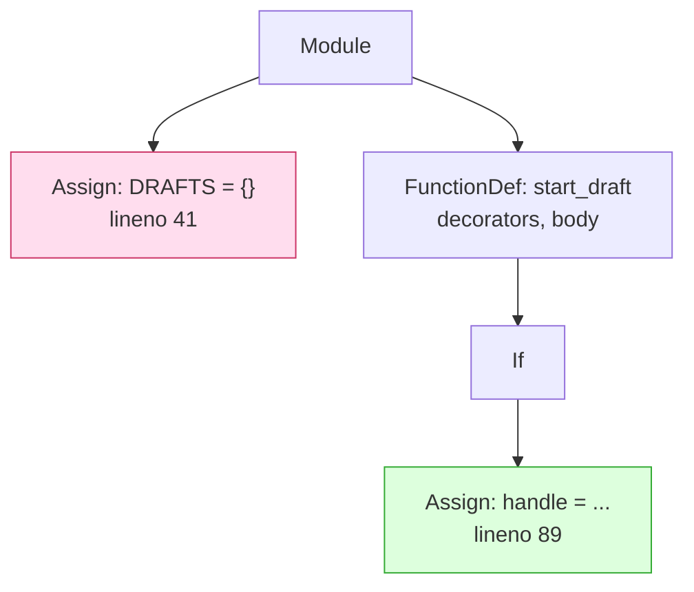

# 2.1 — Reading the code without running it

## One-line answer

To find state that only exists once the module is imported you must **not** import the module — you
parse it into a tree and look at what its top level would do, which costs nothing, cannot start a
server, and works on code you have never installed.

## The story

Before the flat was built, the whole thing existed as a set of drawings on paper.

You can stand at a table with those drawings and answer real questions. How many rooms. Where the
load-bearing wall runs. Whether the kitchen has a window. Whether there is one water inlet or two.
Whether the electrical run passes over the bathroom, which is the sort of thing you would very much
like to know before anyone lives there.

The alternative way to answer those questions is to move in. That works too, and it answers a great
many more questions than the drawings do — but you have to build the flat first, you have to be able
to afford it, and if the electrical run really does pass over the bathroom you find out in the worst
possible way.

The drawings are not better than living there. They are *earlier*, *cheaper*, and *safe*, and for a
specific set of questions they are enough.

## The idea in plain language

There are two ways to ask a question about a piece of code.

**Dynamically**: run it, and look at what exists. Import the module and print
`type(module.DRAFTS)`. This is accurate, because you are looking at the real object.

**Statically**: read the text of the code and work out what it would do, without running it. This is
less accurate — some questions genuinely cannot be answered without running the program — but it has
three properties the dynamic approach cannot match.

**It has no side effects.** Importing a server module runs everything at its top level. That is the
exact code this day is hunting, so importing to find it means opening the connections, seeding the
generators and creating the objects you were looking for. On some modules it also binds a port or
reads a configuration file that is not there, and your finder crashes on the code it was meant to
inspect.

**It needs nothing installed.** A parser reads text. It does not care whether the imports at the top
of the file resolve, whether the right version of a library is present, or whether the code is even
runnable on this machine. You can scan a dependency, a pull request, or a file from a repository you
have never set up.

**It sees the source, not the result.** A dictionary built by three different code paths is one
dictionary at runtime and three lines in the file. When the job is to point at the line somebody has
to change, the file is the right thing to be looking at.

The tool is in the standard library. `ast` stands for **abstract syntax tree**: `ast.parse(source)`
turns Python text into a tree of objects, one per construct — a module holding statements, a
statement holding expressions, and so on. Nothing is executed. You then walk the tree and ask
questions about its shape.

One property of that tree does most of the work in this section. **`tree.body` is the module's top
level and nothing else.** Statements inside a function are in that function's own `body`, not in the
module's. So "what runs at import time" — the exact question this day asks — is a single list you can
loop over.

## Why Sutra needs it

Because the thing being scanned is `sutra_mcp/`, and `sutra_mcp/` is a server.

By the end of Phase 6 that package holds `server.py`, `tools.py`, `resources.py`, `prompts.py`,
`tasks.py`, `auth.py`, `db_tools.py`, `capabilities.py`, `agent_server.py` and today's `app.py`.
Importing that set to inspect it means constructing a `FastMCP`, registering every tool, opening
whatever [Day 39](../../../day-39-database-tools/) opens, and building the ASGI application —
which is precisely why a dynamic check is the wrong instrument here. The whole point of
[Day 34's 1.2](../../../day-34-building-sutra-mcp-tools/parts/01-the-server-object/1.2-a-server-you-build-not-one-that-runs.md)
was that `build_server()` returns and `run()` blocks; a scanner that imports is one accidental
top-level `run()` away from hanging forever in your check suite.

There is a second reason, and it is the one that matters on
[Day 45](../../../day-45-the-mcp-audit/). A static check runs on a machine with nothing configured:
no `.env`, no database, no network. That is the only kind of check that can sit inside `./m check`
and stay there.

## The mechanism

The scanner is a hundred and eighty lines and this is its spine:

```python
# days/day-43-stateless-by-default/lab/scan.py  (extract)
def scan_source(source: str, path: Path) -> list[Finding]:
    """Parse one file and return every module-level state finding in it."""
    tree = ast.parse(source, filename=str(path))
    lines = source.splitlines()
    findings: list[Finding] = []

    for node in tree.body:
        if isinstance(node, ast.Assign | ast.AnnAssign) and node.value is not None:
            names = _targets(node)
            if not names or waived(node.lineno):
                continue
            if isinstance(node.value, MUTABLE_LITERALS):
                findings.append(Finding(path, node.lineno, ", ".join(names), ...))
```

**Line by line:**

- `source: str` and not a path, so the function can be tested on a string and reused on a file. The
  path comes in separately, only to be printed in the finding.
- `ast.parse(source, filename=str(path))` is the entire "do not run it" guarantee. It builds the
  tree and returns. If the file has a syntax error this raises `SyntaxError` with the real line
  number, which is the correct behaviour: a file that does not parse has not been checked, and
  saying so loudly is better than reporting zero findings.
- `lines = source.splitlines()` keeps the raw text beside the tree, because the tree does not carry
  comments. [2.3](2.3-the-waiver-that-has-a-reason-on-it.md) needs the comments.
- `for node in tree.body` is the load-bearing line of the whole scanner. Not `ast.walk(tree)`, which
  would visit every node in the file including the insides of every function. `tree.body` is
  *exactly* the statements that execute at import time, which is *exactly* the question.
- `ast.Assign | ast.AnnAssign` covers both `X = {}` and `X: dict[str, str] = {}`. Leaving out the
  annotated form would miss the more carefully written half of the codebase, which is the half that
  writes annotations.
- `node.value is not None` skips `X: dict[str, str]` with no value — a declaration that creates
  nothing at all. Flagging it would be a false positive on the most correct thing in the file.
- `_targets(node)` returns the plain names being bound and ignores `obj.attr = {}` and `d["k"] = []`.
  Those are assignments to something that already exists, which is a different problem and not this
  one.
- `node.lineno` is on every node and is what turns a finding into an address a person can jump to.
  A finding without a line number is a complaint.
- `isinstance(node.value, MUTABLE_LITERALS)` asks what the right-hand side *is*, not what the name
  is called. A dictionary named `CONFIG` and one named `CACHE` are the same node type, and the
  scanner treats them the same on purpose — [2.3](2.3-the-waiver-that-has-a-reason-on-it.md) is how
  the difference gets recorded.

Two things the tree makes easy that a regular expression makes miserable:



Both assignments are the text `= ` in the file. One is at module level and one is four levels deep
inside a function, and the tree knows the difference by construction, where a regular expression
would have to count indentation and guess about multi-line strings.

## When it breaks

The scanner breaks honestly, and the two ways are worth knowing before you trust it.

A file it cannot parse stops it dead:

```text
Traceback (most recent call last):
  File "...\lab\scan.py", line 197, in <module>
    raise SystemExit(main(sys.argv[1:]))
                     ^^^^^^^^^^^^^^^^^^
  File "...\lab\scan.py", line 188, in main
    findings.extend(scan_path(target))
                    ^^^^^^^^^^^^^^^^^
  File "...\lab\scan.py", line 176, in scan_path
    findings.extend(scan_source(file.read_text(encoding="utf-8"), file))
                    ^^^^^^^^^^^^^^^^^^^^^^^^^^^^^^^^^^^^^^^^^^^^^^^^^^^
  File "...\lab\scan.py", line 100, in scan_source
    tree = ast.parse(source, filename=str(path))
           ^^^^^^^^^^^^^^^^^^^^^^^^^^^^^^^^^^^^^
  File "...\Lib\ast.py", line 52, in parse
    return compile(source, filename, mode, flags,
           ^^^^^^^^^^^^^^^^^^^^^^^^^^^^^^^^^^^^^^
  File "...\broken.py", line 4
    def build_server(-> FastMCP:
                     ^^
SyntaxError: invalid syntax
```

That is the right failure. The alternative — catching it and continuing — would print `0 finding(s)`
for a file nobody checked, and a gate that reports success on unread input is worse than no gate.

The second break is quieter and is the real limitation of the whole approach: **the scanner only
sees what is written in the files it is given.** It cannot see the SDK's `_server_instances` from
[1.4](../01-accidental-state/1.4-the-session-your-sdk-keeps-for-you.md), because that dictionary is
an attribute of an object created by a library you did not scan. It cannot see state built by a
function that is called at import time — `CACHE = build_cache()` is a call to a name the scanner does
not recognise, so it says nothing. And it cannot see anything decided at runtime.

That is not a bug to fix. It is the boundary of the instrument, and knowing exactly where the
boundary is, is what makes the instrument usable. Static analysis finds the state you wrote by
accident. Two instances behind one URL ([section 3](../03-two-instances/3.1-the-dispatcher-that-knows-nothing.md))
find the state you inherited.

## In production

**What a professional writes instead:** in most codebases this is a plugin to a linter that is
already running, not a script of its own — a `ruff` or `flake8` rule, so the finding appears in the
editor while the line is being typed rather than in a check suite an hour later. The scanner here is
written from scratch for the same reason everything in this curriculum is: you cannot judge a rule
you have never had to write. Once you have, adopting the plugin is a small decision instead of a
mysterious one, which is Principle 4.

**What degrades at scale:** precision, not speed. Parsing is fast enough that scanning a large
repository is unnoticeable; what does not scale is a rule with a false-positive rate. On a hundred
files, a rule that is wrong one time in twenty produces five arguments per run, and a check people
argue with becomes a check people disable. [2.3](2.3-the-waiver-that-has-a-reason-on-it.md) is
entirely about that.

**The failure mode that only appears with real traffic:** none — and saying so is the point. A static
check has no traffic and no runtime, so it can never tell you that the thing it approved is actually
correct. It is a filter that removes a known class of mistake before the expensive checks run. A team
that treats a green scan as proof of statelessness has confused a smoke alarm for a fire brigade.

**The review comment a senior engineer leaves:** *"the scan imports the module to inspect it. That
means running our top-level code — the same code we are trying to find — inside the check suite, and
it will hang the day someone leaves a `run()` at module level. Parse it instead; we do not need the
objects, we need the line numbers."*

**The interview question:** *"how would you find every global in a large Python service?"* The honest
answer: *"Statically, with `ast`. Parse each file and walk `tree.body`, which is exactly the
statements that run at import time, and flag assignments whose value is a mutable literal or a call
that returns something stateful. I would not import the modules: importing runs the very code I am
looking for, it needs the whole environment configured, and one top-level `run()` hangs the check.
The trade is that I only see what is written in the files I am given — I will not find state that a
library keeps inside its own objects, so the static scan is the cheap first pass and a two-instance
test is what actually proves it."*

## Check yourself

```bash
cd days/day-43-stateless-by-default/lab
uv run python scan.py scan.py; echo "exit: $?"
```

The scanner scans itself and finds nothing. Open it and look at why: every module-level constant in
it is a `frozenset` or a tuple. Then change one `frozenset({...})` to a bare `{...}` and run it
again.

**Out loud, without scrolling up:** give the three reasons for reading the file instead of importing
it, and say what `tree.body` contains that `ast.walk(tree)` does not stop at.

**Next:** [2.2 — The four shapes worth flagging](2.2-the-four-shapes-worth-flagging.md).
