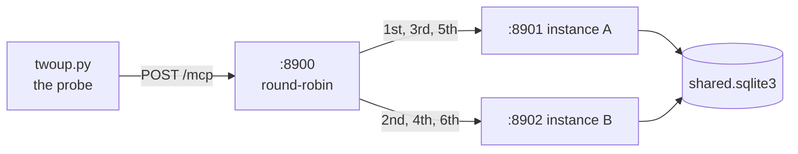

# 3.1 — The dispatcher that knows nothing

## One-line answer

The test for statelessness is a load balancer built to be as stupid as possible — no table of
callers, no memory between requests, strict alternation — because a claim that any instance can
answer any request is only tested by something that refuses to be clever about which one it picks.

## The story

At the taxi rank outside the station there is one rule: you take the car at the front.

Not the driver you had last week. Not the one who knows the shortcut to your street. The one at the
front, and if you had that same driver two days ago, that is a coincidence and nobody records it.

The rule is what makes the rank work. Cars join at the back and leave from the front, drivers can go
home at the end of a shift without anybody being stranded, and a new car joining the queue starts
earning immediately. Nobody has to be matched to anybody.

It also puts a real obligation on the passenger, and it is the whole point: **you have to be able to
say where you are going.** Every time, in full, to a driver who has never met you. If your directions
only work with a driver who remembers last Tuesday, the rank is not the thing that is broken.

## The idea in plain language

A **load balancer** sits at one address and forwards each incoming request to one of several
identical servers behind it. The servers are called **instances** or replicas: separate processes,
usually on separate machines, running the same code.

The policy for choosing is the interesting part. Real ones offer several, and they are not equally
honest for this purpose:

- **Round-robin** — first request to A, second to B, third to A. No memory of who is calling.
- **Least connections** — whichever instance is currently least busy. A little memory, about the
  instances rather than the callers.
- **Sticky sessions**, also called session affinity — the same caller goes to the same instance every
  time. Memory about callers, and the subject of
  [6.2](../06-in-production/6.2-sticky-sessions-the-anaesthetic.md).

For a *test*, round-robin is the only choice, because it is the policy that gives your server no help
at all. Any correctness that survives strict alternation would survive any other policy. Correctness
that needs a friendlier policy was never correctness.

The dispatcher in this day's lab is deliberately, almost rudely, simple. It reads no JSON. It has
never heard of MCP, tools, or JSON-RPC. It does not know what a session is. It takes an HTTP POST,
sends it to the next address in a two-item cycle, and copies the answer back. That ignorance is the
instrument: whatever it discovers cannot be an artefact of the balancer being clever, because there
is nothing in it to be clever with.

And it is not a straw man. The specification's own framing is that a server "operates as an
independent process", exposing "a single HTTP endpoint (the MCP endpoint) that accepts POST", with
every message its own POST — read on 2026-09-05. A round-robin over that endpoint is not a hostile
test. It is the deployment the protocol was rewritten for.

## Why Sutra needs it

Because everything in section 2 was a *shape* argument and section 3 has to be an *evidence*
argument.

The scan can tell you that `sutra_mcp/` has no module-level dictionaries. It cannot tell you that
`sutra-mcp` is stateless, because the state it cannot see is the state that will hurt you: the SDK's
session table from [1.4](../01-accidental-state/1.4-the-session-your-sdk-keeps-for-you.md), a
library's internal cache, a handle policy that is correct in every file and wrong in combination.

[Day 45's audit](../../../day-45-the-mcp-audit/) has to answer *"is `sutra-mcp` deploy-shaped?"*
with something better than "the linter is green". Two instances, one URL, and a fixed set of
requests is that something. It costs three local processes, no network, no account and no model
calls.

The other reason is that you are about to write `sutra_mcp/app.py`
([5.1](../05-deploy-shape/5.1-an-object-not-a-program.md)). A deploy-shaped entry point that has
never actually been deployed twice is a claim. This is how the claim gets checked on a laptop.

## The mechanism

The whole balancer, minus its docstring:

```python
# days/day-43-stateless-by-default/lab/dispatcher.py
BACKENDS = itertools.cycle(  # stateless-ok: which backend is next, never a correctness fact
    ["http://127.0.0.1:8901", "http://127.0.0.1:8902"]
)

HOP_BY_HOP = frozenset({"host", "connection", "content-length", "transfer-encoding", "keep-alive"})


class RoundRobin(BaseHTTPRequestHandler):
    """Forward each POST to the next backend, and relay the answer back untouched."""

    protocol_version = "HTTP/1.1"

    def do_POST(self) -> None:
        backend = next(BACKENDS)
        body = self.rfile.read(int(self.headers.get("Content-Length", 0)))
        headers = {k: v for k, v in self.headers.items() if k.lower() not in HOP_BY_HOP}
        req = Request(backend + self.path, data=body, method="POST", headers=headers)
        try:
            with urlopen(req, timeout=10) as resp:
                status, payload, out = resp.status, resp.read(), resp.headers
        except HTTPError as exc:
            status, payload, out = exc.code, exc.read(), exc.headers
        self.send_response(status)
        for key, value in out.items():
            if key.lower() not in HOP_BY_HOP:
                self.send_header(key, value)
        self.send_header("Content-Length", str(len(payload)))
        self.end_headers()
        self.wfile.write(payload)
```

**Line by line:**

- `itertools.cycle([...])` is the entire routing policy. Two addresses, forever, in order. Its waiver
  comment is [2.3](../02-finding-the-state/2.3-the-waiver-that-has-a-reason-on-it.md)'s worked
  example.
- `BaseHTTPRequestHandler` from the standard library, so this adds no dependency. It is
  single-threaded and handles one request at a time, which is a limitation everywhere except here —
  serial handling makes the alternation exactly predictable, and a test you can predict is a test
  you can assert on.
- `protocol_version = "HTTP/1.1"` opts in to keep-alive. Without it the handler answers HTTP/1.0 and
  closes the connection after every reply, which works but makes the client reconnect constantly and
  muddies what is being measured.
- `do_POST` and no `do_GET`. Every MCP message on this transport is a POST to the one endpoint, so
  there is nothing else to implement. A GET arriving here gets the base class's `501` — which is how
  the probe's readiness wait knows the port is answering.
- `next(BACKENDS)` before the body is read, so which instance handles a request never depends on
  anything in the request. That ordering is the honesty of the test: the balancer cannot accidentally
  route on content it never looked at.
- `int(self.headers.get("Content-Length", 0))` reads exactly the declared number of bytes. Reading
  more would block waiting for data that is not coming.
- The request-header comprehension drops the **hop-by-hop** headers — the ones that describe *this*
  TCP connection rather than the message. `Host` has to go because the backend is a different host
  and port; `Content-Length` has to go because `urlopen` recomputes it; forwarding either produces a
  request the backend rejects.
- Everything else is forwarded untouched, which is the point of the exercise:
  `MCP-Protocol-Version`, `Mcp-Method` and `Mcp-Name` — the routable headers
  [Day 32's 3.1](../../../day-32-mcp-stateless-core/parts/03-headers-and-caches/3.1-the-label-on-the-envelope.md)
  taught — arrive at the backend exactly as the client sent them. A real gateway routes *on* those
  headers without parsing a byte of JSON; this one just passes them along, which proves the same
  thing more modestly.
- `except HTTPError` is not error handling, it is *relaying*. `urlopen` raises on any 4xx or 5xx, and
  a balancer that turned a backend's 404 into its own 500 would be inventing failures. The status and
  body are taken off the exception and passed through unchanged.
- The response-header loop is the fix for a bug this lab actually had: the first version relayed only
  the content type, which silently swallowed the `mcp-session-id` header a stateful server sets — and
  made [3.5](3.5-the-handle-b-had-never-heard-of.md)'s failure impossible to reproduce, because the
  client never received a session to send back. A balancer that drops headers hides exactly the
  problems you are looking for.
- `Content-Length` is set from the relayed body rather than copied, because a copied length that does
  not match the bytes written is a hung client.

The shape of the whole rig:



Three processes and one file. Nothing here is a simulation: they are real HTTP servers speaking real
JSON-RPC to a real client over real sockets, and the only thing scaled down is the number of them.

## When it breaks

The balancer's own failure is worth meeting once, because it is the shape of every proxy problem you
will ever debug. Start the probe without the backends running and the forward fails:

```text
urllib.error.URLError: <urlopen error timed out>
```

Measured on 2026-09-05 against a port with nothing listening on it. On a machine whose firewall
*refuses* rather than *drops*, the same line reads
`<urlopen error [WinError 10061] No connection could be made because the target machine actively
refused it>` — and the difference between those two is the difference between failing immediately and
failing after your timeout, which is [Day 44's](../../../day-44-client-hardening/) whole subject.

The important thing about either version is *where it is reported*: on the balancer's side of the
conversation. The client sees a `500`, or a dropped connection, with nothing in it about ports 8901
and 8902. Every real outage of this shape starts with a caller reporting a generic failure and an
operator having to look one hop further in.

The probe avoids this by waiting for both backends before it starts:

```python
# days/day-43-stateless-by-default/lab/twoup.py  (extract)
def wait_for(port: int, seconds: float = 30.0) -> None:
    """Poll a port until it answers, so the probe never races the servers."""
    deadline = time.monotonic() + seconds
    while time.monotonic() < deadline:
        try:
            urllib.request.urlopen(f"http://127.0.0.1:{port}/healthz", timeout=1)
            return
        except urllib.error.HTTPError:
            return
        except OSError:
            time.sleep(0.25)
    raise SystemExit(f"port {port} never came up")
```

**Line by line:**

- `time.monotonic()` and not `time.time()`, because a clock that can be adjusted backwards can make a
  deadline never arrive. This is the same reasoning as
  [Day 22's ordering discussion](../../../day-22-structured-logging/parts/02-wiring-the-run/2.2-the-correlation-id.md),
  applied to a loop.
- `except HTTPError: return` treats *any* HTTP answer as "the port is up". A `501` from the
  dispatcher's missing `do_GET` is a perfectly good sign of life, and demanding a `200` here would
  make the wait fail against the very process it is waiting for.
- `except OSError: time.sleep(0.25)` is the not-yet case — connection refused, still starting. Short
  sleeps, so start-up is not padded with waiting that is not needed.
- `raise SystemExit(...)` rather than returning a flag, because a probe that proceeds against a
  server that never started will produce confident, meaningless output. Principle 10: fail, loudly,
  at the point of failure.

## In production

**What a professional writes instead:** nothing — you do not write a load balancer. The platform has
one, and it is better than yours in every way that matters: connection reuse, health-aware removal
of bad instances, TLS, retries, timeouts, observability. What you write is the *thirty-line one you
test with*, and the reason is that a real balancer's cleverness is exactly what you want removed
while you are checking your own correctness. This is Principle 4 pointed sideways: build the crude
version to understand what the good one is doing for you.

**What degrades at scale:** this dispatcher does, immediately and by design. One request at a time,
no connection pooling, no timeouts worth the name, no health checks, no retries. Put it in front of
anything real and it is the bottleneck. That is fine, and saying so is part of using it honestly: it
is a measuring instrument, not infrastructure.

**The failure mode that only appears with real traffic:** the balancer whose header handling is
almost right. Dropping one response header cost this lab a whole failure mode
([3.5](3.5-the-handle-b-had-never-heard-of.md)) and would, in a real proxy, silently break
authentication, caching or content negotiation for a subset of requests. Proxy bugs are
under-reported precisely because the proxy reports success — it did forward something.

**The review comment a senior engineer leaves:** *"the test harness proxy strips response headers it
does not recognise. That is why the session test was passing: the client never got the session
identifier back, so it never sent one, so we were accidentally testing the stateless path. Relay
everything except hop-by-hop and run it again."*

**The interview question:** *"how would you prove a service is stateless?"* The honest answer:
*"Adversarially, and with the dumbest possible balancer. Two instances, strict round-robin so
consecutive requests from one caller are guaranteed to hit different processes, and then the normal
request sequence — not a special test sequence. Round-robin specifically, because anything that
survives strict alternation survives every friendlier policy, and because a balancer with any memory
of callers can hide the exact bug I am looking for. If it passes I add a third instance and kill one
mid-run. It costs three processes on a laptop and it is the only evidence that beats reading the
code."*

## Check yourself

```bash
cd days/day-43-stateless-by-default/lab
uv run python dispatcher.py
```

It prints `round-robin on :8900 -> 8901, 8902` and waits. In another shell, send it anything and
watch it fail to reach a backend that is not running. Then stop it, and read `do_POST` again and
name the two headers that must not be forwarded.

**Out loud, without scrolling up:** say why round-robin rather than sticky sessions is the right
policy for a *test*, and say what the balancer would have to know about MCP to run this rig. (It is
nothing.)

**Next:** [3.2 — The same question, twice, one URL](3.2-the-same-question-twice-one-url.md).
