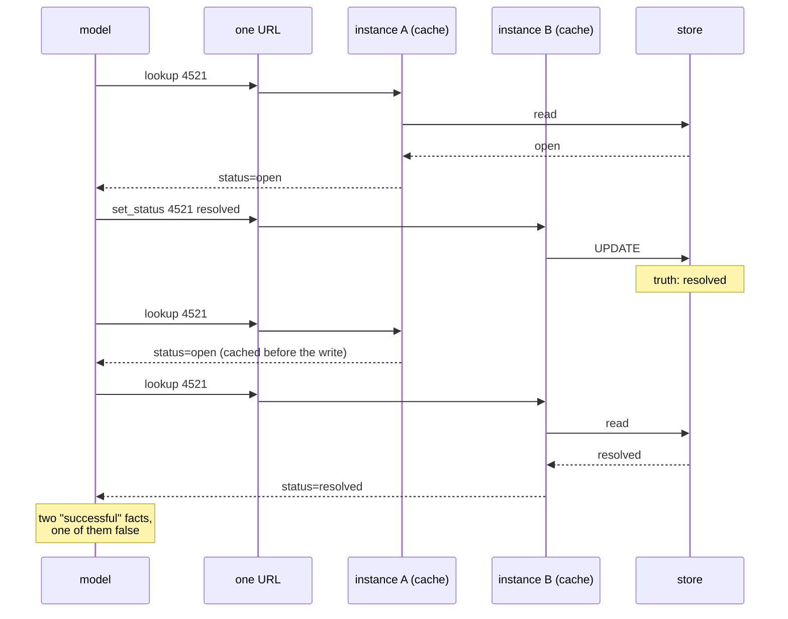

# 3.3 — 💥 Two answers to one question

## One-line answer

Two instances with two caches give a model two contradictory facts inside one turn, and because both
tool calls succeeded, nothing in the system records that anything went wrong — the only trace is a
sentence in an answer that is quietly untrue.

## The story

The fuel station has two pumps and one price.

The price is on a board at the road, and it is also programmed into each pump separately, because
each pump prints the receipt. On the morning the price changes, someone walks out and updates the
board, then updates pump one, and gets called away before pump two.

For the next hour, two cars fill up side by side and drive away with receipts that disagree. Neither
receipt is a mistake in the ordinary sense. Both pumps did exactly what they were configured to do,
both printed correctly, both totals add up. The station's till reconciles at the end of the day and
the numbers are off by an amount nobody can attribute to a transaction, because no transaction was
wrong — the *configuration* was, in one of two places, for one hour.

The driver who noticed is the one who filled up twice that morning at different pumps and looked at
the two receipts.

## The idea in plain language

[1.2](../01-accidental-state/1.2-the-cache-that-becomes-a-second-opinion.md) explained why two
caches hold two answers. This part is what that does once there is a model on the other end, and it
is worse than the ordinary version of the same bug for a reason specific to agents.

An ordinary web client asks a question, gets an answer, and acts on it. If the answer is stale it
does the wrong thing once, and the next page load fixes it.

A model does not work that way. A model **accumulates** tool results in its context and reasons over
all of them together. The transcript for one turn can easily contain:

    lookup(4521) -> 4521: printer offline since Tuesday [status=open]
    lookup(4521) -> 4521: printer offline since Tuesday [status=resolved]

Two lines, same tool, same argument, different answers, both marked as successful tool results, both
now in the context window for the rest of the conversation. The model has to do something with that,
and there is no good option available to it:

- **Believe the later one.** Usually right, and it has no way to know it is the later one — the order
  in the transcript is the order the calls were made, not the order the facts became true.
- **Believe the first one.** Just as defensible from where it is sitting.
- **Say the tool is unreliable.** Honest and useless.
- **Reconcile them into something that was never true.** *"The ticket was open and has now been
  resolved"* is the most likely output, and it is a fabrication assembled from two true-looking
  inputs. Nothing in the model did anything wrong.

That last one is the reason this part exists. Everything else in this day produces a wrong answer.
This one produces a **confident narrative** built out of an inconsistency the model was never told
about — which is precisely the failure mode people blame on the model, and it was caused by a
decorator.

## Why Sutra needs it

Because Sutra is a support desk, and a support desk's whole job is telling somebody the current state
of their ticket.

[Day 34](../../../day-34-building-sutra-mcp-tools/) put `lookup_ticket` on the wire.
[Day 39](../../../day-39-database-tools/) put a real database behind it.
[Day 42](../../../day-42-serving-agents-over-mcp/) put the whole desk agent behind an MCP server, so
another agent can call it. Every one of those layers makes a cache in front of the ticket read look
more attractive, because every one of them adds latency to a call that is made constantly.

And there is a Sutra-specific amplifier. When the desk agent is itself served over MCP, one caller's
question can produce several `lookup` calls that fan out through the same URL — so the two
contradictory lines above do not need a user to ask twice. One question is enough.

## The mechanism

The two lines that disagree come from one decorator and one write:

```python
# days/day-43-stateless-by-default/lab/leaky_server.py  (extract)
@functools.lru_cache(maxsize=128)
def _cached_summary(ticket: str) -> str:
    return store.summary(ticket)


@mcp.tool()
def set_status(ticket: str, status: str) -> str:
    """Change a ticket's status. This always writes to the shared store."""
    return f"{INSTANCE} wrote {store.set_status(ticket, status)}"
```

**Line by line:**

- `_cached_summary` reads the store on a miss and never again for that argument. There is no expiry,
  so "never again" means until this process ends.
- `set_status` writes straight to the shared store, correctly, once. **This is not the bug.** It is
  worth stopping on: the write is right, the store is right, the read is right, and the system is
  still wrong. The defect is entirely in the relationship between a cache in one process and a write
  that happened in another.
- Nothing connects the two functions. There is no invalidation call, and there is nowhere sensible to
  put one — `set_status` runs on instance B and the stale entry is on instance A, in memory B cannot
  reach. **This is the key insight of the part:** a per-process cache cannot be invalidated by another
  process, so "just clear the cache on write" is not a fix that exists at this design.
- `store.set_status` is one `UPDATE` statement, so there is no window inside it for anything to
  interleave. The inconsistency is not a race. Run the same sequence a thousand times and you get the
  same disagreement every time, because it is structural.

What the caller sees, laid out against what is true:



## When it breaks

From the two-instance run on 2026-09-05:

```text
-- the cache: one ticket, one status change, two answers --
   A cached=False 4521: printer offline since Tuesday [status=open]
   B wrote 4521 -> resolved
   A cached=True 4521: printer offline since Tuesday [status=open]
   B cached=False 4521: printer offline since Tuesday [status=resolved]
```

The third and fourth lines are the incident. Same tool, same ticket, consecutive requests, one URL,
`[status=open]` and then `[status=resolved]`.

Now everything this failure does *not* produce, because the list is the reason it survives so long in
real systems:

- no exception, on either instance;
- no non-`200` status code;
- no `isError: true` — both calls are ordinary successful results in the sense of
  [Day 34's 4.1](../../../day-34-building-sutra-mcp-tools/parts/04-two-kinds-of-no/4.1-the-tool-said-no.md);
- no log line above `INFO` anywhere;
- no discrepancy in the store, which held exactly one value the whole time and was never wrong.

The only artefact is the pair. To notice it you have to compare two answers to the same question, and
nothing in an ordinary observability stack does that, because it is not a shape anyone instruments
for.

And there is one more turn of the screw. The disagreement **ends on its own**. Instance A is replaced
at the next deployment, its cache goes with it, and both instances answer `resolved` from then on. So
the customer who was told the wrong thing, complains, and is asked to try again, gets the right answer
— which reads to everybody involved as a transient glitch rather than a design defect, and closes the
ticket about the ticket.

The smallest honest fix is to delete the decorator. If the read genuinely needs to be faster, the
cache moves out of the process and gains an expiry, which is
[4.1](../04-where-state-goes/4.1-down-out-or-nowhere.md)'s decision table applied to a cache.

## In production

**What a professional writes instead:** no per-process cache in front of a value another request can
change. If the read is hot, the cache goes in a shared store with a TTL, and the TTL is chosen as an
explicit statement about how stale an answer is allowed to be — *"ticket status may be up to ten
seconds old"* is a sentence a support desk can agree to, and *"up to whenever that container is
replaced"* is not. If the value never changes, the cache is fine and should be documented as such
next to the decorator.

**What degrades at scale:** the odds of the pair, in a direction that is worse than intuition. With
more instances, the chance that two consecutive reads hit the *same* cache falls, so the
disagreement surfaces more often. With a higher hit rate — a better-tuned cache — each stale entry
survives longer. Both improvements make the bug more visible, and neither is something anybody would
choose to undo.

**The failure mode that only appears with real traffic:** the model reconciling. In testing you read
the two lines yourself and see the contradiction. In production a model reads them, produces a
sentence that accommodates both, and a person receives a plausible, fluent answer that describes a
sequence of events that did not happen. There is no automated check anywhere in the stack for
"the assistant said something coherent and false".

**The review comment a senior engineer leaves:** *"`lru_cache` on `_cached_summary`, and
`set_status` writes to the database. Those two are on different instances half the time, so after a
status change our tool answers the same question two different ways and both answers go into the
model's context in the same turn. There is no invalidation available here — B cannot clear A's
memory. Take the decorator off, and if we need the speed, put a TTL cache in the shared layer and
write down how stale we are willing to be."*

**The interview question:** *"what is the worst kind of bug in a tool an LLM calls?"* The honest
answer: *"One where two calls succeed and disagree. We had it: a per-process cache in front of ticket
status, two replicas, so after a write one instance answered `open` and the other answered
`resolved`. Both were HTTP 200, neither was `isError`, nothing was logged above INFO, and the
database was correct throughout — so no dashboard could see it. The part that makes it worse than the
same bug in a web app is that the model has both answers in its context at once and has to reconcile
them, and what it produces is a fluent sentence describing a sequence of events that never occurred.
The fix is not invalidation, because a cache in one process cannot be invalidated by another; it is to
get the cache out of the process or delete it."*

## Check yourself

```bash
cd days/day-43-stateless-by-default/lab
uv run python twoup.py
uv run python twoup.py --shared
```

In the second run all four cache lines agree. Now open `leaky_server.py` and find the branch that
`--shared` takes: it does not clear the cache, it *skips* it. Say why that is the only fix available
at this design.

**Out loud, without scrolling up:** say why "invalidate the cache on write" cannot work here, and name
the four things this failure does not produce that monitoring would have caught.

**Next:** [3.4 — Three a day, per instance](3.4-three-a-day-per-instance.md).
